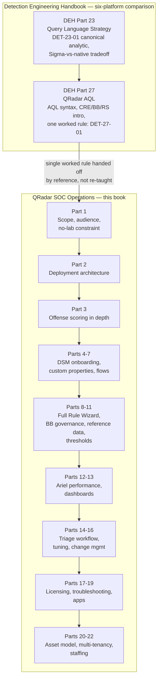

# Part 1 — Why This Book Exists, and What "Operations" Means Here

## Why this part exists

**[CONCEPT]** A reader who already owns *The Detection Engineering Handbook* (DEH) and lands here after finishing Part 27 has a reasonable question before reading another word: didn't that part already cover QRadar? It did — and it said so about itself, plainly, in its own opening section: Part 27 is ~5,800 words that exist to prove one specific claim, that QRadar's correlation model forces a three-object decomposition (a Building Block, a Reference Set, and a Rule) where a KQL or SPL implementation of the same analytic is one deployed artifact. It was never meant to teach anyone how to run a QRadar deployment, and it says that too. This book is the rest of that sentence. It covers the platform-operations experience Part 27 explicitly defers: how an Offense actually gets scored and lived with, the full Rule Wizard catalog beyond one canonical rule, Building Block governance once a library holds hundreds of entries instead of one, the complete reference-data type taxonomy, log source and DSM onboarding as a repeatable process rather than a single failure mode named once, Ariel search performance, dashboards, the noisy-Offense tuning workflow, rule change management with no git pipeline handed to you for free, licensing and capacity planning, and QRadar-specific troubleshooting.

This part does four things before any of that operational material starts. §1 draws the scope boundary against DEH Part 23 and Part 27 precisely, with a table, so nothing in this book quietly re-teaches what those parts already own. §2 defines what "operations" means in this book's own title, because it is a narrower and more specific claim than "everything about QRadar." §3 and §4 name who this book is for, who it isn't, and the one constraint that shapes every figure in it: no real QRadar deployment exists in this author's lab, which is a structurally different evidence position than DEH ever had to work from. §5 and §6 give the reader the two pieces of reading-the-room machinery — the PRODUCT VERSION NOTE convention and the tag/callout system — before Part 2 starts using both without re-explaining them.

---

## 1. The gap this book fills: what DEH Part 27 proves, and what it deliberately leaves for this book

**[CONCEPT]** DEH Part 27's own framing is worth quoting rather than paraphrasing, because it states the boundary this book inherits more precisely than a summary would: QRadar splits "search my data" and "correlate my data into an alert" across two different subsystems. Ariel Query Language (AQL) is the query language for the first; the Custom Rules Engine (CRE) — a separate, largely point-and-click rule-authoring system built from Building Blocks, Rule Tests, and Reference Sets — is the second, and AQL only touches it at the edges. Part 27 teaches AQL's syntax fundamentals (§1: the `events`/`flows` split, the `QIDNAME()`/`CATEGORYNAME()`/`LOGSOURCETYPENAME()` translation functions, time-window shorthand), introduces the CRE only far enough to make its central point (§2: Building Blocks, Rule Tests, Reference Sets as QRadar's answer to a join), and walks one worked example end to end — DET-27-01, QRadar's re-implementation of DEH Part 23's canonical `lsass.exe` process-access analytic (DET-23-01), built as `BB:LSASS-Access-Candidate`, `RS-Allowlisted-LSASS-Tools`, and `R: Suspicious LSASS Access — Unapproved Process` working together. That worked example, and the Offense-as-hybrid-of-Alert-and-Case finding Part 27 §6 closes on, are carried forward by reference throughout this book, never redefined — the same discipline STYLE-GUIDE.md §12 requires of every part here.

What Part 27 does not do — because a ~5,800-word part inside a six-platform comparison book has no room to — is anywhere near the depth a team actually running QRadar needs. One worked Building Block is not a governance model for a `BB:` library that has grown past 400 unreviewed entries over three years (Part 9). One Reference Set introduced to prove a structural point is not the full typed taxonomy — Set, Map, Map of Sets, Map of Maps, Table — and the TTL/expiry discipline a real deployment needs across all of them (Part 10). One paragraph naming that an unmapped Sysmon event lands under a generic QID with no custom properties is not a repeatable DSM onboarding checklist (Part 4), nor does it cover what a team does when a source has no native DSM at all (Part 5). And Part 27's closing SOC MANAGEMENT paragraph — that reviewing "one detection" in QRadar means reviewing three separately-changeable objects, not one query file — names a review-cost problem in one sentence that this book's Part 22 has to actually build a headcount model against.

Table 1.1 makes that boundary concrete rather than asserted, topic by topic, so a reader can see exactly where DEH's QRadar coverage ends and this book's begins before committing to read either.

**Table 1.1 — What DEH already covers for QRadar vs. what this book adds.** Supports the decision "do I need DEH Part 23/27, this book, or both, for the question in front of me right now."

| Topic | DEH Coverage | This Book's Coverage |
|---|---|---|
| AQL syntax (`SELECT`/`WHERE`/`GROUP BY`, translation functions) | DEH Part 27 §1 — full syntax reference | Not re-taught; every AQL example here links back to DEH Part 27 §1 rather than re-explaining `SELECT`/`FROM`/`WHERE` |
| Sigma-first vs. native rule authoring | DEH Part 23 §5 (generic tradeoff), DEH Part 27 §2.1/§3.3–3.4 (QRadar instance) | Not re-argued; Part 9 builds past the one worked example into `BB:` library governance at scale |
| CRE / Building Block / Reference Set — existence and basic mechanics | DEH Part 27 §2 — introduced only far enough to prove the three-object decomposition | Parts 8–11 — full Rule Wizard catalog, `BB:` governance, complete reference-data taxonomy |
| Offense scoring (magnitude, credibility, relevance, severity) | DEH Part 27 §6 — one paragraph, the Offense-as-hybrid finding | Part 3 — full scoring model, lifecycle, retention, entity binding |
| DSM/QID mapping and log source onboarding | DEH Part 27 §3.1 — one failure mode named once | Parts 4–6 — full onboarding lifecycle, Universal DSM, custom-property governance |
| Ariel search performance / EPS-FPM licensing | DEH Part 27 §1.3 — one paragraph flag | Parts 12, 17 — full tuning discipline and capacity planning |
| Analyst triage of a fired Offense | DEH Part 27 §6 — one worked capsule against DET-27-01 | Part 14 — day-to-day queue workflow across every Rule type, not one analytic |
| Noisy-Offense diagnosis, rule change management | Not covered | Parts 15–16 — new material; no DEH equivalent exists |
| Multi-tenancy, MSSP operations, staffing/TCO | DEH Part 27's closing SOC MANAGEMENT paragraph — the review-cost problem named once | Parts 21–22 — full RBAC/Domain treatment and a headcount model built against that problem |

Figure 1.1 gives the same boundary as a diagram, tracing the handoff from DEH's canonical analytic through its one QRadar implementation into this book's own part sequence.

**Figure 1.1 — Where DEH's QRadar coverage ends and this book's begins.** *CONCEPTUAL.* Illustrates the scope handoff argued in prose above: DEH Part 23 defines one canonical analytic once, DEH Part 27 proves QRadar forces a three-object decomposition of it and stops there, and this book's 22 parts build the rest of the operational platform around that same worked example without re-deriving it. Not a reproduction of any DEH or IBM diagram, and not a claim about page counts beyond the ~5,800-word figure DEH Part 27 states about itself.

---

## 2. What "operations" means in this book's title

**[CONCEPT]** "Operations" here is a specific, narrower claim than "everything about QRadar," and it is worth being precise about which claim, because the word gets used loosely enough elsewhere that a reader could reasonably guess wrong. This book is about *running* a QRadar deployment that other people (or other parts of this same book, worn as a different hat) have already decided to build: keeping data flowing in correctly, keeping the correlation layer's decisions trustworthy, keeping the queue triageable instead of flooded, keeping the platform itself healthy under its own licensing and resource constraints, and keeping all of that auditable to whoever budgets it. It is not a book about whether to buy QRadar in the first place, and it is not a book about detection logic in the abstract — DEH already owns both of those conversations, the first only glancingly (a SOC Management View can weigh QRadar against alternatives, but the comparison itself belongs to a buyer's evaluation, not this book) and the second directly, across DEH's full 48-part run.

Concretely, "operations" spans five roles this book's own tag system (STYLE-GUIDE.md §7) names directly, because a single console hides more role separation than its unified login screen suggests: the platform engineer keeping Console/Event Processor/Event Collector/Flow Processor/Data Node/App Host topology, DSM onboarding, licensing, and Ariel performance healthy (`[PLATFORM ENGINEER]`); the rule engineer working inside the CRE authoring surface itself — Rule Wizard, Building Blocks, reference data, custom properties (`[RULE ENGINEER]`, renamed from DEH's `[DETECTION ENGINEER]` specifically because this role operates inside one platform's console rather than across six query languages); the analyst reading a fired Offense's magnitude, credibility, and relevance to decide what to do about it right now (`[ANALYST]`); the hunter pivoting from an Offense to its contributing events in AQL, extending DEH Part 27 §5's pattern into full operational practice (`[THREAT HUNTER]`); and whoever budgets, staffs, and answers for all four of the above to someone outside the SOC (`[SOC MANAGEMENT]`). A sixth tag, `[CONCEPT]`, marks the foundational "what and why" every other tag's content assumes — what an Offense is, what Ariel is, what the CRE evaluates and when — before role-specific content builds on it. This part is `[CONCEPT]` almost throughout, for the same reason DEH's own Part 1 is: before any role-specific content makes sense, the reader needs to know what book they're holding.

One vocabulary discipline follows directly from DEH `TERMINOLOGY.md`, and STYLE-GUIDE.md §12 states it as a hard rule rather than a suggestion: this book does not redefine Alert, Case, Incident, Disposition, Tuning, Suppression, or Coverage — they keep their DEH definitions unchanged, including DEH Part 27 §6's own finding that a QRadar Offense is a hybrid of DEH's Alert and Case concepts. Where this book needs genuinely new, QRadar-specific vocabulary — Magnitude, Credibility, Relevance, QID (QRadar's internal event-taxonomy identifier, expanded here on first use per part per STYLE-GUIDE.md §4 and bare thereafter), DSM, the Custom Rules Engine (universally abbreviated CRE after this point), Building Block, Reference Set/Map/Table, Domain, Tenant, EPS/FPM — it lives in this book's own Appendix A1, cross-referencing DEH `TERMINOLOGY.md` rather than duplicating any entry that already exists there.

---

## 3. Who this book is for, and who it isn't

**[SOC MANAGEMENT]** The honest audience for this book is narrower than "anyone who touches QRadar," and naming who it isn't for saves a reader real time. Table 1.2 states both sides plainly.

**Table 1.2 — Who this book is for.** Supports a reader's decision to keep reading this part, skip ahead to a specific later part, or go read DEH instead.

| Reader | What This Book Gives You | If This Isn't Quite You |
|---|---|---|
| QRadar platform engineer / administrator | Deployment topology, DSM onboarding, Ariel performance, licensing/capacity, HA/DR, troubleshooting (Parts 2, 4–7, 12, 17–19) | Want AQL syntax taught from zero — DEH Part 27 §1 owns that |
| Rule/Building Block author working inside QRadar's console specifically | Full Rule Wizard catalog, `BB:` governance at scale, the complete reference-data taxonomy, custom-property governance (Parts 6, 8–11) | Want a cross-platform Sigma-vs-native argument — DEH Part 23 §5 owns that generically, DEH Part 27 §3.3–3.4 owns it for QRadar |
| Tier-1/2 analyst triaging the Offense queue day to day | Reading magnitude/credibility/relevance to prioritize, escalation and closing-reason criteria, the tuning-intake process for a noisy Rule (Parts 3, 14–15) | Want general SOC triage practice not specific to one platform — DEH Part 27 §6's own capsule is the QRadar-specific starting point this book's Part 14 expands |
| SOC manager evaluating or budgeting a QRadar practice | Licensing/TCO, MSSP-vs-in-house tradeoffs, a headcount model built against the three-object review burden (Parts 17, 21–22) | Want a vendor-neutral SIEM-selection comparison — outside both this book's and DEH's scope entirely |
| A reader who wants AQL syntax, or a six-platform query-language comparison | — | DEH Part 27 §1 (AQL) or DEH Parts 23–29 in full (comparison) — this book assumes both are already read where relevant, per every part's front matter `deh_depends_on` field |

> **SOC Management View**
> A SOC manager evaluating headcount for a QRadar practice cannot reuse a generic "SIEM analyst" job description unchanged, for the reason DEH Part 27's own closing paragraph names for a single-tenant shop: reviewing "one detection" in QRadar means reviewing a Building Block, a Reference Set's current membership and maintenance owner, and a Rule's chained logic as three separately-changeable artifacts that can drift out of sync with each other — not one query file, the way a KQL or SPL shop's review model assumes. Part 22 is where this book actually builds a headcount model against that fact; this part's job is only to put the fact on the table early enough that a reader evaluating a QRadar hire doesn't discover it twenty parts in.

---

## 4. The honesty constraint: no real QRadar deployment in this author's lab

**[CONCEPT]** DEH could stand up Sysmon, a domain controller, an SSH host — commodity lab infrastructure a solo author can build on a home machine over a weekend. Part 1 of DEH's own current edition documents exactly that kind of real capture: a genuine failed-SSH-authentication burst pulled from the author's own home lab. QRadar is not commodity lab infrastructure. It is a commercial SIEM platform with licensing, appliance sizing, and — for anything beyond a single all-in-one console — hardware or cloud spend well past what a solo author's lab supports on demand. That means this book's evidence base is structurally different from DEH's, and this is stated here, in the first part, rather than discovered by a reader twelve parts in wondering why every figure carries the same caveat.

Concretely: this book's figures are almost exclusively `OFFICIAL REFERENCE` (sourced and cited from IBM's own public documentation, with the source URL and covered version recorded in `REFERENCES.md`) or `CONCEPTUAL` (this book's own architecture and workflow diagrams — Figure 1.1 above is one — honestly labeled as illustrative, never styled to look like a captured screenshot). `CONTROLLED LAB EXAMPLE` (captured from a lab built specifically to generate the evidence) and `REAL LAB EXAMPLE` (captured from a real, pre-existing deployment) are not used anywhere in this book, on the current premise that neither exists for this project. That is a stronger restriction than DEH itself operates under, and it is a deliberate one, not a placeholder waiting to be quietly upgraded: STYLE-GUIDE.md §9 is explicit that if lab access is ever secured, that is a scope change to the style guide itself, revised on the record, not a silent per-figure swap-in.

> **PRODUCT VERSION NOTE**
> This book's premise — that no low-cost, on-demand QRadar instance is available to this author — assumes no such access currently exists. IBM has, at various points, offered a limited-EPS trial or Community Edition VM for evaluation purposes; verify current availability, licensing terms, and feature completeness against IBM's own current offering before treating that premise as permanent. If that access path opens up, it changes this book's evidence-classification stance (STYLE-GUIDE.md §9) as a deliberate, recorded revision — not something a reader should assume has already quietly happened because a later part looks more detailed than this one.

A second, related fact belongs here rather than buried in a later part: QRadar's own commercial packaging is itself something this book cannot track live. IBM has moved pieces of the QRadar business — in particular the cloud/SaaS-delivered side — through partnership and divestiture arrangements with other vendors in recent release cycles, while continuing to develop and support on-premises QRadar SIEM directly. Exactly which company operates, sells, or supports which piece of "QRadar" by the time a given reader is running this book's advice against a real console is not a fact this book can freeze in place.

> **PRODUCT VERSION NOTE**
> QRadar's commercial packaging and delivery model have shifted across recent business decisions in ways this book does not have current, verified visibility into — including, at various points, movement of cloud/SaaS-delivered QRadar capability toward other vendors' platforms while IBM continues to sell and support on-premises QRadar SIEM directly. Whether "QRadar" means an IBM-operated deployment, an on-prem license IBM sells and supports directly, or a capability delivered through a different vendor's platform by the time you are reading this is exactly the kind of vendor-side fact STYLE-GUIDE.md §11 flags as aging fastest and least gracefully. Verify your own organization's actual contract, support path, and delivery model before assuming any specific ownership arrangement is current.

---

## 5. The PRODUCT VERSION NOTE convention, promoted from footnote to rule

**[CONCEPT]** DEH Part 27 already hedges version risk in prose, ad hoc, exactly twice: "the exact wording and available test categories in the Rule Wizard have shifted across QRadar releases," and "whether a given QRadar version lets you anchor a Rule Test directly to a saved AQL search... is a version-dependent capability." Both instances above are real quotes from that part, not paraphrases, and both are correct instincts. This book's difference is that it makes that instinct a named, checkable convention instead of leaving it to each writer's individual judgment about when a sentence feels risky. A single-platform operations book makes far more concrete UI, navigation, and wording claims per page than a six-language comparison chapter ever needs to — proportionally, the version-drift risk here is larger, not smaller, which is why the convention gets its own section this early rather than a passing mention.

A PRODUCT VERSION NOTE — full callout form, or a lighter inline flag where a callout is too heavy for one clause — is required wherever a claim in this book names: a specific console menu path or click sequence; the exact wording of a Rule Wizard category, dashboard item name, or any other literal UI string; whether a specific feature exists at all in "QRadar" without a version qualifier; or anything about QRadar's commercial packaging, delivery model, or vendor-side support/ownership, exactly as §4 above just did twice. It is deliberately *not* required for the architectural concepts DEH Part 27 already established and this book stays consistent with rather than re-litigates: the existence of the CRE, the Ariel `events`/`flows` split, the general concept of a DSM parsing raw logs into a QID, or the three-input structure of magnitude (severity, relevance, credibility). Those are stable across the platform's history, not UI specifics, and a note on every one of them would train the reader to skip all of them — the same over-hedging failure the banned-filler rule in STYLE-GUIDE.md §1 already guards against for prose generally. The test this book uses, matching DEH's own filler-word test in spirit: would a reader on a materially different QRadar release, checking their own console, find a given claim simply wrong, or only differently worded? "Simply wrong" earns a note. "Differently worded, same idea" does not.

---

## 6. How to read this book: tags, callouts, and finding the part you actually need

**[CONCEPT]** Every `##`/`###` heading in this book opens with one of the six tags §2 above named — `[CONCEPT]`, `[ANALYST]`, `[RULE ENGINEER]`, `[PLATFORM ENGINEER]`, `[THREAT HUNTER]`, `[SOC MANAGEMENT]` — so a reader who only cares about one role can scan for that bracket and skip the rest of a section without losing the thread. Nine recurring callout types do the rest of the structural work: **Rule Autopsy** (a Rule/Building Block/Reference Set configuration that shipped broken, dissected in four parts — the rule, why it shipped, how it failed, the fix), **Hunter's Note**, **Platform Reality** (documented behavior vs. what production actually does), **Blind Spot** (a named gap in what QRadar's architecture can see or do), **Noisy Offense Trap** (a specific configuration or operational gap that floods the queue, and its fix), **Validation Test** (Setup/Action/Expected result — deliberately not called "Rule Test," since QRadar's own Rule Wizard already owns that term for one condition inside a Rule), **SOC Management View**, **What Would Change My Mind**, and **PRODUCT VERSION NOTE** (§5 above). Full definitions and worked examples of all nine live in STYLE-GUIDE.md §6; this part only needs to name them so the rest of the book can use them without a reintroduction every time.

Table 1.3 is this part's most directly practical contribution: a wayfinding index by task, for a reader who arrived here from a search engine or a colleague's recommendation with one specific problem, not a plan to read all 22 parts in order.

**Table 1.3 — Where to go for a specific problem.** Supports jumping directly to the relevant part instead of reading this book front to back.

| What You Need | Start At |
|---|---|
| How magnitude, credibility, and relevance actually combine into one queue-ranking score | Part 3 |
| Getting a new log source parsing correctly for the first time | Part 4 |
| A log source with no native DSM available | Part 5 |
| Why a custom property referenced in a Rule Test keeps returning nothing | Part 6 |
| Deciding whether an analytic belongs on `events`, `flows`, or both | Part 7 |
| The full Rule Test catalog beyond a single Event rule | Part 8 |
| A `BB:` library that has grown past a few hundred entries with no owner | Part 9 |
| Choosing between a Reference Set, Map, Map of Sets, Map of Maps, or Table | Part 10 |
| Why an Ariel search times out or competes with other analysts' searches | Part 12 |
| A Rule flooding the queue overnight | Part 15 |
| Building change control for Rules without a git-based pipeline | Part 16 |
| Diagnosing why licensing dropped or delayed events last month | Part 17 |
| A log source that stopped parsing after a vendor agent upgrade | Part 18 |
| Running QRadar across Domains/Tenants for an MSSP | Part 21 |
| Building a staffing and TCO case for a QRadar practice | Part 22 |

---

## 7. What would change this book's own scope

**[CONCEPT]** The boundaries this part draws — no AQL re-teaching, no Sigma-vs-native re-argument, no lab-captured evidence — are stated as deliberate, not as the only defensible choice, and it is worth naming up front what would actually move them rather than treating them as beyond question.

> **What Would Change My Mind**
> This book treats "no AQL re-teaching, ever" as a fixed boundary because DEH Part 27 §1 already does that job well, and duplicating it here would be pure restatement with no added value to the reader. If reviewer or reader feedback across the first several released parts showed people repeatedly unable to follow this book's AQL examples even after being pointed to DEH Part 27 §1 — a demonstrated comprehension gap, not a stylistic preference for having everything in one book — the fix would be a short AQL quick-reference appendix here, cross-linked to DEH rather than duplicating its content, not a reversal of the no-re-teach rule itself. Separately: if a real, authorized QRadar instance becomes available to this project, STYLE-GUIDE.md §9's current stance — that `CONTROLLED LAB EXAMPLE`/`REAL LAB EXAMPLE` figures are not currently available — changes, but only as a deliberate, recorded revision to STYLE-GUIDE.md §0 and §9 together, never as a quiet swap-in on individual figures where a reviewer might not notice the evidence class had shifted.

Part 2 picks up immediately where this part leaves off, with the first required PRODUCT VERSION NOTE of the operational content proper: the same on-prem-vs-cloud/SaaS packaging risk named in §4 above, applied specifically to deployment topology (Console, Event Processor, Event Collector, Flow Processor, Data Node, and App Host roles) rather than to the platform's commercial existence in the abstract.

---

**Cross-references:** DEH Part 23 (Query Language Strategy) §1 (DET-23-01, the canonical analytic this book's own worked examples inherit by reference), §5 (Sigma-first-vs-native tradeoff, not re-argued here); DEH Part 27 (QRadar AQL) §1 (AQL syntax fundamentals, not re-taught), §2 (CRE/Building Block/Reference Set introduction), §3.1–§3.4 (DET-27-01 worked example), §6 (Offense-as-hybrid-of-Alert-and-Case finding); DEH `TERMINOLOGY.md` (Alert, Case, Disposition, Tuning, Suppression, Coverage — inherited unchanged); this book's `STYLE-GUIDE.md` §6 (nine callouts), §7 (six tags), §9 (evidence classification), §11 (PRODUCT VERSION NOTE convention); this book's `BOOK-INDEX.md` (full 22-part table); forward references to Part 2 (deployment architecture), Part 3 (offense scoring), Part 22 (staffing/TCO model).
