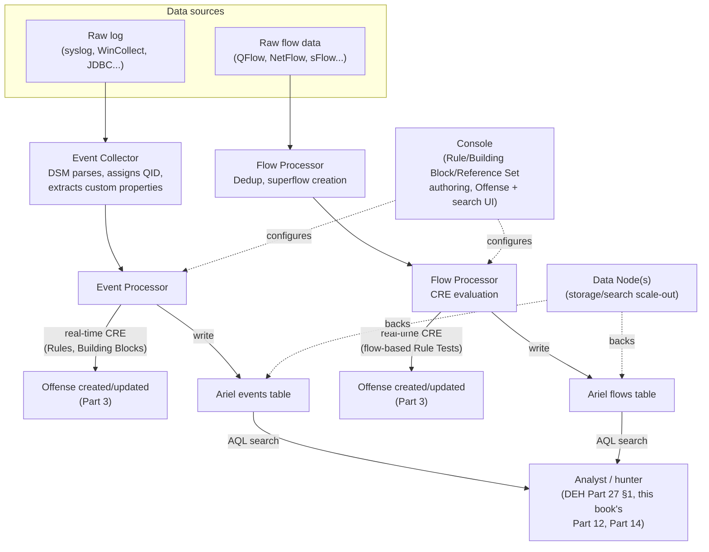

# Part 2 — QRadar Deployment Architecture: Console, Processors, Collectors, and Data Nodes

## Why this part exists

**[CONCEPT]** Every other part in this book assumes an event or a flow has already arrived somewhere QRadar can query or correlate it. Part 3 starts from a fired Offense. Part 4 starts from a raw log a DSM (Device Support Module) hasn't parsed yet. Part 12 starts from an Ariel search that's already slow. None of those parts stop to ask the question this one answers first: what physical or virtual component actually receives that data, what happens to it before it becomes a row in `events` or `flows`, and which component in a distributed deployment is doing which job. DEH Part 27 §1.1 introduces the `events`/`flows` split as a query-language fact — two tables AQL can search — without needing to explain how a raw log or a raw packet turns into a row in either table, because DEH Part 27's job was proving a point about correlation semantics, not teaching platform topology. This part owes that explanation, and everything from Part 4 onward inherits it.

A single-appliance QRadar deployment — an All-in-One — hides this entirely: one box receives logs, receives flows, parses, indexes, correlates, and serves the console UI, so there's no data-flow question worth asking. A distributed deployment, the shape almost every enterprise-scale QRadar environment actually runs, splits those jobs across named component types that each own one part of the pipeline. Get the roles wrong — assume the Console does correlation, or assume an Event Collector stores what it receives — and every downstream troubleshooting step in Part 18 starts from a wrong mental model of where to even look.

This part covers, in order: the component catalog (Console, Event Collector, Event Processor, Flow Processor, Data Node, App Host), the All-in-One-vs-distributed decision, and the path an event and a flow each physically travel from arrival to the point Part 27 §1.1's two tables pick them up. It closes with the first of this book's required PRODUCT VERSION NOTE callouts on packaging and delivery model, per `STYLE-GUIDE.md` §11 and the honesty constraint in §0 — a topic this book flags explicitly rather than asserting a current state it cannot verify from outside a live deployment.

---

## 1. The component catalog

**[PLATFORM ENGINEER]** A distributed QRadar deployment is built from a small set of named appliance/component types, each installable as a dedicated physical appliance, a virtual appliance, or (where the current licensing and packaging model permits — see §4's PRODUCT VERSION NOTE) a cloud-hosted instance. What follows states each component's job at the level that's stable across releases: what data it's responsible for and what it hands off to which neighbor. Exact sizing figures, model numbers, and appliance naming are the part that drifts and are deliberately not the focus here.

### 1.1 Console

**[PLATFORM ENGINEER]** The Console is the management head of the deployment: it's where an administrator logs in, where the Custom Rules Engine (CRE) has its Rule Wizard configured (Part 8), where Reference Sets are administered (Part 10), where the Offense list and Ariel search UI are presented to an analyst (Parts 3, 12, 14), and where the App Framework's apps run unless a dedicated App Host is deployed for that purpose (§1.6, Part 19). In an All-in-One deployment the Console also does everything every other component below does. In a distributed deployment, the Console still holds overall deployment configuration and the CRE's rule-authoring surface, but the actual work of parsing, indexing, and correlating data at scale is delegated to the components below — the Console is the place you look and the place you configure, not necessarily the place doing the heaviest processing.

### 1.2 Event Collector

**[PLATFORM ENGINEER]** An Event Collector is the first point of contact for log data: it receives events from configured Log Sources (syslog, WinCollect, JDBC, and every other collection protocol Part 4 covers), applies the relevant DSM to parse and normalize each raw log into a QRadar event with a QID (QRadar's internal event-taxonomy identifier) and extracted fields, and forwards the normalized result onward for processing and storage. An Event Collector by itself does not store events long-term or run the CRE against them — it's a parsing-and-forwarding stage, which matters directly for §3's data-flow walkthrough and for Part 4's onboarding discipline: a Log Source is configured against a specific Event Collector, and DSM mapping happens here, before an event has any chance of being searched or correlated.

### 1.3 Event Processor

**[PLATFORM ENGINEER]** An Event Processor receives normalized events (from a co-located Event Collector or from a remote one forwarding to it), runs the CRE's real-time rule evaluation against the incoming stream (Part 27 §2's Custom Rules Engine, generalized past the single worked example there), and writes events to Ariel storage for later search. In many distributed deployments an Event Processor and an Event Collector are combined on one appliance; larger deployments separate them so collection load and correlation/storage load can scale independently. This is the component actually running `BB:`-prefixed Building Block conditions and `R:`-prefixed Rules against live data, which makes it the component Part 15's tuning workflow and Part 17's EPS capacity planning are ultimately budgeting resources against.

### 1.4 Flow Processor

**[PLATFORM ENGINEER]** A Flow Processor is the Event Processor's counterpart for network-flow data: it receives flow records (from QRadar's own QFlow collection or from a third-party flow source — Part 7 covers both), applies flow-specific processing (deduplication, superflow creation), runs the CRE against flow-based Rule Tests, and writes to the `flows` side of Ariel storage. Event and flow processing are architecturally parallel paths that converge only where a Rule Test, an AQL query, or an Offense is explicitly written to consider both — a distinction Part 7 builds out in full when it takes on the flow-vs-event design decision DEH Part 27 §1.1 raises but doesn't resolve.

### 1.5 Data Node

**[PLATFORM ENGINEER]** A Data Node adds Ariel storage and search capacity without adding its own event/flow processing responsibility — it's how a deployment scales retention and search performance for a growing data volume independently of scaling correlation throughput. Data Nodes matter directly to Part 12's search-performance tuning: a search that's slow because of storage-tier contention has a different fix than one that's slow because of an underpowered Event Processor, and knowing which component actually holds the data being searched is the first branch in that diagnosis.

### 1.6 App Host

**[PLATFORM ENGINEER]** An App Host is a dedicated component for running App Framework apps (Part 19) — Use Case Manager, Pulse, UBA, and third-party App Exchange apps — off the Console, so a resource-hungry or poorly-behaved app doesn't compete with the Console's own management and UI workload. Not every deployment runs a dedicated App Host; smaller or All-in-One deployments run apps directly on the Console, which is itself a capacity-planning tradeoff Part 19 covers in more depth than this part needs.

**[CONCEPT]** Table 2.1 summarizes the six component types by the one question that matters most for troubleshooting and capacity planning: what job does each one own, and what does it hand off.

**Table 2.1 — QRadar deployment component roles.** Supports deciding which component a given performance, parsing, or correlation problem actually belongs to before troubleshooting it.

| Component | Primary job | Hands off to | Does not do |
|---|---|---|---|
| Console | Management, rule/Reference Set authoring, Offense/search UI | — (top of the deployment) | Bulk event/flow parsing or storage at scale |
| Event Collector | Receives Log Source data, applies DSM, normalizes to a QID | Event Processor | Long-term storage, CRE evaluation |
| Event Processor | Runs CRE against normalized events, writes to Ariel `events` | Data Node (storage/search scale-out) | Flow processing |
| Flow Processor | Processes flow records, runs CRE against flow Rule Tests, writes to Ariel `flows` | Data Node (storage/search scale-out) | Event (log) processing |
| Data Node | Adds Ariel storage and search capacity | — (queried by Console/analysts) | Its own independent CRE evaluation |
| App Host | Runs App Framework apps off the Console | — | Core collection, processing, or correlation |

> **PRODUCT VERSION NOTE**
> The component list above (Console, Event Collector, Event Processor, Flow Processor, Data Node, App Host) reflects QRadar's long-standing distributed-architecture model and is stable in concept across recent releases. Which specific appliance model numbers map to which role, whether a given role ships only as a combined appliance (an Event Processor bundled with local Event Collector and Data Node functions, sometimes marketed as an "All-in-One Event Processor") versus a standalone one, and the exact terminology IBM's current sales and deployment documentation uses for each, have shifted across release and product-packaging cycles. Verify current appliance/component naming against IBM's own deployment documentation for the release you're planning against before treating this part's names as a literal ordering catalog.

---

## 2. All-in-One vs. distributed: the decision, not just the definition

**[PLATFORM ENGINEER]** An All-in-One deployment runs every role in §1 on a single appliance. It is the right starting point for a small environment, a proof-of-concept, or an environment whose sustained EPS/FPM (Part 17) comfortably fits one appliance's processing and storage capacity with headroom. It is also, definitionally, a single point of failure and a single scaling ceiling: every additional Log Source, every additional analyst running a concurrent Ariel search, and every additional Rule the CRE evaluates all compete for the same box's CPU, memory, and storage I/O.

A distributed deployment exists to remove that ceiling by letting each role in §1 scale independently: add Event Collectors near where log volume originates (a second data center, a segment with its own compliance-driven data-residency requirement), add Event Processors or Flow Processors to keep pace with growing sustained EPS/FPM, add Data Nodes to keep retention and search performance from degrading as stored volume grows, and keep the Console as the single point of administration and rule authoring across all of it.

The decision isn't binary in practice — most real deployments land somewhere between "everything on one box" and "every role fully separated," adding components incrementally as a specific bottleneck appears rather than fully distributing from day one. Table 2.2 names the signal that justifies each specific addition, which is the more useful framing than a blanket "distributed is better."

**Table 2.2 — Signals that justify adding a specific component, rather than distributing everything at once.**

| Symptom observed | Component most likely to add | Why this one, not another |
|---|---|---|
| Sustained EPS approaching license/appliance ceiling, events queuing at ingestion | Event Collector (dedicated) | Collection/parsing load is the bottleneck, not correlation or storage |
| CRE evaluation lag, Offenses appearing late relative to event arrival | Event Processor (additional or upgraded) | Correlation throughput, not collection, is the constrained resource |
| Flow volume outpacing event volume disproportionately (heavy NetFlow ingestion) | Flow Processor (dedicated) | Flow and event processing are parallel paths; scale the one under load |
| Ariel searches slow or timing out as retained data grows, ingestion itself is fine | Data Node | Storage/search capacity, not processing throughput, is the constraint |
| App Framework app (Part 19) competing with Console UI responsiveness | App Host | Isolates app resource use from Console management workload |
| Remote site/segment with its own compliance-driven residency requirement | Event Collector (local) | Data needs to be collected and normalized close to origin before crossing a network boundary |

> **Platform Reality**
> A distributed deployment doesn't just add capacity — it adds a network dependency every All-in-One deployment doesn't have. An Event Collector that loses connectivity to its downstream Event Processor doesn't correlate anything until connectivity is restored; depending on configuration and version, it may buffer locally for a bounded period or begin dropping data once its local buffer fills. Before splitting a previously-All-in-One deployment across multiple sites, confirm the buffering behavior and its limits for your specific version, and treat "we added redundancy" and "we added a new single point of failure between two components that used to be one box" as two claims that both need checking, not just the first one.

---

## 3. How an event and a flow physically move through the deployment

**[CONCEPT]** DEH Part 27 §1.1 treats `events` and `flows` as two tables AQL can query, without needing to explain how a row lands in either one. This section is that explanation, walked once for each path, because Part 4 (DSM/QID mapping), Part 7 (flow architecture), and Part 12 (Ariel performance) all build directly on knowing which physical hop a given failure or slowdown belongs to.

### 3.1 The event path

**[PLATFORM ENGINEER]** A raw log leaves its source system (a Windows domain controller, a firewall, an application server) and reaches QRadar via whatever collection mechanism Part 4 covers for that Log Source type — syslog forwarding, an agent like WinCollect, a polled protocol like JDBC. It arrives at an Event Collector, which applies the DSM configured for that Log Source: the DSM assigns a QID, extracts any custom properties it's been configured to extract, and produces a normalized QRadar event. That normalized event is forwarded to an Event Processor (co-located or remote), which does two things with it independently: runs it through the CRE's currently-deployed Rules and Building Blocks in real time (Part 27 §2's architecture, at production scale), and writes it to Ariel's `events` table, on local storage or a connected Data Node, where it becomes searchable via AQL exactly as DEH Part 27 §1.1's query examples assume.

### 3.2 The flow path

**[PLATFORM ENGINEER]** Flow data follows a parallel but architecturally distinct route (Part 7 covers the full picture; this is the summary this part needs). Flow records originate from QRadar's own QFlow processing of mirrored/tapped traffic, or from a third-party flow export (NetFlow, sFlow, IPFIX) pointed at QRadar. They arrive at a Flow Processor, which performs flow-specific processing — deduplication of the same flow reported by multiple observation points, superflow aggregation for high-volume, low-information flow bursts — runs flow-based Rule Tests through the CRE, and writes to Ariel's `flows` table. An event and a flow describing the same real network activity (a login attempt and the TCP session that carried it) can arrive through entirely different components, at different processing latencies, and land in different Ariel tables — which is exactly why Part 7 treats "should this analytic use `events`, `flows`, or both" as a real design decision rather than an afterthought.

### 3.3 Where the CRE and Ariel search actually sit in this picture

**[PLATFORM ENGINEER]** Both paths converge on the same structural fact Part 27 §2 established at the query-language layer: real-time CRE evaluation and ad hoc Ariel search are two separate consumers of the same underlying data, running at different points and different cadences. The CRE evaluates each event or flow once, as it arrives at its Event/Flow Processor, against whatever Rules are currently deployed — it does not retroactively re-evaluate historical data when a Rule changes. An Ariel search, by contrast, queries whatever has already been written to storage, at the time an analyst or a scheduled search runs it, regardless of what the CRE did or didn't do with that data when it first arrived. A newly deployed Rule catches new matching activity going forward; it does not retroactively create an Offense for a matching event that arrived yesterday, before the Rule existed. Figure 2.1 makes this full path, both branches, concrete as one diagram.

**Figure 2.1 — Event and flow data flow from source to Ariel storage and real-time correlation.** *CONCEPTUAL.* Illustrates the two parallel paths (event, flow) this section describes and the point at which each converges on the same two consumers — real-time CRE evaluation and ad hoc AQL search — that Part 27 §1.1 and §2 describe from the query-language side; not a reproduction of any single IBM architecture diagram, and not a claim about a specific version's exact process names or thread model for these components internally.

> **Hunter's Note**
> When a hunt (DEH Part 27 §5's pattern, extended in this book's Part 14) turns up a gap — an event you expected to see and didn't — the first branch point in diagnosing it is exactly this diagram: is the event missing because it never reached an Event Collector at all (a Log Source configuration problem, Part 4), because it reached the collector but the DSM didn't recognize it (a QID-mapping gap, also Part 4), or because it's sitting in `events` but the Rule Test looking for it has a logic gap (a CRE authoring problem, Part 8-11)? Each of those is a different fix, and confusing "the data never arrived" with "the data arrived but the Rule didn't catch it" wastes a hunt's most valuable resource: knowing which team owns the fix.

---

## 4. Packaging and delivery model: the version-sensitive part of this whole topic

**[PLATFORM ENGINEER]** Everything in §1–§3 describes component roles and data-flow order that have held stable across QRadar's architecture for a long time — an Event Collector's job relative to an Event Processor's is not the kind of thing that changes release to release, which is why this part states it plainly rather than hedging it. What has changed, more than once, in ways this book's author cannot track from outside a live deployment, is how QRadar is actually sold, licensed, and delivered: on-premises physical or virtual appliances you size and patch yourself, versus a cloud-hosted or SaaS-delivered offering where IBM or a partner operates some or all of the component roles in §1 on your behalf, versus hybrid arrangements that split the difference. Which of these delivery models is current, what each one is currently branded, and which QRadar product family (or successor branding) owns which piece of this at any given moment, is squarely the kind of claim DEH's own instinct — and this book's §11 convention — exists to keep out of the "asserted as permanent fact" category.

> **PRODUCT VERSION NOTE**
> This book states the component architecture in §1–§3 as stable and does not tie it to a specific delivery model, because the roles themselves (collect, process, store, correlate, manage) hold across on-prem, cloud-hosted, and hybrid arrangements. What this book explicitly does not assert as current fact: which specific packaging tier, cloud-delivery option, or vendor/partner support arrangement is presently available, what each is currently named, or which of the component roles in Table 2.1 a given commercial offering does or doesn't let a customer operate directly versus consume as a managed service. This space has shifted across QRadar's release and business history in ways outside this book's current visibility. Verify current packaging, delivery model, and ownership against IBM's own current commercial documentation before making a purchasing or migration decision on the strength of anything in this part.

---

## 5. What this part deliberately leaves for later parts

**[CONCEPT]** This part stops at "data has arrived, been normalized or processed, and is now sitting in Ariel storage or has already triggered real-time CRE evaluation." Everything past that point is scoped elsewhere on purpose, so this part stays a topology-and-data-flow foundation rather than a shallow preview of six other parts:

- What actually happens inside the CRE when a Rule evaluates — Building Block composition, Reference Set checks, thresholds — is Part 27 §2's job at the query-language-comparison depth and this book's Section D's job at full operational depth (Parts 8–11).
- What the DSM actually does to a raw log, and what happens when that mapping is missing or wrong, is Part 4 and Part 5's job in full.
- The flow-vs-event design decision this section's §3.2 gestures at is Part 7's job.
- What a Data Node's storage limits mean for retention buckets and search tuning is Part 12's job.
- Capacity planning against the EPS/FPM ceilings this part's components enforce is Part 17's job, building on DEH Part 27 §1.3's single-paragraph flag.

> **What Would Change My Mind**
> This part treats the six-component catalog in §1 as the stable core of QRadar's architecture, worth stating plainly rather than hedging generically. That confidence would be misplaced if IBM restructured the platform's own component model itself — not just renamed appliances or changed a delivery tier, but genuinely collapsed or split the collect/process/store/correlate responsibilities differently than they've been split across the releases this book's author could research. A reader on a QRadar release where, say, flow and event processing have been architecturally merged into one component type, or where Data Node-equivalent storage scale-out works on a fundamentally different mechanism, should treat this part's Table 2.1 as out of date and flag it for revision rather than forcing their console into this part's categories.

---

**Cross-references:** DEH Part 27 §1.1 (the `events`/`flows` Ariel tables this part's §3 explains the physical arrival path for) and §2 (the Custom Rules Engine this part's Event/Flow Processor roles run in production); DEH Part 23 (Query Language Strategy, for the general query-language-selection context this book's AQL-adjacent parts build on without re-arguing). Within this book: Part 3 (Offenses, Magnitude, Credibility, and Relevance — what happens the moment §3.3's CRE evaluation fires a Response); Part 4 (DSMs, QID Mapping, and Log Source Onboarding — the Event Collector-side detail this part summarizes); Part 7 (Flow Data Architecture — the flow-vs-event design decision this part's §3.2 defers); Part 12 (Ariel Search Performance and Tuning — Data Node and storage-tier detail); Part 17 (Licensing, EPS/FPM Management, and Capacity Planning — the component-scaling signals in Table 2.2, taken to full capacity-planning depth); Part 19 (Apps, Extensions, and the App Framework — the App Host role in full).
