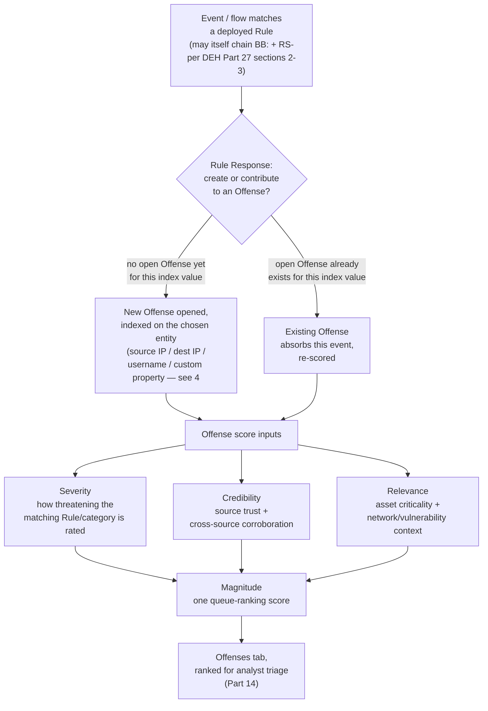
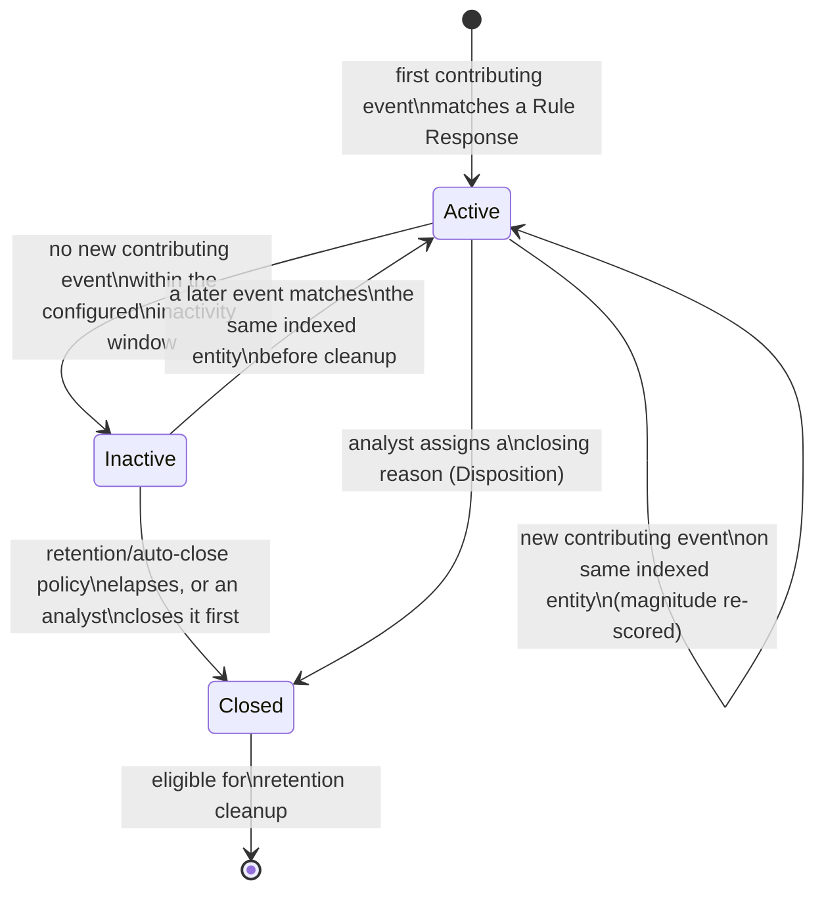

# Part 3 — Offenses, Magnitude, Credibility, and Relevance

## Why this part exists

**[CONCEPT]** DEH Part 27 §6 needed exactly one paragraph to make a single point about QRadar's Offense object — that it "is not quite either an Alert or a Case in TERMINOLOGY.md's strict sense" but a hybrid of both, bundling contributing events under one indexed record over time with "a `magnitude` score QRadar computes from severity, relevance, and credibility rather than a single fixed severity value." That paragraph existed to support a different argument entirely (why AQL alone can't build a QRadar detection); it was never meant to be the full treatment of offense scoring. This part is that full treatment. It inherits DEH Part 27 §6's finding rather than re-deriving it — an Offense stays a hybrid Alert/Case exactly as DEH `TERMINOLOGY.md` defines both terms — and goes deep on what the rest of DEH Part 27 only had room to name: what severity, credibility, and relevance actually measure, how they combine into magnitude, how an Offense is indexed to an entity, and what happens to an Offense across its lifecycle from first contributing event to cleanup.

One constraint governs every specific number in this part: IBM's own QRadar documentation was not reliably fetchable while this book was being outlined (`STYLE-GUIDE.md` §0), and the exact internal weighting arithmetic behind magnitude has never been something this book's author has verified against a live console. Where a claim is architectural — that magnitude has three named inputs, that credibility can rise from cross-source corroboration, that relevance depends on asset context — it is stated plainly, because that structure is stable across the platform's history. Where a claim would require a specific formula, a specific console field name, or a specific default timer, it carries a PRODUCT VERSION NOTE instead of an invented number. This part does not re-teach AQL (DEH Part 27 §1 owns that) and does not re-argue Sigma-first-vs-native authoring (DEH Part 23 §5 owns that); every AQL fragment below exists only to illustrate what an Offense's contributing events look like from the search side, not to teach syntax.

---

## 1. What an Offense actually is

**[CONCEPT]** An Offense is the object QRadar's Custom Rules Engine — universally abbreviated CRE — produces when a deployed Rule's Response is configured to create or contribute to one. It is the queue item an analyst opens, which makes it function like DEH `TERMINOLOGY.md`'s Alert. But unlike an Alert, which is one timestamped instance per match, a single Offense keeps absorbing every later event or flow that matches the same Rule (or, as below, a different Rule) against the same indexed entity, which makes it also function like DEH's Case — an investigative container that accumulates evidence rather than closing the moment it opens. Treat "one Offense" as "one entity's accumulated matches over time," not as "one event that fired once."

That accumulation is not limited to repeats of the same Rule. Because QRadar indexes an Offense by an entity value — not by which Rule produced it — a second, entirely different Rule that matches the same indexed value (the same source IP, the same username, whatever the index is) contributes to the already-open Offense instead of opening a new one. A host that first trips a port-scan Rule and later trips a credential-dumping Rule can end up as one Offense carrying both findings, not two separate queue items an analyst has to manually connect. This is a genuine strength of the model — the Offense already is the correlation DEH Part 27 §2.2's Reference Set pattern builds toward — and it is also why magnitude, credibility, and relevance are computed at the Offense level rather than the event level: they have to summarize a record that can grow more complex over its own lifetime.

Offenses also carry a domain/tenant binding in a multi-tenant deployment, which changes who can even see a given Offense in the first place — full treatment in Part 21; noted here only so the entity-binding discussion in §4 isn't mistaken for the only binding an Offense carries.

---

## 2. The three inputs magnitude is built from

**[CONCEPT]** Every Offense carries three separate scores before it carries one: severity, credibility, and relevance. Each measures a different question, each is visible independently on the Offense record, and magnitude (§3) is what QRadar computes from all three together. Understanding what each one actually asks is the difference between triaging by a single composite number and triaging with judgment.

### 2.1 Severity — how threatening this activity is rated to be

**[CONCEPT]** Severity answers: independent of who or what it hit, how dangerous is this pattern? A brute-force authentication failure and a confirmed LSASS memory-read both carry a severity rating, and that rating is a property of the matching Rule and the QID (QRadar's internal event-taxonomy identifier, distinct from any vendor's native event ID — DEH Part 27 §1.2 introduces the term) or category the activity falls under, not a property of which asset it landed on. A brute-force failure against a domain controller and the identical brute-force failure against a decommissioned test VM start with the same severity; the asset's own criticality is relevance's job (§2.3), not severity's.

**[RULE ENGINEER]** Severity is configured as part of a Rule's or Building Block's Response settings in the Rule Wizard (DEH Part 27 §2.1), and QRadar's own event/category catalog carries default severities for QIDs that haven't had a Rule explicitly override them. The exact numeric scale bounds and the specific default severity QRadar's own catalog assigns to a given category are QRadar's own shipped data, not something this book asserts from memory — verify the current defaults for your own deployment's QID catalog before treating a specific number as fixed platform behavior.

> **Noisy Offense Trap**
> A `BB:` library that has never had its default severity revisited since initial deployment (left at whatever the Rule Wizard's default happened to be — DEH Part 27 §2.1) inflates the whole queue's magnitude ceiling regardless of what the underlying activity actually warrants: every Offense a high-severity Building Block contributes to starts several points ahead of one built from a more conservatively-rated Rule, whether or not the activity is genuinely more dangerous. The fix is not lowering every threshold uniformly — it's a periodic severity audit against accumulated Disposition data (DEH `TERMINOLOGY.md`'s Disposition entry). A Rule whose Offenses resolve mostly Benign Positive or False Positive over a quarter is a candidate for a severity re-rating, not just a Reference Set exclusion; Part 15's tuning-intake process is the right home for this as a recurring review, not a one-time fix.

### 2.2 Credibility — how much QRadar trusts that the report is real

**[CONCEPT]** Credibility answers a different question: how much should this specific report be trusted as an accurate reflection of something that actually happened? A single Log Source's own configured trustworthiness feeds this — QRadar lets an administrator rate a Log Source's baseline credibility, and a source known for noisy or unreliable parsing starts every event it contributes lower than a well-validated one. Credibility can also rise through corroboration: when multiple independent sources report the same underlying activity — a firewall and an IDS both flagging the same connection, or (continuing DEH Part 27's own worked example) a Sysmon-fed Rule and an independently-configured EDR feed both reporting the same process touching `lsass.exe` — QRadar treats that agreement as evidence the activity is real, not an artifact of one source's own parsing quirks, and credibility on the resulting Offense reflects that corroboration rather than a single source's rating alone.

**[PLATFORM ENGINEER]** A Log Source's baseline credibility rating is an administrator-configurable field, set where Log Sources themselves are configured. The exact menu location and field wording for this setting have shifted across console redesigns the way most navigation claims in this book have — verify the current path in your own deployment's admin area rather than assuming a specific click sequence still matches.

### 2.3 Relevance — how much the target's context raises the stakes

**[CONCEPT]** Relevance answers a third question, distinct from both: given where this happened and what it happened to, how much does that context matter? The same event category can carry different relevance depending on the asset's position in the Network Hierarchy, its known vulnerabilities from an integrated vulnerability-scan feed, and any business-criticality weighting an administrator has assigned it — a failed-authentication burst against a domain controller and the identical burst against an isolated lab host are not equally relevant even though they may carry identical severity and identical credibility. Relevance is the input that ties an Offense's score back to *your* environment's own asset model rather than to the activity pattern alone, and it is exactly the reason a generic Rule with generic severity can still produce very differently-prioritized Offenses across two different networks running the same rule base.

Relevance's full mechanics — how the Network Hierarchy, the Asset Database, and vulnerability-feed data actually combine to weight an asset, and the staleness risk of an asset model nobody re-validates after infrastructure changes — belong to Part 20, not here; this part introduces relevance only far enough to make magnitude legible.

---

## 3. Magnitude: combining severity, relevance, and credibility into one score

**[CONCEPT]** Magnitude is the one number QRadar displays prominently on the Offenses list and what actually ranks the queue — a composite QRadar computes from severity, credibility, and relevance so an analyst can sort and prioritize without manually cross-referencing three separate values for every open Offense. The three-input structure itself is stable, documented architecture, not a guess this book is making: it is the same structure DEH Part 27 §6 already named in one sentence. What this book will not do is assert the specific arithmetic — the exact weighting each input contributes, or the exact formula that turns three component scores into one magnitude value.

> **PRODUCT VERSION NOTE**
> Magnitude's three-input structure — severity, relevance, and credibility — is architecturally stable and consistent with what DEH Part 27 §6 already established. The exact arithmetic weighting each input contributes to the final magnitude value is not something this book states as a fixed formula: IBM's own documentation was not reliably fetchable during this book's authoring, and the level of arithmetic detail QRadar's own published guidance exposes has itself varied across releases. Treat any specific formula you find in a console tooltip or a given release's documentation as current for that release only, and verify it against your own deployment rather than this book before building a triage rule around a specific numeric threshold.

Figure 3.1 illustrates the shape of that computation without claiming the arithmetic behind it.

**Figure 3.1 — From a matching Rule to a ranked Offense.** *CONCEPTUAL.* Illustrates the path from a single Rule match (built, per DEH Part 27 §2–§3, from Building Blocks and Reference Sets rather than one AQL statement) to an Offense carrying a computed magnitude, and the three named inputs that computation draws from. This book has no captured IBM diagram to pair with this figure under `OFFICIAL REFERENCE` — IBM's own offense-management documentation was not reliably fetchable while this book was authored (see the `qradar_version_scope` front-matter field) — and does not fabricate one; a future revision should add the sourced IBM figure under that tag if that access gap closes, per `STYLE-GUIDE.md` §9.

Table 3.1 collects the three inputs in one place as a working reference.

**Table 3.1 — Magnitude's three scoring inputs.** Supports deciding which lever actually needs adjusting — a Rule's severity rating, a Log Source's credibility configuration, or an asset's relevance weighting — instead of tuning magnitude as if it were one dial.

| Input | What It Measures | Primary Configuration Surface | Covered In Depth |
|---|---|---|---|
| Severity | How threatening this event/category is rated, independent of what it hit | Rule/Building Block Response settings; QID/category default severity | Part 8 (Rule Wizard Catalog), Part 9 (Building Blocks) |
| Credibility | How much the report should be trusted as real, boosted by independent-source corroboration | Log Source credibility rating; multi-source event aggregation | Part 4 (DSM/Log Source Onboarding), Part 17 (Capacity Planning) |
| Relevance | How much the target's own context (criticality, vulnerabilities, network position) raises the stakes | Network Hierarchy weighting; Asset Database; vulnerability-feed integration | Part 20 (Asset Model, Network Hierarchy, and Vulnerability Data) |

> **Blind Spot**
> Magnitude is one number computed from three inputs, and two Offenses can land on the identical magnitude value for very different reasons — one because a single Rule with an aggressively-configured high severity fired once on an uncorroborated event, another because three independently credible sources each reported a moderate-severity event against a highly relevant asset. The CRE has no mechanism to flag "these two 7s got there differently" anywhere in the Offenses list itself; that distinction only surfaces if an analyst opens the Offense and reads severity, credibility, and relevance individually rather than triaging by the composite number alone. A queue sorted purely by magnitude quietly trains analysts to skip exactly the step that would catch this.

Continuing DEH Part 27 §3.3's worked example makes this concrete. `R: Suspicious LSASS Access — Unapproved Process` (DET-27-01, MITRE T1003.001 (OS Credential Dumping: LSASS Memory)) fires when `BB:LSASS-Access-Candidate` matches and the source process is absent from `RS-Allowlisted-LSASS-Tools`. If only the Sysmon-fed path reports the access, the resulting Offense's credibility reflects that one Log Source's own configured rating. If an independently-configured EDR feed also reports the same process touching `lsass.exe` around the same time, and both feed the same indexed host, credibility rises on the strength of that corroboration — the same underlying analytic, scored differently depending on how many independent sources agree it happened, which is exactly what §2.2 means by credibility not being a synonym for "did the Rule match."

---

## 4. Offense indexing and entity binding

**[RULE ENGINEER]** When a Rule's Response is configured to create or contribute to an Offense, the Rule Wizard requires a choice of what indexes it — the entity value QRadar uses to decide whether a later match belongs to an already-open Offense or needs to start a new one. Common choices are source IP, destination IP, username, or a custom property (the same kind of DSM-extracted field DEH Part 27 §1.2 covers for AQL). This choice determines what "the same entity" means for bundling purposes, and it is not a cosmetic setting — it changes what magnitude, credibility, and relevance are being computed *about*.

Index on source IP for an attacker-centric Rule (scanning, beaconing) and every contributing event from one apparent source lands in one Offense regardless of which target or account it touched. Index on destination IP for an asset-centric Rule (protecting one high-value server) and every contributing event against that asset bundles together regardless of source. Index on username for an identity-centric Rule (credential misuse) and one account's activity bundles across hosts and source IPs. Choosing wrong doesn't produce an error — it produces an Offense that quietly measures the wrong thing, exactly the kind of failure DEH Part 27 §3.1 already warns fails silently rather than loudly.

Table 3.2 lays out the choice and its failure mode per index type.

**Table 3.2 — Offense index choice, what it bundles, and how it fails when chosen wrong.** Supports picking the index deliberately at Rule-authoring time rather than discovering the wrong choice only after Offenses have already accumulated against it.

| Index Value | What Bundles Into One Offense | Best Fit | Failure Mode If Chosen Wrong |
|---|---|---|---|
| Source IP | Every contributing event from one apparent source, any target, any account | Attacker-centric rules (scanning, C2 beaconing) | An attacker pivoting through several source hosts splits across multiple Offenses instead of one |
| Destination IP | Every contributing event against one target asset, any source, any account | Asset-centric rules (protecting a specific server or domain controller) | One account's activity across many targeted assets never bundles into a single view of that account's behavior |
| Username | Every contributing event tied to one account, any source, any target | Identity-centric rules (credential misuse, insider risk) | A shared or service account triggering unrelated Rules from unrelated hosts merges unrelated incidents into one inflated Offense |
| Custom property | Whatever the DSM-extracted field represents (a session ID, a ticket number) | Narrow, purpose-built correlation | Depends entirely on the property's own extraction reliability — DEH Part 27 §3.1's QID-mapping prerequisite applies directly |

Multiple Rules indexed the same way on the same value are what allow the accumulation behavior §1 describes — a port-scan Rule and a credential-dumping Rule both indexed on the same source IP contribute to one Offense, not two. Two Rules meant to correlate the same campaign but indexed on different values (one on source IP, one on username) will never merge, even if a human reviewing both would obviously connect them — a design decision worth checking explicitly when a new Rule is meant to build on an existing one's Offense, not assumed to work automatically.

---

## 5. Offense lifecycle: active, inactive, and closed

**[ANALYST]** An Offense begins the moment its first contributing event triggers a Rule Response configured to create one, and it stays open — actively able to absorb new contributing events and be re-scored — for as long as new matches keep landing on its indexed entity. This is the behavioral shape that matters for triage: an Offense you closed yesterday as a false positive can, if the same Rule matches the same indexed value again, either reopen or contribute to a fresh Offense depending on how your deployment handles reactivation, which is exactly why closing reasons and notes (Part 14) matter — the next analyst who opens a related Offense needs that history, not a clean slate.

**[PLATFORM ENGINEER]** If no new contributing event lands within a configured window, an Offense stops actively accumulating without necessarily being analyst-closed — a state this book describes generically as inactive rather than asserting a specific formal label QRadar's own UI uses for it. Eventually, retention and cleanup policy determines whether an inactive Offense is auto-closed, purged, or simply ages out of default views while remaining queryable. An analyst can also close an Offense directly at any point, assigning a closing reason — the Disposition concept DEH `TERMINOLOGY.md` already defines, carried forward unchanged rather than redefined here.

**Figure 3.2 — Offense lifecycle: active, inactive, and closed.** *CONCEPTUAL.* Illustrates the behavioral shape of an Offense's life — it stays live until either an analyst closes it or it ages out through inactivity and retention policy — without asserting the literal state labels or timer defaults QRadar's own console uses, which the PRODUCT VERSION NOTE below flags explicitly.

> **PRODUCT VERSION NOTE**
> This section describes Offense state generically as active/open, inactive, and closed because that is the stable behavioral shape: an Offense keeps accumulating contributing events until something stops it, and stops being "live" through either analyst closure or elapsed inactivity. The literal state labels QRadar's own console displays, and the specific inactivity/retention timers — including whether an Offense can auto-close without any analyst action at all, and whether on-prem and cloud-hosted deployments default to the same timers — have differed across releases and packaging models. Verify your own deployment's Offense retention and closing configuration before relying on a specific timer value or state name as current.

---

## 6. Retention, cleanup, and offense forwarding

**[PLATFORM ENGINEER]** Closed and long-inactive Offenses don't disappear immediately — retention policy governs how long they remain queryable in the console before eventual purge, and that retention window is a direct capacity/storage consideration alongside the Ariel event and flow retention buckets Part 12 covers; an Offense's own contributing-event list is a pointer into Ariel data, not a separate full copy, so Offense retention and underlying Ariel retention need to be reasoned about together, not independently. Part 17's capacity-planning discipline is the right home for sizing this rather than treating it as a fixed default.

Offenses also frequently need to leave QRadar entirely — into a SOAR platform, a ticketing system, or an upstream aggregation point in an MSSP architecture (Part 21). Architecturally, that happens through one of a small number of paths: a Rule Response action that fires a notification or script when an Offense is created or updated, a dedicated forwarding/destination configuration for sending Offense (and event) data to an external system, or an external system polling QRadar's REST API for Offense data on its own schedule. Which of these is available, what it's called, and which upstream products ship a native integration, is exactly the kind of claim this book will not assert as fixed.

> **PRODUCT VERSION NOTE**
> Offense forwarding to an external ticketing or SOAR platform is described here only at the architectural level — a Rule Response action, a dedicated forwarding/destination configuration, or an external system polling the REST API. Which of these paths exists in a given deployment, what it's called in the console, and which upstream products IBM packages a native integration for, has changed across release cycles and business/ownership changes in QRadar's own product line — the packaging/ownership trigger `STYLE-GUIDE.md` §11 names explicitly applies here. Confirm current forwarding options against your own deployment's admin console and current vendor documentation before designing a workflow around a specific named feature.

---

## 7. Reading magnitude, credibility, and relevance at triage time

**[ANALYST]** The practical payoff of §§2–3 is triage discipline, not trivia: a fired Offense's magnitude tells you where it sits in a ranked queue, but severity, credibility, and relevance individually tell you *why* it's there, and those are different questions an analyst should be able to answer before acting. Is this Offense high-magnitude because three independent sources corroborated the same activity against a genuinely critical asset — strong grounds to escalate fast — or because one aggressively-rated Rule fired once against an asset nobody has weighted for relevance yet? Both can produce the same number. Only opening the breakdown tells you which one you're looking at. Part 14 owns the full day-to-day triage workflow this capsule feeds into; this section only establishes what the three inputs are worth reading for before that workflow starts.

**[THREAT HUNTER]** If an Offense's magnitude looks lower than the raw activity visible in Log Activity seems to warrant, don't stop at re-reading the Offense — pivot into an ad hoc AQL search scoped to the same indexed entity and time window, extending DEH Part 27 §5's hunting pattern from a cold hypothesis to an Offense you already have in hand, and check what didn't get bundled in. A narrow Building Block condition, a custom property left unpopulated for one of several contributing Log Source types (DEH Part 27 §3.1's silent-zero-rows failure mode), or a second Rule indexed on a different entity value can all leave real activity sitting outside the Offense's own contributing-event list with no error anywhere to flag the gap.

---

## 8. What this scoring model costs a SOC program

**[SOC MANAGEMENT]** "We closed N offenses this week" is not the same claim as "we reviewed N alerts" in a KQL/SPL shop, and it is not a coverage claim at all — DEH `TERMINOLOGY.md`'s Coverage entry already warns that bare "coverage" is an incomplete sentence, and an Offense count is one more bare number in the same family. An Offense already bundles however many contributing events one Rule's severity/credibility/relevance mix happened to produce; the count alone says nothing about detection breadth, and reporting it without qualification invites exactly the coverage-count confusion DEH Part 27's own closing paragraph flags for a different metric.

> **SOC Management View**
> Budget analyst training time specifically for reading the severity/credibility/relevance breakdown behind magnitude, not just the composite number — §3's Blind Spot is a training gap this scoring model creates by design, not a one-time onboarding note. A single-severity-dial platform doesn't need this training line item; a platform whose primary ranking number can mean two structurally different things at the same numeric value does. That recurring cost belongs in the same staffing conversation Part 22 makes explicit for the QRadar practice as a whole, alongside the three-object Rule/Building Block/Reference Set review burden DEH Part 27's own closing paragraph already named.

---

**Cross-references:** DEH Part 23 §5 (Query Language Strategy — Sigma-first vs. native authoring, not re-argued here); DEH Part 27 §1.2 (QID and custom-property fundamentals), §2.1–§2.2 (Rule Test/Building Block/Reference Set mechanics behind any Rule that creates an Offense), §3.1/§3.3 (the `R: Suspicious LSASS Access — Unapproved Process` worked example continued in §3 above), and §6 (the Offense-as-Alert/Case-hybrid finding this part inherits rather than re-derives); this book's Part 4 (DSMs, QID Mapping, and Log Source Onboarding), Part 8 (Rule Wizard Catalog), Part 9 (Building Blocks), Part 12 (Ariel Search Performance and Tuning), Part 14 (Analyst Triage Workflow), Part 15 (Noisy-Offense Triage and the Tuning Workflow), Part 17 (Licensing, EPS/FPM, and Capacity Planning), Part 20 (Asset Model, Network Hierarchy, and Vulnerability Data), Part 21 (Multi-Tenancy, RBAC, and MSSP Operations), and Part 22 (Staffing and Running a QRadar Practice).
