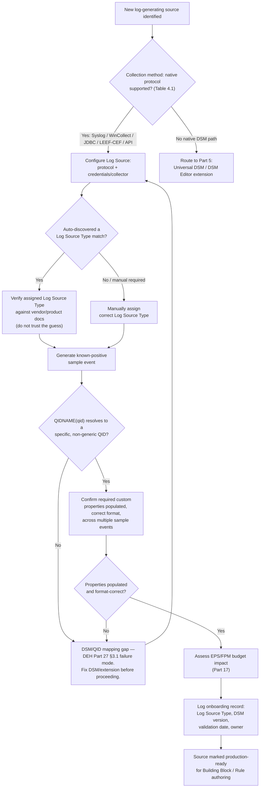

# Part 4 — DSMs, QID Mapping, and Log Source Onboarding

## Why this part exists

**[CONCEPT]** Detection Engineering Handbook (DEH) Part 27 §3.1 names a failure mode in one paragraph and moves on, because proving one AQL/CRE design point was that part's whole job: "an unmapped or partially-mapped event lands under a generic QID with no custom properties, and the query fails silently." That sentence is doing a lot of unstated work. It assumes a reader already knows what a Device Support Module (DSM) is, how QRadar decides which DSM parses a given Log Source's traffic, what "unmapped" actually looks like operationally, and — most importantly — how a team catches this before it becomes six months of a Rule that has matched zero events and nobody noticed. This part is where that assumption gets paid off in full.

Onboarding a new log source into QRadar is not a single click. It is a protocol decision, a parsing-authority decision (which DSM owns this traffic), a QID-assignment verification step, and a custom-property population check — four distinct failure surfaces, each of which can silently produce "the Log Source is receiving data" while the platform's own event-taxonomy identifier (QID) resolves to nothing useful and every custom property a downstream rule needs comes back empty. This part walks the full lifecycle, then turns DEH Part 27 §3.1's one-paragraph warning into the repeatable checklist a platform engineer runs every time a new source comes online — and hands off, deliberately, to Part 5 (log sources with no native DSM at all) and Part 6 (custom-property extraction and governance in depth) rather than absorbing either topic here. This part also does not re-teach AQL syntax — DEH Part 27 §1 owns that — or re-argue Sigma-first-vs-native authoring, which DEH Part 23 §5 already settles generically; every AQL query below exists only to validate onboarding, not to teach the language.

---

## 1. What a DSM actually does, and why nothing downstream works without one

**[CONCEPT]** A Device Support Module is the parser that turns one vendor or product's raw log format into QRadar's internal event schema. Concretely, a DSM does three things to every raw record it successfully recognizes: it normalizes the record's fields into QRadar's built-in schema (`sourceip`, `destinationip`, `username`, and so on, the same fields DEH Part 27 §1.1's baseline AQL query already selects against), it assigns a QID (QRadar's internal event-taxonomy identifier, distinct from any vendor's own native event ID — DEH Part 27 §1.2's own introduction of the term) drawn from a signature match against the raw payload's structure and content, and — where the DSM has been configured or extended to do so — it extracts custom properties: fields beyond the built-in schema, pulled from the payload by regex or a structured parser and made available in AQL under a quoted display name (`"Granted Access"`, `"Target Process Name"`), exactly as DEH Part 27 §1.2 and §3.2 already show.

None of the platform's correlation machinery cares what the raw log looked like before a DSM touched it. The Custom Rules Engine — the platform's real-time correlation engine, universally abbreviated CRE (DEH Part 27 §2) — evaluates normalized events against Rule Tests keyed on QID, category, and custom-property values. A Building Block condition like `BB:LSASS-Access-Candidate`'s match on `"Target Process Name"` ending in `lsass.exe` (DEH Part 27 §3.3) has nothing to check against if the DSM that parsed the underlying Sysmon Event ID 10 record never extracted that field in the first place. Onboarding is the point in the pipeline where that extraction either happens correctly or doesn't — which makes it upstream of every Rule Engineer decision this book's Section D covers, not a one-time setup task that can be treated as done once a source shows up in the Log Source list.

The distinction that matters for the rest of this part: a **Log Source** is one configured collection point — a specific firewall, a specific domain controller's WinCollect agent, a specific cloud API feed — and a **Log Source Type** is the DSM template QRadar assigns to it, which determines every parsing rule, QID-mapping table, and custom-property extraction pattern applied to that source's traffic from that point forward. Two Log Sources of the same Log Source Type share identical parsing behavior; two Log Sources with the same protocol (both arriving over syslog, say) but different Log Source Types are parsed by entirely different DSMs and can produce completely different QID and custom-property outcomes from visually similar raw text. Getting the Log Source Type assignment right is therefore not a cosmetic labeling choice — it is the decision that determines whether §3 and §4 below succeed or fail.

---

## 2. The Log Source object model: protocol, type, and instance

**[PLATFORM ENGINEER]** Configuring a Log Source means answering two largely independent questions: how does the data physically arrive (the protocol/collection method), and which DSM should parse it once it does (the Log Source Type). QRadar supports several collection paths, and picking the wrong one for a given source is a common early onboarding mistake — a source that could be pulled via a structured API integration but gets configured as a raw syslog feed instead loses whatever structure the API would have preserved, pushing more parsing burden onto a DSM's regex layer than necessary.

| Collection Method | Typical Use Case | Push or Pull | Onboarding Note |
|---|---|---|---|
| Syslog (UDP/TCP) | Firewalls, network appliances, most on-prem infrastructure | Push | Highest auto-discovery success rate when the source's syslog format matches a known DSM signature; also the easiest to misassign to the wrong Log Source Type when two vendors' formats look superficially similar. |
| WinCollect (agent-based) | Windows Event Log, Sysmon channels | Push (agent forwards) | Agent version and the specific Windows Event Log channel configured both affect what reaches the DSM — an agent upgrade can change field layout without changing the Log Source Type assignment (see the Rule Autopsy in §5). |
| JDBC | Database-resident audit/log tables (many enterprise applications) | Pull (scheduled poll) | Poll interval becomes a real detection-latency factor — a 10-minute JDBC poll means up to 10 minutes before a matching event even reaches the CRE, independent of Rule logic. |
| LEEF / CEF | Vendor-side structured escape hatch for products emitting IBM's or a common structured log format directly | Push | Skips most DSM regex-parsing burden since the source itself emits a structured, self-describing format; Part 5 covers this as one alternative to a hand-built extension. |
| REST API / cloud connector | SaaS platforms, cloud provider audit logs | Pull (API poll or webhook) | Field mapping is usually maintained by IBM or the vendor as part of the connector rather than a general-purpose DSM signature — verify which party owns updates to that mapping before assuming it survives a vendor-side API version change unattended. |

**Table 4.1 — Common QRadar log-source collection methods and their onboarding implications.** *Version: general/version-agnostic — the collection-method categories themselves are architecturally stable; the exact protocol list QRadar supports out of the box, and the specific connectors available for a given cloud platform, have grown and changed across release cycles. Verify current protocol/connector availability against your own deployment's Log Source creation wizard before assuming a specific method is present.*

Every row in that table answers "how does the data get here." None of them, on their own, answer "does the data get parsed correctly once it arrives" — that is §3 and §4's job, and it is a separate verification step regardless of which collection method a given source uses.

---

## 3. Auto-discovery versus manual configuration

**[PLATFORM ENGINEER]** QRadar can auto-detect certain protocols reaching a known collector and auto-create a Log Source with a guessed Log Source Type, based on matching the incoming traffic's structure against known DSM signatures. This works well for common, high-volume appliance types with a distinctive, stable syslog format — but "auto-detected" is a guess based on pattern matching, not a guarantee that the assigned Log Source Type is the correct one for this specific device's firmware version, configuration, or vendor sub-variant. A platform engineer who accepts an auto-discovered Log Source Type without checking it against the actual device documentation is trusting a heuristic to make a decision that determines every QID and custom property that source will ever produce.

Not every collection path auto-discovers at all. JDBC pulls, most REST/API connectors, and any source requiring credentials or a connection string have to be configured manually from the start — there is no passive traffic pattern for QRadar to match against before a connection is established. Treat auto-discovery as a convenience for a narrow set of common cases, not the default onboarding path to assume for a heterogeneous log-source estate.

> **PRODUCT VERSION NOTE**
> The exact auto-discovery workflow — which protocols it covers, how confidently it pre-selects a Log Source Type versus flagging the match as ambiguous for manual review, and the specific wizard steps and screen names involved — has shifted across QRadar releases and is exactly the kind of console-navigation detail this book will not assert as a permanent fact (STYLE-GUIDE.md §11). Verify current auto-discovery behavior and its confidence-reporting UI against your own deployment before building an onboarding runbook that assumes a specific wizard flow.

---

## 4. QID assignment and the generic-QID failure mode

**[PLATFORM ENGINEER]** A DSM's signature table maps specific raw-payload patterns to specific QIDs — one DSM can and typically does own dozens to hundreds of distinct QIDs, one per event type it recognizes (a firewall DSM might map "connection allowed," "connection denied," and "configuration changed" to three separate QIDs from the same Log Source Type). When an incoming raw record matches none of a Log Source Type's known signatures — because the vendor changed a field order, added a header, shipped a firmware update with new log wording, or because the Log Source Type assigned to this source was simply wrong to begin with — the event still lands in the Ariel `events` table. It has to; QRadar does not discard unparsed data. What it does not get is a specific QID: it lands under a generic, catch-all identifier with no custom properties extracted, because no signature matched well enough to tell the parser which fields exist where in this particular payload.

This is precisely the failure mode DEH Part 27 §3.1 names for one worked example — Sysmon Event ID 10 arriving without a validated DSM path — generalized to every onboarded source: **a Log Source showing green, actively receiving bytes, tells you nothing about whether those bytes are landing under a meaningful QID.** `QIDNAME(qid)` resolving to a generic or unrecognized label, and every custom property a downstream Building Block expects coming back null, is indistinguishable at the ingestion layer from "this event type genuinely never occurs here." Both look identical: a Log Source with a healthy event count and a Rule that has never fired.

> **PRODUCT VERSION NOTE**
> The exact display name QRadar uses for an event that matched no specific signature (commonly referred to informally as an "unknown" or generic QID category), the console path for reviewing which events in a given Log Source fell into it, and the exact wording/color coding a Log Source's own status indicator uses to report "actively receiving data" (referred to generically as "green" or "healthy" in this part) are all wording/navigation details that have varied across releases. Confirm the current label, review path, and status-indicator wording in your own Log Activity and Log Source Management interfaces — the architectural point (unmatched events land under a non-specific identifier with no custom properties, and a healthy-receiving-data status is not the same signal as a correct DSM mapping) is stable; the exact strings and colors are not.

A second, easily overlooked cause of the same symptom is a **parsing-order conflict**: two Log Source Types can plausibly claim the same traffic shape, especially for generic syslog-based devices from different vendors that happen to share a similar wire format. If a source is auto-discovered or manually assigned to a Log Source Type that superficially matches but isn't the actual DSM built for this vendor and product, every event parses "successfully" in the sense of matching some signature — just the wrong DSM's signature, assigning QIDs and (if any) custom properties that describe a different product's event taxonomy entirely. This is worse than the zero-match case in one specific way: a wrong-DSM assignment can produce a plausible-looking, non-generic QID that is nonetheless meaningless for this source, passing a shallow "does it have a specific QID" check while still being wrong.

---

## 5. `BB:LSASS-Access-Candidate` — a DSM mapping that shipped broken

**[PLATFORM ENGINEER]** The failure mode §4 describes in the abstract has a concrete, dated history in DEH Part 27's own worked example — the onboarding step that has to succeed before `BB:LSASS-Access-Candidate` can ever match anything.

> **Rule Autopsy**
>
> **The rule:** A WinCollect-forwarded Sysmon `Microsoft-Windows-Sysmon/Operational` channel, onboarded as the Log Source Type for a community-maintained Sysmon DSM extension, feeding DET-27-01's `BB:LSASS-Access-Candidate` (DEH Part 27 §3.1, §3.3) — the exact scenario DEH Part 27's own Engineering Reality callout warns a reader to validate before writing a single Rule Test against it.
>
> **Why it shipped:** Onboarding was signed off the day the Log Source showed events flowing and a spot-check AQL search against `events` returned rows with a populated QID for a handful of common event types. That was treated as proof the DSM mapping worked. Nobody ran DEH Part 27 §3.1's specific known-positive test — deliberately generating an Event ID 10 access to `lsass.exe` and confirming `"Granted Access"` came back populated and in the expected format — before marking the source production-ready.
>
> **How it failed:** A routine Sysmon agent upgrade six months later changed how the WinCollect-forwarded payload represented the `GrantedAccess` field — from the zero-padded hex string the DSM extension's regex expected to an unpadded variant. The extraction pattern stopped matching for that one field alone; every other field on the same event kept extracting normally, and the Log Source's event count and general health metrics showed nothing unusual. `"Granted Access"` came back empty for every subsequent Event ID 10 record. `BB:LSASS-Access-Candidate`'s Rule Test checking that field's value against the memory-read access-mask list never matched again — not because the underlying LSASS-access activity stopped happening, but because the field it was built to check had gone silently empty. No error surfaced anywhere in the console; the Rule simply stopped firing, indistinguishable from "no suspicious access occurred."
>
> **The fix:** Onboarding sign-off became conditional on a documented, per-Log-Source-Type known-positive test for every custom property a currently-deployed Building Block or Rule depends on — not just "the Log Source shows events" or "a generic AQL search returns rows." That test gets re-run, not assumed still valid, after any agent, firmware, or DSM-extension version change touching that source — the same discipline DEH Part 27 §3.1's Engineering Reality callout states for the initial mapping, extended here to cover the mapping's entire operational lifetime rather than treating validation as a one-time gate at onboarding.

This is the sharpest version of the point this part exists to make: the failure DEH Part 27 §3.1 names once, as a caution against skipping validation before writing AQL or a Rule Test, recurs on a longer timescale as a caution against skipping *re*-validation after any change to the source, the agent, or the DSM extension parsing it. Onboarding is not a milestone reached once; it is a mapping contract that has to survive every subsequent change on either side of it.

---

## 6. What onboarding must confirm before a Rule Engineer builds anything

**[RULE ENGINEER]** Part 6 owns custom-property extraction, naming, and governance in full depth — the regex-vs-calculated-property choice, Ariel search-performance cost, and the naming discipline that keeps a property referenced in AQL or a Rule Test from silently drifting out of sync with the DSM that populates it. This part's narrower job is to state the handoff condition clearly: a source is not onboarding-complete, in any sense a Rule Engineer should rely on, until every custom property a currently-planned or currently-deployed Building Block needs from it has been confirmed populated, in the expected format, against a real event — not merely present in the DSM's configuration as an extraction rule that has never actually matched live traffic.

> **Validation Test**
> **Setup:** A newly onboarded Log Source, Log Source Type assigned and accepted (auto-discovered or manual), at least one custom property this source is expected to populate for a planned or existing Building Block.
> **Action:** Generate a known-positive event on the source system that should trigger the specific event type the target custom property depends on — the same discipline DEH Part 27 §3.1's Engineering Reality callout requires for DET-27-01's Sysmon path, generalized to any source: don't wait for organic production traffic to be your first test.
> **Expected result:** The resulting event in Log Activity resolves to a specific, non-generic QID; the target custom property appears populated with a value in the format the consuming Building Block or AQL query expects (hex vs. decimal, zero-padded vs. not, a full path vs. a bare filename); and an ad hoc AQL search scoped to this Log Source and QID returns the field populated across more than one sample event, not just the first one — a single lucky match doesn't rule out an intermittent extraction pattern.

Skipping this step doesn't just risk a Building Block that never fires — DEH Part 27 §2.3's Blind Spot already names the sharper consequence for a chained, multi-Rule pattern: if a first-stage Rule depends on a custom property that never actually populates, a Reference Set a second-stage Rule depends on never gets written to, and the second Rule silently never fires either, with the failure's true origin sitting one onboarding step upstream of either Rule's own logic.

---

## 7. A repeatable onboarding checklist

**[PLATFORM ENGINEER]** The steps below operationalize §4 and §5's failure modes into a sequence a platform engineer can run for every new source, regardless of collection method. None of these steps require AQL syntax beyond what DEH Part 27 §1 already covers — this checklist is a workflow around that syntax, not a reason to relearn it.

| Step | Action | Verifies Against |
|---|---|---|
| 1 | Confirm the collection method (Table 4.1) matches what the source can actually deliver, not just what's convenient to configure. | Wrong protocol choice loses structure a native connector would have preserved. |
| 2 | If auto-discovered, check the assigned Log Source Type against the device's actual vendor/product/firmware documentation — do not accept a plausible-looking match on trust. | §3's auto-discovery-is-a-heuristic caveat; §4's wrong-DSM parsing-order risk. |
| 3 | Generate or identify a known-positive sample event for at least one event type this source is onboarded to support. | §6's Validation Test setup step. |
| 4 | Confirm the resulting event resolves to a specific, non-generic QID via `QIDNAME(qid)` in an ad hoc AQL search (DEH Part 27 §1.2). | §4's generic-QID failure mode. |
| 5 | Confirm every custom property a currently planned or deployed Building Block needs from this source is populated, across more than one sample event, in the exact format the consuming query or Rule Test expects. | §5's Rule Autopsy; DEH Part 27 §3.1's Engineering Reality. |
| 6 | Estimate this source's sustained event rate and confirm it against the deployment's licensed EPS/FPM budget before going live at full volume (Part 17). | §8's Platform Reality below. |
| 7 | Record the Log Source Type, DSM/extension version, validation date, and validating engineer in the onboarding log. | Re-validation trigger for any future agent/DSM/firmware change (§5's fix). |
| 8 | Re-run step 3–5's known-positive test after any agent upgrade, DSM content update, or firmware change touching this source — do not assume a passing test stays valid indefinitely. | §5's Rule Autopsy — this is the step that was skipped. |

**Table 4.2 — Log source onboarding checklist, keyed to the failure mode each step closes.** *Version: general/version-agnostic — the checklist steps themselves don't depend on QRadar's exact release; step 4's specific AQL function names and step 2's exact wizard screen are covered by DEH Part 27 §1.2 and this part's own PRODUCT VERSION NOTEs respectively.*

**Figure 4.1 — Log source onboarding lifecycle, from source identification to production-ready sign-off.** *CONCEPTUAL.* Illustrates this part's own checklist (Table 4.2) as a workflow, including the two loop-back points where a mismatched Log Source Type or an unpopulated custom property routes back to reconfiguration rather than forward to sign-off; not a reproduction of any QRadar console screen or wizard, and not a claim about the exact wizard steps a specific release presents (see §3's PRODUCT VERSION NOTE). The Mermaid source above is the editable source of truth for this figure per STYLE-GUIDE.md §10.

---

## 8. Platform Reality: onboarding doesn't end at sign-off

**[PLATFORM ENGINEER]** Two forces keep acting on an already-onboarded Log Source after Table 4.2's checklist is complete, and neither is optional to plan for. First, DSM content itself updates — IBM (and, for extensions, whatever team maintains them) periodically ships revised signature tables and field-extraction patterns for existing Log Source Types, the same class of update that Part 19 covers for the App Framework more broadly. A DSM content update can change which QID a given raw pattern resolves to, or add a custom property that didn't exist at onboarding time, without anyone touching this specific Log Source's own configuration. That is generally an improvement, but "generally" is doing real work in that sentence: a signature refinement that narrows an overly broad pattern can, in principle, cause a previously-matching event type to resolve differently after an update most teams apply as routine platform maintenance, not as a change requiring re-validation of every dependent Rule.

Second, and independently of any DSM update, a source's actual sustained event volume rarely matches its estimate from step 6 once real production traffic replaces the sample events used for validation. A newly onboarded source that seemed comfortably within budget during a quiet validation window can push the deployment's total sustained rate over its licensed EPS/FPM tier once it's carrying full production load — Part 17 covers the licensing and capacity-planning mechanics in depth; the operational point here is that onboarding sign-off should include a follow-up check on real sustained volume after the source has been live for a representative period, not just the estimate used to justify going live in the first place.

> **Platform Reality**
> Documented onboarding treats Table 4.2's sign-off as a completed gate; production treats it as a snapshot that starts decaying immediately. A routine DSM content update can silently change which QID or custom property a Log Source Type produces, and a source's real sustained EPS/FPM under full production load routinely exceeds the estimate from a quiet validation window. Neither is a malfunction — both are ordinary platform behavior a re-validation cadence has to plan for, not a one-time approval.

> **PRODUCT VERSION NOTE**
> How QRadar surfaces a DSM content update — whether it applies automatically on a schedule, requires a manual review-and-approve step, or is packaged separately from platform/console updates — has varied across release and delivery models (on-prem vs. cloud/SaaS), and this book does not have current visibility into which model your specific deployment uses. Confirm your environment's DSM update cadence and approval workflow directly rather than assuming updates apply silently or require sign-off — either assumption, held wrong, changes how often step 8 of Table 4.2's checklist actually needs to run.

---

## 9. Blind Spot: what auto-discovery and a "receiving events" status can't tell you

**[PLATFORM ENGINEER]** Auto-discovery, by construction, only recognizes traffic shaped like something it already has a signature for. A source using a nonstandard port, an unusual encapsulation (syslog wrapped inside another transport, a proxy that reformats headers before forwarding), or a genuinely proprietary log structure won't be auto-discovered — and won't necessarily fail loudly either. It may register as a Log Source receiving bytes with no confident Log Source Type match, or it may partially match a similar-looking DSM's signature closely enough to get auto-assigned incorrectly, which is the wrong-DSM case §4 already names as worse than an outright non-match. Neither outcome announces itself as an error; both look, from a distance, like "a new source came online and QRadar is handling it."

> **Blind Spot**
> A "receiving events" status answers one question — is data arriving — and cannot answer a structurally different one: is the assigned Log Source Type the right parser for that data. QRadar tracks these at two separate layers (collection vs. DSM), and no status indicator collapses them into one signal. Only the checklist in §7, run deliberately rather than inferred from a healthy-looking status, closes that gap.

This is the same blind spot as §4's generic-QID failure mode, restated from the discovery side rather than the parsing side: the collection layer and the DSM layer fail independently, and a platform engineer who only checks the collection layer's status has verified nothing about the layer underneath it.

---

## 10. What this means downstream, for the analyst and the rule engineer

**[ANALYST]** When a fired Offense doesn't show up for a pattern an analyst or a Rule Engineer is confident should be firing, the reflex is to suspect the Rule's logic first — a threshold set wrong, a Reference Set membership check inverted, a Building Block condition that's subtly too narrow. This part's whole argument is that the reflex should include one earlier question: has this Log Source's DSM mapping actually been validated for the specific QID and custom properties this Rule depends on, and has it been re-validated since the last agent, firmware, or DSM-content change touching that source? A Rule with flawless logic against a field that's silently empty produces the exact same symptom — nothing — as a Rule with broken logic. Part 18's troubleshooting playbook picks this up as one of its three named failure modes (a DSM/QID mismatch after a vendor agent upgrade) with the full symptom-to-fix decision tree; this part is what makes that playbook's first diagnostic question ("was this source's mapping ever actually validated, and is it still valid") answerable at all, because §7's checklist is what should have produced a documented answer before the question ever needed asking.

---

**Cross-references:** DEH Part 27 §1.1–§1.2 (Ariel `events` schema and the `QIDNAME()`/`LOGSOURCETYPENAME()` translation functions this part relies on without re-teaching); DEH Part 27 §3.1 (the DSM/QID mapping prerequisite and generic-QID failure mode this part operationalizes into Table 4.2's checklist); DEH Part 27 §2.3 (the chained-Rule Blind Spot §6 extends to an onboarding-layer root cause); DEH Part 23 §3 (field-mapping completeness as a translation-layer failure mode, the Sigma-pipeline analog of this part's DSM-signature failure mode). Within this book: Part 5 (Universal DSM and DSM Editor extensions for sources with no native DSM); Part 6 (custom-property extraction, naming, and governance in full depth); Part 17 (EPS/FPM licensing and capacity planning); Part 18 (the full troubleshooting playbook for a DSM/QID mismatch and other named failure modes); Part 19 (App Framework and content-update mechanics generally).
