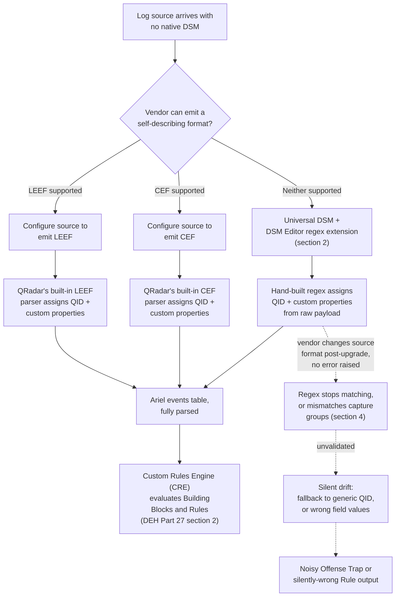

# Part 5 — The Universal DSM, DSM Editor, and Custom Log Source Extensions

## Why this part exists

**[CONCEPT]** Part 4 walked the onboarding lifecycle a log source follows once QRadar already knows how to parse it: protocol configuration, auto-discovery, and a Device Support Module (DSM) that assigns a QID (QRadar's internal event-taxonomy identifier) and extracts fields from a format IBM (or a community maintainer) has already written a parser for. That part's whole premise — DEH Part 27 §3.1's own framing, that "an unmapped or partially-mapped event lands under a generic QID with no custom properties, and the query fails silently" — assumes a DSM exists to eventually get the mapping right. This part covers what happens before that assumption holds: a log source with no native DSM at all, and no realistic prospect of IBM shipping one on your timeline.

Every SOC running QRadar past its first year accumulates a handful of these: an in-house application with a bespoke log format, a niche security appliance too small a vendor for IBM's DSM catalog to prioritize, a SaaS product whose audit-log export predates any DSM effort, a legacy device nobody has patched in a decade. None of these disappear because QRadar doesn't ship a parser for them — they still need to land in Ariel with a usable QID and usable custom properties, or every rule and every AQL search against that data source in Part 4's sense, and every Building Block DEH Part 27 §2.1 describes, has nothing to match against. This part covers the three escape hatches available when a native DSM isn't coming: build a regex-based extension yourself through the DSM Editor against QRadar's generic Universal DSM path, push the vendor toward emitting a self-describing structured format (LEEF or CEF) QRadar already knows how to parse, or accept the wait for native coverage and operate without full parsing in the meantime. It does not re-teach AQL syntax (DEH Part 27 §1 owns that) or the general onboarding lifecycle Part 4 already covers — it starts exactly where Part 4's assumption runs out.

---

## 1. The coverage gap a DSM catalog can't close

**[CONCEPT]** QRadar's shipped DSM catalog is broad — mainstream operating systems, major firewalls, common identity providers, well-known cloud platforms — but it is not, and structurally cannot be, exhaustive. A DSM is built and maintained against a specific vendor's specific log format, and that format is a moving target the DSM author has to track release-to-release. A log source with a small install base, a format IBM hasn't prioritized, or a home-grown application that was never going to appear in any vendor's catalog in the first place, arrives at your Log Source configuration with nothing to parse it.

Left unaddressed, that source's events still ingest — QRadar doesn't refuse to store data it can't parse — but they land the way DEH Part 27 §3.1 already names for the partially-mapped case, only worse: a generic, low-information QID, no `CATEGORYNAME()` value worth filtering on, and none of the custom properties a Rule Test or an AQL `WHERE` clause needs to do anything useful with the event's actual content. `QIDNAME(qid)` resolves to a generic "unknown log"-style placeholder — the same generic QID DEH Part 27 §3.1 names for the partially-mapped case — rather than a name describing what happened, and the raw payload sits in the event's payload field, readable by a human scrolling through Log Activity but invisible to every mechanism in this book that expects a parsed field.

Three paths close that gap, each shifting the maintenance burden to a different party:

**Table 5.1 — Escape hatches for a log source with no native DSM.**

| Approach | Where parsing effort lives | Setup cost | Ongoing maintenance risk | Best fit |
|---|---|---|---|---|
| Universal DSM + DSM Editor regex extension | Your team, in QRadar's console | Moderate — write and test regex against representative sample logs | High — coupled to the exact log line format of the sample used to build it; breaks silently on a source-side format change (§4) | A source you control, with a stable-enough format and no near-term vendor DSM in sight |
| Vendor emits LEEF | The log source vendor/application | Low, if the vendor already supports it; otherwise a change request to the vendor | Lower for your team, shifted to trusting the vendor's LEEF implementation stays correct release-to-release | A source whose vendor actively supports LEEF as an IBM-oriented integration target |
| Vendor emits CEF | The log source vendor/application | Low, if the vendor already supports it (CEF has wide adoption beyond IBM's own ecosystem) | Same shifted-trust profile as LEEF, spread across a wider, less IBM-specific vendor base | A source whose vendor supports CEF for multi-SIEM compatibility rather than QRadar specifically |
| Wait for / request a native DSM | IBM (or a community DSM maintainer) | None, beyond the RFE/request itself | Timeline outside your control; the source runs under-parsed until it lands | A widely-deployed product likely to get native coverage eventually, where under-parsing in the interim is tolerable |

> **PRODUCT VERSION NOTE**
> Whether IBM's own DSM-request process (an RFE, a support case, or a dedicated request channel) is the fastest path to native coverage, versus a community-maintained DSM extension already existing for your exact source, has shifted across QRadar's release history and IBM's own support-channel structure. Check IBM's current DSM catalog and request process before committing a team to a hand-built extension for a source popular enough that native coverage might already exist or be imminent.

---

## 2. The Universal DSM: QRadar's generic parsing path

**[PLATFORM ENGINEER]** When a Log Source Type has no vendor-specific DSM behind it, QRadar still needs somewhere to route that source's raw events for storage and (optionally) parsing. The generic path for this — commonly referred to as the Universal DSM — accepts events QRadar cannot map to a specific vendor parser and stores them under a generic QID/category rather than rejecting them outright. On its own, a Universal DSM log source is exactly the under-parsed state §1 describes: events land, but nothing beyond the raw payload and the built-in envelope fields (timestamp, source IP, log source) is queryable as a distinct field.

The Universal DSM becomes useful the moment it's paired with a hand-built parsing definition — a Log Source Extension — that tells QRadar how to read this specific source's format: which QID or category a given line pattern should map to, and which regex capture groups should populate which custom properties. That pairing is built through the DSM Editor.

> **PRODUCT VERSION NOTE**
> The exact name QRadar's console uses for the generic, no-native-DSM Log Source Type, and the exact menu path to reach the extension-authoring tool described below, have both been worded and grouped differently across release cycles — this book states the concept (a generic parsing fallback, plus a purpose-built extension-authoring tool) as stable, and defers the literal console labels and click path to your own deployment's Admin console. Confirm both before writing internal documentation that quotes a specific menu sequence.

### DSM Editor — regex-based field and QID extraction

**[PLATFORM ENGINEER]** The DSM Editor is the authoring surface for a Log Source Extension: an admin tool that takes representative sample events from the source you're onboarding and lets you define, against those samples, the regex patterns that pick out a QID/category and any custom properties QRadar should extract going forward. The core workflow, stable in shape even where the exact wizard steps have shifted release to release:

1. **Capture representative sample events** — not one line, but a set covering every distinct event shape the source actually produces (a success case, a failure case, a warning, whatever variants exist), because a regex written against one sample generalizes only as far as that sample's format actually represents the source's real output.
2. **Define QID/category mapping patterns** — a regex (or a set of them, one per distinct event shape) that QRadar tests against each incoming raw event to decide which QID and category it gets assigned.
3. **Define custom property extraction patterns** — regex capture groups, each named and typed, that pull specific values (a username, an IP, an action code, whatever the source's fields carry) out of the raw payload into queryable custom properties, the same custom-property concept DEH Part 27 §1.2 already introduces for the DSM's own built-in extraction and Part 6 covers in full for governance.
4. **Test against the captured samples before deploying** — confirming every sample event resolves to the intended QID and that every intended custom property populates correctly, not just that the regex compiles without error. A regex that compiles cleanly and matches zero of your samples, or matches but extracts the wrong capture group into the wrong property, fails exactly the way DEH Part 27 §3.1 warns a field-mapping gap fails elsewhere: no error, a query or Rule Test that runs clean and finds nothing or finds the wrong thing.
5. **Deploy and associate the extension** with the Log Source (or Log Source Type, if it should apply to every instance of that source), then re-verify against live traffic, not just the captured samples — production log volume routinely surfaces a fifth event shape nobody thought to capture in step 1.

The result is a Log Source Extension document — an XML mapping of regex patterns to QID/category assignments and custom-property definitions — that QRadar evaluates against every incoming raw event from the source(s) it's attached to:

```text
CONCEPTUAL SAMPLE — illustrative structure only, not a validated export. Exact element
names, attribute schema, and DSM Editor export format depend on your QRadar release;
verify against an extension your own console actually exports before treating this as
a literal schema reference. Rendered as text, not xml, precisely because it is an
annotated illustration rather than a complete, validated artifact — STYLE-GUIDE.md §3.

<device-extension xmlns="event-extension-format">
  <pattern id="auth-failure-pattern"
           xmlns="event-extension-format-regex">
    <![CDATA[^(\S+)\s+AUTHFAIL\s+user=(\S+)\s+src=(\S+)]]>
  </pattern>
  <event-match-multiple pattern-id="auth-failure-pattern">
    <values>
      <value index="2" name="identity-source-name">Username</value>
      <value index="3" name="identity-ip-source-address">Source IP</value>
    </values>
    <qid>
      <default-value name="qidname" value="AuthFail-CustomApp"/>
    </qid>
  </event-match-multiple>
</device-extension>
```

This snippet illustrates the underlying idea a DSM Editor session produces — a named regex pattern, applied to a raw event, mapping specific capture groups to specific fields and assigning a QID — without claiming to be a validated export from any specific QRadar version. The disambiguating point worth carrying forward from §1: everything downstream of this extension — every Building Block Rule Test that references `"Username"` or `"Source IP"` for this source, every AQL query filtering on them — depends entirely on this regex continuing to match the source's actual output. §4 covers what happens when it stops.

---

## 3. LEEF and CEF: pushing the parsing burden to the source

**[PLATFORM ENGINEER]** A hand-built regex extension is not the only escape hatch, and for a source whose vendor is willing to cooperate, it is often not the best one. QRadar parses two self-describing, structured log formats natively, without requiring a custom regex extension at all, because the format itself carries enough structure for QRadar's built-in parser to extract fields without guessing at delimiters:

- **LEEF (Log Event Extended Format)** — IBM's own key-value log format, purpose-built for QRadar integration. A LEEF-formatted event declares its own event ID/name and a set of `key=value` pairs QRadar's built-in LEEF parser reads directly into QID assignment and custom properties, without a hand-written regex extraction step.
- **CEF (Common Event Format)** — originated at ArcSight, since adopted far more broadly as a de facto multi-SIEM structured-logging format. CEF-formatted events carry a similarly self-describing header-plus-extension-fields structure, and QRadar's built-in CEF parser reads it the same way LEEF is read, without a source-specific regex extension.

The practical effect of either format: if the source device or application can be configured to emit LEEF or CEF instead of its native ad hoc text format, the parsing burden that would otherwise sit in a hand-built DSM Editor extension moves to the vendor's own LEEF/CEF implementation. This is a genuine trade, not a strictly better option — it exchanges one maintenance surface for another, and the party responsible for keeping it correct changes along with the surface.

**Table 5.2 — Regex extension vs. LEEF/CEF: who owns the maintenance risk.**

| Dimension | Hand-built regex extension | LEEF or CEF |
|---|---|---|
| Who writes the parsing logic | Your team, via DSM Editor | The source vendor's own LEEF/CEF emitter |
| What breaks it | Any change to the source's raw log line format that the regex didn't anticipate | A change to the vendor's LEEF/CEF field set or key names between application/firmware versions |
| Who notices a break first | Your team, if regression-tested (§5); otherwise a Rule that's gone quiet or an analyst pulling an empty search | Same risk, but now also gated behind the vendor's own release notes — a break may not be visible until QRadar-side testing catches it |
| Who fixes a break | Your team, re-authoring the regex | Your team still has to update the QRadar-side mapping if the vendor added/renamed LEEF/CEF fields, but doesn't have to reverse-engineer a raw format from scratch |
| Turnaround for a fix | As fast as your team can re-test and redeploy the extension | Bounded by whether the vendor's LEEF/CEF change is backward-compatible; a breaking change on the vendor's side may need a support case, not just a QRadar-side edit |

> **PRODUCT VERSION NOTE**
> Both LEEF and CEF parsing are described here as built into QRadar without a custom extension — a stable architectural fact. The exact protocol configuration options for enabling LEEF/CEF ingestion on a given Log Source Type, and the specific field-name conventions QRadar's built-in parsers expect for either format, have areas of version-specific detail this book does not treat as fixed; verify the current protocol configuration screen and any format-version requirements against your own deployment.

Neither LEEF nor CEF eliminates the coverage gap on its own — a vendor that won't or can't emit either format leaves the regex-extraction path (§2) as the only option — and neither is a substitute for the governance question §5 covers: a LEEF-emitting source can still drift out of sync with QRadar's expectations if the vendor changes its own LEEF field set across a firmware or application release, even though the parsing mechanism itself didn't change on QRadar's side.

---

## 4. The maintenance cost of a hand-built extension

**[PLATFORM ENGINEER]** A DSM Editor extension is authored against a snapshot: the exact set of sample events captured in step 1 of §2's workflow, produced by one version of one source's software or firmware. That coupling is invisible while the source stays on the version it was captured against, and it is exactly what breaks — usually without any error, warning, or failed deployment — the moment the source changes underneath the extension.

A firmware update that reorders fields, adds a new field between two the regex treats as adjacent, changes a delimiter, or reformats a timestamp does not cause the extension to fail loudly. It causes one of two quieter failures: the pattern stops matching at all, and the event falls back to the generic Universal DSM QID with no custom properties — the exact under-parsed state §1 describes, silently reappearing for a source that used to be fully mapped — or, worse, the pattern still matches syntactically but now captures the wrong token into the wrong named property, so a custom property that used to hold a username now holds a source IP, or an empty string, with no indication anywhere that the value is wrong. Every AQL query and every Rule Test built against that custom property keeps running without error and keeps returning data — just the wrong data, or no matches where there should be some — the identical silent-failure shape DEH Part 27 §3.1 already names for a partially-mapped native DSM, recurring here for a hand-built one with no vendor QA process behind it at all.

> **Rule Autopsy**
> **The rule:** a DSM Editor extension built two years ago for an in-house billing application's authentication log, extracting `"Username"` and `"Source IP"` via regex, feeding `BB:Any-Mapped-AuthEvent` — a Building Block several downstream Rules reference for authentication-failure correlation.
> **Why it shipped:** the application had no native DSM, the format was stable at the time, and the extension passed its original test pass against the sample events captured that quarter.
> **How it failed:** a routine application platform upgrade reformatted the log line — the username field moved from the third token to the fifth, and a new session-ID token was inserted where the regex's second capture group expected the source IP. The extension kept matching syntactically. `"Username"` started silently populating with a session ID instead of an account name, and `"Source IP"` started capturing whatever token happened to sit where the regex still looked. No deployment failed, no error appeared in any log; the downstream Rules kept firing, just correlating and reporting the wrong identity for every offense this Building Block contributed to for weeks before an analyst noticed the "usernames" on a triage screen looked nothing like real accounts.
> **The fix:** re-capture a fresh sample set from the upgraded application, rebuild the regex against the new field order, and — the change that should have existed from the start — add this extension to a re-test-on-vendor-upgrade checklist (§5) instead of treating "deployed once, working at the time" as a permanent state.

> **Noisy Offense Trap**
> The failure mode above can flood a queue instead of just corrupting one field, depending on where the regex breaks. If the QID/category-mapping pattern stops matching entirely rather than mismatching a capture group, every event from that source falls back to the Universal DSM's generic QID — and a generic QID is exactly broad enough to satisfy `LOGSOURCETYPENAME(devicetype)`-based Rule Tests that several unrelated Building Blocks use to scope themselves loosely ("any event from this Log Source Type," rather than a QID-specific condition). A source that used to produce ten meaningfully distinct, narrowly-matched event types can, the moment its extension stops parsing, start matching every broadly-scoped Rule Test built against its Log Source Type at once — producing a burst of Offenses from Rules that were never designed to fire on unparsed generic events, for a reason that has nothing to do with a real change in attacker behavior. Diagnose a sudden offense-count spike from a hand-extended source by checking whether its events are still resolving to their intended QIDs before assuming the spike reflects anything real; Part 15's tuning-intake workflow applies here directly.

---

## 5. Governance: keeping a hand-built extension honest over time

**[SOC MANAGEMENT]** Part 4's onboarding checklist and DEH Part 27 §3.1's own validation instinct — confirm the mapping against a known-positive test event before trusting it — apply to a DSM Editor extension at least as strongly as to a native DSM, and for a reason a native DSM doesn't share: IBM (or a community maintainer) has some incentive and some install base to notice and fix a native DSM's own drift. A one-off, in-house regex extension has exactly the reviewers your team assigns to it, and nobody else.

A workable governance discipline for a hand-built extension, without the git-based pipeline DEH Part 22 describes and this book's Part 16 names as a gap QRadar's console-native workflow doesn't hand you for free, needs at minimum:

- **A retained sample corpus** — the original captured events the extension was built and tested against, kept somewhere durable, not just "whatever was in Log Activity that week." Without it, re-validating after a source-side change means recapturing from scratch with no baseline to diff against.
- **A named maintenance owner** — a specific person or team responsible for this specific extension, the same discipline Part 10 requires for a Reference Set's TTL and membership and Part 9 requires for a `BB:`-prefixed library entry — not "whoever built it originally," who may no longer be reachable when it breaks.
- **A trigger list for re-validation** — the source-side events that should prompt a re-test, not a calendar-only cadence that misses an out-of-cycle change:

**Table 5.3 — Re-validation triggers for a hand-built Log Source Extension.**

| Trigger | Why it matters | Re-validation action |
|---|---|---|
| Source application/firmware/agent upgrade of any kind | The single most common cause of silent regex drift (§4's Rule Autopsy) | Re-capture a fresh sample set post-upgrade; diff against the original corpus before assuming the format is unchanged |
| Vendor-announced log format change (release notes, changelog) | Sometimes the only advance warning you get before the upgrade actually lands | Pre-stage the regex update against the vendor's documented new format if possible, test on the day of upgrade |
| A downstream Rule or dashboard using this source's custom properties goes quiet or starts looking abnormal | The first operational symptom of drift is usually here, not in the extension itself | Confirm the custom property is still populating correctly before assuming the Rule logic itself is at fault |
| Scheduled periodic review (quarterly, or per your team's change-management cadence) | Catches drift with no other trigger — a format change with no vendor announcement and no obviously broken downstream Rule | Re-run the extension against a fresh live sample and confirm QID/property assignment still matches intent |

> **Blind Spot**
> None of these triggers catch a format change that happens to keep matching the existing regex syntactically while shifting which value lands in which capture group — the mismatched-field failure mode in §4's Rule Autopsy, not the stopped-matching one. A periodic review that only checks "does the extension still assign a QID" without checking "does the *value* in each custom property still look like what it's supposed to be" (a username field that now contains a session ID, a source-IP field that now contains a port number) will pass a review that should have failed. Validate against expected value shape, not just successful pattern match.

---

## 6. Deciding when to stop maintaining, and what to do instead

**[SOC MANAGEMENT]** A hand-built extension is a standing engineering liability from the day it deploys, not a one-time cost — every trigger in Table 5.3 is recurring work, scaled by however many niche, unsupported sources your environment has accumulated. That cost is easy to underweight at onboarding time, when the only visible cost is the initial regex-authoring effort, and easy to rediscover expensively later, when a dozen one-off extensions built by people no longer on the team all need simultaneous re-validation after an unrelated infrastructure refresh touched every source at once.

Three questions worth asking before defaulting to "build a DSM Editor extension" for the next unsupported source, rather than after the fact:

1. **Can the vendor emit LEEF or CEF instead?** If yes, §3's trade — moving the parsing-format maintenance burden to the vendor's own release process — is very often the better long-term position, even though it costs a support/feature request up front instead of an afternoon of regex work.
2. **Is this source popular enough that native DSM coverage is plausible on a horizon you can tolerate?** If the answer is genuinely "IBM will likely cover this within a release cycle or two," a temporary under-parsed state (§1) with a documented interim workaround may cost less than building and then decommissioning a full extension.
3. **If a hand-built extension is genuinely the only option, is there a named owner and a re-validation trigger list before it ships, not after the first Rule Autopsy?** Table 5.3's governance discipline is cheap relative to the cost of discovering drift the way §4's Rule Autopsy describes — from a triage screen full of wrong values, weeks after the break happened.

None of these questions have a universally correct answer; they depend on vendor cooperation, your team's regex-maintenance capacity, and how much under-parsing you can tolerate while waiting. What they share is that answering them at onboarding time is governance; discovering the answer only after a silent break is the pattern this part exists to prevent.






**Figure 5.1 — Decision path from an unsupported log source to a parsed Ariel event, and where hand-built extensions drift.** *CONCEPTUAL.* Illustrates the three escape hatches this part covers (LEEF, CEF, Universal DSM/DSM Editor regex extension) converging on the same Ariel `events` table destination every other part in this book assumes is already reliably populated, and the specific failure branch — a source-side format change the regex extension doesn't anticipate — that §4 and §5 exist to catch before it reaches a triage screen or an offense flood, downstream of the Custom Rules Engine (CRE) hand-off DEH Part 27 §2 already covers. Not a reproduction of any IBM architecture diagram and not a claim about internal QRadar processing order beyond what this part states in prose. The Mermaid source above is the editable source of truth for this figure per STYLE-GUIDE.md §10.

---

**Cross-references:** DEH Part 27 §3.1 (the unmapped/partially-mapped-event silent-failure pattern this part's regex-drift failure mode inherits); DEH Part 27 §1.2 (QID/DSM function primer — `QIDNAME()`, `CATEGORYNAME()`, `LOGSOURCETYPENAME()` — and the custom-property reference convention this part's extension examples build on); DEH Part 23 §1 (field-mapping and translation-loss framing generalized here to a hand-built extension with no vendor QA process behind it). Within this book: Part 4 (DSM/QID mapping and the onboarding lifecycle this part's scope begins where Part 4's native-DSM assumption ends); Part 6 (custom-property extraction and governance, extended here to properties a hand-built extension defines rather than a native DSM); Part 9 (Building Block naming/governance, referenced for the `BB:` object this part's Noisy Offense Trap and Rule Autopsy examples depend on); Part 10 (reference-data governance discipline, the model for this part's §5 maintenance-owner/TTL analogy); Part 15 (noisy-offense tuning-intake workflow, the diagnostic path for this part's Noisy Offense Trap); Part 16 (rule change management without a detection-as-code pipeline, the same gap this part's §5 names for extension governance specifically); Part 18 (troubleshooting playbook for a log source that stops parsing, the operational counterpart to this part's failure modes).
