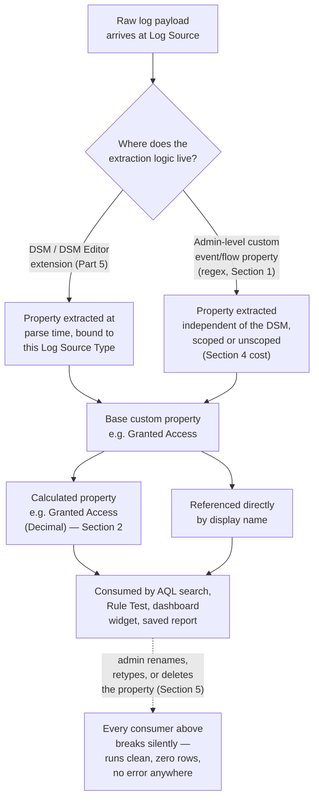

# Part 6 — Custom Properties: Extraction, Calculated Properties, and Governance

## Why this part exists

**[CONCEPT]** Part 4 and Part 5 got a log source parsing cleanly — a Device Support Module (DSM) assigning a QID (QRadar's internal event-taxonomy identifier) and extracting the fields that QID's events carry. DEH Part 27 §1.2 already named the object this part is entirely about, in one sentence: "custom properties — fields a DSM extracts from a log's raw payload via regex or a structured parser, beyond QRadar's built-in schema," referenced in AQL "by their configured display name in double quotes." That sentence is correct and this part does not restate it as new information. What it doesn't cover — because a query-language comparison chapter had no room to — is everything that happens *around* that one fact: that a custom property can come from two structurally different places, not just a DSM; that a second class of custom property, the calculated property, derives a value instead of extracting one; that a badly scoped extraction regex has a real, measurable cost against Ariel search performance (Part 12's subject, flagged here rather than re-taught); and that the display name AQL and every Rule Test depend on is a bare string with no built-in reference-tracking, which makes an unmanaged rename or deletion one of the quietest ways a previously-working detection stops matching anything.

This part also owes a debt to DEH Part 27 §3.1's own worked failure: DET-27-01's `"Granted Access"` custom property, populated correctly by the DSM but formatted as hex in one deployment and decimal in another, silently defeating a literal-value Rule Test that expected one specific string shape. That is not a DSM-mapping problem — the field is populated, the mapping worked — it is exactly the custom-property design problem this part exists to solve: what a custom property is, where its value comes from, and what happens the moment two different consumers (a query, a Rule Test, a dashboard) expect that value in two different shapes.

---

## 1. What a custom property is, and where it comes from

**[CONCEPT]** QRadar's built-in event schema — `sourceip`, `destinationip`, `username`, `qid`, `category`, and a handful of others — exists identically for every event regardless of source, because it is the platform's own normalized column set. A custom property is anything beyond that set: a field a specific log source's payload happens to carry that QRadar's core schema has no column for, made queryable in AQL and usable inside a Rule Test only because someone configured an extraction (or a derivation) for it. `"Source Process Name"`, `"Target Process Name"`, and `"Granted Access"` from DEH Part 27's worked example are all custom event properties in exactly this sense — none of them exist for an event whose DSM never defined them, and every one of them is referenced by exactly the quoted-string display name its definition gave it, not by any internal column name a reader could guess.

Two mechanisms populate a custom event property, and they live at different layers of the pipeline:

- **DSM-native extraction** — a mapping or an extension (DSM Editor's regex-based approach, Part 5's subject) that is part of how a specific Log Source Type's payload gets parsed in the first place. The property exists only for events that DSM parses, and only if that DSM's mapping was written to extract it. This is the mechanism DEH Part 27 §3.1 assumes when it walks through Sysmon Event ID 10's field extraction.
- **Admin-level custom property definition** — a regex applied against an event's raw payload (or an already-parsed field) independently of which DSM produced it, configured centrally rather than inside a specific DSM extension. This mechanism can be scoped to one Log Source Type, one QID, one category, or left unscoped to run against every event QRadar ingests.

Both mechanisms produce the same kind of object from AQL's point of view — a value retrievable by quoted display name — but they differ in where the extraction logic lives, who owns changing it, and what it costs to run at scale (§5). Conflating the two is a common governance failure in its own right: a property that looks DSM-owned in a Rule Wizard's picker may actually be an admin-level definition nobody on the DSM-maintenance side knows exists, and vice versa.

> **PRODUCT VERSION NOTE**
> Where exactly the admin-level custom-property editor lives in the console, and the exact wording of the picker that lets you scope a new property to a specific Log Source Type, QID, or category versus leaving it unscoped, has shifted across QRadar releases along with the rest of the Admin tab's own reorganization. Confirm the current path and picker wording in your own deployment before treating any specific click-sequence as durable — the *existence* of scoped-vs-unscoped custom property definition is the stable claim here, not its exact console location.

### 1.1 Table 6.1 — Three mechanisms that put a value behind a custom property's display name

The table below supports one decision: which mechanism to reach for when a new field needs to be queryable in AQL or matchable in a Rule Test. Every row produces a value AQL and the Rule Wizard consume identically once defined; they differ in ownership, scope, and cost.

| Mechanism | Where the logic lives | Runs against | Best fit | Version note |
|---|---|---|---|---|
| DSM / DSM Editor extension property | Inside the Log Source Type's own parsing definition (Part 5) | Only events that specific DSM parses | A field every event of this source type should reliably carry, maintained alongside the rest of that source's mapping | Extension syntax and editor UI have changed across releases — Part 5 owns this detail |
| Admin-level custom event/flow property (regex) | Central custom-property definition, independent of any one DSM | Every event or flow matching the property's configured scope (one source type, one QID, one category, or unscoped) | A field one team needs from a source whose DSM you don't own or don't want to modify, or a field that spans multiple source types | Editor location and scoping-picker wording — see PRODUCT VERSION NOTE above |
| Calculated property | A derivation formula referencing one or more existing properties (§2) | Evaluated wherever its input properties are already populated | Normalizing a format inconsistency (hex vs. decimal), unit conversion, string concatenation for a composite key | Available function set for derivations has grown across releases — verify current coverage before assuming a specific transform exists |

---

## 2. Calculated properties: deriving a value instead of extracting one

**[RULE ENGINEER]** A calculated property does not read anything new out of a raw payload — it computes a new value from one or more properties (built-in or custom) that are already populated, using QRadar's own function set for string, numeric, or date/time transforms. The distinction matters because the two failure modes are different: an extraction property fails (returns null) when its regex doesn't match the payload it's scoped to; a calculated property fails when one of its *inputs* is null, or when the transform's assumption about the input's format is wrong — which is exactly DEH Part 27 §3.1's `"Granted Access"` problem restated as something a calculated property can actually fix rather than merely flag.

Consider that problem directly. `BB:LSASS-Access-Candidate` (DEH Part 27 §3.3) matches on `"Granted Access"` against a literal value set (`0x1010`, `0x1410`). If one Log Source Type's DSM emits that value as hex and another emits it as unpadded decimal, no single literal-match Rule Test condition catches both without listing every format variant by hand — fragile, and a maintenance burden every time a new source joins. A calculated property `"Granted Access (Decimal)"`, defined once as a numeric-base conversion of the raw `"Granted Access"` custom property, gives every downstream consumer — the Building Block's Rule Test, an AQL search, a dashboard widget — one normalized value to match against regardless of which DSM produced the raw field. The normalization work happens once, in one place, instead of being re-solved (or missed) in every consumer separately.

```sql
-- QRadar AQL, not standard SQL — same disambiguation DEH Part 27 §1.1 states on first
-- appearance: the quoted "Display Name" property references and the LAST n HOURS
-- shorthand below are AQL-specific, not general-purpose SQL syntax, and there is no
-- general-purpose JOIN available. Shown here only to illustrate referencing a calculated
-- property by its configured display name exactly like any other custom property, not
-- to re-teach SELECT/FROM/WHERE syntax, which DEH Part 27 §1 owns. Property names are
-- illustrative, consistent with DEH Part 27's own DET-27-01 worked example (§3 of that
-- part) — this query does not restate that analytic's allowlist boundary, only its
-- custom-property naming.
SELECT sourceip, "Source Process Name", "Granted Access", "Granted Access (Decimal)"
FROM events
WHERE "Target Process Name" ILIKE '%lsass.exe%'
LAST 24 HOURS
```

This query's point is narrow and deliberately so: it shows a raw extracted property and its calculated derivative side by side for validation, before anyone rewrites `BB:LSASS-Access-Candidate`'s Rule Test to match against the normalized column instead of the two-literal hex list DEH Part 27 §3.3 originally shipped. Rewriting that Rule Test is itself a Tuning change in the DEH `TERMINOLOGY.md` sense — a deliberate, logged change to the detection's own logic, not a Suppression — and belongs in this book's Part 16 change-management discipline, not applied silently.

> **Rule Autopsy**
> **The property:** A calculated property `"Bytes Transferred (MB)"`, dividing a flow's raw byte count by 1,048,576 for a threshold Rule Test that was tired of comparing against an eight-digit raw byte value.
> **Why it shipped:** An analyst asked for a Rule Test threshold expressed in megabytes instead of bytes, and a calculated property looked like the clean way to give the Rule Wizard a human-scaled number to compare against.
> **How it failed:** The underlying raw flow property it divided was itself a custom property scoped to one flow source; a second flow source added months later populated a differently-named raw byte field, and the calculated property's input was null for every flow from the new source. The Rule Test using the calculated property never fired against the new source's traffic — not because the threshold was wrong, but because its input was silently empty, and nothing in the Rule Wizard flags a calculated property whose input has gone null for an entire source.
> **The fix:** Calculated properties get the same "verify with a known-positive event" discipline DEH Part 27 §3.1's Engineering Reality box already requires for a raw extraction — run a real flow from *every* source the Rule Test is meant to cover through the calculated property and confirm a non-null result, not just from the source it was originally built against.

---

## 3. Event properties vs. flow properties: two separate catalogs

**[PLATFORM ENGINEER]** Ariel's `events` and `flows` tables (DEH Part 27 §1.1) are separate databases with separate schemas, and custom properties inherit that split completely: a custom *event* property is defined against event payloads and is not visible, referenceable, or extractable when querying `flows`, and a custom *flow* property is the mirror case. There is no shared custom-property namespace that lets a property defined on one side show up automatically on the other, even if the underlying raw data superficially looks similar (an IP address field extracted from an event payload and a flow's native `sourceip` column are not the same object just because they'd print the same value).

| Dimension | Custom event property | Custom flow property |
|---|---|---|
| Underlying table | `events` | `flows` |
| Populated from | Log payload parsed by a DSM, or an admin-level regex against that payload | Flow record fields QRadar's own flow collectors or a third-party flow source populate |
| Typical fields it derives from | Fields a specific log format carries (process names, access-rights values, application-specific identifiers) | Byte/packet counts, application classification, port/protocol combinations |
| Usable in a Rule Test on an Event rule | Yes | No — a Flow-type Rule Test scope is required |
| Usable in a Rule Test on a Flow rule | No | Yes |

This split is exactly why Part 7's flow-vs-event design decision ("does this analytic belong on `events`, `flows`, or both") is a decision made once, early, rather than something a custom property definition can paper over later — defining the same conceptual field twice, once per table, is the only way to make it available on both sides, and the two definitions then have to be kept in sync by hand.

---

## 4. The Ariel search-performance cost of a custom property

**[PLATFORM ENGINEER]** A custom property is not free enrichment sitting quietly in the background. Every event or flow that falls inside an extraction property's configured scope has that property's regex evaluated against it — at minimum once, at parse/index time, and again at search time for any query using that property unless the property has been marked for indexing (commonly described as "optimizing" the property so it gets its own index rather than requiring a runtime regex scan across every row a search touches). This is the same Ariel indexing-and-quick-filter discipline Part 12 covers in full; this part's job is narrower — naming the specific way a *badly scoped* custom property becomes a search-performance problem rather than a background cost nobody notices:

- **Unscoped regex properties.** A custom property left unscoped ("any Log Source Type," "any QID") runs its regex against every event this deployment ingests, whether or not that event's format could ever match. At sustained EPS that a real production Event Processor is licensed for (DEH Part 27 §1.3's Engineering Reality box on EPS/FPM licensing), that is real, continuous CPU cost competing with the Custom Rules Engine's (CRE's) own per-event Rule Test evaluation and every other admin's unscoped property on the same processor — not a one-time definition cost.
- **Expensive regex patterns.** A greedy, unanchored, or heavily backtracking pattern (`.*something.*` chained repeatedly, alternation-heavy groups) costs measurably more per event than a tightly anchored pattern matching the same field, and that cost is paid once per matching event at parse time and again at search time for every unindexed search that touches it.
- **Un-indexed properties used as a search or `GROUP BY` key.** A custom property never marked for indexing, used routinely as a `WHERE` filter or a `GROUP BY` key over a wide time window, forces a full scan-and-regex-evaluate pass across every row the search's time window and any other filters leave in scope — the same class of cost Part 12 names generically for any unindexed search field, concentrated here on a property whose whole reason for existing was to make something more queryable, not less.

> **Platform Reality**
> "Just add a custom property to make this field searchable" is treated, informally, as a free operation by a lot of admins who've never had to diagnose a slow Ariel search — it isn't. A regex property scoped to one Log Source Type and marked for indexing costs a small, bounded, one-time-per-event overhead that Ariel's own indexing amortizes well. The same property left unscoped, unindexed, and written with a loose pattern, added on top of dozens of other admins' similarly loose unscoped properties over a few years, is a large and cumulative reason a shared Event Processor's search performance degrades in ways no single admin's own query looks slow enough to explain in isolation — because the cost is spread across every property evaluated against every event, not concentrated in any one visible query.

> **Blind Spot**
> QRadar gives you no built-in "find every Rule, Building Block, saved search, and dashboard widget that references this custom property" report. Scoping or re-indexing a property that turns out to be more expensive than expected means finding its consumers by manual review or institutional memory, not by a dependency query the console can answer for you — which is exactly why §6's governance discipline treats an inventory of who-references-what as something the team has to build and maintain itself, outside the console, rather than something to expect QRadar to hand back on demand.

---

## 5. Naming and governance: the display name is the only handle you have

**[RULE ENGINEER]** Every consumer of a custom property — an AQL query's `SELECT`/`WHERE` clause, a Rule Test's property picker, a dashboard widget, a saved or scheduled search — references it by exactly one thing: the quoted display name configured when the property was defined. That name is a plain string, case- and whitespace-sensitive, with no structural link back to any of its consumers. Rename `"Source Process Name"` to `"Source Process"` while cleaning up a naming convention, or delete and recreate it with a trailing-space typo nobody notices in the editor, and every one of those consumers keeps running exactly the way DEH Part 27 §3.1 already describes for a missing DSM mapping: no error, no broken-reference warning, a query or Rule Test that executes cleanly and simply never matches anything again. A Rule silently stops firing; a dashboard widget silently starts showing zero; and because nothing in the console surfaces the break, the gap is usually found only when someone notices an Offense that should have fired didn't, days or weeks after the rename.

This is a materially different failure surface than DEH's own `Detection Drift`/`Schema Drift` concepts describe for a source's own format changing underneath a detection — here the *source data* hasn't drifted at all; the *label* administrators gave to a value has moved, inside a platform with no reference-tracking to catch it. Three practices close most of this gap in a console-native environment with no compiler or CI to catch a broken reference for you:

1. **Treat a live custom property's display name as an interface, not an implementation detail.** Once a `BB:` or `R:`-prefixed Rule references it, or a scheduled report depends on it, renaming it in place is a breaking change to every one of those consumers simultaneously — require the same change-ticket discipline Part 16 asks of a Rule or Building Block change, not a quick admin-panel edit.
2. **Maintain a property-to-consumer inventory outside the console**, because the console won't produce one for you (the Blind Spot above). At minimum: property display name, defining mechanism (DSM extension, admin regex, calculated), owning team, and every known Rule/Building Block/dashboard/report that references it. This is the same review-cost discipline DEH Part 27's own closing SOC Management paragraph names for the three-object Rule/Building Block/Reference Set pattern, extended one layer further to the custom properties those objects actually match against.
3. **Deprecate, don't atomically rename.** Add the new property alongside the old one, migrate consumers deliberately and verifiably (re-running each dependent Rule's Detection Test-equivalent — this book's Validation Test — against a known-positive event after the change), and only retire the old name once the inventory in step 2 shows zero remaining references. An atomic rename-in-place is the fast path to exactly the silent, undiscovered break this section exists to prevent.

> **SOC Management View**
> A property-to-consumer inventory is unglamorous, invisible work with no dashboard of its own to show progress on — which is exactly the kind of maintenance task that gets skipped under staffing pressure until a rename breaks something in production. Budgeting a QRadar rule-engineering practice (Part 22's subject) should treat this inventory the same way DEH's own Detection Debt concept treats unreviewed exceptions: a backlog that costs nothing to defer today and a real, undocumented outage risk to defer indefinitely.

---

## 6. Choosing the right mechanism: a decision guide

**[RULE ENGINEER]** Bringing §1 through §5 together into one practical question — "I need a new field queryable in AQL or matchable in a Rule Test; which mechanism do I reach for?" — the answer depends on where the value already lives and who owns the source it comes from:

- **The value is already present in the raw payload of a source type you (or your DSM-maintenance team) own the mapping for.** Extend the DSM or its extension (Part 5). This keeps the field's definition alongside the rest of that source's mapping, where anyone maintaining the source will actually look for it.
- **The value is present in a payload from a source type whose DSM you don't own, don't want to modify, or need scoped narrower than the whole source type (a single QID or category within it).** Define an admin-level custom property, scoped as narrowly as the need actually requires — not left unscoped by default, per §4's performance argument.
- **The value doesn't exist anywhere in raw form — it's a transform of one or more properties that already do.** Define a calculated property, and validate it against a known-positive event from *every* source the transform needs to cover (the Rule Autopsy in §2 is the cautionary case for skipping this).
- **The value is needed on both `events` and `flows`.** Define it twice, once per table (§3) — there is no shared definition, and the two copies need to be tracked as two separate inventory entries in the governance discipline §5 asks for, not one.

None of these choices is reversible without cost once a `BB:`, `R:`, dashboard, or scheduled report depends on the result — which is the entire reason this part treats naming and scope as first-class design decisions rather than incidental configuration.






**Figure 6.1 — A custom property's path from raw payload to the single point of failure every consumer shares.** *CONCEPTUAL.* Illustrates the two structurally different extraction paths (§1) feeding one base custom property, the optional calculated-property derivation layer (§2), and the display name every AQL search, Rule Test, dashboard widget, and saved report references downstream (§5) — the single point every one of those consumers shares once the property is defined, and the reason a rename or deletion breaks all of them silently, with no error anywhere. Not a reproduction of any QRadar console screen; this book's own structural summary of the naming/governance argument in §5.

---

## Closing

A custom property is a small object with an outsized failure radius: it looks like configuration, but by the time a Building Block, three Rules, a dashboard, and a scheduled report all reference it by name, it functions like a shared interface with no compiler to protect it. The discipline this part asks for — scope extraction properties deliberately (§1, §4), validate a calculated property against every source it needs to cover (§2), keep the event/flow catalogs straight (§3), and track who references what before anyone renames anything (§5) — costs real, unglamorous maintenance time. The alternative, per DEH Part 27 §3.1's own framing carried forward here, is a query or a Rule that runs clean, returns nothing, and tells no one why.

**Cross-references:** DEH Part 27 §1.2 (custom property syntax in AQL) and §3.1 (DSM/QID mapping prerequisite and the `"Granted Access"` format-drift example this part's §2 builds on directly); DEH Part 23 §5 (Sigma-first-vs-native tradeoff, not re-argued here); this book's Part 4 (DSM/QID mapping and log source onboarding), Part 5 (Universal DSM, DSM Editor, and custom log source extensions), Part 7 (flow-vs-event design decision), Part 8 (Rule Wizard catalog and Rule Test property references), Part 12 (Ariel search performance and index management), Part 16 (rule change management), and Part 22 (staffing and review-cost budgeting).
