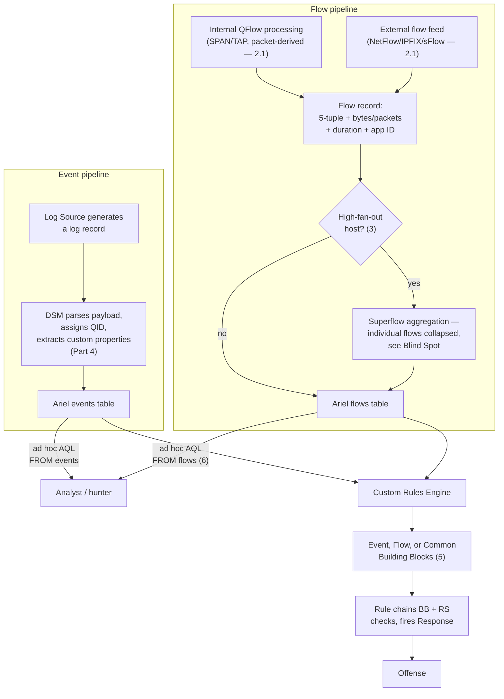

# Part 7 — Flow Data Architecture: QFlow, Flow Sources, and Flow-vs-Event Design

## Why this part exists

**[CONCEPT]** DEH Part 27 §1.1 introduces the fact that AQL queries two separate Ariel databases — `events` and `flows` — states the mechanics of `events` at length as the basis for that part's own LSASS-access worked example, and disposes of `flows` in a single sentence: network-flow records generated by QRadar's own flow collectors or ingested from a third-party flow source. DEH Part 27 never had to make the events-vs-flows decision, because its worked detection is an events-only analytic from the start — a process-access event, not a network conversation. Parts 4 through 6 of this book closed out the `events` side of the platform: how a DSM (Device Support Module) assigns a QID (QRadar's internal event-taxonomy identifier — DEH Part 27 §1.2's own introduction) and extracts custom properties (Part 4), what happens when no native DSM exists (Part 5), and how a governed custom property survives its own drift (Part 6). This part is `events`' silent counterpart and the last part in Section C — the flow pipeline that runs the whole time next to the event pipeline, watching traffic no Log Source was ever configured to log in the first place.

This part does not re-teach AQL syntax; `SELECT`/`FROM`/`WHERE`/`GROUP BY`/`LAST n HOURS` work identically against `flows` as they do against `events`, and DEH Part 27 §1 remains the canonical syntax reference for both. It does not re-argue Sigma-first-vs-native authoring — DEH Part 23 §5 owns that generically and DEH Part 27 §2–§4 owns it for QRadar's Rule/Building Block/Reference Set decomposition specifically. What this part does is make the one decision DEH Part 27 §1.1 explicitly left open: whether a given analytic belongs on `events`, on `flows`, or on both — and what QRadar's flow-collection architecture actually does, and fails to do, before that data ever reaches Ariel for a Rule Test or an AQL search to touch it. Section D picks up from here: Part 8's Rule Wizard catalog includes Flow and Common rule types built on exactly the architecture this part describes, and Part 17 picks up the licensing consequence this part only introduces in §7.

## 1. What a flow is, and why QRadar keeps it separate from an event

**[CONCEPT]** An event, in QRadar's own vocabulary, is one row per normalized log record — DEH Part 27 §1.1 already fixes this definition and this book inherits it unchanged. A flow is a different unit entirely: one row summarizing a network conversation — source and destination IP and port, protocol, byte and packet counts in each direction, start and end time, and (where the collecting sensor has the visibility to determine it) an application classification such as `HTTP`, `DNS`, or `SMB` — rather than a single log line a device chose to write. Nothing has to log anything for a flow record to exist. A flow is derived directly from the traffic itself, at whatever point in the network a flow source is actually watching.

That last clause is the reason this book gives flow architecture its own part rather than folding it into a paragraph of Part 2's deployment-topology part. An event depends on a Log Source that was deliberately onboarded (Part 4) to a device that was deliberately configured to generate the log in question. A flow depends on nothing configured on the endpoint at all — it depends entirely on where in the network a sensor sits and what traffic actually crosses that vantage point. Two hosts on the same internal VLAN, transferring a large file over SMB with no security agent installed on either one and no firewall or proxy in the path to log the connection, produce zero rows in `events` for that transfer. They can still produce a `flows` row, if — and only if — some flow source is actually positioned to see that specific segment of the network. Flow data is QRadar's answer to exactly the blind spot a log-source-only deployment has by construction: traffic nobody chose to log.

The two tables' properties differ across nearly every dimension a rule engineer cares about when deciding where an analytic belongs (§5 turns this into a procedure):

| Property | `events` | `flows` |
|---|---|---|
| Row unit | One normalized log record | One summarized network conversation |
| Source of the data | A configured Log Source + DSM | A flow source — internal QFlow processing or an external flow feed (§2) |
| Requires endpoint/device configuration | Yes — a Log Source has to be onboarded and generating the log | No — depends only on network vantage point |
| Typical fields | `sourceip`, `username`, `QIDNAME(qid)`, custom properties (Part 6) | `sourceip`/`sourceport`, `destinationip`/`destinationport`, protocol, bytes/packets each direction, application ID |
| License meter | Events Per Second (EPS) | Flows Per Minute (FPM) |
| Sees traffic with no log source at all | No | Yes, within sensor coverage |
| Sees application-layer field detail (a username, a process name) | Yes, if the DSM extracts it | No — a flow has no concept of a custom property extracted from a payload field the way a DSM does |

This table's last row is the design tradeoff §5 turns into a decision procedure: a flow tells you *that* two hosts talked, in what volume, for how long, and (often) over what application — never *who* was logged on when it happened, unless a separate `events`-side fact gets tied to it through the same Reference Set mechanism DEH Part 27 §2.2 already introduced for a different purpose.

## 2. Flow collection architecture: QFlow processing and flow sources

**[PLATFORM ENGINEER]** A flow record does not appear in the Ariel `flows` database by magic any more than an event appears without a DSM assigning it a QID. Something has to watch traffic and produce the summarized conversation record in the first place, and QRadar draws that data from two structurally different kinds of flow source.

### 2.1 Internal QFlow processing vs. external flow-record ingestion

**[PLATFORM ENGINEER]** The first kind is internal QFlow processing: a QRadar flow-collection component watches raw packets — via a SPAN/mirror port, a network TAP, or an inline deployment — and builds flow records itself, directly from the packets it sees. Because this path has the actual packet payload available (at least long enough to inspect it before discarding the payload and keeping only the derived flow record — QRadar's flow model is not a full packet-capture retention product), it can perform deep-packet-inspection-based application classification: identifying that a given conversation on a nonstandard port is actually HTTP traffic, or that a connection using the standard SMB port is doing something a purely port-based classifier would misname. This is also the path that produces the richest flow content, because it's derived from the traffic itself rather than from a third party's own summary of it.

The second kind is external flow-record ingestion: routers, switches, and other network devices that already export their own summarized traffic records — NetFlow (v5/v9), IPFIX, sFlow, or J-Flow, depending on vendor — send those records to QRadar, which parses and stores them without ever seeing the underlying packets itself. Unlike QRadar's own internal processing, these are standardized or vendor-published export formats independent of any one SIEM: NetFlow v9 is Cisco's own template-based export format (Cisco Systems, "Cisco Systems NetFlow Services Export Version 9," RFC 3954, IETF, 2004: https://www.rfc-editor.org/rfc/rfc3954), IPFIX is the IETF standards-track protocol NetFlow v9 fed into (IETF, "Specification of the IP Flow Information Export (IPFIX) Protocol for the Exchange of Flow Information," RFC 7011, 2013: https://www.rfc-editor.org/rfc/rfc7011), and sFlow is InMon's sampling-based alternative (InMon Corporation, "InMon Corporation's sFlow: A Method for Monitoring Traffic in Switched and Routed Networks," RFC 3176, IETF, 2001: https://www.rfc-editor.org/rfc/rfc3176). This path is cheaper to deploy (most enterprise-grade network gear already supports one of these export formats; no dedicated collection point needs building), but it inherits whatever classification depth and field detail the exporting device chose to provide — a NetFlow v5 export, for instance, carries less field detail than IPFIX, and QRadar cannot recover detail the exporting device never captured in the first place.

> **PRODUCT VERSION NOTE**
> The exact product name, packaging, and appliance-vs-software-vs-virtual-form-factor lineup for QRadar's internal packet-based flow collection (branded, at various points, as the QFlow Collector, with hardware appliance models sitting alongside a related-but-distinct deep-packet-inspection product line) has shifted across release and business-unit cycles, consistent with Part 2's own first PRODUCT VERSION NOTE on delivery-model changes. Verify current product names, supported deployment form factors, and whether a given capability (deep application classification vs. basic flow summarization) ships in the base platform or a separately licensed add-on against your own vendor documentation before committing a design to a specific product name.

Both kinds land in the same Ariel `flows` table once collected, and — this is the point worth stating plainly rather than leaving implicit — a Rule Test or an AQL `FROM flows` query has no way to tell, from the row alone, which collection path produced a given flow record. A Building Block written against flow fields that assumes deep application classification is available will silently degrade to whatever coarser classification an external NetFlow exporter actually provided, for any flow that came in through that path instead of internal QFlow processing. Confirming which flow sources feed a given network segment, and what classification depth each one actually provides, is the flow-side equivalent of DEH Part 27 §3.1's DSM/QID mapping prerequisite — skipped, it produces the same failure shape: a query or Rule Test that runs cleanly and silently sees less than the engineer designing it assumed.






**Figure 7.1 — Event and flow pipelines converging on the same Custom Rules Engine.** *CONCEPTUAL.* Illustrates the two structurally different collection paths this part covers — DSM-parsed events on one side, internally-processed or externally-fed flow records (with superflow aggregation as a possible detour) on the other — both landing in their respective Ariel table and both reachable by an ad hoc AQL search or by a Rule built from Building Blocks and Reference Sets in the Custom Rules Engine (CRE), extending DEH Part 27's own Figure 27.1 event-only diagram to cover the flow side that part left unillustrated. Not a reproduction of any IBM architecture diagram and not a claim about a specific deployment's actual topology — Part 2 covers real Console/Processor/Collector role placement.

## 3. Superflows: aggregation, and the blind spot it creates

**[PLATFORM ENGINEER]** A single busy host — a DNS server answering thousands of clients, an NTP server, a heavily used file server — can generate an enormous number of structurally similar, short-lived flows in a short window. Logging every one of those as a fully discrete flow record would consume FPM budget (§7) and Ariel storage out of proportion to the actual investigative value of keeping each one separate. QRadar's answer is the superflow: a single aggregate flow record representing many similar underlying flows — same source, same destination pattern, same application — collapsed into one row with summed byte/packet counts and a flow count, rather than one row per individual conversation.

This is a sensible, necessary control for the exact high-fan-out hosts it targets. It is also a real detection blind spot, and it is the blind spot this part exists to name rather than let a rule engineer discover it the hard way after a Rule Test that should have matched something didn't.

> **Blind Spot**
> A superflow's aggregate record has no discrete row for any one of the individual flows it consolidated — the specific byte count, destination, or duration of one particular conversation folded into that aggregate is not separately queryable in Ariel once the aggregation has happened, and a Rule Test built to match a specific flow-level condition (an unusually large single transfer, a specific destination among many) may never see the one flow that mattered because it was never stored as its own row. A single malicious DNS-tunneling exchange to a high-fan-out DNS server, or one anomalously large transfer folded into a busy file server's aggregate, can be structurally invisible to flow-based correlation the same way a Reference Set that never got populated makes a second-stage Rule silently never fire (DEH Part 27 §2.3's own Blind Spot names that failure shape for the CRE generally) — except here the cause is upstream aggregation, not a missed Rule Response, and no amount of downstream Rule Test tuning fixes it. The mitigation is scope, not cleverness: identify which hosts are high-fan-out enough to trigger superflow aggregation in your environment, and treat any flow-based analytic aimed at one of those hosts's traffic as needing a different data source (an events-side log from that host itself, or a narrower flow-source configuration scoped to exclude that host from aggregation) rather than trusting flow-based Ariel data to represent every individual conversation that host had.

> **PRODUCT VERSION NOTE**
> The specific threshold (how many similar flows in what window trigger superflow aggregation) and whether it is administrator-configurable in a given deployment has varied across QRadar releases and deployment tiers. Verify the current superflow configuration surface and default thresholds in your own Console before assuming a specific number, and before assuming a specific host is or isn't being aggregated without checking.

## 4. Asymmetric routing and capture-location pitfalls

**[PLATFORM ENGINEER]** Internal QFlow processing builds its richest flow records — full byte counts in both directions, accurate application classification — from seeing both legs of a conversation. A network with asymmetric routing, where outbound and return traffic for the same conversation can take physically different paths (common with multi-homed internet egress, some load-balancer configurations, and routing setups optimized for path cost rather than session symmetry), breaks that assumption at the point where it matters least conveniently: silently. A QFlow sensor watching only the outbound leg of an asymmetric conversation still produces a flow record — it just produces one with an incomplete byte count in the direction it never saw, and potentially a downgraded or incorrect application classification, because DPI-based classification often depends on seeing enough of both directions of the exchange to be confident.

Capture location compounds the same problem at a more basic level: a SPAN or TAP point only sees the traffic that physically crosses it. Two hosts on the same access switch, in the same VLAN, talking to each other without ever crossing a router or firewall uplink, produce traffic a flow source positioned at the network's perimeter or core will never see at all — not degraded, not partial, simply absent, with the resulting Ariel `flows` table showing nothing for that conversation ever having happened.

> **Platform Reality**
> The documented expectation behind a flow-based analytic is usually "this network segment's traffic is visible to a flow source." What a real deployment actually has, more often than a design review assumes, is partial visibility assembled opportunistically over years — a SPAN port added to catch one incident, a NetFlow export enabled on one core switch because it was easy, no coverage at all on the east-west traffic between two server racks that were never in scope for any single project that built out flow collection. Before designing a flow-based Rule or Building Block around lateral-movement or internal-scanning detection specifically, verify — segment by segment, not as a blanket assumption — which internal network paths actually have a flow source watching them, the same diligence DEH Part 27 §3.1's own Engineering Reality box asks for DSM/QID mapping before trusting a query's field list. A flow-based Rule that has been silently seeing nothing for a specific internal segment since the day it was deployed fails exactly the same way an unmapped DSM does: no error, a query that returns zero rows, and a false sense of coverage until someone tests it against a known-positive case.

## 5. Deciding where an analytic belongs: events, flows, or both

**[RULE ENGINEER]** DEH Part 27 §1.1 introduces `events` and `flows` as QRadar's two Ariel tables and stops there — proving one narrower point about AQL syntax, not making this decision. Here it is, stated as a procedure rather than left to instinct:

| Analytic needs… | Belongs on | Why |
|---|---|---|
| A specific application-layer field a device logged (a username, a process name, a Windows Event ID) | `events` | Flows have no concept of a DSM-extracted custom property (§1's table) — that detail only exists if something logged it. |
| Visibility into traffic no device was ever configured to log (internal lateral movement, unexpected internal port usage, scan-like fan-out to many destinations) | `flows` | This is exactly the blind spot §1 names `events`-only deployments as having by construction. |
| A volume or duration signal (unusually large transfer, sustained long-lived connection, beaconing-interval regularity) | `flows` | Byte/packet counts and duration are native flow fields; no DSM extracts an equivalent from most logs. |
| Correlating "this user logged on" (an events fact) with "this host then moved an unusual data volume" (a flows fact) into one analytic | Both | Requires the same Reference Set decomposition DEH Part 27 §2.2 introduces for a different case — see the worked example below. |
| A host already known to be high-fan-out (§3) | Neither `flows` alone, nor without adjustment | Superflow aggregation may already have consolidated the individual conversation away; consider an events-side signal from that host instead. |

Two of the Rule Wizard's rule types exist specifically to act on this decision once it's made: a Flow rule evaluates Rule Tests against incoming flow records the same way an Event rule evaluates them against events, and a Common rule can match conditions against either — naming these rule types here as the stable architectural fact that `flows` is a first-class CRE input, not a claim about their exact current labels or availability in every release, which Part 8 flags per its own PRODUCT VERSION NOTE convention. The full Rule Wizard catalog — every rule type, every Rule Test category, and the exact current wording of each — is Part 8's job, not this part's; what matters here is simply that the architecture supports acting on `flows` inside the Custom Rules Engine with the same Building-Block-and-Reference-Set pattern DEH Part 27 §2–§3 already establishes for events, not a separate, lesser mechanism.

### R: Suspicious Internal SMB Fan-Out — anatomy of a flow-based Rule

**[RULE ENGINEER]** A concrete illustration of the "both" row above, deliberately decomposed the same way DEH Part 27 §3.3 decomposes its own worked detection into three objects, and equally illustrative rather than lab-tested — this book has no lab to validate it against (STYLE-GUIDE.md §0):

1. **Building Block `BB:Flow-SMB-Internal-FanOut-Candidate`** — a Flow Rule Test condition matching internal-to-internal SMB traffic (destination port 445, both source and destination inside the internal network hierarchy defined under Network Hierarchy — Part 20 covers how that hierarchy gets built and kept current) where one source host connects to an unusually high count of distinct destination hosts within a short window — QRadar's native threshold/aggregation Rule Test, the same mechanism DEH Part 27 §4's own threshold example uses for a failed-authentication count, applied here to a distinct-destination-count on flow data instead.
2. **Reference Set `RS-Approved-SMB-Fileserver-Sources`** — the maintained allowlist of hosts expected to make exactly this kind of fan-out connection legitimately: backup servers, patch-management servers, endpoint-management infrastructure that touches many hosts over SMB by design. Populated and re-validated the same way DEH Part 27 §3.3's `RS-Allowlisted-LSASS-Tools` is — by name or IP, re-checked after any infrastructure change that adds or retires one of these legitimate fan-out sources.
3. **Rule `R: Suspicious Internal SMB Fan-Out`** — chains `BB:Flow-SMB-Internal-FanOut-Candidate` AND a Rule Test checking the source host is **not** contained in `RS-Approved-SMB-Fileserver-Sources`, with a Response that creates or contributes to an Offense indexed on the source host asset.

The "both" case from the decision table sharpens this further: if the same source host also has an `events`-side Rule contributing a fact to a shared Reference Set — say, `RS-Recently-Alerted-Hosts`, populated by an unrelated events-based detection that already flagged that host for something else in the last hour — a second Rule Test on `R: Suspicious Internal SMB Fan-Out` checking that Reference Set turns a moderate flow-only signal into a higher-confidence combined one, using exactly the cross-event, cross-table state mechanism DEH Part 27 §2.2 describes, just fed from both `events` and `flows` sources instead of two `events`-side Rules.

> **PRODUCT VERSION NOTE**
> Whether a specific QRadar release's Rule Wizard lets a single Rule mix a Flow-sourced Rule Test and an events-sourced Reference Set membership check in one object (as opposed to requiring a Common rule type, or requiring the Reference Set check to live in a second, chained Rule) is exactly the kind of Rule Wizard mechanics question Part 8 owns and DEH Part 27 §2.1 already flags as shifting release to release. Verify the current Rule Wizard's supported combinations in your own console before assuming this pattern is buildable as a single object.

## 6. Threat hunting on flow data

**[THREAT HUNTER]** Flow data's hunting value is the direct payoff of §1's core claim: it is the one Ariel table that can show a hunter traffic no analyst, no Rule, and no DSM ever had a reason to expect, because nothing had to be configured to log it. AQL against `flows` uses the same syntax family DEH Part 27 §1 already teaches against `events` — `SELECT`/`FROM flows`/`WHERE`/`GROUP BY`/`LAST n HOURS` — so this section shows the shape of a flow hunt rather than re-explaining any of that syntax.

**HUNT-07-01 — Does any internal host show beaconing-shaped flow behavior QRadar's own Rules aren't watching for?**

**Threat Hypothesis:** A compromised internal host communicating with external command-and-control infrastructure often produces a distinctive flow signature — small, regular-interval connections to the same destination over a sustained period — that no Building Block in this environment currently targets, because §5's decision table puts "regularity of interval" outside the native threshold Rule Test's simple count-in-a-window model.

**Approach:** Pull outbound flows grouped by source/destination pair over a multi-day window and look for pairs with a high connection count but a low total byte volume — the volume-per-connection signature of a small periodic check-in rather than a real data transfer:

```sql
-- QRadar AQL, not standard SQL — same SELECT/FROM/WHERE/GROUP BY syntax DEH Part 27 §1
-- introduces against events, run here against flows instead; no separate "flow query
-- language" exists, but note the same non-SQL behavior DEH Part 27 §1 flags still applies:
-- LAST n DAYS is AQL's own time-window shorthand, not a standard-SQL construct, and
-- NETWORKNAME() below resolves a raw IP to its network-hierarchy segment rather than
-- naming a queryable column the way a quoted custom property (DEH Part 27 §1.2) would.
-- CONCEPTUAL SAMPLE — a hunting query, not a standing Rule; the count/byte thresholds
-- implied below are illustrative starting points, not validated against any real telemetry.
SELECT sourceip, destinationip, COUNT(*) AS "Connection Count",
       SUM(sourcebytes + destinationbytes) AS "Total Bytes"
FROM flows
WHERE NETWORKNAME(destinationip) = 'Internet'
GROUP BY sourceip, destinationip
LAST 3 DAYS
```

**Finding (illustrative — a template, not a captured result):** A hunt run this way either turns up nothing worth escalating — itself a negative finding worth recording per DEH `TERMINOLOGY.md`'s Hunt definition, as evidence this specific pattern was checked rather than silently assumed absent — or surfaces a source/destination pair with a connection count high enough and a per-connection byte volume small and consistent enough to warrant pulling that destination's reputation and, if it's confirmed suspicious, promoting the pattern into a standing Flow rule the same way DEH Part 27 §5's own hunting finding gets promoted into a Building Block value-list update.

> **Hunter's Note**
> Pair the connection-count-and-byte-volume view above with an interval-regularity check the raw `COUNT(*)` alone can't give you — export the individual flow start times for any suspect pair and look at the gaps between them by eye, or with a downstream script pulled via the REST API, before treating a merely high connection count as a finding on its own. A host polling a legitimate SaaS API every few minutes and a host beaconing to C2 on the same rough cadence can look identical on count and volume alone; the interval's regularity, and whether that destination has any legitimate business reason to be contacted this often, is what actually separates them.

## 7. The licensing consequence: FPM, and why superflows exist beyond noise control

**[PLATFORM ENGINEER]** DEH Part 27 §1.3's own Engineering Reality box already establishes that QRadar licenses events by sustained EPS and flows by sustained FPM — separate meters, separate overage conditions. Superflow aggregation (§3) is not purely a storage-efficiency measure; it is also the platform's own mechanism for keeping a handful of extremely high-fan-out hosts from single-handedly pushing an environment's real FPM consumption over its licensed tier, the same way an unbudgeted Sysmon Event ID 1 rollout can push EPS over budget. That framing matters for how a rule engineer reads §3's Blind Spot: superflow aggregation is not a bug to route around locally for every affected host, because doing so for enough hosts reintroduces the exact FPM overage problem the aggregation exists to prevent. The real fix, as §3 already states, is scoping — deciding deliberately which specific hosts are worth the FPM cost of granular, non-aggregated flow visibility (a domain controller, a small number of genuinely high-value servers) rather than disabling aggregation broadly. Part 17 covers the full capacity-planning discipline this decision belongs to, including how to forecast FPM growth before a new flow source or a network change pushes an environment into overage the same way Part 4 already flags for a new noisy Log Source's EPS impact.

> **PRODUCT VERSION NOTE**
> Support for, and the exact metering/packaging of, flow collection under a cloud- or SaaS-delivered QRadar offering has been a moving target across this platform's business-unit and delivery-model changes, consistent with Part 2's opening PRODUCT VERSION NOTE on packaging generally. Do not assume flow collection is available, licensed identically to EPS, or architected the same way in every current QRadar delivery model — verify against the specific offering and contract you are actually running before a capacity plan or a flow-based detection design depends on it.

## Cross-references

DEH Part 27 §1.1 (the `events`/`flows` table split), §1.2 (QID), §1.3 (EPS/FPM licensing, Engineering Reality), §2.1–§2.3 (Building Block/Reference Set decomposition pattern, applied here to flow-sourced conditions), §3.1/§3.3 (DSM/QID mapping-prerequisite pattern, mirrored here for flow-source coverage), §5 (hunting-query structure); DEH Part 23 §5 (Sigma-first vs. native authoring, not re-argued here); this book's Part 2 (deployment topology and Flow Processor placement), Part 4 (DSM/QID onboarding, the events-side mirror of this part's flow-source onboarding concerns), Part 8 (full Rule Wizard catalog, including Flow and Common rule types), Part 17 (FPM capacity planning), and Part 20 (Network Hierarchy, referenced by §5's worked example).
