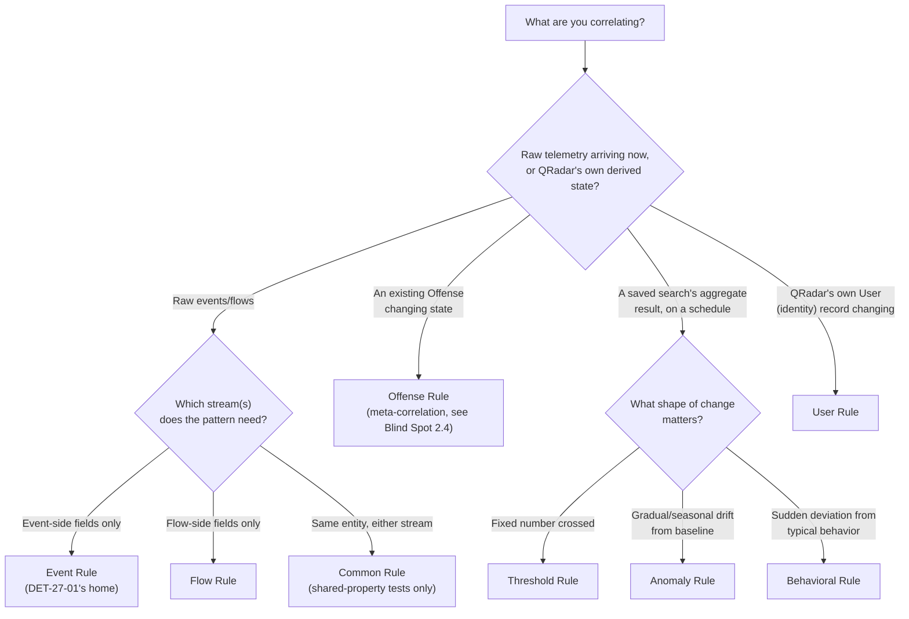

# Part 8 — The Rule Wizard Catalog: Rule Types Beyond the Canonical Example

## Why this part exists

**[CONCEPT]** DEH Part 27 built exactly one rule: `R: Suspicious LSASS Access — Unapproved Process`, an Event Rule chaining `BB:LSASS-Access-Candidate` against `RS-Allowlisted-LSASS-Tools` (DEH Part 27 §3.3). That was the right amount of Rule Wizard to show in a part whose job was proving one point about QRadar's correlation model against KQL and SPL — not a survey of everything the Rule Wizard can build. This part is that survey. The Rule Wizard's very first screen asks a question DEH Part 27 never had to answer out loud because DET-27-01 only ever needed one answer: **what kind of record is this rule actually evaluating?** An event arriving right now. A flow record arriving right now. Either one, matched on the properties they share. An Offense that already exists, changing state. Or a saved search's aggregate result, checked on a schedule rather than a stream.

Get that first answer wrong and nothing downstream saves you — the wrong rule type doesn't error, it just doesn't expose the Rule Test category you needed, and the rule you built quietly tests something adjacent to what you meant to test. This part works through each rule type in the Wizard's catalog, the Response actions available once a rule matches (which are broader than "create an Offense"), and the Response Limiter mechanism that keeps a matching rule from flooding its own Response. None of this re-teaches AQL (DEH Part 27 §1 owns that) or the Building Block/Reference Set/Rule three-object pattern DEH Part 27 §2 and §3.3 already established — this part assumes both and builds outward into the parts of the Wizard DET-27-01 never had to touch.

---

## 1. The Rule Wizard's anatomy, briefly recapped

**[CONCEPT]** DEH Part 27 §2 established the load-bearing structural fact: the Custom Rules Engine, universally abbreviated CRE, evaluates every incoming record against deployed Rules built from Rule Tests, and Rules can reference Building Blocks — named, reusable Rule Test groupings — by name. A Rule Test is one condition drawn from a fixed, point-and-click catalog; a Rule chains one or more of them with AND/OR logic and attaches a Response.

What DEH Part 27 didn't need to spell out is that the Rule Test catalog itself is not one fixed list. It's scoped by which **rule type** you picked on the Wizard's first screen, because rule type determines which underlying record stream the CRE evaluates the rule against — and a Rule Test that reads a flow-only field simply isn't offered inside a rule type that never sees flow records. This is the decision §2–§4 below work through category by category.

### 1.1 Rule type as the first decision, not an afterthought

**[RULE ENGINEER]** In practice, a team that has only ever built Event Rules (because that's what the one worked example in training or in DEH Part 27 showed them) tends to keep building Event Rules for problems that aren't event problems — testing a flow-volume condition by proxy through an event-side custom property that only approximates it, or building a second, unrelated Event Rule to "watch" an Offense's magnitude instead of using the rule type built for exactly that. None of these substitutes are wrong in the sense of producing an error. They're wrong in the sense of testing something adjacent to the actual question, which is a harder failure to catch in review because the rule deploys cleanly, matches something, and produces Offenses that look plausible until an analyst notices the evidence attached to them doesn't match the name on the tin. §7's Rule Autopsy below is exactly this failure mode, worked through in full.

---

## 2. The four data-scoped rule types: Event, Flow, Common, and Offense

**[RULE ENGINEER]** Four of the Wizard's rule types are distinguished by which record stream they evaluate: two raw-telemetry streams (`events`, `flows` — the same two Ariel tables DEH Part 27 §1.1 introduces for search), one that spans both, and one that steps outside raw telemetry entirely to evaluate QRadar's own correlation output.

### 2.1 Event Rules — DET-27-01's home

**[RULE ENGINEER]** An Event Rule evaluates the `events` table as records land, one at a time (or aggregated across a window via a threshold-style Rule Test, the same "at least *X* events... in *Y* minutes" category DEH Part 27 §4 covers for DET-27-02). Every Rule Test in an Event Rule's catalog reads event-side fields: QID (QRadar's internal event-taxonomy identifier, per DEH Part 27 §1.2), `LOGSOURCETYPENAME()`, and any custom property a DSM (Device Support Module — the log-source-type-specific parser that assigns a QID and extracts fields, per DEH Part 27 §1.2/§3.1) has populated for that log source. `R: Suspicious LSASS Access — Unapproved Process` is an Event Rule because DET-27-01's entire analytic — a source process, a target process image, a granted-access value — lives on one Sysmon-derived event; there is no flow-side component to the pattern at all.

Event Rules are the default a new QRadar rule author reaches for, and for good reason: most detection content maps naturally onto discrete log records rather than network-flow aggregates. The failure mode isn't choosing an Event Rule for an event pattern — it's reaching for one when the pattern actually needs flow evidence, covered next.

### 2.2 Flow Rules — evaluating network behavior QRadar itself observed

**[RULE ENGINEER]** A Flow Rule evaluates the `flows` table (DEH Part 27 §1.1) as flow records arrive from QFlow or a third-party flow source (Part 7 of this book covers flow collection architecture in full). Its Rule Test catalog exposes flow-side properties an Event Rule's catalog does not: bytes/packets transferred in each direction, flow duration, detected application, and the source/destination network-hierarchy segment a flow traversed. A Flow Rule cannot see event-side custom properties at all, for the same structural reason an Event Rule can't see flow volume — it evaluates a different table.

*Example, illustrative:* `R: Large Outbound Flow to Unowned Network — Exfil Candidate` — a Flow Rule chaining a Rule Test on bytes-transferred-outbound exceeding a configured value against a Rule Test checking the destination network segment is **not** contained in a Reference Set of known-owned or known-partner networks. This is a flow-native pattern: nothing about it involves a parsed log record, and building it as an Event Rule would leave the author hunting for a bytes-transferred Rule Test that the Event Rule catalog simply does not carry.

### 2.3 Common Rules — one rule, two streams

**[RULE ENGINEER]** A Common Rule evaluates both `events` and `flows`, but only against the subset of properties both tables actually share — source/destination IP and port, protocol, and a handful of others QRadar's schema maps onto both record types identically. A Common Rule's Rule Test catalog is narrower than the union of Event and Flow catalogs for exactly this reason: it can't offer a flow-only bytes-transferred test any more than it can offer an event-only QID test, because either one would only ever be populated on half the records a Common Rule evaluates.

Common Rules earn their place when the correlation genuinely needs "the same source IP whether it shows up as an event or a flow," not as a general substitute for choosing between Event and Flow. §7's Rule Autopsy is a team learning that distinction the hard way.

### 2.4 Offense Rules — correlating on QRadar's own output

**[RULE ENGINEER]** An Offense Rule evaluates Offenses themselves — the record QRadar's CRE already produced — as they're created or updated, not the events or flows that fed them. Its Rule Test catalog reads Offense-level state: magnitude crossing a value, an Offense going a configured period without analyst assignment, an Offense's event/flow count growing past a value, or an Offense matching a specific source Rule or Building Block by name.

*Example, illustrative:* `R: Escalate Unassigned Critical Offense` — an Offense Rule testing for magnitude above a configured value AND no analyst assignment after a configured dwell time, with a Response that sends an email notification and adds an annotation, rather than creating a second Offense for the same underlying activity.

> **Blind Spot**
> An Offense Rule tests conditions on the Offense record itself — magnitude, assignment state, contributing-record count, source Rule name — not on the event or flow fields that produced it. A rule built to catch "an Offense whose magnitude jumped because of a specific technique" can only see that the magnitude jumped, never which contributing event drove the jump, unless the Event or Common Rule that fed the Offense already wrote that context somewhere an Offense Rule can read it back (an annotation, a Reference Set entry keyed to the Offense ID). Meta-correlation on Offenses is a coarser signal layered on top of already-fired detections — an escalation and notification mechanism, not a substitute for getting the underlying Event, Flow, or Common Rule right in the first place.

---

## 3. The saved-search-driven rule family: Threshold, Anomaly, and Behavioral

**[RULE ENGINEER]** The Wizard groups three rule types together under a distinct authoring model from the data-scoped four above: rather than evaluating individual records as they stream in, each of these three wraps a saved AQL search's *aggregate result* and re-evaluates that result on a schedule. This is architecturally different from the threshold-style Rule Test DEH Part 27 §4 already covers for DET-27-02 — worth disambiguating explicitly, since both use the word "threshold" and a reader moving between the two parts should not conflate them:

- DEH Part 27 §4's threshold Rule Test (`when at least X events are seen with the same property in Y minutes`) is a condition available *inside* an Event, Flow, or Common Rule — it evaluates a rolling window of individual records against a count, in near-real time, as part of a rule that also carries other Rule Tests.
- This section's Threshold rule *type* is a standalone rule built directly on top of a saved search's own aggregate output, re-run on a configured interval, with no requirement that the underlying records look anything like a single Building Block's match condition.

The distinction matters because the second model is the one that answers a genuinely different class of question: not "did this specific pattern happen at least X times against one entity," but "did some aggregate metric across the whole environment move in a way worth flagging."

```sql
-- QRadar AQL — illustrative saved search only, disambiguated from standard SQL exactly
-- as DEH Part 27 §1.1 flags on first appearance: no general-purpose JOIN, and the
-- LAST/GROUP BY shorthand here follows AQL's own time-window and aggregation syntax,
-- not a portable SQL dialect. Property names and QID text are illustrative — see
-- DEH Part 27 §3.1 on confirming both against your own DSM mapping before reuse.
SELECT UNIQUECOUNT(sourceip) AS "Distinct Sources"
FROM events
WHERE QIDNAME(qid) = 'Process accessed'
GROUP BY QIDNAME(qid)
LAST 1 HOURS
```

A saved search shaped like this one — how many distinct source IPs triggered a process-access QID in the last hour, across the whole environment, not any one host — is the kind of aggregate a Threshold, Anomaly, or Behavioral rule type wraps. DEH Part 27 §2.3 already flags that whether a given QRadar version lets a Rule Test anchor directly to a saved AQL search, and on what evaluation cadence, is a version-dependent capability; the same uncertainty applies with at least as much force to which saved-search shapes the Anomaly Detection Rule family accepts as a valid basis in your specific release.

### 3.1 Threshold rules

**[RULE ENGINEER]** A Threshold rule fires when a saved search's aggregate result crosses a fixed number you configure — "more than 50," not a baseline the platform computed for you. This is the simplest of the three: no history, no seasonality, just a number and a comparison operator, checked each time the saved search re-runs.

### 3.2 Anomaly rules

**[RULE ENGINEER]** An Anomaly rule compares a saved search's current aggregate result against a baseline QRadar builds from that same search's own recent history, and fires on a meaningful percentage change from that baseline rather than a fixed number — the mechanism aimed at catching "today looks different from this metric's usual pattern" without an author having to guess the right static number for an environment whose baseline itself drifts over time (seasonal traffic, headcount growth, a new business unit's log volume).

### 3.3 Behavioral rules

**[RULE ENGINEER]** A Behavioral rule targets the same class of question as an Anomaly rule — has this metric moved outside what's normal — but through a different statistical treatment of "normal," oriented toward catching a sudden deviation from a metric's typical behavior rather than a gradual seasonal shift. The practical distinction an author cares about is which of the two better matches the kind of change worth flagging for a given metric: a slow drift away from baseline versus a sharp, out-of-character spike or drop.

> **PRODUCT VERSION NOTE**
> The exact statistical model each of Threshold, Anomaly, and Behavioral rule types uses — the specific percentage-deviation formula, the baseline window length, and even which of the three names groups under "Anomaly Detection Rules" in the Wizard's own menu — has not been independently verified against a live console for this book (STYLE-GUIDE.md §0's no-lab constraint) and is exactly the kind of literal-wording claim §11 requires flagging rather than asserting. Treat this section's descriptions as the conceptual shape of each mechanism, and verify the current math, defaults, and menu grouping against your own deployment's Rule Wizard and release notes before designing a specific rule around any one of the three.

---

## 4. User Rules and the identity-record exception

**[RULE ENGINEER]** A User rule type evaluates QRadar's own User records — identity data the platform builds and updates from authentication and identity-correlation events, distinct from any single raw event or flow — as those records are created or changed. Where the four data-scoped types in §2 test what a log record or flow record says, and the three saved-search types in §3 test what an aggregate metric is doing, a User rule tests what QRadar currently believes about an identity: a new administrative-group membership appearing on a User record, or an identity attribute changing in a way worth flagging independent of any single authentication event that triggered the change.

> **PRODUCT VERSION NOTE**
> User rules sit closest to QRadar's identity-correlation and user-behavior-analytics capabilities, which have been packaged, renamed, and re-scoped across releases and business decisions more than most of this book's other subject matter (per STYLE-GUIDE.md §11's packaging/ownership trigger) — including periods where deeper user-behavior analytics lived in a separate app rather than the core Rule Wizard (Part 19 of this book covers the App Framework and UBA-class apps at a survey level). Whether "User" appears as a first-class rule type, what Rule Test categories it exposes, and how it relates to any UBA app installed alongside it are all things to verify against your own deployed release before building on this section's description as a literal current-state claim.

---

## 5. Choosing a rule type: a decision table

**[RULE ENGINEER]** The table below supports the one decision this part exists to get right before any Rule Test gets picked — which of the Wizard's rule types actually matches what you're correlating. Treat the Version column as a floor, not a ceiling: it flags where this book has the least confidence the exact menu grouping or availability matches your release, not a claim that everything else in the row is guaranteed unchanged either.

| Rule Type | Evaluates | Typical Use | Version |
|---|---|---|---|
| Event | `events` table, per record or windowed | Log-record patterns — DET-27-01's home | Stable core CRE concept |
| Flow | `flows` table, per record or windowed | Network-volume/behavior patterns with no log-record component | Stable core CRE concept |
| Common | Shared properties across `events` and `flows` | One entity (IP, port) correlated regardless of which stream reported it | Stable core CRE concept |
| Offense | Existing Offense records, on state change | Escalation, notification, meta-correlation on already-fired detections | Stable core CRE concept |
| Threshold | A saved search's aggregate result vs. a fixed number | Simple environment-wide count crossing a known bad number | See §3's PRODUCT VERSION NOTE |
| Anomaly | A saved search's aggregate result vs. its own rolling baseline | Gradual/seasonal drift worth flagging | See §3's PRODUCT VERSION NOTE |
| Behavioral | A saved search's aggregate result vs. typical-behavior deviation | Sudden, sharp deviation worth flagging | See §3's PRODUCT VERSION NOTE |
| User | QRadar's own User (identity) records, on change | Identity-attribute or group-membership change | See §4's PRODUCT VERSION NOTE |





**Figure 8.1 — Choosing a Rule Wizard rule type from what's actually being correlated.** *CONCEPTUAL.* Illustrates the decision this part argues from prose — rule type is a first-class authoring choice made before any Rule Test is selected, not an incidental setting — and maps each of the eight types in §2–§4 to the question it answers. Not a reproduction of the Rule Wizard's own screen flow, which DEH Part 27 §2.1 and this part's PRODUCT VERSION NOTEs already flag as wording/grouping that shifts across releases; this diagram is this book's own structural summary of that catalog, not a captured UI walkthrough.

---

## 6. Response actions beyond "create an Offense"

**[RULE ENGINEER]** Every rule type above shares the same Response tab once a Rule Test chain matches. DEH Part 27 §2.1 names "create or contribute to an Offense" as one Response option among several without enumerating the rest; this section is that enumeration.

### 6.1 Offense-shaping responses

**[RULE ENGINEER]** Beyond simply creating an Offense, a Response can contribute a match to an existing Offense (indexed on a chosen field, exactly as `R: Suspicious LSASS Access — Unapproved Process` indexes on source host or username per DEH Part 27 §3.3), set or adjust Offense attributes such as name, description, or an annotation, and — the mechanism §2.4's Offense Rules depend on to see anything beyond raw magnitude — write a note or attribute an Offense Rule can later read back.

### 6.2 Reference-data responses

**[RULE ENGINEER]** A Response can add to, or remove from, a Reference Set, Reference Map, or another reference-data collection (Part 10 of this book covers the full typed taxonomy). This is the mechanism behind DEH Part 27 §2.2's entire Reference Set correlation pattern — the first-stage Rule's Response is what actually populates `RS-Stage1-Seen` for the second-stage Rule Test to check.

### 6.3 Notification and integration responses

**[RULE ENGINEER]** A Response can send an email notification, send an SNMP trap, forward a syslog message to an external system, dispatch a new correlated event (chaining into another rule's evaluation), or execute a script or app-based custom action. Each of these is how QRadar's correlation output leaves the platform — into a ticketing system via email-to-case, into another monitoring tool via SNMP or syslog, or into a bespoke remediation action via a script.

> **PRODUCT VERSION NOTE**
> The exact name, availability, and execution surface of the script/custom-action Response — historically a raw script executed on the Console, increasingly framed as an App Framework "Custom Action" in more recent packaging — has shifted across releases and delivery models (on-prem vs. cloud/SaaS, per STYLE-GUIDE.md §11's packaging trigger). Confirm what your specific deployment actually offers, and where it actually executes, before designing a Response around this action; Part 19 covers the App Framework's own resource footprint for the case where a custom action runs as an app.

> **Platform Reality**
> A Response that sends an email, an SNMP trap, or runs a script executes once per match, not once per Offense — a Rule matching in bulk (a genuine flood, or a newly enabled Rule evaluated retroactively against a large backfill) can generate that same multiplied volume of outbound notifications or script executions, independent of how many Offenses the CRE consolidates the matches into. A Response that looks cheap at expected match volume can back up mail queues, SNMP receivers, or the Console's own resources at flood volume — the same resource-sharing concern DEH Part 27 §1.3's Engineering Reality callout names for EPS/FPM licensing applies to the Response subsystem, not just to ingestion.

### 6.4 Response Limiters — the throttle nobody notices until it's missing

**[RULE ENGINEER]** A Response Limiter caps how often a Rule's Response actually fires per matched value within a configured interval — for example, sending at most one email per source IP per hour even if the underlying Rule Test chain matches that source IP forty times in the same hour. The Rule still evaluates and still contributes to the Offense every time it matches; the Limiter governs only the Response side, which is exactly the distinction that makes it easy to configure once, forget, and then be surprised twice in opposite directions — once when a Limiter that's too permissive floods a downstream mailbox during a genuine incident, and once when a Limiter that's too aggressive silently drops the second, third, and further legitimate notification an escalation actually needed.

---

## 7. Rule Autopsy: the Common Rule that tested only half its own condition

**[RULE ENGINEER]** §2.3's Common Rule/Event Rule boundary is the exact distinction this failure worked through in full.

> **Rule Autopsy**
> **The rule:** `R: Same Source IP Seen in Event and Flow Category — Candidate C2 Beacon`, built as an Event Rule.
> **Why it shipped:** The author wanted one rule instead of two — a single source IP showing both a suspicious event-side indicator and a high-volume outbound flow — and picked Event Rule in the Wizard's first screen because that was the same rule type the team's one existing worked example (`R: Suspicious LSASS Access — Unapproved Process`, an Event Rule per DEH Part 27 §3.3) already used, without checking whether a flow-volume Rule Test was even offered inside that catalog.
> **How it failed:** It wasn't. Event Rules evaluate the `events` table only; the flow-side bytes-transferred Rule Test category the author needed simply never appeared in the list, so the "flow" half of the intended condition was quietly dropped rather than flagged as missing. The rule deployed cleanly, matched on the event-side indicator alone, and produced Offenses named after a C2-beacon pattern with zero flow evidence attached to any of them — eight closures in before an analyst asked why a "candidate beacon" Offense never showed the flow tab populated.
> **The fix:** Rebuilt as a Common Rule, whose Rule Test catalog exposes the source-IP property shared by both streams, chained against the existing event-side Building Block and a new flow-volume condition backed by a Reference Set of known-owned destination networks (§2.2's pattern). Re-validated against a simulated beacon (a test host generating both the event-side indicator and a matching high-volume outbound flow) before redeployment, confirming both halves of the condition actually contributed before trusting the Offense name again.

---

## 8. Governance consequence: one more object type to review

**[SOC MANAGEMENT]** DEH Part 27's closing SOC MANAGEMENT paragraph named the three-object review burden a QRadar rule set imposes relative to a single-file Sigma or native query — a Building Block, a Reference Set, and a Rule, each separately versioned and separately permissioned. This part's catalog adds a dimension to that review burden that isn't about counting objects but about verifying a category choice: a reviewer checking a new Rule needs to confirm not just that its Rule Tests and Response are correct, but that its rule *type* actually matches the data shape the author intended — the exact gap §7's Rule Autopsy shows slipping past a review that only checked the Rule Test logic and never asked whether an Event Rule could see the flow evidence the name promised. Budgeting review time for "one new rule" should account for that category check as a distinct line item, not assume it's implied by reading the Rule Test list — a rule that tests exactly what its Wizard-limited catalog let it test can still look complete to a reviewer who doesn't independently ask what the author actually meant to correlate.

---

**Cross-references:** DEH Part 27 §1.1, §1.2, §2.1, §2.2, §2.3, §3.1, §3.3, §4 (AQL fundamentals, CRE/Building Block/Reference Set mechanics, DET-27-01/DET-27-02 worked examples); DEH Part 23 §1, §5 (DET-23-01 origin; Sigma-first-vs-native authoring tradeoff, not re-argued here); this book's Part 7 (flow collection architecture), Part 9 (Building Block governance at scale), Part 10 (the full reference-data type taxonomy), Part 11 (thresholds, Anomaly, and Behavioral rules in operational depth), Part 15 (Noisy-Offense tuning workflow), Part 16 (rule change management), Part 19 (App Framework and UBA-class apps), Appendix A2 (Rule Wizard and Rule Test quick reference).
