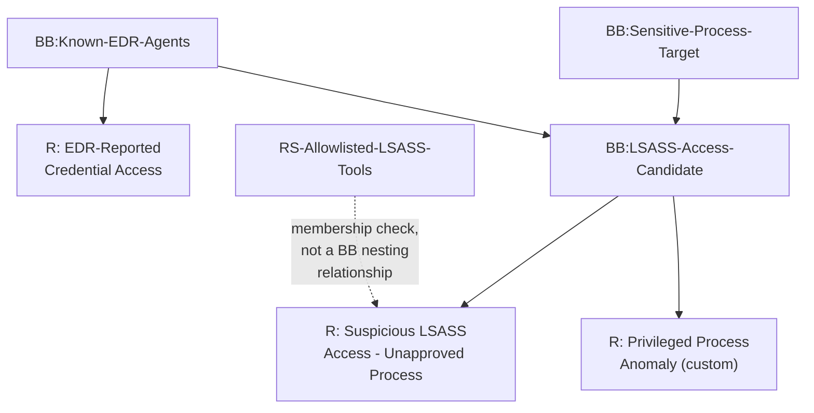
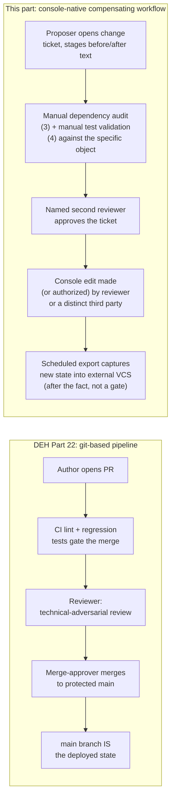

# Part 9 — Building Blocks: Design Patterns and Governance at Scale

## Why this part exists

**[CONCEPT]** DEH Part 27 §2.1 introduces the Building Block for exactly one purpose: to prove that a QRadar Rule can share a named, reusable Rule Test grouping instead of re-specifying the same condition in every Rule that needs it, using a single worked example (`BB:LSASS-Access-Candidate`, carried forward in this book's own worked example below). That is the right amount of Building Block theory for a part whose job is comparing six query languages. It is not enough Building Block practice for a team running a QRadar deployment that has been live for three years, has forty rule authors who have rotated through the team, and has a `BB:` library that has grown — quietly, one reasonable one-off decision at a time — past four hundred entries, most of them unreviewed since the day they were created.

This part is about that library, not about how to build one Building Block. It covers naming and taxonomy patterns that keep a `BB:` library navigable past the point where any one person can hold its contents in their head; where sprawl and drift actually come from at scale, and how to detect both before a Noisy Offense Trap or a silent detection gap forces the discovery; and the change-control gap this book has to name honestly rather than paper over — QRadar's console-native authoring surface does not hand a team DEH Part 22's git-based, pull-request-gated, three-role-separation-of-duties pipeline for free, and a disciplined team has to build a compensating discipline instead. It does not re-teach Rule Wizard mechanics (Part 8 owns the full Rule Test catalog) or the reference-data type taxonomy a Building Block often works alongside (Part 10 owns Reference Set/Map/Table/Sequence selection). It does not own the day-to-day tuning-intake workflow a flooding Building Block eventually feeds into (Part 15) or the ticket-level change-management process a single rule change should follow (Part 16) — this part is about the library those processes operate against, and the governance discipline that keeps the library itself from becoming the source of the next incident.

---

## 1. A Building Block library is a dependency graph, not a list

**[CONCEPT]** A Building Block is a named Rule Test grouping — the same authoring mechanism as a Rule's own conditions, saved under a `BB:`-prefixed name so it can be referenced by name instead of rebuilt (DEH Part 27 §2.1). What that section's single example does not have room to show is that a Building Block's Rule Test can itself include the condition "when the event matches any/all of the following Building Blocks" — a Building Block can reference another Building Block. At the scale of a handful of custom Building Blocks sitting alongside QRadar's own shipped content, this nesting is trivial: everyone remembers that `BB:LSASS-Access-Candidate` feeds `R: Suspicious LSASS Access — Unapproved Process` and nothing else does. At the scale of hundreds, it is a real dependency graph with real failure modes a flat list hides: a single foundational Building Block quietly referenced by forty Rules, where an edit intended to narrow one Rule's false-positive rate silently reshapes the other thirty-nine; a Building Block that references a second Building Block that has since been disabled; a Building Block with zero remaining Rule references at all, sitting in the library as dead weight nobody has confirmed is safe to remove.

Figure 9.1 makes this structure explicit. The point is not the specific shape drawn — it is that a `BB:` library big enough to matter has a topology, and "how many Rules does this Building Block feed, directly or through another Building Block" is a question a team needs to be able to answer before editing anything, not after an edit has already gone live.






**Figure 9.1 (FIG-09-01) — A Building Block library as a dependency graph.** *CONCEPTUAL.* Illustrates the two ways sprawl compounds at scale: a foundational Building Block (`BB:LSASS-Access-Candidate`) that several Rules and a second-order Building Block all depend on, and a Reference Set consulted by a Rule directly rather than through Building Block nesting — the same distinction DEH Part 27 §2.2 draws between Building Block reuse and Reference Set state. Not a capture of any real rule repository or dependency-visualization tool; this book has no lab access to produce that capture (STYLE-GUIDE.md §9).

**[RULE ENGINEER]** The practical consequence: before editing any Building Block that has existed longer than the most recent onboarding cycle, the first question is not "what does this condition currently say" but "who depends on it, directly and through another Building Block" — §3 covers how to answer that question without a native dependency-visualization tool guaranteed to exist in your specific deployment.

---

## 2. Naming and taxonomy patterns that survive scale

**[RULE ENGINEER]** QRadar ships with its own out-of-box Building Block library organized, in broad strokes, around a small set of functional categories — Building Blocks that define a category of events, a category of hosts, a category of network segments, a category of ports, a category of users, or a known-false-positive condition, each intended to be referenced by many downstream Rules rather than rebuilt per Rule. A custom `BB:` library that grows past the first few dozen entries benefits from adopting the same functional-category discipline for its own additions, rather than letting every new Building Block get whatever name felt clearest to the analyst who wrote it that week.

> **PRODUCT VERSION NOTE**
> The exact prefix strings, punctuation, and grouping QRadar's out-of-box content uses for its own categorical Building Blocks (definitional patterns along the lines of a category, host, network, port, user, or device grouping) are believed stable in spirit across recent releases but have not been verified against a live console for this book (STYLE-GUIDE.md §0/§9 — no lab access). Treat the functional taxonomy in Table 9.1 below as this book's own recommended convention for a custom library, informed by that shape, not as a literal transcript of IBM's current out-of-box naming — verify your own deployment's shipped Building Block names in Admin before assuming an exact string match.

Table 9.1 states that convention as a decision aid: which functional bucket a new custom Building Block belongs in, and what naming pattern keeps that bucket searchable once the library holds hundreds of entries across multiple bucket types.

**Table 9.1 — A functional taxonomy for a custom `BB:` library.** Supports the decision of which bucket a new Building Block belongs in and what its name should communicate before a second author has to guess.

| Category | Purpose | Example name | Typically reused by |
|---|---|---|---|
| Candidate-match | Defines the raw pattern a downstream Rule tests against, before any allowlist exclusion is applied | `BB:LSASS-Access-Candidate` | One or a small number of closely related Rules |
| Definitional / scope | Names a reusable set of hosts, networks, ports, users, or device types other logic references by name instead of by literal value | `BB:Domain-Controllers` | Many Rules and other Building Blocks across unrelated analytics |
| Exclusion / allowlist-adjacent | Narrows a candidate-match condition against a known-benign source — distinct from a Reference Set (Part 10) when the exclusion is a fixed logical condition rather than a maintained membership list | `BB:Known-Backup-Agent-Behavior` | The specific candidate-match Building Block it's paired with |
| Category rollup | Groups several QID (QRadar's internal event-taxonomy identifier) or event-category values under one reusable label, standing in for a repeated `CATEGORYNAME()`-style condition | `BB:CategoryDefinition-Auth-Failures` | Any Rule needing a broad authentication-failure signal |
| Deprecated / retiring | Marks a Building Block scheduled for removal, with the removal date and replacement named in the description field, not just implied by the name | `BB:LSASS-Access-Candidate-DEPRECATED-2026Q4` | Nothing, by design — see §5's deprecation policy |

**[RULE ENGINEER]** Two naming disciplines matter more than the specific taxonomy chosen: first, a Building Block's name should say what it *matches*, not what *Rule* it was built for — `BB:LSASS-Access-Candidate` survives being reused by a second Rule cleanly; a name like `BB:Rule14-Condition2` does not, and is itself a sprawl symptom (§3). Second, every custom Building Block's description field — not just its name — should state its functional category, its intended reuse scope, and an owner, because the name alone runs out of room fast once a library holds several hundred entries across five categories.

---

## 3. Where sprawl actually comes from, and how to catch it before it costs you

**[PLATFORM ENGINEER]** A `BB:` library rarely sprawls from one bad decision. It sprawls from many individually reasonable ones, each made under time pressure by an author who did not have visibility into the rest of the library:

- **Building-Block-per-Rule.** An analyst under deadline pressure builds a new Building Block for a condition that's 90% identical to an existing one, because searching the existing several hundred entries for a near-match takes longer than writing a new one from scratch. The library gains a near-duplicate; neither copy gets the benefit of the other's future tuning.
- **Orphaned Building Blocks.** A Rule gets retired or rewritten, and the Building Block it depended on — built specifically for that Rule and referenced nowhere else — is left in place because removing it wasn't part of the Rule-retirement checklist. It sits in the library indefinitely, consuming review attention every time someone audits "what does this library actually contain" without contributing to any live detection.
- **Silent breakage on rename or duplication.** §1's dependency graph is exactly what makes this failure mode possible: an author "cleans up" an old Building Block by duplicating it under a corrected name and deleting the original, intending the swap to be transparent to every dependent Rule. Whether that swap is actually transparent depends on how QRadar's Rule Wizard internally resolves a Building Block reference — and that is exactly the kind of implementation detail this book will not assert as fact without a source (see the PRODUCT VERSION NOTE below, and the worked failure in §3.1's Rule Autopsy).
- **Unclear ownership.** A Building Block written by an analyst who has since left the team, with no owner field and no description beyond its name, becomes something nobody wants to touch — not because it's known to be load-bearing, but because nobody can rule that out quickly. The safe-feeling response, leaving it alone indefinitely, is how a library accumulates permanent uncertainty instead of resolving it.

> **PRODUCT VERSION NOTE**
> Whether your specific QRadar release exposes a built-in "where is this Building Block referenced" or dependency view from inside the Rule Wizard or the Building Block editor is not a claim this book makes either way — it has shifted across releases and this book has no lab access to confirm current behavior. If your deployment does not expose one, the compensating control is a periodic content export (§4's REST API pattern) parsed for cross-references by name, run before any Building Block is edited or deleted, not after.

**[RULE ENGINEER]** Absent a guaranteed native dependency view, the audit pattern that catches all four sprawl causes above without one is the same in each case: export the full Rule and Building Block catalog on a fixed schedule (§4), parse it for which Building Block names appear inside which Rule's and other Building Block's Rule Test definitions, and flag three conditions — a Building Block with zero referencing Rules or Building Blocks (orphan candidate), a Building Block whose logic is a near-exact duplicate of another's (consolidation candidate), and a Building Block referenced by an unusually high count of Rules relative to the library's median (a de facto foundational dependency that any edit needs extra review before touching, regardless of how small the edit looks).

### BB:LSASS-Access-Candidate — anatomy of a well-governed Building Block

**[RULE ENGINEER]** This book does not re-derive `BB:LSASS-Access-Candidate`'s matching logic — DEH Part 27 §3.3 already defines it as the Rule Test equivalent of DET-27-01's candidate-match condition (QID resolves to the Sysmon process-access category, target process name ends `lsass.exe`, granted access matches the memory-read-capable value set), feeding `R: Suspicious LSASS Access — Unapproved Process` alongside `RS-Allowlisted-LSASS-Tools`. What this part adds is the governance metadata a well-run library attaches to that same object, none of which QRadar's own description field is guaranteed to structure for you — so a disciplined team adopts a fixed convention and writes it into every Building Block's free-text description consistently:

- **Category:** Candidate-match (Table 9.1).
- **Owner:** the individual or team accountable for reviewing this Building Block, not the person who happened to author it three years ago and may no longer be on the team.
- **Known dependents:** `R: Suspicious LSASS Access — Unapproved Process` — kept current by the audit pattern in §3, not by memory.
- **Last reviewed:** a date, bumped every time the audit in §3 confirms this Building Block's logic and dependents are still accurate — the same discipline DEH Part 22 §4 requires of a `Required Fields`/`Known FP` metadata block for a Detection Rule, adapted to an object QRadar's own console does not give a dedicated structured field for.

> **Rule Autopsy**
> **The Building Block:** `BB:LSASS-Access-Candidate`, feeding `R: Suspicious LSASS Access — Unapproved Process` exactly as DEH Part 27 §3.3 wires it.
> **Why it shipped:** A quarterly naming-cleanup pass (§2) renamed the Building Block by duplicating it under a corrected, standardized name and disabling the original — a "safe-looking" two-step migration, not a reckless one — on the assumption that the dependent Rule's Building Block condition would carry over automatically.
> **How it failed:** The dependent Rule's Rule Test had been wired to the specific Building Block object the original author selected in the Rule Wizard at authoring time. Whether QRadar resolves that reference by a stable internal object identifier or by display name at evaluation time is exactly the kind of implementation detail this book flags rather than asserts (see the PRODUCT VERSION NOTE above) — and it is precisely the detail that determines whether a duplicate-then-disable migration like this one is transparent or silently breaks the link. In this scenario, it broke the link: the Rule stayed enabled, logged no error, and simply stopped matching anything, indistinguishable from a quiet week for `lsass.exe` activity across the whole fleet.
> **The fix:** Treat "duplicate the object, then disable or delete the original" as a two-step migration that is not complete until every dependent Rule and Building Block identified by the §3 audit has been individually re-verified against the new object — not assumed to follow automatically — and prefer an in-place rename of the existing object over a duplicate-and-delete migration whenever the change is naming-only and no logic actually needs to change.

---

## 4. Change control without a git-based pipeline

**[PLATFORM ENGINEER]** DEH Part 22 describes a rule repository where the console is a deployment target, not an editing surface: a protected branch, a pull request per change, automated lint and regression testing that blocks the merge button, and a structural three-role separation — author, reviewer, merge-approver — enforced by branch protection settings rather than trusted to memory. None of that exists by default for a Building Block edited directly in QRadar's own console. A user with Rule/Building Block edit permission opens the editor, changes a condition, and saves — live, immediately, with no required second reviewer, no CI gate, and no built-in mechanism forcing a record of what the object looked like five minutes earlier. This is not a QRadar defect distinct from every other console-native platform's default behavior; DEH Part 22 §1's own Engineering Reality names the identical gap for detection consoles generally. It is, however, a gap this book states plainly rather than implying a Building Block library gets DEH Part 22's guarantees for free just because the underlying authoring mechanism (a named, reusable, versionable logical object) looks similar on the page.

> **PRODUCT VERSION NOTE**
> This part states plainly that no built-in second-reviewer approval gate and no automatic revision history exist for a Building Block edit made directly in the console. That absence is stated as this book's working assumption, not a claim verified against every current release — this book has no lab access (STYLE-GUIDE.md §0/§9), and IBM has added platform-management capabilities (content/extensions export-import tooling, and administrative auditing features) over successive releases that could narrow this gap in ways not reflected here. Verify what your own deployment's specific release actually exposes before assuming the fully manual compensating workflow below is the only option available to you.

**[PLATFORM ENGINEER]** What a disciplined team substitutes, mapped against the three roles DEH Part 22 §3 makes structural:

- **In place of a pull request:** a change ticket in whatever system of record the team already uses for infrastructure changes, opened before the console edit is made, naming the specific Building Block by its `BB:` name, the current logic (captured from the export in the pattern below, not from memory), the proposed change, and the reason — the same fields DEH Part 22 §4's metadata standard requires of a Detection Rule, filled in as ticket text instead of a YAML front-matter block, because the console gives no equivalent structured field.
- **In place of CI lint/test gates:** a manual pre-change step that runs the §3 dependency audit specifically against the Building Block being changed, and a manual post-change validation against a known-positive test event or saved search — the same intent as DEH Part 22 §2's automated regression check, performed by a human because the platform will not gate the save button on it.
- **In place of branch-protection-enforced separation of duties:** a two-person rule at the process level — the proposer opens the ticket and stages the exact before/after text, a second, named individual reviews the ticket and only then makes (or explicitly authorizes) the console edit — accepting, as DEH Part 22 §3's own SOC Management View names for a two-person detection team, that a console with no native reviewer-cannot-also-be-merger toggle makes this a staffing discipline to enforce, not a setting to turn on.
- **In place of `git log` as the audit trail:** a scheduled export of the full Rule and Building Block catalog into an external version-controlled store — not a live gate, since nothing blocks a console edit from happening outside this export cycle, but a genuine after-the-fact diff and rollback aid once it exists, and the same raw data the §3 dependency audit runs against.

```bash
# CONCEPTUAL SAMPLE — illustrative shadow-version-control export, not a validated
# call against a live deployment (STYLE-GUIDE.md §0/§9 — no lab access). Confirm
# the exact endpoint path, the required API "Version" header value, and the
# authentication scheme against your own deployment's REST API reference before
# reusing this unmodified — all three have changed across QRadar releases.
curl -s -H "SEC: $QRADAR_API_TOKEN" \
  -H "Version: 20.0" \
  "https://qradar.example.internal/api/analytics/rules?fields=id,name,type,owner,base_host_id" \
  -o rules_and_building_blocks_export.json
```

```json
{
  "id": 4021,
  "name": "BB:LSASS-Access-Candidate",
  "type": "BUILDING_BLOCK",
  "owner": "detection-engineering-team",
  "base_host_id": 1
}
```

> **PRODUCT VERSION NOTE**
> The REST API request above is illustrative of the *pattern* — export the Rule/Building Block catalog on a schedule, diff it against the last export, feed the diff into an external, version-controlled store — not a literal, tested call. The exact endpoint path, the required `Version` header value, field names in the response body, and whether Building Blocks are exposed through the same endpoint as ordinary Rules (distinguished only by a type field) or a separate one entirely, are all specifics that have shifted across QRadar releases and API versions. Verify against your own deployment's in-console REST API reference before building automation on top of this pattern.






**Figure 9.2 (FIG-09-02) — A git-based pipeline's structural gate versus a console-native compensating workflow's process gate.** *CONCEPTUAL.* Illustrates the same intent — no single person authors, reviews, and ships a change unilaterally — achieved by two different mechanisms: DEH Part 22's branch-protection-enforced structural gate on the left, where the merge button is literally unavailable until conditions are met, versus this part's process-level compensating workflow on the right, where every step depends on staffing discipline rather than a setting the platform enforces. Not a capture of any real ticketing system or QRadar console.

**[PLATFORM ENGINEER]** The honest limitation Figure 9.2 is drawn to surface, not hide: the right-hand workflow is a discipline, not a control. Nothing in QRadar's own console stops the proposer from skipping the ticket and editing the Building Block directly — the compensating workflow's only enforcement mechanism is restricting console edit permissions to people who have agreed to follow it, and auditing console-side changes against the last export to catch the ones that didn't (the same gap DEH Part 22 §1's own Engineering Reality names for a git-managed rule repository generally, applied here to a Building Block library specifically). Part 16 covers this ticket-to-rollback process in full for a single rule change; this section states the version of it a `BB:` library's dependency structure (§1) specifically requires — a change to a foundational Building Block needs the same two-person review a change to a single-Rule Building Block does, but the audit step beforehand has to check every dependent, not just the one Rule the proposer had in mind.

---

## 5. Governance roles and review cadence at scale

**[SOC MANAGEMENT]** DEH Part 27's own closing paragraph names a review-cost consequence specific to QRadar's multi-object model: reviewing "one detection" here means reviewing a Building Block, a Reference Set's maintained membership, and a Rule's chained logic as three separately-changeable artifacts, not one file. A `BB:` library of a few dozen custom entries makes that cost tolerable through informal team memory. A library of several hundred does not — and the review-cost multiplication compounds specifically because of §1's dependency graph: reviewing a change to a foundational Building Block referenced by forty Rules is not one detection's review cost, it is potentially forty.

> **SOC Management View**
> A team sized for "review each new detection as it ships" runs out of capacity the moment a `BB:` library crosses from a flat handful of entries into the hundreds, because the review unit stops being one Rule and starts being a dependency graph with unknown blast radius per change — exactly the cost this part's §1 and §4 name mechanically. Budget for a named Building Block library owner (a role, not necessarily a dedicated headcount line) whose job includes running the §3 audit on a fixed cadence, maintaining the ownership/last-reviewed metadata §3.1 recommends, and holding authority to block a change to a high-fan-in Building Block until its full dependent list has been re-verified — not just the one Rule the requester had in mind. A team that skips this role does not avoid the cost; it defers it to the day a foundational Building Block edit breaks silently across every Rule that depended on it, discovered only when offense volume drops and someone finally asks why.

**[SOC MANAGEMENT]** A minimum viable cadence for a library past a few hundred entries: a quarterly pass running the §3 audit in full (orphan detection, near-duplicate detection, fan-in outlier detection), a rolling deprecation policy — a Building Block marked `-DEPRECATED-<date>` per Table 9.1's convention is removed after a stated grace period with zero new dependents added during that window, not left in the library indefinitely out of caution — and an ownership review confirming every Building Block's assigned owner is still on the team, reassigning the orphaned ones rather than letting "unclear ownership" (§3) silently regenerate itself one departure at a time.

---

## 6. A minimal governance checklist

**[RULE ENGINEER]** Table 9.2 collects this part's recommendations into the form a Building Block library owner can actually run against a single object during a change review, rather than holding the whole part in mind at once.

**Table 9.2 — Building Block governance checklist, applied per change.** Supports a reviewer's go/no-go decision on a proposed Building Block edit, rename, or deletion.

| Check | Confirms | Owning section |
|---|---|---|
| Name states what it matches, not which Rule it was built for | Reusability signal is legible to the next author | §2 |
| Category and owner recorded in the description field | Findable during an audit without relying on memory | §2, §3.1 |
| Dependency export run against this specific object before editing | Full list of dependent Rules and Building Blocks is current, not assumed | §1, §3 |
| Near-duplicate check run against the rest of the library | Change isn't solving a problem an existing Building Block already solves | §3 |
| Change ticket opened with before/after text, before the console edit | Compensates for the missing PR gate | §4 |
| Named second reviewer approved before the edit was made | Compensates for the missing branch-protection separation of duties | §4 |
| Post-change validation run against a known-positive test event | Compensates for the missing automated regression gate | §4 |
| Export captured after the change, diffed into external VCS | Audit trail exists for this change going forward | §4 |
| If renamed or duplicated: every dependent individually re-verified | Closes the exact failure mode named in §3.1's Rule Autopsy | §3, §3.1 |

---

**Cross-references:** DEH Part 27 §2.1 (Building Blocks and Rule Tests) and §3.3 (`BB:LSASS-Access-Candidate` worked example, carried forward unchanged in §3.1 above); DEH Part 22 (Detection-as-Code: the git-based pipeline and three-role separation of duties this part's §4 builds a compensating workflow against); DEH Part 23 (Query Language Strategy — not re-argued here); this book's Part 8 (Rule Wizard Catalog), Part 10 (Reference Data Collections), Part 15 (Noisy-Offense Triage and the Tuning Workflow), Part 16 (Rule Change Management Without a Detection-as-Code Pipeline), and Part 22 (Staffing and Running a QRadar Practice).
