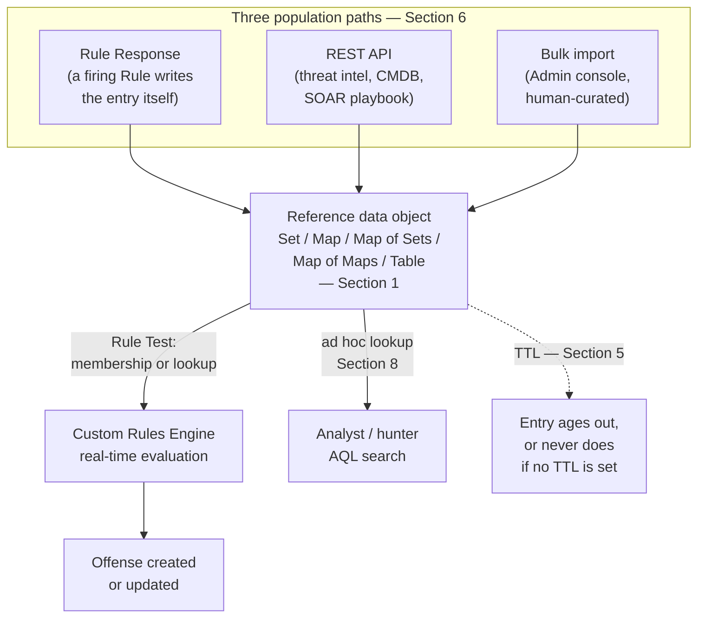

# Part 10 — Reference Data Collections: Sets, Maps, Map of Sets, Map of Maps, and Tables

## Why this part exists

**[CONCEPT]** DEH Part 27 introduced exactly one reference-data object — the Reference Set — for two purposes, in two different sections: §2.2's generic illustrative example, giving a two-stage correlation pattern (`RS-Stage1-Seen`) a place to persist state between an event's first-stage match and a second, later event's evaluation; and §3.3's worked DET-27-01 case study, giving `R: Suspicious LSASS Access — Unapproved Process` a maintained allowlist (`RS-Allowlisted-LSASS-Tools`) to check membership against. That part was explicit about scope: it needed one worked example to prove that QRadar's Reference Set is the platform's structural answer to what a KQL `join` or an SPL `transaction` expresses natively, not a full survey of the reference-data type catalog.

This part is that survey. A Reference Set is the simplest member of a five-shape taxonomy — Set, Map, Map of Sets, Map of Maps, and Table — and picking the wrong shape for a given correlation question either forces awkward workarounds (cramming a key-value relationship into a bare Set by concatenating the key and value into one string) or silently fails to answer the question at all (checking "is this IP anywhere in the set" when the real question was "is this IP associated with *this specific user's* recent history"). It also covers the maintenance dimension DEH Part 27 §2.2 flagged once and moved past: time-to-live (TTL) management, and the three distinct paths — Rule Response, the REST API, and a bulk console import — a piece of reference data can be populated through, each with its own drift risk when more than one of them touches the same object without coordination.

This part does not re-teach AQL syntax or the Custom Rules Engine's basic Rule Test/Building Block mechanics; DEH Part 27 §1 and §2.1 own that, and this book's Part 8 (Rule Wizard catalog) and Part 9 (Building Block governance) own the adjacent authoring-surface ground. What follows assumes a reader already comfortable with "a Rule Test can check whether a property is contained in a Reference Set" and wants the rest of the typed reference-data picture DEH Part 27 gestures at — "Reference Set (or its typed relatives — Reference Map, Reference Table)" — but never expands.

---

## 1. From one Reference Set to a typed taxonomy

**[CONCEPT]** Every reference-data object in QRadar solves the same architectural problem: the Custom Rules Engine (CRE) evaluates each incoming event or flow against a Rule's conditions as it streams in, with no native mechanism for holding an arbitrary multi-event join open across an unbounded time window the way a KQL `summarize` or an SPL `transaction` can inside one query. DEH Part 27 §2.2's Blind Spot already names the consequence: state that needs to survive from one event to a later, differently-shaped event has to live somewhere the CRE can write to and read from outside any single query's time bound. Reference data is that somewhere — a named, persistent collection a Rule Response can add to or remove from, and a Rule Test can check against, independent of Ariel's own retention buckets (Part 12) or any AQL search's `LAST n HOURS` clause.

A bare Reference Set answers exactly one kind of question well: "is this value present, yes or no." The moment a correlation question needs a second dimension — "is this value present *for this specific key*," "what set of values has accumulated under this key," "what value is stored two keys deep" — a Set alone forces an awkward encoding (string-concatenating a username and a source IP into one Set entry, then parsing it back apart in a Rule Test) that a properly typed collection avoids by construction. QRadar's reference-data catalog covers that range directly:

| Type | Structure | Correlation question it answers | Illustrative object |
|---|---|---|---|
| Reference Set | Unordered collection of single values | Is this value present in the set? | `RS-Allowlisted-LSASS-Tools` |
| Reference Map | One key maps to one value | What single value is associated with this key? | `RM-Asset-To-Owner` |
| Reference Map of Sets | One key maps to a set of values | What set of values has accumulated under this key? Is this specific value already in that key's set? | `RMOS-User-To-Source-IPs` |
| Reference Map of Maps | One key maps to a second key, which maps to a value | For this first key, what value is stored under this second key? | `RMOM-Host-ProcessBaseline` |
| Reference Table | Keyed row with one or more named, typed inner keys ("columns") holding a value | What multi-column record is associated with this key? | `RT-Asset-Inventory` |

> **PRODUCT VERSION NOTE**
> The five rows above name the shapes this book's correlation examples actually need, not a guaranteed one-to-one match to a specific QRadar release's Admin console labels or REST API wording. The reference-data type catalog itself (Set, Map, Map of Sets, Map of Maps, Table) is a stable architectural feature of the platform rather than something that has gained or lost a member across recent releases, but the Admin console's exact menu labels for each type have not stayed constant across versions. Check Admin > Reference Set Management (or your version's equivalent menu) for the exact wording your console uses before assuming any specific label from this table exists verbatim in your deployment.





**Figure 10.1 — Reference data as the CRE's shared, mutable state layer.** *CONCEPTUAL.* Illustrates how any of the five collection types in the table above sits between three independent population paths and two independent consumers — real-time Rule Test evaluation and ad hoc AQL lookup — with TTL as the one expiry mechanism any of them has, or lacks if never configured. Not a reproduction of any IBM architecture diagram; a structural summary of this part's own §1, §5, §6, and §8 read together. Compare Figure 27.1 in DEH Part 27 for the narrower single-Reference-Set version of the same left-hand population/right-hand consumption pattern.

The rest of this part walks the taxonomy from simplest to most structured, then covers the two dimensions every type shares regardless of shape: TTL/expiry (§5) and population path (§6).

---

## 2. Reference Set: the single-value collection, generalized beyond the allowlist

**[RULE ENGINEER]** A Reference Set is an unordered collection of single, independent values — no key, no structure beyond "is this value a member." `RS-Allowlisted-LSASS-Tools` is one instance of a broader pattern that recurs constantly once you stop thinking of a Reference Set as "the allowlist object" and start thinking of it as "the cheapest possible persistent membership test the CRE has." Common shapes beyond an allowlist:

- **A denylist fed by an external feed** — a Reference Set of known-malicious source IPs, populated by a threat-intel integration, checked by a Rule Test on every inbound connection event. This is not a hypothetical integration shape: IBM's own public `qradar-misp-ioc-importer` app does exactly this, polling a MISP threat-intelligence instance on a configurable interval and writing matching indicator types (IPs, domains, URLs) into a named QRadar Reference Set (IBM, "qradar-misp-ioc-importer," GitHub, 2023: https://github.com/IBM/qradar-misp-ioc-importer).
- **A short-lived "seen recently" marker** — `RS-Stage1-Seen` from DEH Part 27 §2.2, holding whatever a first-stage Rule's Response wrote to it until a second-stage Rule Test checks membership or the entry's TTL expires.
- **A scope-narrowing set for a broad Rule** — Part 8's Rule Wizard catalog covers this book's threshold-rule generalization of DET-27-02 (repeated authentication failure); a Reference Set of `RS-VIP-Usernames` lets a single Rule's Response branch its severity or routing without duplicating the whole Rule for one privileged-account carve-out.

### RS-Recent-Failed-MFA-Sources — a Reference Set with a maintenance lesson

**[RULE ENGINEER]** Consider a Reference Set built to catch MFA fatigue/push-bombing: a Rule's Response adds the source IP to `RS-Recent-Failed-MFA-Sources` on every failed MFA challenge, and a second Rule fires an Offense when that same source IP accumulates five failed challenges in the set within a short window, distinguishing genuine push-bombing from an isolated fat-fingered approval. The object works exactly as designed for the first several weeks. Six months later, nobody remembers this Reference Set exists, its TTL was never configured, and it has quietly accumulated every source IP that has ever failed an MFA challenge — legitimate typo-driven failures included — going back to the day it was created. §5 below covers why that specific failure mode (a Reference Set with no TTL, still doing exactly what it was built to do, just against a stale and unbounded population) is this part's Noisy Offense Trap, not a hypothetical.

---

## 3. Reference Map and Reference Map of Sets: when membership alone isn't enough

**[RULE ENGINEER]** A Reference Map associates one key with exactly one value — a lookup, not a membership test. Where a Reference Set answers "is X present," a Reference Map answers "what is the value associated with X."

### RM-Asset-To-Owner — a Reference Map anatomy

**[RULE ENGINEER]** `RM-Asset-To-Owner` maps an asset identifier (hostname or IP, depending on which key your asset model — Part 20 — uses consistently) to a single value: the email address or ticketing-queue identifier of the team responsible for that asset. A Rule Response on a fired Offense can look up the contributing asset in this Map and route a notification directly, without the Rule itself needing to encode organizational ownership as CRE logic. The map's value is exactly as current as whoever maintains it — the same staleness risk Part 20 names for the asset model generally, inherited here rather than solved by the Map's own mechanics.

A Reference Map of Sets extends this one step further: instead of one value per key, each key accumulates a *set* of values, and a Rule Test can check either "does this key have any accumulated values at all" or "is this specific value already in this key's set."

### RMOS-User-To-Source-IPs — impossible-travel via Map of Sets

**[RULE ENGINEER]** `RMOS-User-To-Source-IPs` maps each username to the set of source IPs (or, more usefully, the set of resolved network-hierarchy segments or geolocated regions) that username has authenticated from recently. A Rule Response adds each new authenticating source to the set on every successful login. A second Rule Test checks: is the source on *this* login event new to this username's accumulated set — and, if the population feeding the Map also carries a rough geolocation, is the new source geographically implausible given the most recent prior entry's timestamp. This is the shape of an impossible-travel heuristic for **T1078 (Valid Accounts)** built entirely from native reference-data mechanics, with no external UEBA integration required, though Part 19 covers where a dedicated UBA app does this more precisely once one is licensed.

A Reference Set alone cannot express this: a flat Set of "all source IPs anyone has ever logged in from" tells you nothing about *which user* a given IP belongs to. Cramming a `username|sourceip` concatenated string into a plain Set would technically work for the membership check but breaks the moment you need to enumerate everything associated with one user — exactly the operation a Map of Sets is built to do natively, and exactly the workaround §1 warned against.

> **Blind Spot**
> A Map of Sets used for impossible-travel or new-source detection is only as good as its own bootstrap period. On the day `RMOS-User-To-Source-IPs` is first deployed, every user's set is empty, so the *first* login event for every account in the environment reads as "new source" — either a flood of low-value Offenses on day one if the Rule fires unconditionally on any new-source match, or a silent false negative for weeks if the team responds by suppressing new-source matches broadly rather than giving the Map a defined backfill/warm-up period. Populate the Map from a bulk import of each account's genuinely established recent history (§6) before enabling the Rule that reads it, the same discipline DEH Part 27's Detection Test requires before trusting any new correlation object's first-week output.

---

## 4. Reference Map of Maps and Reference Table: two-key and multi-column state

**[RULE ENGINEER]** A Reference Map of Maps adds a second level of keying: an outer key maps to an inner key, which maps to a value — two lookups deep, still resolved in one Rule Test evaluation rather than a chained pair of Rules. This is the right shape whenever the correlation question is naturally "for *this* entity, what do I know about *this specific sub-thing*," and a single flat key would either collide across entities or need to be reconstructed by string-concatenating two identifiers, the same workaround §3 flagged for Map of Sets.

### RMOM-Host-ProcessBaseline — a Map of Maps anatomy

**[RULE ENGINEER]** `RMOM-Host-ProcessBaseline` maps a hostname (outer key) to a nested structure keyed by process image path (inner key), whose value is the timestamp that process was first observed executing on that host. A Rule Response on every process-creation event checks whether the inner key already exists for this host; if not, it adds the entry and, on that specific transition, fires a low-severity "new process observed on this host" Offense — a first-seen-per-host baseline, maintained natively, without exporting process telemetry to an external baselining system. The same object structure, read rather than written, lets a separate Rule Test suppress noise for genuinely routine software rollouts: a process that already has an entry under every host in a given asset group is evidently not new to that group, regardless of whether this specific host has seen it yet.

This is a heavier object than a Map of Sets in exactly the way its structure suggests — two keys deep means two lookups' worth of write-and-read cost on every evaluating event, and a host fleet numbering in the thousands with a process-diversity count in the hundreds per host is an outer-key-times-inner-key cardinality problem worth sizing before deployment, not after the Console's reference-data memory footprint becomes a Part 17 capacity conversation.

**MITRE:** a first-seen-process baseline of this kind is one practical, native-CRE approach to surfacing **T1059 (Command and Scripting Interpreter)** and living-off-the-land tooling generally — it does not name a single technique on its own, since "a process ran on this host for the first time" is a weak signal in isolation and needs the same allowlist/context discipline DEH Part 23's False Positive Trap already requires for any first-seen heuristic.

### RT-Asset-Inventory — a Reference Table anatomy

**[RULE ENGINEER]** `RT-Asset-Inventory` uses a hostname or IP (outer key, matching whichever asset identifier Part 20's asset model uses consistently) plus a fixed set of named, typed inner keys — `owner`, `criticality`, and `last_patched` — each holding its own value for that asset: the owning team's identifier, a criticality tier, and the timestamp of the asset's most recent patch cycle. A Rule Test can pull any one column for a given asset (the `criticality` column feeding an Offense's severity weighting) without needing three separate Reference Maps kept in sync by hand, and a Rule Response updating one column (a patch-management integration writing `last_patched` on every completed cycle) never touches the others. This is the structural difference from a Map of Maps: a Map of Maps' inner key space is open-ended and per-entry (process image paths differ host to host, as `RMOM-Host-ProcessBaseline` above shows), where a Reference Table's inner keys are a fixed, named column set defined once when the table is created and shared by every outer key stored in it.

### Ordered and sequence-tracking as a pattern, not a type

**[RULE ENGINEER]** Some correlation questions add a third dimension on top of "which key, which sub-key": *order*. DEH Part 27 §2.2's two-stage pattern (`RS-Stage1-Seen` gating a second Rule) already tracks a two-step sequence with nothing more than a plain Reference Set — stage 1 writes, stage 2 reads, and the ordering is implicit in "stage 2's Rule Test only fires after stage 1's Response has run." Extending that past two stages, or adding an explicit *within-order* constraint (stage 2 must follow stage 1, not merely coexist with it), does not call for a sixth object type — QRadar's reference-data catalog has no dedicated ordered- or sequence-tracking collection in any release. It is a pattern built on top of the Reference Map or Reference Table shapes already in this section: a keyed entry (`RM-KillChain-Stage-Tracker`, or `RT-KillChain-Stage-Tracker` if more than one attribute needs tracking per stage) whose value records which stage of a defined sequence has been reached and when, so a later Rule Test can check both "has this key reached stage N" and "was the interval between stages plausible" against logic you write yourself rather than a mechanism the platform provides natively.

> **PRODUCT VERSION NOTE**
> Whether your Admin console packages any convenience wizard for this kind of multi-stage tracking on top of a Reference Map or Reference Table, versus leaving the stage-number-and-timestamp bookkeeping entirely to the Rule Response and Rule Test logic you write yourself, is the kind of console-convenience detail that has varied across releases — the underlying object shape (a Map or a Table, per §1) does not. Confirm what your own Rule Wizard offers before assuming either path.

Whichever shape you build it on, the general lesson generalizes past three stages the same way DEH Part 27 §4's threshold-rule discussion generalizes past one: a native aggregation test handles "count of one event type, one key, one window" cheaply; anything with a state dimension — membership, lookup, or now order — needs some shape of reference data, and the shape should match the actual question, not the first object type that happens to be already deployed for something else.

---

## 5. TTL and expiry: the maintenance dimension every type shares

**[PLATFORM ENGINEER]** Every reference-data type above shares one property DEH Part 27 §2.2 states once and does not revisit: none of them expire an entry automatically unless a time-to-live is explicitly configured on the collection. A Reference Set, Map, Map of Sets, Map of Maps, or Table with no TTL configured behaves exactly as designed for as long as it exists — which is precisely the trap in `RS-Recent-Failed-MFA-Sources` from §2: the object never malfunctions, it simply keeps answering a question ("has this source ever failed an MFA challenge") that stopped being the question anyone meant to ask the moment "recent" quietly became "ever."

TTL posture is not one-size-fits-all across the taxonomy — it depends on what the object represents, not what shape it is:

| Object example | Typical TTL posture | Reasoning |
|---|---|---|
| `RS-Allowlisted-LSASS-Tools` | No TTL, or very long, human-reviewed | Curated by a person; auto-expiring a legitimate entry silently reopens the exact false-positive flood the allowlist exists to prevent. |
| `RS-Stage1-Seen` | Short, sliding — minutes to a few hours | State should bridge only the attacker's actual plausible multi-stage window; anything longer accumulates entries the second-stage Rule was never meant to match against, exactly the DEH Part 27 §2.2 Blind Spot. |
| `RMOS-User-To-Source-IPs` | Short, sliding, ideally per-value | An impossible-travel or new-source check is only meaningful against genuinely recent history; a set that never forgets an old source IP eventually contains so much history that nothing reads as new. |
| `RMOM-Host-ProcessBaseline` | No TTL, or very long with a scheduled re-validation | A baseline is meant to represent "has this ever been seen," not "was this seen recently" — expiring entries defeats the object's entire purpose and reintroduces the day-one bootstrap flood from §3's Blind Spot on every expiry cycle. |

> **PRODUCT VERSION NOTE**
> Whether TTL is configured per collection (a single expiry policy applying to every entry) or per entry (each value or key carrying its own expiry clock, resettable on each write), and whether a Rule Response's write to an existing entry resets that entry's TTL clock or leaves the original expiry untouched, are both configuration-surface details that have varied across QRadar releases and are exactly the "exact wording, default, or availability" category §11 requires a note for. Confirm both behaviors against your own console's Reference Set Management configuration for the specific collection before relying on either assumption — a Rule Response that you expect to keep refreshing an entry's recency, but which only extends the TTL clock on true insert rather than on every touch, produces the same "silently stale after all" failure mode as having no TTL at all, just delayed.

> **Noisy Offense Trap**
> `RS-Recent-Failed-MFA-Sources` from §2, six months in with no TTL ever configured: every source IP that has ever failed an MFA challenge — a legitimate typo, a cached-credential retry, a genuine push-bombing attempt from eighteen months ago — is still a member. The Rule reading it still fires exactly as designed on "five accumulated failures within the set," except the set's population has drifted from "recent failure sources" to "every failure source in this object's entire lifetime," which inflates the false-positive rate on any account with a long history of occasional typos without anyone changing a single Rule Test. The fix is not to raise the failure-count threshold — that just makes a real push-bombing attempt harder to catch too, the identical mistake DEH Part 27 §4's own Noisy Offense equivalent warns against for a threshold rule. The fix is to add a TTL to the Reference Set that matches the actual correlation window the Rule was designed around, backfill-test it against a known-positive push-bombing simulation (Part 14's Validation Test discipline), and audit every reference-data object without a TTL the same way Part 15's tuning-intake process audits a flooding Rule — because an unmanaged reference-data object is a tuning problem that has nothing to do with the Rule that reads it.

---

## 6. Populating reference data: three paths, and the drift risk of running more than one

**[PLATFORM ENGINEER]** A reference-data object gets values into it through exactly three mechanisms, and a team that uses more than one against the same object without coordinating them is the single most common way reference data silently drifts from what the Rules reading it assume it contains.

| Path | Typical use | Coupling to a Rule | Drift risk |
|---|---|---|---|
| Rule Response | Self-populating state — the Stage1/Stage2 pattern, a running baseline, an auto-added denylist entry | Tight — the object's contents only change because a Rule fired | If the populating Rule stops matching (a DSM mapping breaks per Part 4, a Building Block gets edited and quietly stops matching), the object silently stops updating with no error anywhere — indistinguishable from "nothing to add" the same way a missing custom property is indistinguishable from "no matches" in DEH Part 27 §3.1. |
| REST API | External feed — threat intel, a CMDB export, a SOAR playbook, a scheduled script | Loose — no Rule is aware the API call happened | A scripted job that does a full replace of an object's contents (delete-and-reload) rather than a merge silently erases any entry a Rule Response or a manual console edit added since the last scheduled run, with no audit trail pointing at the API call as the cause. |
| Bulk import (Admin console) | Human-curated allowlist seed, a one-time backfill, an analyst's tuning-ticket addition | None | The moment it's imported, it's already as stale as the source list it was copied from — nobody re-validates a bulk-imported allowlist against current reality unless a process explicitly requires it (Part 16's rule-change-management discipline is the compensating control here). |

```bash
# Illustrative only — a REST API call adding one value to an existing Reference Set.
# CONCEPTUAL EXAMPLE: the exact endpoint path, authentication header name, and request
# shape below are illustrative of the kind of call this population path uses, not a
# verified transcript of a specific QRadar REST API version. Confirm the current
# Reference Data endpoint path and required headers against your own deployment's
# REST API documentation (usually browsable from the Console itself) before reusing
# this verbatim.
curl -X POST "https://qradar.example.internal/api/reference_data/sets/RS-Allowlisted-LSASS-Tools" \
  -H "SEC: <api-token>" \
  -H "Content-Type: application/json" \
  -d '{"value": "C:\\Program Files\\Vendor\\scanner.exe"}'
```

> **PRODUCT VERSION NOTE**
> The Reference Data REST API's exact endpoint paths, whether a POST appends a value versus a PUT replacing the entire collection, and the specific authentication header/token mechanism, have all been the kind of implementation detail that shifts across QRadar releases without changing the underlying concept. Treat the `curl` example above as illustrating the *shape* of this population path — an authenticated call that mutates a named collection — and verify the literal request against your own version's REST API reference before building a scheduled job against it.

The drift risk table's middle row is worth naming as a concrete failure, not an abstraction: a threat-intel team pushes a nightly REST API job that reloads `RS-Allowlisted-LSASS-Tools` from a CMDB export of approved EDR agent paths, using a full-replace call because that was the simpler script to write. An analyst, acting on a same-day tuning ticket, manually adds a newly-approved diagnostic tool's path through the Admin console that afternoon. That night's scheduled reload silently deletes the addition — the script only knows the CMDB export it was handed, not what changed since the last run. The Rule fires again on the diagnostic tool the next morning, the analyst re-adds it, and the cycle repeats until someone fixes the reload script to merge rather than replace, or moves ownership of that allowlist to one path exclusively. Neither population path was misconfigured on its own; the drift is entirely a consequence of two uncoordinated paths writing to the same object.

---

## 7. Choosing the right type: a decision guide

**[RULE ENGINEER]** The taxonomy in §1 is easiest to apply correctly by starting from the question a Rule Test actually needs answered, not from whichever object type is already familiar:

- **"Is this value present at all?"** — Reference Set. No key, no lookup, cheapest option; do not reach for a Map when a Set answers the question.
- **"What single fact is associated with this key?"** — Reference Map. One key, one value, a lookup rather than a membership check.
- **"What has accumulated under this key, and is this new value already part of it?"** — Reference Map of Sets. Any "per-entity recent history" question — source IPs per user, destination ports per host, escalation targets per team — belongs here rather than encoded into a flat Set's concatenated strings.
- **"For this entity, what do I know about this specific sub-thing?"** — Reference Map of Maps. Two genuinely independent keys (host and process, asset and vulnerability ID, tenant and rule) that would otherwise need string concatenation to fit a flatter type.
- **"What multi-column record is associated with this key?"** — Reference Table. A per-entity record with more than one fixed, named attribute (an asset's owner, criticality, and last-patched date) belongs here rather than several parallel Reference Maps that have to be kept in sync by key.
- **"Have these stages happened, in this order, within a plausible interval?"** — not a distinct object type at all; build it as a pattern on top of whichever of the two prior answers fits (Reference Map for one tracked attribute per stage, Reference Table for more than one) per §4.

A Rule Engineer who defaults to the Reference Set for every new correlation need — because it was the first type learned, and DEH Part 27 §2.2 only demonstrated that one — eventually produces exactly the string-concatenation workarounds §3 and §4 both warn against: technically functional, materially harder for the next reviewer to read, and a worse fit for Part 9's Building Block governance discipline than an object whose type already documents what question it answers.

---

## 8. Validating and hunting against reference data state

**[THREAT HUNTER]** A Rule that silently stops matching because the reference data it depends on has drifted — an allowlist missing a recently-approved tool, a Map of Sets whose bootstrap period was skipped, a Rule Response that stopped firing after a DSM mapping broke — produces no error anywhere in the CRE. The only way to catch that drift before an Offense flood (or an Offense silence) forces the issue is to periodically check a reference-data object's actual current contents against what the Rules reading it assume is there, the same discipline DEH Part 27 §3.1's Engineering Reality box requires for a DSM/QID mapping.

```sql
-- QRadar AQL — this checks whether a specific value is currently a member of a named
-- Reference Set from an ad hoc search, which is a different operation from a Rule
-- Test's own membership check inside the CRE: this runs against Ariel search
-- infrastructure on demand, not the real-time evaluation path. The exact function
-- name and argument order for reference-data lookups from AQL have not been
-- confirmed against a specific QRadar release for this book — verify the current
-- function signature in your own AQL function reference before reusing this
-- pattern, per the PRODUCT VERSION NOTE immediately below.
SELECT sourceip, username, "Source Process Name"
FROM events
WHERE QIDNAME(qid) = 'Process accessed'
  AND "Target Process Name" ILIKE '%lsass.exe%'
LAST 7 DAYS
```

> **PRODUCT VERSION NOTE**
> AQL exposes some mechanism for checking reference-data membership or looking up a value from an ad hoc search — the general capability is a reasonable, stable assumption given that a Rule Test can already do the equivalent check inside the CRE. The exact function name, its argument order, and whether it can address a Map's inner key or only a Set's flat membership, are details this book has not independently verified against a specific QRadar release and will not assert as fact. Check your own console's AQL function reference (typically browsable from the Log Activity > Advanced Search interface) before writing a hunt or a saved search that depends on a specific reference-data function signature.

The more reliable validation path, and the one that needs no unverified AQL function at all, is direct: open the Reference Set Management (or equivalent) view for the object in question and review its actual current membership against what you expect — exactly the DEH Part 27 §3.1 discipline of confirming a mapping is populated *and* usable, not just assumed correct because the Rule has been deployed a long time without complaint.

> **Hunter's Note**
> Before concluding that a quiet Rule means "nothing to catch," pull the reference-data object it depends on and check its last-modified timestamp and current size, not just whether the Rule itself looks enabled. A `BB:LSASS-Access-Candidate`-style Building Block paired with a Rule Test against `RS-Allowlisted-LSASS-Tools` that has silently grown from twelve entries to four hundred over two years of unreviewed additions — every tuning ticket's fix, never once revisited — is functioning exactly as configured and is also functionally closer to "the Rule is disabled" than anyone treating it as a live control realizes. A Rule's silence and a Reference Set's drift are two separate things to check, and checking only the Rule misses the second one entirely.

---

## 9. Governance: the review burden of five object types instead of one

**[SOC MANAGEMENT]** DEH Part 27's own closing paragraph named the three-object review burden a QRadar detection carries relative to a single Sigma file or native query — a Building Block, a Reference Set, and a Rule, each separately versioned and permissioned. This part's taxonomy adds a dimension to that burden rather than replacing it: "reviewing the reference data" is no longer one predictable object shape. A reviewer now has to check a Reference Set's membership list, a Reference Map's key coverage, a Map of Sets' per-key cardinality growth, a Map of Maps' two-level consistency, and a Reference Table's per-column consistency across its outer keys — each with its own TTL posture and population path per §5 and §6 — and none of that collapses into the single "check the query" pass a native SPL or KQL detection's usually-stateless logic allows.

> **SOC Management View**
> A team with forty Rules but two hundred reference-data objects behind them — some Sets, some Maps, several Maps of Sets from an impossible-travel program, a handful of baseline Maps of Maps nobody has re-validated since the host fleet's last refresh — has a materially larger review surface than the Rule count alone suggests. "We reviewed forty rules this quarter," reported without naming how many reference-data objects back them, is the same coverage-count confusion DEH Part 1 and Part 23 §5 warn against, restated here for the object layer Part 9 and Part 15 both depend on staying honest.

---

**Cross-references:** DEH Part 27 §2.2 (Reference Set introduction and the `RS-Stage1-Seen` worked example this part generalizes from) and §3.3 (the `RS-Allowlisted-LSASS-Tools` worked example this part also generalizes from), together with §2.3's Blind Spot (unmanaged Reference Set drift, extended here into the TTL discussion in §5); DEH Part 23 §5 (Sigma-vs-native authoring tradeoff, inherited rather than re-argued) and DEH Part 27's closing SOC MANAGEMENT paragraph (the three-object review burden this part's §9 extends to the reference-data layer specifically). Within this book: Part 4 (DSM/QID mapping — the silent-failure pattern §6 and §8 both borrow); Part 8 (Rule Wizard catalog and Response actions, the mechanism that populates reference data from inside a Rule); Part 9 (Building Block governance — the sibling object-sprawl problem this part's §9 runs alongside); Part 12 (Ariel search performance, distinct from reference-data lookup cost); Part 14 (analyst triage) and Part 15 (Noisy-Offense tuning workflow, the compensating process for §5's TTL failures); Part 16 (rule change management, the compensating control for §6's bulk-import staleness); Part 17 (licensing/capacity, for reference-data memory footprint at scale); Part 19 (App Framework/UBA apps, the licensed alternative to the hand-built impossible-travel pattern in §3); Part 20 (asset model, the other major consumer of Map-of-Maps-style lookups).
