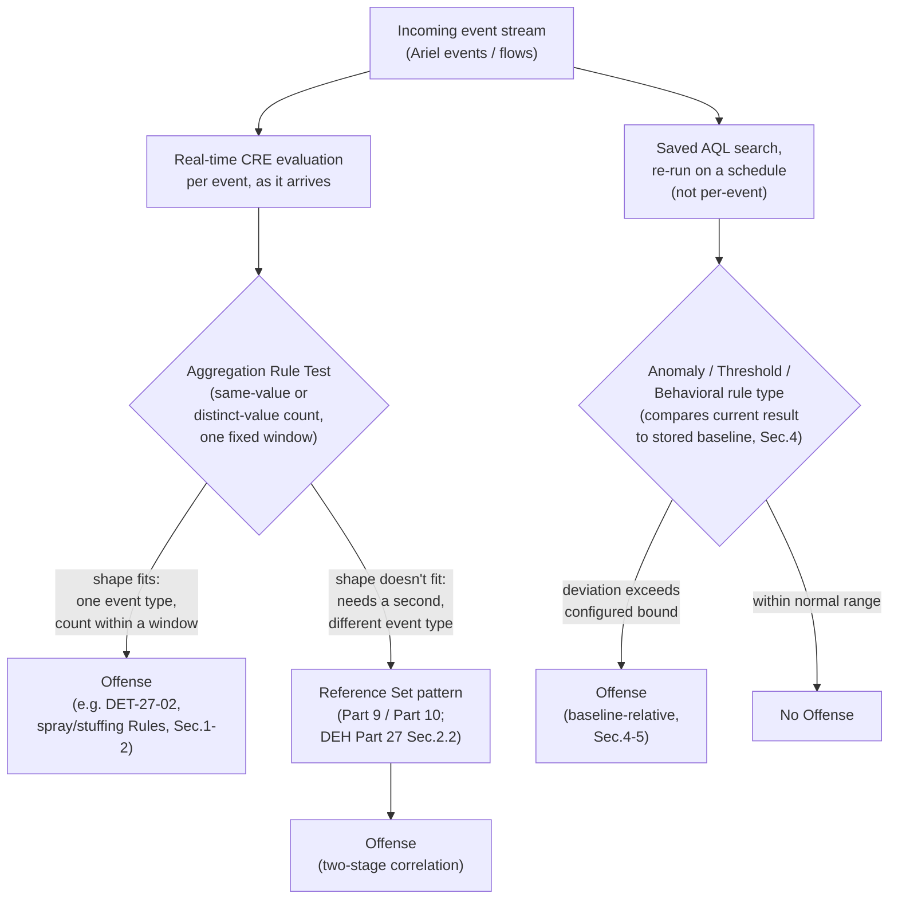

# Part 11 — Thresholds, Anomaly and Behavioral Rules, and the Limits of Native Aggregation

## Why this part exists

**[CONCEPT]** DEH Part 27 left two threads dangling on purpose. Its §2.3 Blind Spot named, in the abstract, exactly what the Custom Rules Engine (CRE) cannot do: "an arbitrary multi-event join running continuously the way a KQL/SPL scheduled query does." Its §4 then built exactly one worked example of the CRE's own answer to *some* multi-event problems — DET-27-02, a single Rule using QRadar's built-in aggregation Rule Test to catch three failed authentications against one account from one source within five minutes — and closed by naming two gaps that one Rule's grouping key leaves wide open: password spraying and distributed credential stuffing. Part 27 stopped there, by design; a query-language comparison chapter had one worked example's worth of room, not a survey of every native correlation shape QRadar's Rule Wizard actually supports.

This part picks up both threads. First, it generalizes DET-27-02's single grouping-key threshold into the fuller parameter space the Rule Wizard's aggregation Rule Test actually offers — including the distinct-value-count variant that closes the spraying and stuffing gaps DEH Part 27 §4 named without building. Second, it introduces the saved-search-baseline mechanisms — Anomaly, Threshold, and Behavioral rule types — that operate on an entirely different evaluation model from the per-event streaming Rule Test, and that exist specifically to catch drift-from-normal patterns no fixed count-in-a-window test can express. Third, and this is the part's actual job per DEH Part 27 §2.3, it draws the boundary precisely: exactly which correlation shapes these three native mechanisms cover between them, and which shapes still force the Building Block/Reference Set/Rule decomposition pattern this book's Part 9 and Part 10 cover in depth. This part does not re-teach AQL syntax (DEH Part 27 §1) or re-argue Sigma-first-vs-native authoring (DEH Part 23 §5); it assumes both and builds the native-aggregation half of the CRE's correlation toolkit that DEH Part 27 had no room to finish.

---

## 1. The aggregation Rule Test, generalized

**[RULE ENGINEER]** DEH Part 27 §4's DET-27-02 used one shape of QRadar's built-in aggregation Rule Test: `when at least X events are seen with the same property in Y minutes`, grouped on the pair (`sourceip`, `username`), threshold 3, window 5 minutes. That single worked example undersells the test's actual parameter space, which is what this section fills in before §2 uses it to close DET-27-02's own named gaps.

Three independent knobs make up this Rule Test, whatever its exact on-screen wording in your deployment:

- **Grouping key.** One property (`sourceip` alone) or a composite of several (`sourceip` and `username` together, as DET-27-02 used). More properties in the key means a narrower, more specific match — and a correspondingly easier evasion by an attacker who varies just one of them.
- **Threshold and window.** A count (`at least X`) and a time span (`in Y minutes`) evaluated on a rolling basis as events stream in — this is real-time, per-event CRE evaluation, the same evaluation model DEH Part 27 §2 describes for any Rule, not a periodic batch job.
- **Same-value count vs. distinct-value count.** The variant DET-27-02 used counts *occurrences* of the same grouping-key combination. A second variant — matching against **distinct** values of a named property within the window, rather than raw occurrence count — asks a structurally different question: not "did this pair repeat enough times" but "did this one key see enough *different* values of some other property." That second variant is the piece DEH Part 27 §4 needed and didn't have room to build.

> **PRODUCT VERSION NOTE**
> The Rule Wizard exposes both variants — same-value repetition count and distinct-value count — as separate aggregation Rule Test entries, and both have existed across recent QRadar release lines. The exact on-screen wording of the distinct-count variant (something to the effect of `when at least X events are seen with at least Y different values of property in Z minutes`) has shifted in phrasing and Rule Wizard grouping before, the same drift risk DEH Part 27 §2.1 already flags for the Rule Test catalog generally. Confirm the current wording and exactly which properties are eligible as the "different values" target in your own deployment's Rule Wizard before treating this section's phrasing as a literal transcript.

Table 11.1 lays out the shape space this generalization actually covers, stated against the specific gap each shape closes rather than as an abstract feature list — including, in its first row, a bare QID (QRadar's internal event-taxonomy identifier; DEH Part 27 §1.2) matched with no grouping composite at all.

**Table 11.1 — Aggregation Rule Test shapes and what each one catches.**

| Correlation shape | Rule Test variant | Grouping key | Example catch | Version sensitivity |
|---|---|---|---|---|
| Repeated hit, same actor | Same-value count | Single property (`sourceip`) | One host repeatedly triggering a scan-detection QID | Stable concept; wording flagged above |
| Repeated hit, same actor pair | Same-value count | Composite (`sourceip` + `username`) | DET-27-02: 3+ failed auths, one account, one source, 5 minutes | Stable concept; wording flagged above |
| One actor touching many targets | Distinct-value count | `sourceip`, distinct `username` | Password spraying (§2) | Wording flagged above |
| One target touched by many actors | Distinct-value count | `username`, distinct `sourceip` | Credential stuffing (§2) | Wording flagged above |
| Sustained deviation from a historical norm | Not covered by this Rule Test at all | — | "This user logs in from twice as many countries this week as their 90-day average" | See §4 — a different mechanism entirely |

The bottom row is the pivot point for the rest of this part: every shape above it is a bounded, fixed-window, single-pass count evaluated as events arrive — cheap for the CRE to maintain in memory and genuinely real-time. The bottom row needs a rolling historical baseline, and no fixed-window streaming count expresses "compared to normal for this entity" no matter how the grouping key is composed. §3 draws that line formally; §4 covers the mechanism QRadar actually offers for it.

---

## 2. Closing DET-27-02's two named gaps

**[RULE ENGINEER]** DEH Part 27 §4's own Blind Spot named the failure mode precisely: DET-27-02's single Rule, keyed on (`sourceip`, `username`) same-value count, "never accumulates enough failures against any single (source, account) pair to fire" against either password spraying (many accounts, one source, one or two attempts each) or distributed credential stuffing (many sources, one account, one or two attempts each) — and warned that lowering the threshold or widening the window on that *same* Rule makes it noisier without closing the gap, because the grouping key itself is the wrong shape for either pattern.

The distinct-count variant from §1 closes both gaps as two separate Rules, not as a modification to DET-27-02's existing one — each reusing the same `BB:Auth-Failure-Candidate` Building Block DET-27-02's own failed-authentication matching logic already established, per this book's Part 9 governance pattern for sharing match conditions across Rules:

1. **`R: Password Spray Candidate — Distinct Accounts`** — Rule Test: at least 10 events matching `BB:Auth-Failure-Candidate`, same `sourceip`, with at least 5 distinct values of `username`, in 10 minutes. Catches one source hitting many accounts with low per-account attempt counts — **MITRE:** T1110.003 (Brute Force: Password Spraying).
2. **`R: Credential Stuffing Candidate — Distinct Sources`** — Rule Test: at least 10 events matching `BB:Auth-Failure-Candidate`, same `username`, with at least 5 distinct values of `sourceip`, in 10 minutes. Catches many sources hitting one account — **MITRE:** T1110.004 (Brute Force: Credential Stuffing).

Both Rules are still native aggregation — no Reference Set, no second Rule reading state a first Rule wrote. That distinction matters enough to state directly: distinct-value counting looks like it needs to "remember" every username or source IP seen for a given key, and in a sense the CRE does exactly that internally for the duration of the window — but that bookkeeping lives entirely inside one Rule Test's own evaluation, scoped to one window, discarded once the window rolls off. It is not the same mechanism as DEH Part 27 §2.2's Reference Set pattern, where one Rule's Response deliberately writes state a *different* Rule reads back with no shared window at all. Confusing the two is a real risk: an engineer who reads "this needs to count distinct values across events" and reaches for a Reference Set to do it has built a slower, more failure-prone version of a test the Rule Wizard already offers natively.

> **Validation Test**
> **Setup:** `BB:Auth-Failure-Candidate` deployed and confirmed matching real failed-authentication events (same DSM/QID verification discipline DEH Part 27 §3.1 requires before trusting any Building Block); `R: Password Spray Candidate — Distinct Accounts` deployed with the distinct-count Rule Test from above.
> **Action:** From one test source IP, generate failed authentication attempts against 6 distinct test accounts, one or two attempts each, within a 10-minute window.
> **Expected result:** No single (source, account) pair crosses DET-27-02's own same-value threshold — confirming DET-27-02 correctly stays silent on this pattern, as DEH Part 27 §4 predicted it would — while `R: Password Spray Candidate — Distinct Accounts` fires once the sixth distinct account crosses the 5-distinct-value threshold, visible as a new Offense indexed on the source IP.

This closes DEH Part 27 §4's specific Blind Spot as stated, but it does not close every gap a real spraying or stuffing campaign can present — the next section names why on purpose, rather than letting two working Rules read as "solved."

---

## 3. Where native aggregation still hits a wall

**[CONCEPT]** Every shape in Table 11.1's top four rows shares three properties: one event type (or one Building Block's worth of matching conditions), one fixed evaluation window chosen at authoring time, and a count — same-value or distinct-value — as the only statistic computed. That combination is deliberately narrow, and naming the boundary precisely is this section's job, because DEH Part 27 §2.3's Blind Spot deserves a real answer, not just a restatement.

Three correlation shapes fall outside every variant of the aggregation Rule Test, regardless of how the grouping key is composed:

- **Multi-event-type sequential correlation.** Stage-one event (a distinct QID, a distinct schema) followed by a *different* stage-two event, where the link between them is identity or asset, not a shared count within one window. This is exactly DEH Part 27 §2.2's Reference Set pattern — a first Rule's Response writes to a Reference Set, a second Rule's Rule Test checks membership — covered in full in this book's Part 9 (Building Block governance) and Part 10 (the reference-data type taxonomy). No aggregation Rule Test, however parameterized, expresses "this event, followed later by a structurally different event."
- **Long-horizon historical baselines.** "More than twice this user's 90-day daily average" is not a fixed count in a fixed window — it needs a stored statistical baseline computed over a horizon far longer than any aggregation Rule Test's window is practically evaluated at, and a live comparison against that baseline rather than a literal threshold. This is Anomaly/Behavioral territory, covered in §4.
- **Peer-group or population-relative deviation.** "This asset's flow volume relative to other assets in its same asset group" needs a population statistic, not a per-entity count — also Anomaly/Behavioral territory, and the sharper of the two once §4 gets into it.

> **Blind Spot**
> Table 11.1 and this section together are the answer DEH Part 27 §2.3 deferred: the CRE's native aggregation Rule Test covers exactly "count or distinct-count of one matched-condition's occurrences, grouped by up to a few properties, within one bounded window" — full stop. It does not matter how creative the grouping key gets; a shape that needs a second, structurally different event type, or a comparison against a rolling historical baseline rather than a fixed number, is outside this mechanism's reach by construction, not by an implementation gap IBM might close with a wider Rule Wizard menu. An engineer who spends a week trying to force a multi-stage, cross-event-type pattern into one aggregation Rule Test by widening the grouping key is fighting the architecture, not tuning it — the Reference Set decomposition (Part 9/10) or the saved-search baseline (§4) is the actual tool for that job, and recognizing which of the two applies *before* authoring anything is the design decision this whole part exists to support.





**Figure 11.1 — Three native correlation paths from one event stream, and where each one's reach ends.** *CONCEPTUAL.* Illustrates the two structurally different evaluation models this part covers — real-time per-event aggregation on the left branch, periodic saved-search-baseline comparison on the right branch — converging on the Reference Set decomposition path only when neither native mechanism's shape fits. Not a reproduction of any IBM architecture diagram; this book's own structural sketch of the boundary §3 and §4 argue from prose. Compare DEH Part 27's Figure 27.2 for the KQL/SPL-vs-QRadar deployment-unit contrast this diagram's middle branch extends.

---

## 4. Anomaly, Threshold, and Behavioral rule types: saved-search baselines, not streaming events

**[PLATFORM ENGINEER]** Everything in §1–§3 evaluates inline, per event, as the CRE processes the live stream — the same real-time model DEH Part 27 §2 describes for any ordinary Event, Flow, or Common Rule. QRadar's Rule Wizard also exposes a second family — commonly presented as **Anomaly**, **Threshold**, and **Behavioral** rule types, distinct from the Event/Flow/Common rule types Part 8 covers in full — built on an entirely different evaluation model: each references a **saved search** (an AQL search against `events` or `flows`, saved rather than run ad hoc) and re-runs that search on a recurring interval, then evaluates the search's *result set* — not the raw incoming events — against a Rule Test comparing the current result to a stored baseline or a configured bound.

The distinction that matters operationally: an ordinary aggregation Rule Test (§1) sees every event the instant the CRE processes it, and its "window" is a rolling span computed continuously. A saved-search-based rule sees only what its underlying search returns *when it happens to run* — detection latency for this family is bounded by the search's re-run interval, not by CRE stream processing, and a search scheduled to re-run every 15 minutes cannot detect a pattern faster than 15 minutes after it starts, no matter how tight the Rule Test's own comparison logic is.

Within that family, the three named rule types differ in what they compare the saved search's result to, in spirit:

- **Threshold** rule types compare the saved search's result against a fixed or configured bound — conceptually adjacent to §1's aggregation Rule Test, but evaluated on the search's own schedule against a broader or more complex result set than a single Rule Test condition can express inline (a multi-column `GROUP BY` result, for instance).
- **Anomaly** rule types compare the current result against a stored historical baseline computed from the same saved search's own past runs — the "twice this user's 90-day average" shape §3 named as outside the aggregation Rule Test's reach.
- **Behavioral** rule types compare an entity's current pattern against either its own recent history or a peer-group pattern — the population-relative shape §3 also named, and the one most sensitive to what "normal" was computed from in the first place (§5).

> **PRODUCT VERSION NOTE**
> The existence of Anomaly, Threshold, and Behavioral as named rule types built on saved-search comparison is treated in this part as a stable architectural fact, consistent with this book's Part 8 scope. The exact baseline-computation mechanics available in a given release — how many days of history feed a baseline, which statistical measure (average, standard deviation, a configured percentage change) the comparison uses, and how much of that is user-configurable versus fixed — is not something this book states as certain fact, because IBM's own current documentation was not reliably available at the time this book was outlined. Verify the current baseline-configuration options in your own deployment's Rule Wizard before designing a specific Anomaly or Behavioral rule around an assumed statistical method.

> **Platform Reality**
> A saved search feeding an Anomaly or Behavioral rule type is still an Ariel search, competing for the same search-resource pool DEH Part 27 §1.3 already flags for any AQL query and this book's Part 12 covers in depth — it is not a lightweight background process just because it's wrapped in a rule type rather than run from Log Activity. A saved search scoped too broadly (an unbounded `GROUP BY` over a busy environment's full event volume) and scheduled to re-run every few minutes competes directly with every analyst's own ad hoc search for the same shared resources, and a deployment with several such rules can turn "detect drift from normal" into "starve the search tier" without a single Offense ever explaining why. Scope the underlying saved search as narrowly as the detection goal allows, and treat its re-run interval as a genuine capacity-planning input, not a free dial to tighten for lower detection latency.

---

## 5. Baseline drift and the false-positive cost of an unmaintained "normal"

**[ANALYST]** Every mechanism in §1–§2 has no concept of "normal" at all — a count either crosses a fixed threshold or it doesn't, and the threshold is exactly what an engineer typed into the Rule Wizard. Anomaly and Behavioral rule types are different in a way that changes what tuning even means for them: the comparison point is a *computed* baseline, derived from historical data the rule itself (or its underlying saved search) accumulated, not a number anyone chose directly. That has a direct and under-discussed consequence for false-positive management.

A baseline computed from an organization's own recent history encodes whatever was already true during the window it learned from — including activity nobody would call "normal" in any meaningful sense if asked directly. A department that ran an unusual, temporary data-migration project for three weeks bakes that volume into a 90-day rolling baseline; once the project ends, the department's genuinely normal traffic can read as an *anomalous drop*, and the reverse is equally real — a baseline learned during an unusually quiet stretch flags the first ordinary busy week as a deviation. Neither failure is a bug in the Rule Test's comparison logic; both are the baseline itself having drifted out of sync with what "normal" should mean by the time the rule evaluates against it, the same staleness risk this book's Part 10 already names for an unmaintained Reference Set and Part 20 names for an unrevalidated asset model.

> **Noisy Offense Trap**
> A Behavioral rule flooding the queue during a specific recurring period — month-end reporting, a quarterly close, a seasonal traffic pattern — is rarely a sign the underlying detection logic is wrong; it is usually a sign the baseline window is too short to have ever seen that recurring pattern as "normal," or too long to have adapted after the organization's actual behavior changed. The fix is not to raise the deviation threshold until the noise stops, which — the same discipline DEH Part 27 §4's own False Positive Trap already states for a different mechanism — also raises the bar for a real deviation the rule exists to catch. The fix is to name a baseline maintenance owner (the same role this book's Part 10 requires for Reference Set TTL policy) who reviews the baseline window length and re-validates it against a known-normal recent period on a fixed schedule, not just when an analyst complains.

---

## 6. Validating a candidate baseline before deploying it

**[THREAT HUNTER]** DEH Part 27 §5's hunting pattern — loosen a deployed detection's fixed condition in an ad hoc AQL search and see what falls out, without touching production correlation logic — applies just as directly to a *candidate* baseline as it does to a deployed Building Block's value list. Before wiring a saved search into an Anomaly or Behavioral rule type at all, run the same search's underlying logic as a plain AQL query over the exact historical horizon the baseline would learn from, and look at the actual distribution rather than trusting that "90 days of history" produces a sane average by default.

```sql
-- QRadar AQL, not standard SQL — same disambiguation DEH Part 27 Sec.1.1 states on first
-- appearance: SELECT/FROM/WHERE reads like standard SQL, but LAST n DAYS is AQL-specific
-- shorthand with no ANSI SQL equivalent, and there is no general-purpose JOIN available.
-- CONCEPTUAL SAMPLE — hunting query validating a candidate Behavioral-rule baseline before
-- deployment, not a standing detection. As in DEH Part 27's own AQL examples, the exact
-- property names and QID display strings are illustrative — confirm both against your own
-- Log Activity > Advanced Search field list first. GROUP BY DATEFORMAT(...) here approximates
-- a per-day bucket for eyeballing the distribution; AQL's own date-bucketing syntax and
-- function names are covered in full by DEH Part 27 Sec.1, not re-taught here.
SELECT DATEFORMAT(starttime, 'yyyy-MM-dd') AS "Day", username, COUNT(*) AS "Events"
FROM events
WHERE username = 'test-svc-account'
GROUP BY "Day", username
LAST 90 DAYS
```

**Approach:** Run this per candidate entity (a specific service account, a specific asset group) before the baseline goes live, and look explicitly for the failure modes §5 named — a sustained anomalous stretch that would skew a 90-day average, a period of near-zero activity that would make ordinary activity read as a spike once the baseline resets, or a level shift partway through the window (a role change, a migration, a decommission date) that makes "the last 90 days" internally inconsistent as a single baseline.

**Finding (illustrative — treat as a template, not a captured result):** A hunt run this way either confirms the candidate window is reasonably stable — worth documenting as a deliberate validation step, not silence about having checked — or surfaces a specific anomalous stretch that becomes an explicit exclusion window when the baseline is configured, the same targeted fix DEH Part 27 §5's own worked hunt produces for a Building Block's value list rather than a blanket threshold change.

> **Hunter's Note**
> Plot the distribution, don't just compute the average before you look at it. A 90-day average of 40 events/day can hide a distribution that was actually 10/day for 60 days and 130/day for a 30-day migration project — the mean lands on a number that never actually occurred on any single day, and a Behavioral rule comparing live data against that mean will misfire in both directions once the migration project's traffic pattern is no longer current. A day-by-day `GROUP BY` like the one above costs one extra query and catches this before it becomes a production noise incident instead of after.

---

## 7. The review-cost consequence, and what would change this boundary

**[SOC MANAGEMENT]** DEH Part 27's own closing paragraph named a staffing consequence specific to QRadar's multi-object model: reviewing "one detection" here means reviewing a Building Block, a Reference Set's maintenance, and a Rule's chained logic as three separately-changeable artifacts. This part's mechanisms add a fourth review surface with its own distinct maintenance discipline: a saved-search-based Anomaly or Behavioral rule's *baseline*, which §5 already established drifts on its own schedule independent of anyone editing the rule itself. Budgeting review time for "we run N Anomaly/Behavioral rules" without separately budgeting a recurring baseline-revalidation task is the same undercount risk DEH Part 27 §5's SOC Management paragraph warns against for coverage-count reporting generally — a rule that hasn't been touched in a year reads as stable, and a baseline that hasn't been revalidated in a year reads exactly the same way right up until it starts either flooding the queue or going silent.

**Table 11.2 — Native correlation mechanisms, their review burden, and where the boundary sits.**

| Mechanism | Evaluation model | Objects to review | What goes stale | Version sensitivity |
|---|---|---|---|---|
| Aggregation Rule Test (§1–§2) | Real-time, per event | One Rule (plus any shared `BB:`) | Threshold/window relative to actual traffic growth | Wording of distinct-count variant |
| Reference Set decomposition (Part 9/10) | Real-time, two-stage | `BB:`, `RS-`, `R:` — three objects | Reference Set membership (Part 10) | Low — architecture is stable |
| Anomaly / Threshold / Behavioral (§4–§5) | Periodic, saved-search re-run | Saved search, rule type config, **and the baseline itself** | The baseline's learned "normal" (§5) | Baseline-mechanics detail, rule-type wording |

> **What Would Change My Mind**
> This part draws its central boundary — aggregation Rule Tests cover single-event-type counting within a fixed window; anything needing a second event type or a rolling historical comparison needs either the Reference Set pattern or a saved-search-based rule type — from the CRE's architecture as DEH Part 27 §2.3 described it and as this part's own worked examples confirm. If a future QRadar release lets an ordinary aggregation Rule Test reference a saved search directly as its own grouping input, or extends the distinct-count variant to span more than one event type in one condition — either of which DEH Part 27 §2.3 already flagged as a version-dependent capability worth checking rather than assuming — the sharp three-way split this part draws would soften, and the guidance to reach for Part 9/10's decomposition "by construction, not by an implementation gap" (§3's Blind Spot) would need to be re-evaluated against whatever the new capability actually covers. Recheck this boundary against your own deployment's current Rule Wizard before treating it as permanent architecture rather than this book's best current read of it.

---

**Cross-references:** DEH Part 23 §5 (Sigma-first-vs-native authoring tradeoff, not re-argued here); DEH Part 27 §1.3 (Ariel search-resource cost, extended in §4's Platform Reality), §2.1–§2.3 (Rule Test/Building Block catalog and the CRE Blind Spot this part resolves), §4 (DET-27-02 and its named spray/stuffing gap, closed in §2), §5 (the AQL hunting pattern extended in §6). This book's Part 8 (full Rule Wizard rule-type catalog), Part 9 (Building Block governance and the shared `BB:` pattern used in §2), Part 10 (Reference Set/Map/Table taxonomy and TTL discipline referenced in §3 and §5), Part 12 (Ariel search performance, referenced in §4's Platform Reality), Part 15 (noisy-offense tuning workflow, referenced in §5's Noisy Offense Trap), Part 20 (asset-model staleness, the same drift pattern named for baselines in §5), Part 22 (staffing/review-cost model extended in §7).
