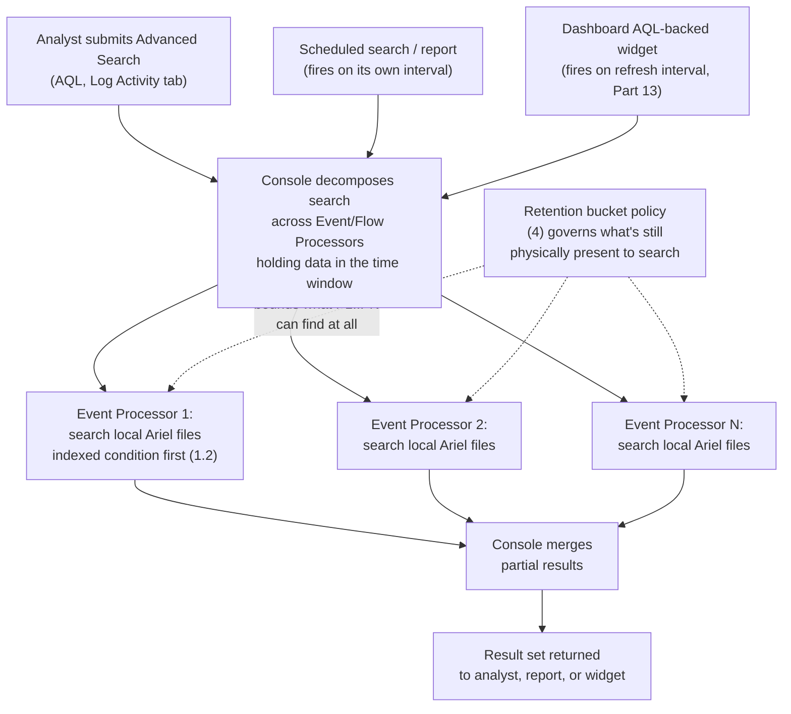

# Part 12 — Ariel Search Performance and Tuning

## Why this part exists

**[CONCEPT]** DEH Part 27 §1.3 raises Ariel search cost as a single paragraph inside a section about AQL time windows: an unbounded search against a busy Ariel database "will run long enough to time out or exhaust search resources shared with every other analyst's concurrent search," backed by an Engineering Reality callout about QRadar's EPS/FPM licensing model. That paragraph was doing one job for DEH — flagging that AQL's authoring convenience and its runtime cost are different axes — and it explicitly deferred the rest. This part is the rest: what actually makes one Ariel search fast or slow, which properties are worth indexing and why a `SELECT *` against a wide time window is a different kind of expensive than a narrow indexed lookup, the difference between a saved search an analyst reruns by hand and a scheduled search quietly feeding a dashboard tile every few minutes, how QRadar's retention-bucket model changes the cost of searching data that's aged out of hot storage, and what actually happens when several analysts and a batch of scheduled reports compete for the same finite search resources at once.

One naming note before this part uses the word "tuning" in its own title: this is search-**performance** tuning — index choices, search scope, resource contention — not the Tuning DEH `TERMINOLOGY.md` defines ("a deliberate, logged change to a detection rule's logic, thresholds, or exclusions... in response to observed false-positive or false-negative patterns") or this book's own Part 15, which covers exactly that sense for a flooding Rule. Both senses of "tuning" are real work on a live QRadar deployment, and they occasionally touch — a Reference Set growing large enough to slow the Rule Test that checks it is a genuine intersection point, flagged in §5 below — but this part stays on the performance side of that line and points to Part 15 rather than absorbing its scope.

This part assumes DEH Part 27 §1.1's `events`/`flows` table split, §1.2's translation functions (`QIDNAME()`, `LOGSOURCETYPENAME()`, custom properties referenced by quoted display name), and §1.3's mandatory time-window practice, and does not re-teach any of that AQL syntax again — see DEH Part 27 §1 directly for the language itself. It also assumes DEH Part 23's general framing that a query language's authoring convenience and its runtime cost on a given backend are separable concerns; this part is that second axis, worked through for one platform's real search-execution model rather than argued abstractly.

---

## 1. How an Ariel search actually executes

### 1.1 Ariel is a distributed, purpose-built search store, not a relational database

**[PLATFORM ENGINEER]** Ariel is QRadar's own event and flow data store, not a general-purpose relational database sitting behind AQL — there is no query planner an admin inspects with an `EXPLAIN`-equivalent statement, and no arbitrary index the way a DBA would add one to a SQL table. Each Event Processor and Flow Processor in a deployment (Part 2 covers the full topology) writes and retains its own local slice of the Ariel data it processes, as compressed, time-partitioned flat files, not as rows in a shared database a single node owns. When an analyst or a scheduled job submits a search, the Console decomposes it into sub-searches distributed to every processor holding data in the requested time range, each processor searches its own local files, and the Console (or, in a distributed deployment, a coordinating processor) merges the partial results back into the answer the analyst sees.

That architecture has one direct consequence this whole part builds on: **a search's real cost is not just "how many rows came back" — it is "how many processors had to be asked, how much of each one's local data had to be read to answer, and how much of that reading could be skipped because the condition matched against an index instead of a full record scan."** A query that returns ten rows from a year-wide search across every processor in a twelve-node deployment can be far more expensive than a query that returns ten thousand rows from one processor's last hour of data.

> **PRODUCT VERSION NOTE**
> The distribution-and-merge model above — Console decomposing a search across Event/Flow Processors and merging partial results — is architecturally stable and consistent with how QRadar's own documentation describes a distributed deployment, but the exact terminology QRadar uses for the coordinating role in a given topology (Console vs. a designated processor acting as a search head for a subset of nodes), and any specific concurrent-search-slot limits tied to appliance tier or license, have varied across releases and hardware generations. Verify current terminology and any documented concurrency limits against your own deployment's System and License Management pages before treating a specific number as current.

### 1.2 Indexed properties: the one lever that changes a search's cost class, not just its speed

**[PLATFORM ENGINEER]** QRadar lets an admin flag specific normalized fields and custom properties as indexed, through a dedicated index-management screen. An indexed property lets a search filter on that field without QRadar having to decompress and scan every event's full payload to evaluate the condition — the difference is not a modest speedup, it is the difference between a search that can answer in seconds against weeks of data and one that has to touch every byte of every event in the requested window to find out whether the condition matched at all. `sourceip`, `destinationip`, `username`, and `qid` are indexed by default in a standard deployment because they are exactly the fields most searches, most Rule Tests, and most dashboard widgets filter on. A custom property a DSM extracts from raw payload — the kind DEH Part 27 §1.2 shows referenced in AQL as `"Source Process Name"` or `"Granted Access"` — is **not** indexed by default, and stays that way until someone deliberately flags it, because indexing every custom property unconditionally would cost storage and processing overhead on properties nobody actually filters on.

| Property Type | Indexed by Default | Typical Search Role | Version |
|---|---|---|---|
| `sourceip`, `destinationip` | Yes | Primary filter/pivot field for nearly every investigation | Stable across releases |
| `username` | Yes | Identity-centric pivot, Offense triage starting point | Stable across releases |
| `qid` / `QIDNAME(qid)` | Yes (on the underlying `qid` integer) | Event-type filtering, the anchor condition in most Building Blocks | Stable across releases |
| Custom property (e.g., a DSM-extracted process name or access-rights field) | No, until manually enabled | High-value filter for a specific analytic (e.g., DET-27-01's `"Target Process Name"`) once that analytic runs often enough to justify the cost | Screen name/navigation — see PRODUCT VERSION NOTE below |
| Free-text payload search (no property reference at all) | Never indexed | Ad hoc keyword search when the relevant field isn't known yet | Always a full scan |

This table supports one decision: **before promoting a hunt query into a saved search someone will re-run daily, or into a Building Block's Rule Test that the Custom Rules Engine (CRE) will evaluate against every incoming event, check whether the property it filters on is indexed** — and if the analytic is important enough to run routinely, that is the point at which indexing it stops being optional overhead and starts being the fix. Part 6 covers the extraction-time cost of a poorly written custom property (an expensive regex evaluated on every incoming event regardless of whether it's ever searched); this section's cost is a separate, search-time concern layered on top of whatever that property already costs to populate.

> **PRODUCT VERSION NOTE**
> The index-management screen's exact name and navigation path (commonly referenced as "Index Management" under the Admin tab in recent releases) and the specific mechanics of flagging a custom property as indexed have carried the same underlying concept across QRadar's history but are exactly the kind of literal UI detail this book's §11 convention exists to flag rather than assert as a fixed click sequence. Confirm the current path in your own Admin tab before treating any specific navigation as current.

### 1.3 Quick Filter versus Advanced Search: two different cost profiles for the same question

**[THREAT HUNTER]** QRadar's Log Activity tab offers a Quick Filter search bar — a fast, keyword-oriented search that leans on indexed properties and a lighter-weight matching path — alongside Advanced Search, where an analyst writes the AQL DEH Part 27 §1 teaches directly. The two are not interchangeable for every question: a Quick Filter search across a known indexed field (an IP address, a username) is usually the cheapest way to answer "show me everything touching this entity in the last day," while a question that needs a custom property comparison, a `GROUP BY` aggregate, or a join-style Reference Set lookup (§2.2's territory from DEH Part 27) has no Quick Filter equivalent and has to go through Advanced Search / AQL.

For an analyst pivoting off a fired Offense — say, `R: Suspicious LSASS Access — Unapproved Process` from DEH Part 27 §3.3's DET-27-01 — the practical sequence is: start from the Offense's own contributing-event list (already scoped, already indexed on the entity QRadar bound the Offense to), and only drop into an unscoped Advanced Search across a wide time window if the Offense's own contributing events don't answer the question. Reaching for a fresh, wide AQL search first when the Offense already narrowed the field for you is the single most common way an otherwise reasonable investigation turns into an expensive search competing with everyone else's.

> **PRODUCT VERSION NOTE**
> "Quick Filter" and "Advanced Search" as the two named entry points under the Log Activity tab are stable in concept — a lightweight indexed-field search versus full AQL authoring — but the literal tab/button labels and where each lives in the console have shifted before and are not this book's claim to freeze. Verify the current labels and layout in your own deployment before treating this section's naming as a literal transcript.

---

## 2. Search-scope narrowing: the three levers that matter more than query cleverness

**[PLATFORM ENGINEER]** Given §1's cost model, three scoping decisions change a search's cost class far more than any amount of clever AQL syntax inside an already-wide search:

1. **Time window.** `LAST 1 HOUR` versus `LAST 90 DAYS` is not a tenfold difference in cost, it can be a difference measured in orders of magnitude, because it directly controls how many processors' worth of historical data — and, per §4 below, which retention tier — the search has to touch at all.
2. **Log source / log source type filter.** Narrowing with `LOGSOURCETYPENAME(devicetype) = 'Microsoft Windows Security Event Log'` (DEH Part 27 §1.1's own example) restricts the search to data from a known subset of sources instead of every DSM-mapped source in the deployment, which matters most when the question is genuinely source-specific rather than "search everything and see what turns up."
3. **Indexed-property filter first, unindexed condition second.** AQL does not guarantee a specific evaluation order the way a query planner might, so writing the indexed condition first is a habit, not a documented optimization — but structuring a query so its cheapest, most-selective condition is the one doing the heavy narrowing (an indexed `sourceip` match) before an unindexed `ILIKE` payload scan keeps the expensive part of the search working against a much smaller candidate set.

```sql
-- QRadar AQL, not standard SQL — same SELECT/FROM/WHERE shape DEH Part 27 §1.1 introduces,
-- including its non-SQL LAST n HOURS/DAYS window shorthand and no general-purpose JOIN.
-- The point of this pair is search COST, not new syntax: neither query introduces a
-- construct DEH Part 27 §1 doesn't already cover.

-- Wide form: scans every log source type, 90 days, unindexed payload match first.
-- This is the version a hunter should run ONCE to confirm a pattern exists, per
-- DEH Part 27 §5's hunting discipline -- not the version to save and re-run daily.
SELECT sourceip, username, "Target Process Name"
FROM events
WHERE "Target Process Name" ILIKE '%lsass.exe%'
LAST 90 DAYS

-- Narrowed form: indexed QID filter and a log source type filter do the heavy lifting
-- before the unindexed payload condition ever runs, and the window matches the actual
-- investigation (the last 24 hours around a fired Offense), not a hunting-scale range.
SELECT sourceip, username, "Target Process Name", "Granted Access"
FROM events
WHERE QIDNAME(qid) = 'Process accessed'
  AND LOGSOURCETYPENAME(devicetype) = 'Microsoft Windows Security Event Log'
  AND "Target Process Name" ILIKE '%lsass.exe%'
LAST 24 HOURS
```

The narrowed form's main limitation: it assumes the QID display name and log source type string are already confirmed for this environment, exactly the DSM/QID mapping prerequisite DEH Part 27 §3.1 requires before trusting any of DET-27-01's field names — a search scoped against the wrong QID string doesn't error, it just returns nothing, the same silent-failure mode DEH Part 27 already names.

> **Hunter's Note**
> Run the wide, unscoped form of a query exactly once, to confirm the pattern exists and to see the real distribution of values (DEH Part 27 §5's HUNT-27-01 does exactly this against `"Granted Access"`), then narrow every subsequent run of that same investigation. A hunter who reruns the wide form out of habit every time they revisit a hypothesis is paying the full-scan cost repeatedly for a question the first run already answered.

### 2.1 What this feels like from the analyst's chair

**[ANALYST]** None of §2's scoping discipline is abstract to the person triaging a live queue. A Log Activity search that takes ninety seconds to return during a fast-moving incident is not a minor inconvenience — it's ninety seconds a Tier-1 analyst spends staring at a spinner instead of deciding whether an Offense is a true positive, multiplied across every analyst on shift doing the same thing against the same shared search resources. The habits that keep an investigation fast are the same ones §2 already names: pivot from the Offense's own contributing-event list before reaching for a fresh search, scope the time window to the actual incident timeframe rather than defaulting to the widest option in the picker, and prefer a Quick Filter search against a known indexed field over an Advanced Search AQL query when the question doesn't actually need one.

---

## 3. Saved searches, scheduled searches, and where dashboards fit

**[PLATFORM ENGINEER]** A **saved search** is a stored AQL query or Quick Filter definition an analyst reruns on demand — it costs Ariel search resources exactly once, at the moment someone actually runs it, and its stored form (§1.2's scoping discipline baked in) is what makes it cheap or expensive each time. A **scheduled search** runs on a defined interval whether or not anyone is watching — commonly to populate a report (cross-reference Part 13's dashboard and reporting scope) or to feed a Rule Test anchored to a saved search, where a given QRadar version supports that anchoring at all (DEH Part 27 §2.3 already flags whether a Rule Test can anchor directly to a saved AQL search, and on what evaluation cadence, as a version-dependent capability — this part inherits that exact hedge rather than resolving it).

The distinction matters for capacity planning, not just semantics: a saved search that scans ninety days of unindexed payload data costs nothing until someone clicks run, but the same query saved as a scheduled search that fires every fifteen minutes costs that full scan every fifteen minutes, indefinitely, whether or not its results ever change meaningfully between runs. A handful of such scheduled searches, each individually reasonable, can add up to a standing load on Ariel search resources that a one-time audit of "what's scheduled and how often" is the only reliable way to catch — nothing in the platform proactively warns an admin that a scheduled search's own AQL was never scoped as tightly as the ad hoc version it started life as.

> **Platform Reality**
> A dashboard tile backed by an AQL query (Part 13's scope) behaves like a scheduled search from a resource standpoint even though it presents as a passive chart — it re-runs on its own refresh interval, competing for the same finite search resources as every analyst's live Advanced Search and every scheduled report, and a dashboard with a dozen AQL-backed widgets each refreshing every few minutes is a standing search load that is easy to build one widget at a time without anyone totaling the sum. Audit dashboard widget refresh intervals with the same scrutiny §3 gives scheduled searches — a widget nobody has looked at in months but that still refreshes every two minutes is pure overhead with zero analyst value on the other side of it.

---

## 4. Retention buckets and the rising cost of searching old data

**[PLATFORM ENGINEER]** QRadar routes incoming event and flow data into named retention policies — commonly called retention buckets — that match data against filter criteria (a log source type, a specific QID, a network segment) and assign it a retention period, and in some configurations a distinct storage/compression treatment, independent of the deployment's overall default retention. Two consequences follow for search performance specifically, beyond the compliance and storage-planning purpose retention buckets primarily exist for:

1. **A search spanning a wide time window may cross multiple retention tiers**, and data nearing the edge of its retention period, or already compressed more aggressively than recently ingested data, does not necessarily search at the same speed as this morning's events — a ninety-day hunt is not a uniform ninety days of cost.
2. **Data a retention bucket has already aged out and deleted is not searchable at all**, regardless of how the AQL time window is written — a `LAST 180 DAYS` search against a bucket configured for 90-day retention returns nothing for the uncovered range, silently, the same failure shape DEH Part 27 §3.1 already names for a missing DSM mapping: the query runs cleanly and simply doesn't have the data behind it anymore.

| Retention Consideration | Search-Performance Impact | Compliance/Capacity Impact |
|---|---|---|
| Shorter retention bucket for high-volume, low-value log source type | Keeps hot-tier data smaller, faster to scan for recent windows | Reduces storage footprint fastest for the noisiest sources |
| Longer retention bucket for sources tied to a compliance mandate | Wide-window hunts against this bucket stay possible further back, at proportionally higher scan cost | Meets retention obligations independent of search convenience |
| No explicit bucket (default retention applies) | Cost and availability follow the deployment-wide default, not a tuned exception | Easiest to configure, least tailored to actual data value |
| Bucket boundary crossed mid-search (`LAST N` spans two tiers) | Search cost is not uniform across the window; the older portion may be slower or, past the retention edge, simply absent | Bucket policy, not the search, determines what's still there to find |

> **Blind Spot**
> A well-scoped, well-indexed search is still bounded by whatever retention buckets have kept around. A retrospective hunt built on the assumption that "QRadar keeps everything for a year" fails the moment it runs against a high-volume log source type that was quietly given a 30-day bucket to control storage cost — and because the failure is a clean, empty result set rather than an error, a hunter who doesn't check bucket policy first can walk away from a genuine negative finding without realizing the finding is "the data was already gone," not "the pattern didn't occur." Confirm retention-bucket coverage for every log source type a retrospective hunt depends on before treating an empty result as evidence of absence.

> **PRODUCT VERSION NOTE**
> "Retention bucket" is this part's working term for QRadar's data-retention-policy mechanism; the exact admin screen name, the specific criteria types available for matching data into a bucket, and whether a given release exposes per-bucket storage-tier or compression settings distinctly from retention duration have all varied across releases. Confirm the current terminology and configuration surface (commonly under a Data Retention area of the Admin tab) against your own deployment before assuming this section's vocabulary matches your console exactly.

---

## 5. Concurrency: what happens when your search competes with everyone else's

**[PLATFORM ENGINEER]** Ariel search execution shares finite resources — CPU, disk I/O, and a bounded number of concurrent search slots tied to the deployment's hardware/appliance tier — across every analyst running an ad hoc Advanced Search, every scheduled search and report, and every dashboard widget on its own refresh timer, all at once. None of that load is prioritized by urgency: a Tier-1 analyst's time-sensitive pivot off a live Offense competes on equal footing with an unattended scheduled report someone set up eighteen months ago and forgot about, unless the deployment has been deliberately configured otherwise.

Two practical consequences follow. First, a single unscoped search — the wide form from §2's worked example, run against a deployment's full retention window instead of the narrow form — can measurably slow every other concurrent search on the same processors, not just the one that submitted it; this is why §2's scoping discipline is a platform-health practice, not just a personal-productivity tip. Second, capacity planning for "how many analysts can search comfortably at once" is a real sizing question with the same shape as the EPS/FPM licensing question DEH Part 27 §1.3's Engineering Reality callout raises for ingest — this book's Part 17 covers that sizing question in depth; this part's job is naming that search concurrency is a shared, boundable resource in the first place, not a bottomless one.

> **Platform Reality**
> The degree to which Ariel search execution shares underlying compute/I/O resources with the same processor's real-time CRE evaluation and event/flow indexing work is a genuine architectural interaction, but the precise resource-isolation guarantees (whether search load can measurably delay correlation latency, versus being fully partitioned from it) are not something this book asserts as settled fact without a real deployment to measure it against — see this book's own no-lab constraint (`STYLE-GUIDE.md` §0). Treat "a search-heavy period might slow other search-heavy work" as the safe claim, and "a search-heavy period delays Offense creation" as a claim to test against your own deployment's monitoring, not to assume from this book alone.

### 5.1 Where performance tuning and detection tuning genuinely intersect

**[RULE ENGINEER]** One specific interaction is worth naming rather than leaving implicit: a Reference Set checked by a Rule Test (DEH Part 27 §2.2's `RS-Stage1-Seen` pattern, or this book's own `RS-Allowlisted-LSASS-Tools` from Part 9/10's scope) is itself a lookup the CRE performs on every relevant incoming event, and an unmanaged Reference Set that grows into the tens or hundreds of thousands of entries because nobody configured a TTL is not just Part 10's data-hygiene problem — it is also a standing per-event cost on whatever Rule checks it. When a noisy or slow Rule shows up for tuning under Part 15's workflow, "how large is the Reference Set this Rule Test checks, and does it have a TTL" is a legitimate first question, sitting exactly on the boundary between this part's performance scope and Part 15's detection-tuning scope.

---

## 6. Validating a performance change before trusting it

**[PLATFORM ENGINEER]** A performance-tuning change — indexing a custom property, narrowing a scheduled search's scope, adjusting a retention bucket — is only real once it's measured, not assumed from the change description alone.

> **Validation Test**
> **Setup:** A candidate custom property (e.g., `"Target Process Name"`) not currently flagged as indexed, referenced by an existing saved search that analysts or a scheduled report run routinely; a recorded baseline run time for that saved search against a fixed, repeatable time window.
> **Action:** Flag the property as indexed through the deployment's index-management screen (§1.2), allow any documented reindexing/propagation period the platform requires, then rerun the identical saved search against the identical time window.
> **Expected result:** A measurably shorter run time for the post-change search than the recorded baseline, with identical result rows — a performance change that alters what a search returns, not just how fast it returns, is a correctness bug in the change, not a tuning win. If run time doesn't improve, confirm the property was actually referenced by an indexed condition in the query (not just present in the `SELECT` list) before concluding indexing doesn't help this case.

---

## 7. A practical Ariel search-hygiene checklist

**[PLATFORM ENGINEER]** The individual sections above resolve into a short list worth keeping visible for anyone writing, saving, or scheduling a search against a shared Ariel deployment:

| Practice | Why It Matters | Who Owns It |
|---|---|---|
| Scope every search to the narrowest time window the question actually needs | Direct multiplier on data scanned across every processor (§1.1, §2) | Analyst / hunter running the search |
| Filter on an indexed property before an unindexed payload condition | Changes the search's cost class, not just its speed (§1.2) | Whoever authors a saved or scheduled search |
| Prefer the Offense's own contributing-event list over a fresh wide search when pivoting from a triage | Avoids re-scanning data QRadar already scoped for you (§1.3) | Triaging analyst |
| Audit scheduled searches and dashboard widgets for refresh interval versus actual value | A forgotten scheduled search costs the same every run, forever, until someone looks (§3) | Platform admin / dashboard owner |
| Confirm retention-bucket coverage before trusting a wide-window hunt's empty result | An empty result past a bucket's retention edge means "gone," not "absent" (§4) | Hunter running a retrospective query |
| Check whether a Rule Test's Reference Set has a TTL before assuming a slow Rule is purely a logic problem | Reference Set size is a standing per-event CRE cost, not just a data-hygiene issue (§5.1) | Rule engineer doing Part 15-style tuning intake |
| Measure a performance change against a recorded baseline, same query, same window | Confirms the change actually helped and didn't alter results (§6) | Whoever makes the tuning change |

---

## 8. Mermaid diagram: how one Ariel search competes for shared resources

**[PLATFORM ENGINEER]** The flowchart below collects §1's distribution-and-merge model and §5's concurrency argument into one picture: every submission path funnels into the same per-processor search execution, bounded by whatever the retention-bucket policy (§4) has kept physically available.






**Figure 12.1 — One Ariel search's real path, and what it shares with everyone else's.** *CONCEPTUAL.* Illustrates §1's distribution-and-merge model and §5's concurrency argument together: an ad hoc analyst search, a scheduled search, and a dashboard widget all funnel into the same per-processor search execution and the same merge step, bounded throughout by whatever the deployment's retention-bucket policy has kept physically available. This is a structural illustration of this part's own argument, not a capture of any real QRadar console or a claim about a specific vendor-published architecture diagram.

---

**Cross-references:** DEH Part 27 (QRadar AQL) §1.1–§1.3 (Ariel table structure, translation functions, time-window/search-cost discipline this part expands), §2.2 (Reference Set lookup cost intersecting §5.1), §3.1 and §5 (DSM/QID mapping and hunting discipline this part's scoped-query examples build on); DEH Part 23 (Query Language Strategy) §5 (authoring convenience vs. runtime cost as separable axes); this book's Part 6 (Custom Properties — extraction-time cost distinct from this part's search-time indexing cost), Part 9/10 (Building Blocks and Reference Data — TTL and sizing referenced in §5.1), Part 13 (Dashboards, Pulse, and Executive Reporting — AQL-backed widget refresh cost referenced in §3), Part 15 (Noisy-Offense Triage and the Tuning Workflow — the detection-tuning sense of "tuning" this part deliberately does not cover), and Part 17 (Licensing, EPS/FPM Management, and Capacity Planning — search concurrency sizing referenced in §5).
