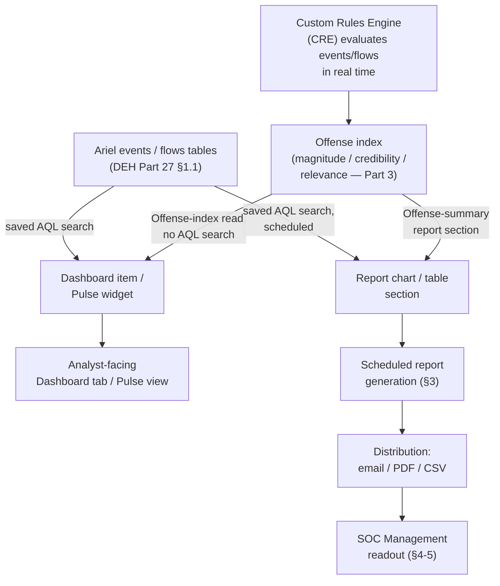

# Part 13 — Dashboards, Pulse, and Executive Reporting

## Why this part exists

**[CONCEPT]** Every part before this one in Section D built the objects that produce an Offense — a Rule, a `BB:`-prefixed Building Block, an `RS-`-prefixed Reference Set — and Part 12 covered the Ariel search performance discipline that keeps ad hoc investigation usable at scale. None of that work is visible to anyone who doesn't open the console and run a search. This part covers the layer that actually gets looked at by people who aren't running searches: the Dashboard tab, the Pulse app's purpose-built widgets, and QRadar's scheduled-report engine — the surfaces a shift lead, a SOC manager, or an executive sponsor actually reads.

This part does not re-teach AQL (Ariel Query Language) syntax — DEH Part 27 §1 owns that in full, and every saved search backing a dashboard item or report chart in this part is written the way that section already teaches. It does not re-argue Sigma-first-vs-native query authoring — DEH Part 23 §5 owns that tradeoff, and it is orthogonal to this part's subject anyway: a dashboard widget consumes whatever AQL search sits behind it regardless of how that search's logic was originally designed. What this part adds is QRadar-specific and genuinely new: how a dashboard item or Pulse widget is actually backed (§1–§2), how scheduled reports compose and distribute that same data (§3), the specific honesty problem a bare offense-count number creates for anyone reporting metrics upward (§4, building directly on DEH `TERMINOLOGY.md`'s Coverage entries), a worked structure for a report that avoids that trap (§5), the silent-failure mode a dashboard shares with a broken DSM mapping (§6), and the access-control boundary a shared dashboard needs (§7).

This part assumes DEH Part 27 §1's AQL fundamentals and §6's Offense-triage framing, and this book's own Part 3 (magnitude, credibility, relevance), Part 6 (custom-property governance), Part 9 (Building Block governance), and Part 12 (Ariel search performance) — cross-referenced by section below, not restated.

---

## 1. Dashboard architecture: default items vs. custom AQL-backed widgets

**[CONCEPT]** The Dashboard tab is a tiled surface of independently refreshing panels, each called a dashboard item. Some ship with the product as defaults — an Offense summary, a most-recent-Offenses list, a system-notification panel, an event/flow throughput chart. Others are added by an analyst or admin, most commonly by saving an Advanced Search (an AQL query, per DEH Part 27 §1) and adding its result to the dashboard as a new item. The tile itself is dumb: it re-runs whatever is behind it on its own refresh interval and renders the result as a chart, table, or single-value counter. Nothing about the tile's own logic differs from what §2's Pulse widgets do — the distinction between "Dashboard tab item" and "Pulse widget" is which app renders the tile and how much layout/typing flexibility it offers, not a different data model underneath.

> **PRODUCT VERSION NOTE**
> The exact names QRadar's console gives its default dashboard tabs ("Offense," "Network Activity," "Application Overview," or similar wording) and the specific set of dashboard items that ship pre-built have shifted in wording and grouping across releases — the same drift risk DEH Part 27 §2.1 already flags for the Rule Wizard's own Rule Test catalog. Treat this section's category names as illustrative and verify the current tab and default-item list against your own console before citing one as a literal on-screen label.

### 1.1 What a dashboard item actually is

**[PLATFORM ENGINEER]** Structurally, a dashboard item is one of three things, and knowing which one you're looking at matters for everything in §4 and §6:

1. **An Offense-index tile.** Reads directly from QRadar's own Offense index — the same magnitude/credibility/relevance-scored records Part 3 covers — not from an AQL search against `events` or `flows` at all. A "Top 10 Offenses by Magnitude" tile is this category.
2. **A saved-search tile.** Backed by an Advanced Search saved against `events` or `flows`, exactly the query surface DEH Part 27 §1.1–§1.3 teaches. A "Failed Authentication Events, Last 24 Hours" chart grouped by source IP is this category, and it carries the same search-cost profile any AQL search does — see §3's callout on report-time contention.
3. **A system-metric tile.** Reads QRadar's own operational telemetry — sustained EPS/FPM against your licensed tier (Part 17), disk/storage utilization, system-notification feed — not user data at all. This category is the one place a dashboard genuinely reflects platform health rather than security signal, and conflating the two is a real failure mode: a green "system healthy" tile says nothing about whether any Rule is still matching real telemetry correctly.

### 1.2 Dashboard item categories, at a glance

**[PLATFORM ENGINEER]** The table below supports deciding what to check first when a dashboard item looks wrong — an empty Offense-index tile and an empty saved-search tile fail for entirely different reasons.

| Category | Backing mechanism | Refresh behavior | Search-resource cost | Version note |
|---|---|---|---|---|
| Offense-index tile | QRadar's own Offense index (Part 3) | Near-continuous; reflects live Offense state | Low — not an Ariel search | Field names on Offense-index tiles are stable across releases; layout options are not (see above) |
| Saved-search tile | AQL search against Ariel `events`/`flows` (DEH Part 27 §1) | On a configured interval, re-running the search | Shares Ariel search capacity with every concurrent analyst search (Part 12) | Default refresh-interval bounds and options have varied by release |
| System-metric tile | Platform telemetry (EPS/FPM, storage, notifications) | Near-continuous | Low — not an Ariel search | Exact metrics surfaced have expanded across releases; do not assume an older deployment exposes the same set |
| Reference-data tile | Reference Set/Map contents or membership count (Part 10) | On the item's refresh interval | Low to moderate depending on set size | Whether a given release exposes reference-data contents directly as a dashboard item, versus only via a saved search that checks membership, is version-dependent — verify before designing a widget around it |

---

## 2. Pulse: purpose-built dashboards beyond the default tab

**[PLATFORM ENGINEER]** Pulse is an app built on QRadar's App Framework (Part 19 covers App Host resource footprint and governance in full) that provides a more flexible dashboarding surface than the default Dashboard tab — more widget types, more layout control, and a design intent closer to a single-pane executive or shift-handoff view than a working analyst's tiled search results. Underneath, a Pulse widget is backed by the same three mechanisms §1.1 names: an Offense-index read, a saved AQL search, or a platform metric. Nothing about Pulse changes what data is available; it changes how that data can be laid out and combined into one view meant for someone who isn't going to open a search bar.

> **PRODUCT VERSION NOTE**
> Whether Pulse ships pre-installed with a given QRadar deployment or has to be installed separately from IBM's App Exchange, and which packaging tier or delivery model (on-prem vs. cloud/SaaS) bundles it by default, has varied across release cycles and business-unit ownership changes to QRadar's own commercial packaging — exactly the category of claim §11 of this book's style guide flags as aging fastest. This part assumes Pulse is available as an installable app rather than asserting it ships by default in your deployment; verify its install status and any separate licensing before promising an executive-dashboard capability that depends on it.

The practical reason to reach for Pulse rather than stacking more tiles on the default Dashboard tab is audience separation: an analyst's working dashboard is optimized for "what needs my attention right now" (a live Offense list, a saved search tracking a rule under active tuning per Part 15), while a Pulse view built for a weekly SOC-management sync is optimized for trend and volume over a longer window. Building both audiences into one tiled surface tends to produce a dashboard that serves neither well — too dense for a quick triage glance, too granular for a management summary.

---

## 3. Scheduled reports: composition, distribution, and the search-cost tax

**[PLATFORM ENGINEER]** QRadar's Reports function composes chart and table sections — each backed by a saved search or an Offense-index query, structurally identical to §1.1's tile categories — into a formatted document generated on a schedule (daily, weekly, monthly, or ad hoc) and distributed by email attachment or to a shared location, typically as PDF or CSV depending on the section type. A report is a dashboard's contents, reformatted for people who read a document instead of a live console, generated once per schedule interval rather than refreshed continuously.

The operational detail worth naming explicitly: **a scheduled report's generation time is a real Ariel search event, not a free export of already-computed dashboard data.** A report section covering a 30-day window, grouped across every Log Source, runs that search against Ariel at generation time — the exact search-resource contention Part 12 covers for ad hoc analyst searches, except now scheduled and recurring. A report scheduled to generate at 9:00 AM on a Monday, timed to land in a manager's inbox before a standup, runs its underlying searches at the exact moment the overnight shift is also running its own end-of-shift searches.

> **Platform Reality**
> A wide historical report section — 30 days, all Log Sources, grouped by several fields — competes for the same Ariel search resources as every analyst's live search, the same shared-resource constraint Part 12 names for concurrent ad hoc use. Scheduling a heavy report to generate during business hours does not just risk a slow report; it can measurably slow down every analyst's concurrent search while it runs. Schedule wide historical reports for off-peak hours, and treat report-generation time as a line item in the same search-capacity planning Part 12 asks you to do for analyst headcount, not as a separate, free reporting layer sitting outside Ariel's actual load.

Distribution and branding options (a logo, a cover page, per-recipient access scoping) are cosmetic on top of this same generation mechanism — worth configuring for a report leaving the SOC for an executive audience, but they do not change the underlying search-cost fact above.

---

## 4. What a dashboard number actually tells you: the coverage trap

**[SOC MANAGEMENT]** DEH `TERMINOLOGY.md` §5 states a rule this book inherits rather than re-derives: bare "coverage" is an incomplete sentence, and a claim has to be qualified as Telemetry Coverage, Detection Coverage, or a specific tier on DEH's six-tier scale (NO VISIBILITY through TESTED/RECENTLY VALIDATED) before it means anything. A QRadar dashboard is exactly where that discipline gets skipped by default, because the platform hands you a tile that looks like a coverage statement without being one.

> **SOC Management View**
> An "Offenses Closed This Week" tile, or a scheduled report's raw offense-count trend line, is a volume metric — how many Offenses the Custom Rules Engine (the CRE; see this book's Part 8 for the full Rule Wizard catalog behind it) produced and how many an analyst dispositioned — not a Detection Coverage statement in DEH `TERMINOLOGY.md`'s sense. It says nothing about which adversary behaviors this deployment can reliably detect, only how much the deployed Rule set fired and how the queue was worked. Reporting a rising or falling offense count to leadership without naming which of DEH's six Detection Coverage tiers backs it repeats the exact "bare coverage" ambiguity DEH's `TERMINOLOGY.md` warns against generically — applied here to a specific tile that looks like progress on its own merits.

> **Blind Spot**
> Every stock dashboard item and every scheduled report section in this part draws from Offenses the CRE already produced or events/flows already indexed in Ariel. None of it can show a technique sitting at NO VISIBILITY (no telemetry exists — a collection gap) or a Log Source sitting at TELEMETRY ONLY with no analytic ever built against it — the Visibility Debt DEH `TERMINOLOGY.md` names as a gap that "looks like progress on a source-count dashboard while contributing nothing to actual detection capability." A perfectly clean, low-offense-count QRadar dashboard is consistent with excellent tuning (Part 15) and separately consistent with a deployment that has never onboarded telemetry for half its ATT&CK-relevant surface — the two look identical from inside QRadar's own reporting layer. Closing that gap needs the source-and-analytic inventory DEH's six-tier matrix asks for, tracked as a program artifact outside QRadar's dashboards entirely, not as a widget QRadar itself can render for you.

### 4.1 Reframing four common tiles honestly

**[SOC MANAGEMENT]** The table below is not a claim that these tiles are wrong to build — they answer real operational questions. It is a claim that each one answers a narrower question than its label suggests, and the honest reframing is the sentence that belongs in a report's caption or a management readout, not the raw label alone.

| Common dashboard metric | What it actually measures | What it doesn't measure | Honest reframing |
|---|---|---|---|
| Offenses Closed This Week | Analyst queue throughput | Whether closed Offenses were correctly dispositioned, or whether anything went undetected | "Queue throughput: N Offenses closed; see Part 14's disposition-accuracy sampling for triage quality" |
| Offense Count by Severity | Volume of CRE matches, bucketed by the Rule's configured severity | Detection Coverage tier for any specific technique; a high-severity Rule that never fires contributes zero to this chart either way | "Volume by configured severity, not a coverage statement — cross-reference the technique-level Detection Coverage tier for anything this chart is being used to argue" |
| Top 10 Source IPs by Event Count | Which sources are noisiest in raw log volume | Which sources are attacking anything; a chatty, benign application server routinely outranks a slow, deliberate intrusion | "Noisiest sources by volume — a triage starting point, not a threat ranking" |
| Log Sources Ingesting (count) | Telemetry Coverage — sources present in the pipeline (DEH `TERMINOLOGY.md`) | Detection Coverage — whether any Rule uses that data | "N sources ingesting; see the Visibility Debt tracker for which have an analytic built against them (Part 15, Part 22)" |

---

## 5. Building an executive-safe report: a worked structure

**[SOC MANAGEMENT]** A report structure that survives the trap in §4 leads with tiered coverage language instead of raw counts, and treats offense volume as one input among several rather than the headline number. A structure that holds up under a second read:

1. **Detection Coverage summary, by DEH's six-tier scale** — a distribution across NO VISIBILITY through TESTED/RECENTLY VALIDATED for the technique set your program tracks (Part 22's capstone staffing model assumes this exists as a maintained artifact), not a single aggregate percentage DEH `TERMINOLOGY.md` explicitly warns against reporting.
2. **Offense volume and disposition, contextualized** — the raw counts §4.1's table reframes, presented with their disposition breakdown (true positive, benign positive, false positive per Part 14's closing-reason taxonomy) rather than as a bare trend line.
3. **Top firing Rules and Building Blocks, with tuning status** — which named `R:`- and `BB:`-prefixed objects (Part 8, Part 9) generated the most volume, and whether each is an intentional high-volume detector or a Part 15 tuning candidate already in progress. Naming the object, not "a large number of alerts from one rule," is the same concrete-over-vague discipline this book's style guide requires throughout.
4. **Mean time to triage and close** — Part 14's queue-handling metric, reported alongside coverage rather than instead of it, since a fast queue and a wide detection gap are both true at once and neither metric substitutes for the other.
5. **Tuning and onboarding actions taken this period** — new Log Sources onboarded (Part 4), Reference Sets updated (Part 10), Rules tuned or retired (Part 15) — the concrete evidence that Visibility Debt from §4's Blind Spot is being worked down, not just tracked.

None of this requires new QRadar functionality beyond what §1–§3 already describe — every section above is a saved search, an Offense-index query, or a manually-maintained coverage-tracking artifact assembled into one report template. The change is entirely in what gets reported first and how each number is captioned, not in the tooling.

---

## 6. Dashboard and report drift: the silent failure mode

**[PLATFORM ENGINEER]** A saved-search tile or report section fails exactly the way DEH Part 27 §3.1 describes for a broken QID (QRadar's internal event-taxonomy identifier) mapping: silently, with no error surfaced anywhere an analyst or manager would see it.

> **Platform Reality**
> If a custom property a widget's saved search references gets renamed during a DSM update (Part 6's custom-property governance), or a `BB:`/`R:`-prefixed object referenced by name in the search's filter gets renamed without the search being updated to match, the widget does not break visibly — it keeps rendering, and it renders a flat line or a zero. A shift lead skimming the Dashboard tab reads that as "nothing happened this period," not "this widget stopped measuring anything." The same failure shape §3.1 of DEH Part 27 documents for a Rule silently matching nothing since deployment applies here one layer up: the query runs cleanly, returns zero rows, and nobody is alerted that the number means "broken" rather than "quiet." Re-validate a dashboard item's or report section's backing search after any DSM change, custom-property rename, or Rule/Building Block rename that touches a field the search filters or groups on — the same trigger list Part 6 already asks you to track for AQL searches generally, extended here to cover dashboards and reports as additional consumers of the same fields.

> **Validation Test**
> **Setup:** A dashboard item or Pulse widget built on a saved AQL search grouping Offense volume by `"Source Process Name"` for `R: Suspicious LSASS Access — Unapproved Process` (DEH Part 27 §3.3's worked example; T1003.001 (OS Credential Dumping: LSASS Memory)).
> **Action:** Generate one known-positive event against the underlying Rule using the same test procedure DEH Part 27 §3.3's own Detection Test describes, then refresh the widget and re-run the equivalent report section.
> **Expected result:** The widget's count increments by one and the newly-charted value matches the test event's actual `"Source Process Name"`, confirming the widget's backing search still resolves the same custom property and Rule name it was built against — not merely that the widget renders without a console error, which a stale or mis-scoped search can do indefinitely while measuring nothing real.

---

## 7. Access and sharing across roles

**[SOC MANAGEMENT]** A dashboard or report built for one audience becomes a liability shared with the wrong one: a working analyst dashboard exposing raw event detail to an audience that will misread a single noisy tile as an incident, or a management-facing report exposing per-analyst disposition counts in a way that reads as a performance scoreboard rather than a queue-health metric. QRadar's own sharing controls for dashboards and reports scope who can view or edit a given item or template; in a multi-tenant or MSSP deployment this interacts directly with the Domain/tenant boundaries Part 21 covers for Rules and Offenses generally.

> **PRODUCT VERSION NOTE**
> The specific sharing/permission model for dashboards and reports — whether sharing is scoped per-item, per-tab, or per-user-group, and what the exact console workflow for granting that access looks like — is a UI/navigation detail of the kind this book's style guide §11 requires flagging rather than asserting as stable fact. Verify the current sharing model in your own console, and cross-reference Part 21 for how it interacts with Domain-based tenant separation, before designing a shared-dashboard rollout around an assumed permission structure.

**Figure 13.1 — Two backing paths into every dashboard tile and report section.** *CONCEPTUAL.* Illustrates that a QRadar dashboard item, Pulse widget, or report section draws from one of two structurally different sources — the Offense index QRadar itself maintains (Part 3's magnitude/credibility/relevance model) or a saved AQL search against the Ariel `events`/`flows` tables (DEH Part 27 §1.1) — and that both paths converge on the same scheduled-report and distribution mechanism before reaching a management-facing readout. Not a reproduction of any single IBM architecture diagram, and not a claim about any specific dashboard item's internal query implementation, which IBM does not publish.

---

**Cross-references:** DEH Part 27 §1 (AQL fundamentals, `events`/`flows`), §3.1 (silent DSM/QID mapping failure — the same failure shape §6 applies to dashboards), §3.3 (`R: Suspicious LSASS Access — Unapproved Process` worked example reused in §6's Validation Test), §6 (Offense as Alert/Case hybrid); DEH Part 23 §5 (Sigma-first vs. native authoring, orthogonal to this part's subject); DEH `TERMINOLOGY.md` §5 (Coverage, Telemetry Coverage, Detection Coverage, Visibility Debt — the basis for §4); this book's Part 3 (magnitude/credibility/relevance), Part 4 (Log Source onboarding), Part 6 (custom-property governance), Part 8 (Rule Wizard catalog), Part 9 (Building Block governance), Part 10 (Reference Data types), Part 12 (Ariel search performance and resource contention), Part 14 (triage disposition and MTTR), Part 15 (tuning workflow and Visibility Debt paydown), Part 17 (EPS/FPM capacity), Part 19 (App Framework and Pulse's App Host footprint), Part 21 (multi-tenancy and dashboard/report sharing), Part 22 (staffing and coverage-tracking capstone).
