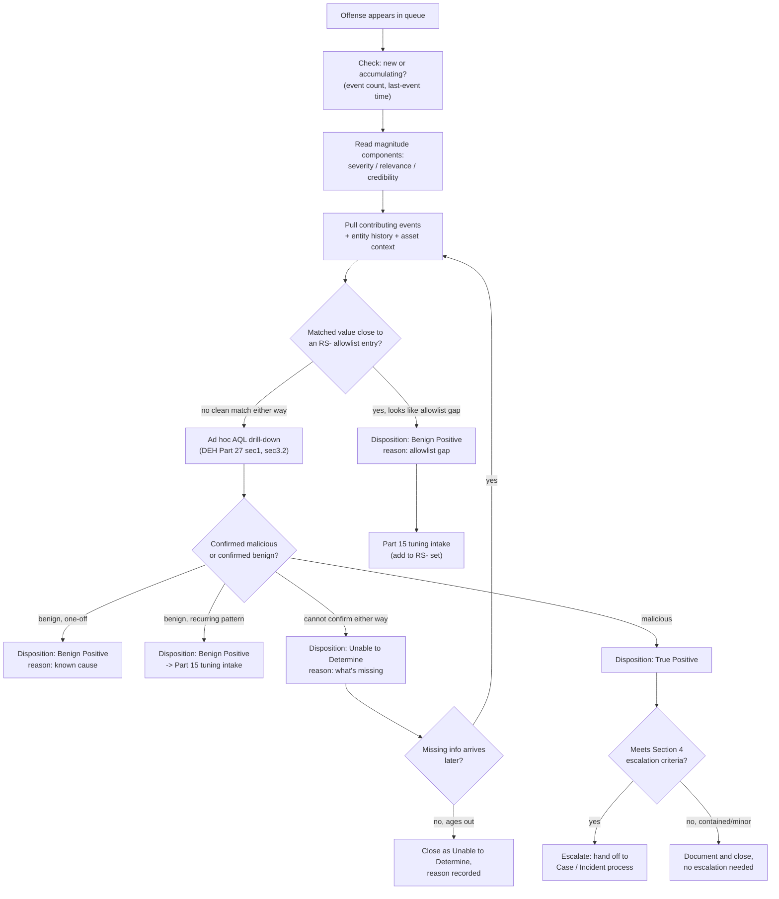

# Part 14 — Analyst Triage Workflow for Offenses

## Why this part exists

**[CONCEPT]** DEH Part 27 §6 spent one section proving a structural point: a QRadar Offense is not cleanly either an Alert or a Case in DEH `TERMINOLOGY.md`'s strict sense — it behaves like a hybrid of both, a queue item an analyst opens (the Alert instance) that also bundles every contributing event matched against the same Rule and the same indexed entity into one accumulating record over time (the Case). That section closed with a two-line worked example: pull the contributing events, decide whether the source process should have been on the allowlist (a Benign Positive that becomes a Tuning change) or is genuinely unrecognized (a True Positive candidate). This part is the rest of that workflow, generalized past one Building Block and one Rule to the whole queue an analyst actually works a shift against.

Part 3 (`part03-offenses-magnitude-credibility-relevance.md`) owns the scoring model itself — what severity, relevance, and credibility each measure, how they combine into magnitude, and the Offense lifecycle states (active, dormant, closed). This part assumes that model is already understood and asks the operational question Part 3 doesn't: given a queue of Offenses each carrying a magnitude number, what does an analyst actually do, in what order, and how do they record the outcome so the next shift — and every downstream metric in this book — can trust it? Part 15 picks up where this part's escalation-vs-tuning fork leads when the same Rule keeps flooding the queue with the same disposition; this part is scoped to one analyst working one Offense at a time, correctly, before that systemic question is in scope.

This part does not re-teach AQL — every drill-down query below is a pointer to DEH Part 27 §1 and §3.2's syntax, not a new tutorial — and it does not re-derive the Offense-as-hybrid finding Part 27 §6 already established; it cites that finding and builds the day-to-day discipline on top of it.

---

## 1. The queue an analyst actually sees

**[ANALYST]** An Offense list is not a flat, chronological feed the way a raw alert stream from a simpler platform can be. Because QRadar indexes an Offense on an entity (an IP, an asset, a username — the exact indexing key depends on how the firing Rule's Response was configured) and keeps updating that same Offense record as new contributing events match, a queue an analyst opens mid-shift already contains a mix of:

- Offenses that fired once, cleanly, and are waiting on first review.
- Offenses that have been open for hours or days, accumulating additional contributing events every time the same Rule matches the same entity again — magnitude and event count both climbing since the last analyst touched it.
- Offenses that another analyst already reviewed and left an internal note on, without formally closing, because the investigation needed information that hadn't arrived yet (an asset owner's response, a EDR console lookup).

**[ANALYST]** The practical consequence: before touching the top-magnitude Offense, an analyst scans for whether it's new or accumulating. An Offense sitting at magnitude 7 that fired once an hour ago reads very differently from one sitting at magnitude 7 that has been open for three days and just picked up its ninth contributing event in the last ten minutes — the second is actively escalating, and the queue-sort-by-magnitude view alone won't surface that unless the analyst also checks last-event-time and event count per Offense, not magnitude in isolation.

> **PRODUCT VERSION NOTE**
> The specific Offense-list columns available by default (magnitude, last-event time, event count, source/destination summary, assigned-user field) and whether a given deployment exposes a one-click "sort by last updated rather than magnitude" toggle are console details that have shifted in exact placement across QRadar releases. The underlying data — an Offense's magnitude, its event count, and its last-event timestamp — is architecturally stable; the specific column layout and default sort a reader's own console presents is not something this part asserts as a fixed screenshot. Verify your own Offense list's available sort/filter fields before building a shift-handoff procedure around a specific column that may not be in the position this part describes.

### 1.1 Reading magnitude, credibility, and relevance as triage inputs — not as a verdict

**[ANALYST]** Part 3 defines what each of the three inputs measures; this section is about what an analyst does with the number, which is a different question. Magnitude is a queue-ranking score, not a confirmed-severity label — a high-magnitude Offense is one QRadar's own weighting considers worth looking at first, not one that has been validated as a true positive by anything other than the Rule's own match logic. Treat magnitude the way DEH `TERMINOLOGY.md`'s Alert entry treats any alert score: a triage-ordering signal, disposed only after the analyst actually looks.

A magnitude number by itself also collapses three different questions into one figure, and a triage workflow that only ever reads the collapsed number loses information a shift handoff needs:

- **Is this a severe pattern in the abstract?** (severity — the Rule/offense-type's own inherent weight, largely fixed by how the firing Rule was authored.)
- **Is this pattern relevant to *this* asset specifically?** (relevance — pulls from the asset model and Network Hierarchy weighting Part 20 covers; an identical Rule match against a domain controller and against an unmanaged guest-network laptop should not triage identically, and relevance is the mechanism that's supposed to reflect that difference.)
- **How much does QRadar trust the event data behind this match?** (credibility — lower for a Log Source type QRadar's own scoring treats as less reliable, or for a match built from a single low-confidence event rather than corroborated by multiple independent sources.)

**[ANALYST]** A queue-triage discipline worth building: when two Offenses show similar magnitude, look at which of the three components is driving it before assuming they're equally urgent. An Offense scoring high mostly on severity against a low-relevance asset is a different next action than one scoring the same total mostly on relevance against a high-value asset with only moderate severity underneath — the first might genuinely wait behind the second even though the queue's raw sort shows them adjacent.

---

## 2. First-look triage: what to pull before deciding anything

**[ANALYST]** Continuation of DEH Part 27 §6's own worked example, generalized past one Rule. For any fired Offense, before a disposition decision is made, pull:

1. **The contributing event(s).** Open the Offense's event list and read the actual matched fields — not just the Rule name. A Rule name like `R: Suspicious LSASS Access — Unapproved Process` (DEH Part 27 §3.3's own example) tells you what pattern matched; it does not tell you which specific process, host, and user triggered it this time.
2. **The entity's recent history.** Has this same asset or user shown up on other Offenses recently, from the same Rule or a different one? A single Offense reviewed in isolation misses a pattern a second Offense on the same entity, twenty minutes later, would make obvious.
3. **The asset context.** Pull whatever Part 20's asset model and Network Hierarchy placement say about this host or user — is this a domain controller, a workstation in a segment with known vulnerability findings, a service account with an expected automated behavior pattern this match might just be describing normally?
4. **Whatever Reference Set membership the firing Rule actually checked.** If the Rule chains a Building Block match against a Reference Set exclusion — DEH Part 27 §3.3's `RS-Allowlisted-LSASS-Tools` pattern — check directly whether the matched value was *close to* being on that list rather than cleanly off it. A source path that's one character off from an allowlisted entry (a version-bump path change, a typo introduced in a prior maintenance edit) is a strong signal toward Benign Positive with a Tuning follow-up, not toward escalation.

**[ANALYST]** For deeper investigation — pivoting from the Offense's summary view into the full underlying event set with a broader time window, or checking whether the same pattern shows up against other entities the Offense list doesn't currently group together — drop into an ad hoc AQL search anchored on the Offense's own indexed entity and time range. DEH Part 27 §1 and §3.2 already cover AQL syntax and the search-cost caveats (`LAST n HOURS`, no unbounded search) that apply here unchanged; this part adds no new syntax, only the triage question the search is answering.

> **Hunter's Note**
> A drill-down search run from inside an Offense's own context should almost always narrow, not widen, relative to the Rule Test that fired it — for example, dropping the specific `GrantedAccess` value filter to see the full range of access-rights values this entity has produced against `lsass.exe` recently, the same loosening DEH Part 27 §5's `HUNT-27-01` demonstrates. If a full-context drill-down search on a live Offense turns into an open-ended hunt with no time bound and no specific question it's trying to answer, it has stopped being triage and become a hunt — which is a legitimate activity, but belongs under `[THREAT HUNTER]` discipline with its own hypothesis and time budget (DEH Part 27 §5's pattern), not an unbounded detour inside a triage shift with a queue still waiting behind it.

---

## 3. Disposition and closing-reason codes

**[ANALYST]** DEH `TERMINOLOGY.md`'s Disposition entry is unchanged here by definition, per this book's STYLE-GUIDE §12 — an Offense's recorded outcome is still one of True Positive, Benign Positive, False Positive, or Unable to Determine, and every downstream quality metric this book or DEH discusses is only as trustworthy as that recorded disposition. What QRadar adds operationally is a closing-reason mechanism attached to the close action itself, letting an analyst record *why* a given disposition applies without writing free-text every time.

| Disposition | Typical QRadar closing-reason pattern | Next action |
|---|---|---|
| True Positive | A specific reason naming the confirmed technique or activity (e.g., "confirmed credential-dumping tool execution") | Escalate per §4; do not close the Offense as the terminal record of a confirmed incident — hand off to the Case/Incident process DEH `TERMINOLOGY.md` defines, keeping the Offense as supporting evidence. |
| Benign Positive | A reason naming the known-legitimate cause (e.g., "authorized EDR scan," "known maintenance window") | Tuning follow-up if the cause is likely to recur — add the source to the relevant `RS-` Reference Set or file a Part 15 tuning-intake request; do not just close and move on if the same cause will fire again tomorrow. |
| False Positive | A reason naming the logic gap (e.g., "Rule matched on stale asset classification") | Tuning follow-up owned by the Rule/Building Block author, not a Reference Set entry — this is a logic defect, not an expected-but-unwanted match; route through Part 15's diagnosis workflow. |
| Unable to Determine | A reason naming what's missing (e.g., "source host offline, could not confirm process") | Re-open on new information if it arrives; do not let "unable to determine" become a silent default for closing a queue faster — DEH `TERMINOLOGY.md`'s Disposition entry treats this as a real, trackable outcome, not a non-answer. |

> **PRODUCT VERSION NOTE**
> Whether QRadar's console presents closing reasons as a fixed, admin-managed picklist, a free-text field, or both, and the exact default reason list shipped out of the box, are UI specifics that have varied across releases and deployment configurations. The claim this part relies on — that a closing action can carry a structured reason distinct from the four-value disposition itself — is treated as architecturally available; the exact picklist contents and whether custom reasons can be added without vendor support involvement should be verified against your own deployment before building a reporting pipeline that assumes a specific reason taxonomy exists by default.

### 3.1 The Tuning-vs-Suppression fork, at the point of disposition

**[ANALYST]** DEH `TERMINOLOGY.md` draws a hard line between Tuning (a logged change to the detection's own logic) and Suppression (a mechanism that stops an otherwise-matching condition from reaching an analyst, without touching the underlying logic) — carried forward unchanged per this book's STYLE-GUIDE §12, and given full console-native treatment in Part 15. The disposition step is where that fork actually gets decided, even though the mechanical change happens later:

- A Benign Positive caused by a legitimate tool that should have been excluded from the start (DEH Part 27 §3.3's False Positive Trap — an AV engine, `WerFault.exe`, a sanctioned diagnostic tool) points toward **Tuning**: add the tool to the relevant `RS-` allowlist, a change to what the Rule's logic treats as excluded.
- A Benign Positive caused by a known, bounded, temporary condition — a scheduled penetration test, a one-off maintenance window — points toward **Suppression** if it recurs during a known window, without permanently changing what the Rule matches once that window closes.

**[ANALYST]** Recording the disposition and reason correctly at triage time is what lets Part 15's tuning-intake process later distinguish "this Rule needs a permanent logic change" from "this was a one-off, no systemic action needed" — a queue full of Benign Positive dispositions with no reason code attached gives the tuning workflow nothing to act on beyond "this Rule is noisy," which is a much weaker starting point than a reason-coded pattern showing exactly which Reference Set entry is missing.

---

## 4. Escalation criteria

**[ANALYST]** Escalation is the point where an Offense's disposition moves from "an analyst's individual judgment call" to "a decision other people and processes now depend on." A workable escalation trigger set, generalized from DEH Part 27 §6's own single-Rule example:

- **Confirmed True Positive on any asset**, regardless of the firing Rule's severity weighting — a confirmed malicious action on a low-relevance asset still needs the same incident-response handoff a high-relevance asset would get; relevance affects triage *order*, not whether escalation happens at all once confirmed.
- **Multiple Offenses on the same entity within a short window**, even if no single one individually reads as severe — the pattern across Offenses is often the signal a single Offense's magnitude cannot carry, since magnitude is computed per-Offense, not across an entity's full recent history.
- **An Unable to Determine disposition where the missing information itself is concerning** — a source host that's gone offline specifically because it's mid-compromise reads differently from one that's offline for a scheduled reboot; escalate on the ambiguity itself when the missing-information cause can't be independently confirmed as benign.
- **Any Offense that would, if true, cross a threshold your organization has pre-defined as requiring formal incident declaration** — credential-dumping activity against a domain controller, confirmed lateral movement, anything matching your own incident-response plan's declaration criteria. Escalation criteria here should be pre-agreed with the incident-response process, not improvised per-analyst per-shift.

**[ANALYST]** Escalating hands the Offense's supporting evidence — the contributing events, the drill-down search results, the reason the analyst believes this is a True Positive rather than the next-most-likely alternative — into DEH `TERMINOLOGY.md`'s Case or Incident process. The Offense itself stays open or closes-with-escalation-noted depending on your organization's own workflow convention; what matters for this book's purposes is that the Offense's own disposition record and the downstream Case/Incident record both point at each other, so a later reviewer reconstructing what happened doesn't have to guess which Offense triggered which Case.

> **Validation Test**
> **Setup:** A test Offense fired against a non-production or clearly test-labeled asset, from a Rule with a known, reproducible Rule Test condition (for example, DEH Part 27 §3.3's `R: Suspicious LSASS Access — Unapproved Process`, triggered per its own Detection Test procedure).
> **Action:** An analyst works the Offense through this part's triage sequence — pulls contributing events, checks entity history and asset context, checks Reference Set proximity, assigns a disposition with a reason code, and (for this test) escalates per §4's criteria as if the finding were confirmed.
> **Expected result:** The disposition and reason code are recorded on the Offense; the escalation handoff produces a Case/Incident record that cross-references the originating Offense; a second analyst reviewing only the recorded disposition and reason (without re-reading the raw events) can correctly state why the Offense was escalated. If the second analyst cannot reconstruct the reasoning from the recorded disposition alone, the reason-code discipline in §3 failed, independent of whether the underlying triage judgment was correct.

---

## 5. A shift-handoff workflow, end to end

**[ANALYST]** The following diagram ties §1 through §4 into one repeatable per-Offense path, including the two forks (tune vs. suppress, escalate vs. close) this section has built up separately.

**Figure 14.1 — Per-Offense triage decision path.** *CONCEPTUAL.* Illustrates this part's own decision sequence — queue-state check, magnitude-component read, first-look pull, the allowlist-proximity shortcut, the drill-down fork into the four disposition outcomes, and the tuning/escalation handoffs into Parts 15 and the Case/Incident process. Not a reproduction of any QRadar-provided workflow diagram or a claim about a specific console feature automating this path; it is this book's own representation of a repeatable analyst procedure built on top of the architecture DEH Part 27 §6 and this book's Part 3 already establish.

**[ANALYST]** The two shortcut branches worth calling out explicitly: a matched value that's obviously and cleanly on the allowlist already (not shown as a separate branch above because a Rule correctly chaining a Reference Set check should not have fired at all in that case — see DEH Part 27 §2.2) and a matched value that's obviously, unambiguously malicious with no plausible benign explanation, which should skip straight to escalation without spending the shift's limited drill-down time re-confirming what's already clear. The decision path exists to structure the *ambiguous* middle case, which is most of what a real queue actually contains — the false economy in a triage workflow is treating every Offense as equally uncertain when most queues have a recognizable long tail of "this again" alongside a much smaller set of genuinely novel matches.

### 5.1 What a shift handoff needs to record

**[ANALYST]** An Offense still open at shift change needs more than "I looked at it" passed to the next analyst. At minimum: which step in Figure 14.1's path the review had reached, what evidence has already been pulled (so the next analyst doesn't re-pull the same event list from scratch), and what specific missing piece — if any — is blocking a disposition. A queue-management practice worth adopting from DEH `TERMINOLOGY.md`'s own Triage discipline: an open Offense with no note at all reads, to the next shift, identically to an Offense nobody has touched yet — which wastes the first analyst's work and risks a duplicate escalation or a duplicate dismissal from two analysts reasoning independently about the same evidence.

> **Rule Autopsy**
> **The rule:** `R: Suspicious LSASS Access — Unapproved Process` (DEH Part 27 §3.3), deployed correctly with `BB:LSASS-Access-Candidate` and `RS-Allowlisted-LSASS-Tools` all wired together as designed.
> **Why it shipped:** The Rule Autopsy pattern here is not the Rule's logic — that's DEH Part 27's own worked example, and it's sound — it's a triage-workflow gap around it: an analyst disposed three consecutive Offenses from this Rule as Benign Positive with no reason code, no note, and no Part 15 tuning-intake ticket, because the shift was busy and "same as last time" felt self-evident.
> **How it failed:** A fourth Offense from the same Rule, actually a True Positive using a renamed copy of a legitimate tool's binary, got the same fast "same as last time" disposition from a different analyst who had no recorded reasoning from the first three to compare against — only a pattern of three quick Benign Positive closes with nothing explaining why, which read as routine rather than as a queue that should have already had a Part 15 tuning ticket open and, more importantly, a documented *reason* the prior three were safely benign.
> **The fix:** No disposition closes without a reason code, full stop, regardless of how routine it feels in the moment — §3's reason-code discipline is the actual fix, not a smarter Rule. The Rule's logic was never the defect; the missing paper trail was.

---

## 6. Cross-role handoffs this workflow depends on

**[ANALYST]** Two boundaries worth naming so this part doesn't quietly claim ownership of decisions that belong elsewhere in this book's tag taxonomy:

- **Tuning a Rule, Building Block, or Reference Set is `[RULE ENGINEER]` work**, not an extension of triage. An analyst's disposition and reason code are the *input* to a tuning decision (Part 15's intake process consumes exactly this data); the analyst does not themselves edit `RS-Allowlisted-LSASS-Tools` or the Building Block's Rule Test as part of closing an Offense, even when the fix looks obvious from the triage seat. This boundary exists for the same change-control reason DEH Part 27 §2.2 flags a Reference Set's unmanaged growth as a drift risk — an allowlist entry added ad hoc, without the review Part 9 and Part 15 both require for `BB:`/`RS-` changes, is exactly how an allowlist becomes the next `Taskmgr.exe`-shaped evasion gap DEH Part 27 §3's own Blind Spot describes.
- **Relevance weighting drift is `[PLATFORM ENGINEER]` territory (Part 20)**, not something an analyst corrects by mentally discounting a specific asset's Offenses shift after shift. If an analyst repeatedly finds that magnitude's relevance component doesn't match the asset's actual current importance — a decommissioned host still weighted as high-value, a newly critical host still weighted as generic — that observation is worth escalating as an asset-model staleness finding, not silently worked around at the triage layer indefinitely.

**[SOC MANAGEMENT]** The reason-code discipline in §3 is not free — it costs an analyst a few extra seconds per closed Offense, multiplied across an entire queue's volume every shift. It is worth budgeting that time explicitly rather than treating disposition speed alone as the throughput metric a SOC manager optimizes for: a queue closed fast with no reason codes produces exactly the ambiguous, unusable Disposition data DEH `TERMINOLOGY.md`'s own Disposition entry warns against, and every downstream metric this book or DEH discusses — Part 15's tuning backlog, Part 22's staffing model — is built on Disposition data that has to actually mean something to be worth aggregating.

> **What Would Change My Mind**
> This part treats reason-coded disposition at the point of triage as worth the added seconds per Offense. If a SOC running this discipline for a full quarter found no measurable difference in Part 15's tuning-intake accuracy or escalation-quality outcomes between reason-coded closures and bare four-value dispositions — genuinely no signal, not just an unmeasured assumption — that would be a real argument for dropping the reason-code requirement on high-volume, low-severity Rule types specifically, while keeping it for anything that can escalate. This part has not seen that data; it states the discipline as the default, not as a claim already proven against a production queue this book has access to.

---

**Cross-references:** DEH Part 27 §1 and §3.2 (AQL syntax and the drill-down query form this part's §2 builds on, not re-teaches), DEH Part 27 §6 (the Offense-as-Alert/Case-hybrid finding this part's whole workflow inherits), DEH Part 23 (query-language strategy generally, and the field-mapping-gap discipline behind confirming a drill-down search actually returns the fields it claims to), DEH `TERMINOLOGY.md` (Alert, Triage, Disposition, Case, Incident, Tuning, Suppression — all inherited unchanged, none redefined here); this book's Part 3 (magnitude/credibility/relevance scoring model), Part 15 (the systemic tuning-intake workflow this part's disposition data feeds), Part 20 (asset model and relevance weighting), and Part 22 (staffing and review-cost consequences of the disposition discipline in §6).
