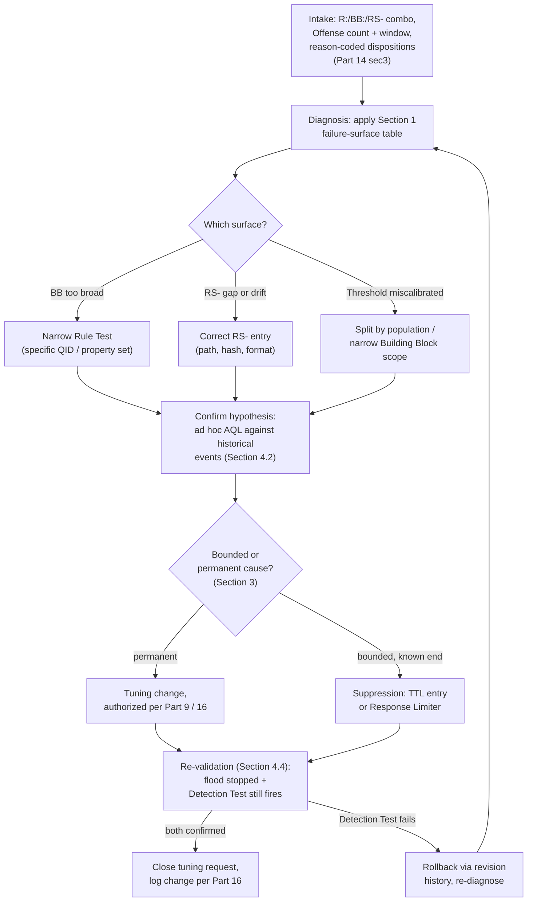

# Part 15 — Noisy-Offense Triage and the Tuning Workflow

## Why this part exists

**[CONCEPT]** Part 14 ended at a fork: an analyst disposes an Offense as Benign Positive, attaches a reason code, and — if the cause looks likely to recur — files a tuning-intake request rather than just closing the queue item and moving on. That fork is where Part 14's scope stops on purpose. One analyst reasoning about one Offense cannot see whether "same as last time" is actually the fortieth Offense this week from the same `R:`/`BB:`/`RS-` combination, whether the underlying cause is a Building Block condition that was always too broad, or whether a Reference Set that should have blocked the match silently missed one entry. This part picks up exactly there: not "what does an analyst do with one noisy Offense," but "what does a Rule Engineer do when a Rule, Building Block, or Reference Set is flooding the queue systemically, and how does a team run that diagnosis-and-fix cycle repeatably on a platform that hands you no CI gate for free."

DEH `TERMINOLOGY.md` §4 draws the line this whole part stands on: **Tuning** is a deliberate, logged change to a detection's own logic, thresholds, or exclusions; **Suppression** is a mechanism that stops an otherwise-matching condition from reaching an analyst without touching that logic. That distinction is inherited here unchanged, per this book's `STYLE-GUIDE.md` §12 — this part does not redefine it, it operationalizes it against QRadar's specific objects: a `BB:` Rule Test condition, an `RS-` Reference Set's membership, and a Rule's chaining logic are the concrete things a Tuning change edits; a Response Limiter or a time-bounded allowlist entry are the concrete things a Suppression mechanism edits instead. DEH Part 27 §2.1–§2.2 and §3.3 already built the vocabulary this part diagnoses against — Rule Tests, Building Blocks, and the Reference Set pattern that stands in for a join QRadar's correlation model cannot express natively — and this part assumes that mechanics discussion is settled rather than re-explaining it. Where a diagnosis step needs an ad hoc query against historical events, this part points to DEH Part 27 §1 and §3.2 for AQL syntax and DEH Part 23 for the broader question of when a native, backend-specific query is the right tool rather than a portable one — it does not re-teach either.

This part is scoped to the recurring, steady-state discipline of keeping a Rule base tuned. Part 16 owns the harder problem this part deliberately does not solve: what a disciplined team builds to replace the git/PR/CI pipeline DEH Part 22 assumes is available, for the *change-management* half of a tuning edit (tickets, approvals, a staging tenant, rollback). Part 18 owns the acute version of the same failure — an offense-flooding incident in progress, walked as symptom → cause → fix under incident-response time pressure — where this part is the discipline that should have caught the same Rule before it flooded anything.

---

## 1. Diagnosing a flooding Rule: symptom versus cause

**[RULE ENGINEER]** A Rule that is producing far more Offenses than it should always looks the same from the queue: a spike in Offense count against one `R:` name. It does not always have the same cause, and treating every flood as "the Rule Test is wrong" leads to fixes that don't hold. Three distinct failure surfaces produce the identical symptom, and a diagnosis has to tell them apart before touching anything:

- **The Building Block's Rule Test condition is genuinely too broad** for what the analytic is trying to catch — it matches a wider set of real-world activity than the analytic intends, independent of any exclusion list. DEH Part 27 §4's generalized failed-authentication example (`DET-27-02`) is exactly this shape at the design stage: a Building Block written to span every Log Source type QRadar has mapped to an authentication-failure category, rather than one known-consistent source, inherits a cross-source conflation risk before a single Reference Set is even in the picture.
- **The Reference Set that should be excluding known-legitimate activity is missing an entry, or the entry it has no longer matches.** DEH Part 27 §3.3's own worked example — `BB:LSASS-Access-Candidate` chained against `RS-Allowlisted-LSASS-Tools` — floods for this reason specifically when an EDR or AV agent's own binary path changes after a vendor upgrade and the allowlist entry, written against the old path, stops matching. The Building Block's logic did not change; the environment moved out from under a static exclusion list.
- **The threshold or aggregation window is miscalibrated for the population it's actually evaluating**, not for the population it was tuned against originally. A Rule built and validated against one business unit's traffic pattern, then deployed fleet-wide without re-checking whether a legitimately bursty but benign population (a backup job's authentication retries, a scheduled scan's connection volume) crosses the same threshold the original analytic assumed only an attacker would cross.

**[RULE ENGINEER]** These three surfaces point to different fixes, and confusing them is the single most common way a tuning change makes things worse instead of better. The table below is the first diagnostic pass — before opening the Rule Wizard, work out which row the flood actually belongs to.

| Symptom | Likely cause | Where to look first | Tuning-shaped fix |
|---|---|---|---|
| Same `R:` fires across many unrelated entities, no obvious common exclusion | Building Block condition too broad for the analytic's real intent | `BB:` Rule Test logic itself — is it matching a category, not a specific pattern? | Narrow the Rule Test (a specific QID — QRadar's internal event-taxonomy identifier — or QID range, a specific property value set) — DEH Part 27 §3.1's QID-mapping discipline applies before narrowing further. |
| Same `R:` fires repeatedly against a small, recognizable set of known-legitimate sources | Reference Set missing an entry, or an entry that no longer matches (path/hash drift after an agent upgrade) | `RS-` membership, checked against the actual matched value on a recent Offense, not just the exclusion list's intent | Add or correct the specific `RS-` entry; re-verify the match format (path string, hash, case sensitivity) against what the DSM actually extracts. |
| A threshold-based `R:` fires on a population that wasn't part of the original validation | Threshold or grouping key miscalibrated for a wider or different population than tuned against | The Rule Test's grouping key (DEH Part 27 §4's `sourceip`/`username` example) and which Log Source types actually feed the Building Block behind it | Narrow the Building Block to a specific Log Source type, or split into population-specific Rules with separately tuned thresholds, rather than raising one shared threshold for everyone. |
| Offense count climbs gradually over weeks with no single triggering change | Reference Set drift — entries never expired, never re-reviewed, or a legitimate change (org restructuring, tool retirement) never reflected | `RS-` TTL configuration (Part 10) and last-reviewed date, if your team tracks one | Scheduled Reference Set review, not a one-off fix — this symptom is a governance gap (Part 9), not a single bad entry. |

> **PRODUCT VERSION NOTE**
> Whether QRadar's console exposes a built-in "top firing Rules" or "Offense count by Rule" report out of the box, and where that report lives in the Admin or Offenses tab, are console specifics that have moved across releases. The diagnostic question this section asks — which Rule, Building Block, and Reference Set combination is actually producing the volume — is answerable in every recent release through some combination of the Offense list's own grouping/filtering and an ad hoc AQL search grouped by rule name and time; verify the specific built-in reporting surface your deployment offers before building a runbook around a menu path this part does not claim as fixed.

### 1.1 Confirming the cause before changing anything

**[RULE ENGINEER]** Every row in §1's table has the same next step: confirm the cause against real matched values before editing the Building Block, the Reference Set, or the Rule. Pull a representative sample of the flooding Offenses' contributing events — the same first-look pull Part 14 §2 already teaches at the single-Offense level, just run across a sample large enough to see the pattern rather than one instance of it. A Building Block that looks too broad in the abstract sometimes turns out to be correctly scoped, with the real cause sitting in a Reference Set that just happens to be stale for one specific tool — narrowing the Building Block in that case would have fixed today's symptom while quietly reopening exactly the evasion gap DEH Part 27 §2.3's Blind Spot warns about for an under-scoped two-stage chain.

> **Noisy Offense Trap**
> A Rule Engineer under queue-volume pressure reaches for the fastest available lever — widening a threshold, adding a broad wildcard exclusion, or simply disabling the Rule — because any of those stops the flood immediately and the pressure to clear the backlog is real. Each of those three moves also removes detection coverage the analytic was built to provide, and none of them is a diagnosis: a threshold widened without checking whether the flood was a Reference Set gap just made a genuinely malicious burst below the new threshold invisible too. The fix that actually holds is almost always narrower and slower than the fix that stops the pain fastest — confirm the cause per §1.1 before choosing which lever to pull, even when the queue is on fire.

---

## 2. The console-native constraint: tuning with no CI gate

**[PLATFORM ENGINEER]** A team used to DEH Part 22's detection-as-code model reaches for a branch, a pull request, and a CI pipeline that runs a regression suite before a rule change merges. QRadar's Rule Wizard, Building Block editor, and Reference Set management screens do not hand a team that pipeline — a saved edit to a `BB:` Rule Test or an added `RS-` entry takes effect immediately, evaluated by the Custom Rules Engine against live traffic from the moment it's saved, with no staging environment most licenses include and no automated test gate between the edit and production.

This part is scoped to the diagnosis-and-fix cycle that happens *within* that constraint, not to replacing it — Part 16 covers what a disciplined team builds instead (change tickets, a rule revision-history-based rollback plan, a staging tenant where licensing allows one, manual regression testing against known-positive events before and after a change). What this part assumes from Part 16, without re-deriving it: every tuning change gets logged somewhere a later reviewer can find — what changed, why, and what was tested — because the console's own revision history, where available, records *that* an object changed and by whom, not necessarily *why* in terms a future Rule Engineer can act on without asking the person who made the change.

> **PRODUCT VERSION NOTE**
> Whether a given license tier or deployment includes a separate staging/test tenant to evaluate a Rule or Building Block edit before it touches production is a packaging and licensing question, not an architectural constant — it has varied across QRadar offerings and sales agreements. Part 16 covers what to build "where licensing allows" one; do not assume the absence of a staging tenant applies uniformly to every deployment without checking your own license and deployment model first.

> **PRODUCT VERSION NOTE**
> Rule and Building Block revision-history depth — whether a deployment can show a prior version of a Rule Test's exact condition and revert to it directly from the console, versus only showing a last-modified timestamp and user — has varied across QRadar releases and is not a capability this part assumes exists uniformly. Confirm what your specific deployment's revision history actually retains before building a rollback plan around a console feature that may show less detail than a git-based diff would.

---

## 3. Tuning versus Suppression, at the systemic level

**[RULE ENGINEER]** Part 14 §3.1 drew this fork at the point of one Offense's disposition. At the systemic level the same fork decides which of two different objects gets edited, and getting it backward is how a temporary fix quietly becomes permanent scope creep or a permanent fix gets treated as disposable:

- **Tuning** edits what the Rule, Building Block, or Reference Set actually matches — adding a corrected `RS-` entry, narrowing a Rule Test's condition, splitting an overbroad Building Block into population-specific ones. This is the right tool when the cause is a **permanent** mismatch between the analytic's logic and the environment it runs against: a tool that will always be there, a population the analytic was never validated against, a field format the DSM will always emit this way.
- **Suppression** stops a match from reaching the queue without touching the logic underneath — a Response Limiter capping how many times a Rule contributes to an Offense or fires a notification within a window, or a time-bounded `RS-` entry with a TTL scoped to a known, temporary condition. This is the right tool when the cause is **bounded**: a scheduled penetration test, a one-off maintenance window, a vendor's temporary scanning campaign that will end on a known date.

**[RULE ENGINEER]** The failure mode DEH `TERMINOLOGY.md`'s Tuning Debt concept names — a known false-positive source identified repeatedly but never fed back into the rule — is exactly what happens when a Suppression mechanism gets used past its bounded window because it was easier to leave in place than to circle back and ask whether the cause turned out to be permanent. A Response Limiter silences the symptom every time regardless of cause; it produces a quieter queue whether the underlying condition was ever actually tuned or not, which makes it a dangerous default to reach for first rather than a considered choice for a genuinely temporary condition.

| Situation | Right mechanism | Why |
|---|---|---|
| AV/EDR agent upgrade changed a known tool's binary path | Tuning — correct the `RS-` entry | Permanent environmental fact; the old path will never come back. |
| A scheduled two-week penetration test will generate expected LSASS-access activity from an authorized tool | Suppression — time-bounded `RS-` entry with a TTL matching the engagement window, or a Response Limiter for the engagement's duration | Bounded, known-end condition; the exclusion should expire on its own rather than requiring a second person to remember to remove it. |
| A Building Block spans multiple Log Source types and floods on one specific source's normal behavior | Tuning — narrow the Building Block or split by Log Source type | The mismatch is structural, not temporary — it will recur every day until the logic changes. |
| A single noisy source is under active incident-response investigation and the team wants matches to keep accumulating evidence without paging on-call every few minutes | Suppression — Response Limiter on the notification path only, Offense still accumulates contributing events | The team wants the detection logic fully intact and still recording; only the paging volume is the problem. |

> **PRODUCT VERSION NOTE**
> Response Limiter configuration — exactly which Rule types expose it, what granularity it rate-limits at (per Rule, per Response action, per matched entity), and whether it is named "Response Limiter" consistently across the Rule Wizard in your specific release — has shifted in wording and placement across QRadar versions. The underlying capability (cap how often a Rule's Response fires within a window, independent of how often the underlying condition matches) is architecturally stable; confirm the exact configuration surface against your own deployment before writing a runbook step that names a specific wizard screen.

---

## 4. A repeatable tuning-intake workflow

**[RULE ENGINEER]** The workflow below is this part's core deliverable: a four-stage pipeline a team can run every time a Rule, Building Block, or Reference Set floods, so the outcome doesn't depend on which Rule Engineer happened to be on shift that day.

### 4.1 Intake

**[SOC MANAGEMENT]** A tuning request needs a minimum data set to be actionable, and the most common reason a tuning backlog stalls is that requests arrive without it. At minimum, an intake record needs: which `R:`/`BB:`/`RS-` combination is involved, how many Offenses over what window, a sample of the reason codes Part 14 §3 already requires analysts to attach at disposition time, and — if the requesting analyst has one — a guess at which of §1's three failure surfaces looks most likely. A queue full of reason-coded Benign Positive dispositions naming the same allowlist gap is a far stronger intake signal than an analyst's Slack message saying "this Rule is noisy again," precisely because Part 14's disposition discipline exists to make that signal available in the first place.

### 4.2 Diagnosis

**[RULE ENGINEER]** Apply §1's diagnostic table against the intake sample, then confirm the hypothesis against real historical data before writing a single change. This is the point where an ad hoc AQL search earns its place in the workflow — DEH Part 27 §1 and §3.2 already cover the syntax and the search-cost discipline (bounded time windows, no unbounded search against a shared Ariel deployment) this step inherits without restating. Query the historical event population the flooding Rule's Building Block would have matched, with the proposed fix's condition removed or loosened, and check what the result set actually contains before assuming the fix is safe:

```sql
-- QRadar AQL, not standard SQL — this is a diagnostic query, not a standing rule.
-- Non-SQL behavior in play here: LAST n DAYS is AQL's time-window shorthand, not a
-- standard-SQL construct, and there is no general-purpose JOIN to correlate against a
-- second table. Syntax per DEH Part 27 sec1/sec3.2; not re-taught here. Illustrative
-- property names ("Source Process Name") per this book's convention of following DEH
-- Part 27's own worked LSASS example — confirm your own custom property names against
-- Log Activity > Advanced Search before reuse.
SELECT "Source Process Name", COUNT(*) AS "Occurrences"
FROM events
WHERE QIDNAME(qid) = 'Process accessed'
  AND "Target Process Name" ILIKE '%lsass.exe%'
LAST 30 DAYS
GROUP BY "Source Process Name"
```

Grouping the flooding population by the field a proposed `RS-` fix would key on shows, directly, whether one dominant source explains the volume (a strong candidate for a clean Tuning fix) or whether the volume is spread across many distinct, unfamiliar values (a signal that the real cause is closer to §1's "Building Block too broad" row than "one missing allowlist entry"). This diagnostic query is itself a QRadar-native artifact, not a portable one — DEH Part 23 §5's finding about when Sigma-first authoring pays off and when it doesn't applies here in the negative: a diagnosis built against this platform's own `RS-`/`BB:` constructs and this platform's own Offense population has no meaningful portable form, and isn't trying to have one. It exists to answer one platform-specific question, once, and gets discarded or promoted into documentation afterward, the same way DEH Part 27 §5's hunting queries are used and retired.

### 4.3 Change

**[RULE ENGINEER]** Make the confirmed fix — the `RS-` entry, the narrowed Rule Test, the split Building Block — through whatever change-authorization your team requires (Part 9's Building Block governance discipline and Part 16's fuller change-management model both apply; this part does not repeat either). Record what changed and why in whatever log Part 16's model designates as the record of truth, even if that log is a change ticket rather than a git commit message — the "why" matters more here than in a git-based workflow precisely because there is no diff a future reader can inspect to reconstruct intent.

### 4.4 Re-validation

**[RULE ENGINEER]** A tuning change is not done when it stops the flood — it's done when two things are both confirmed: the flood has actually stopped, and the analytic still catches what it was built to catch. Skipping the second half is how a tuning fix becomes a coverage regression nobody notices until a red-team exercise or a real incident finds the gap.

> **Validation Test**
> **Setup:** A tuning change has just been made to `BB:LSASS-Access-Candidate` or `RS-Allowlisted-LSASS-Tools` in response to a confirmed diagnosis (§4.2) — for example, correcting an allowlist entry's binary path after an EDR agent upgrade.
> **Action:** Re-run §4.2's historical AQL query against the same window to confirm the previously-flooding source no longer appears in the unmatched population, then separately run DEH Part 27 §3.3's own Detection Test — a credential-dumping tool against a test host's live LSASS process — to confirm the Rule still fires on genuinely unapproved access.
> **Expected result:** The corrected source's activity no longer produces new Offenses from `R: Suspicious LSASS Access — Unapproved Process`, and the Detection Test's known-malicious pattern still produces one. If the flood stopped but the Detection Test also stopped firing, the fix over-corrected — the Building Block itself was narrowed rather than the Reference Set, or the Reference Set entry was written broader than the specific tool it needed to cover — and the change should be rolled back to the state Part 16's revision history retains, not patched further under continued time pressure.






**Figure 15.1 — The tuning-intake pipeline: request, diagnosis, change, re-validation.** *CONCEPTUAL.* Illustrates this part's own four-stage workflow, including the Tuning-vs-Suppression fork from Section 3 and the re-validation loop that catches an over-corrected fix before it ships as a silent coverage regression. Not a reproduction of any QRadar-provided workflow feature or a claim that the platform automates this sequence — it is this book's own representation of a repeatable practice built on top of the object model DEH Part 27 §2.1–§2.2 and §3.3 already establish.

---

## 5. Case walkthrough: the LSASS Rule, flooded and tuned

**[RULE ENGINEER]** DEH Part 27 §3.3's False Positive Trap named the mechanism in one sentence: an AV/EDR agent upgrade can change a scanning process's binary path and either reopen a false-positive flood or silently stop matching an exclusion nobody re-tested. This walkthrough is that sentence run through §4's pipeline end to end.

> **Rule Autopsy**
> **The rule:** `R: Suspicious LSASS Access — Unapproved Process`, chaining `BB:LSASS-Access-Candidate` against `RS-Allowlisted-LSASS-Tools` (DEH Part 27 §3.3). MITRE ATT&CK T1003.001 (OS Credential Dumping: LSASS Memory), mapping inherited from DEH Part 23/27 and not re-derived here.
> **Why it shipped:** `RS-Allowlisted-LSASS-Tools` was populated by full binary path for the environment's EDR agent, correctly, at the time it was written — the allowlist did its job for months.
> **How it failed:** A fleet-wide EDR agent upgrade moved the scanning binary to a new installation path as part of the vendor's own directory restructuring. `RS-Allowlisted-LSASS-Tools` still held the old path. Every endpoint running the upgraded agent started generating a `BB:LSASS-Access-Candidate` match that no longer found its source process on the allowlist, and `R: Suspicious LSASS Access — Unapproved Process` began firing across the fleet within hours of the upgrade's rollout — hundreds of Offenses, all from one root cause, all reading identically to a genuine credential-dumping wave at first glance.
> **The fix:** Intake (§4.1) arrived within the hour as a spike of reason-coded Benign Positive dispositions all naming the same EDR process. Diagnosis (§4.2) ran the historical AQL query grouped by `"Source Process Name"` and found one dominant, single value driving the entire spike — the new EDR path, not a spread of unfamiliar tools, which pointed cleanly at §1's Reference Set row rather than a Building Block or threshold problem. The change (§4.3) corrected `RS-Allowlisted-LSASS-Tools`'s entry to the new path, logged with the EDR vendor's change bulletin as justification. Re-validation (§4.4) confirmed the flood stopped and separately confirmed the Detection Test's credential-dumping tool still fired.

**[RULE ENGINEER]** The version of this same flood that goes wrong looks almost identical up to the diagnosis step, with one difference: an under-pressure Rule Engineer, seeing hundreds of Offenses and a queue backing up, disables `R: Suspicious LSASS Access — Unapproved Process` entirely rather than running §4.2's confirmation query first. The flood stops immediately — and so does every legitimate detection of the technique the Rule exists to catch, for however long it takes someone to notice the Rule is disabled and ask why. This is the exact shape of §1.1's Noisy Offense Trap, playing out with a real deadline attached rather than a hypothetical one.

**[RULE ENGINEER]** A second, less tidy example belongs in this walkthrough because it doesn't resolve as cleanly as the LSASS case: DEH Part 27 §4's generalized failed-authentication Rule (`DET-27-02`), built on QRadar's native threshold Rule Test across every Log Source type mapped to an authentication-failure category. That Rule floods differently — not from one identifiable source, but from cross-source conflation, where a `username` shared coincidentally across two unrelated identity namespaces (an SSH account and an unrelated application login sharing a common name like `admin` or `svc-backup`) merges into one grouping and crosses the threshold on combined, unrelated activity. Diagnosis here does not find one dominant value to add to an allowlist; it finds that the Building Block itself needs to be split by Log Source type, because the grouping key was never wrong, but the population it was applied across was too broad from the start. This is why §1's diagnostic table treats "Building Block too broad" and "Reference Set gap" as genuinely different rows rather than two names for the same fix — the LSASS case needed a data correction, this case needs a logic change, and running the wrong one first (adding usernames to an exclusion list instead of splitting the Building Block) would have chased an ever-growing allowlist without ever closing the actual gap.

---

## 6. Measuring tuning debt and reporting it honestly

**[SOC MANAGEMENT]** DEH `TERMINOLOGY.md`'s Tuning Debt concept — a known false-positive source identified repeatedly but never fed back into the rule — is directly measurable from the intake records §4.1 asks a team to keep, and a SOC manager budgeting a QRadar practice should be tracking it as its own metric rather than folding it into a generic "queue volume" number that hides where the actual cost sits.

| Metric | What it tells you | Reads as a problem when |
|---|---|---|
| Open tuning requests, by age | Backlog size and staleness | Requests routinely age past a week with no diagnosis started — intake is outpacing Rule Engineer capacity. |
| Offenses suppressed vs. Offenses tuned, per period | Whether the team is fixing causes or muting symptoms | Suppression count grows relative to Tuning count over successive periods — Response Limiters and time-bounded exclusions accumulating past their intended bounded use. |
| Mean time from intake to re-validated fix | Process health, not individual speed | Consistently long even for single-dominant-cause diagnoses (the LSASS case above) — a sign the pipeline itself, not the diagnosis difficulty, is the bottleneck. |
| Repeat intake requests against the same `R:`/`BB:`/`RS-` combination | Whether a prior "fix" actually held | A Rule that generates a new tuning request every few months against the same root cause — the earlier fix treated a symptom, not the cause, or the Reference Set drifted again with no scheduled review in place. |

> **SOC Management View**
> A tuning-intake pipeline that reports "flood resolved" without recording which of Tuning or Suppression resolved it, and without a re-validation step confirming the Detection Test still passes, produces exactly the same false confidence a bare offense-count dashboard produces for detection coverage generally (Part 13's own caution against that metric). Budget the pipeline's overhead explicitly — the diagnosis query, the Detection Test re-run, the change log entry — as the cost of a tuning fix that actually holds, rather than measuring the team only on how fast the queue quiets down. A fast fix that was really a Suppression wearing a Tuning label shows up as solved this quarter and reopens, with interest, the quarter an auditor or a red team actually checks whether the underlying gap ever closed.

**[SOC MANAGEMENT]** The same review-cost argument DEH Part 27's own closing SOC MANAGEMENT paragraph makes about a QRadar detection's three separately versioned objects applies again here, sharpened: reviewing whether a tuning fix was correct means reviewing which of the `BB:`, `RS-`, or `R:` chaining logic actually changed, not just confirming the Offense count went down. Staff and schedule that review the same deliberate way Part 9 asks a team to review a new Building Block before it ships — a tuning change is a production change to live correlation logic, not a queue-management housekeeping task, even when it looks like one from the analyst's side of the fork.

---

## 7. Where this part's scope ends

**[PLATFORM ENGINEER]** This part covers the diagnosis-and-fix discipline; it does not cover the paperwork and rollback infrastructure around it, and it does not cover what to do when the flood is bad enough to be an active incident rather than a queued tuning request. Part 16 owns the change-management ceremony — tickets, staging where licensing allows it, revision-history-based rollback — this part's §4.3 gestures at without designing. Part 18 owns the acute failure-mode version of this same problem, walked as a live troubleshooting scenario under time pressure rather than a steady-state intake queue; its offense-flooding decision tree assumes this part's diagnostic table as a starting point and adds the specific triage speed a live incident demands. Part 10's Reference Set TTL and governance discipline is the upstream fix that prevents §1's "gradual drift" row from recurring at all — a Reference Set reviewed on a schedule floods from drift far less often than one nobody revisits until it's already causing a problem.

---

**Cross-references:** DEH Part 27 §2.1 and §2.2 (Rule Test, Building Block, and Reference Set mechanics this part diagnoses against, not re-derives), DEH Part 27 §3.3 (the `BB:LSASS-Access-Candidate`/`RS-Allowlisted-LSASS-Tools`/`R: Suspicious LSASS Access` worked example this part's §5 walkthrough extends), DEH Part 27 §4 (the generalized threshold-rule example and its cross-source-conflation Blind Spot, extended in §5), DEH Part 27 §1 and §3.2 (AQL syntax used in §4.2's diagnostic query, not re-taught), DEH Part 23 §5 (when native, non-portable query authoring is the right tool — applied to this part's diagnostic queries), DEH `TERMINOLOGY.md` §4 (Tuning, Suppression, Exception, Tuning Debt, Alert Fatigue — inherited unchanged, none redefined); this book's Part 3 (magnitude/credibility/relevance scoring underlying an Offense's queue position), Part 9 (Building Block governance this part's change step relies on), Part 10 (Reference Set TTL and drift discipline), Part 14 (the disposition and reason-code discipline that feeds this part's intake stage), Part 16 (the change-management model this part's §4.3 defers to), Part 18 (the acute offense-flooding troubleshooting scenario this part's steady-state discipline exists to prevent), and Part 22 (staffing and review-cost consequences of the tuning-intake pipeline in §6).
