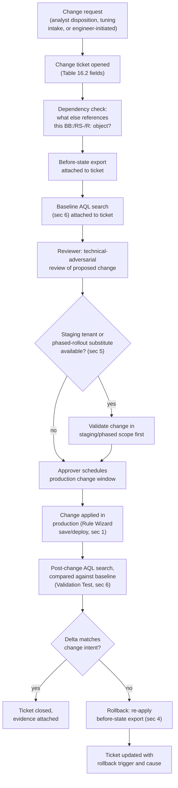

# Part 16 — Rule Change Management Without a Detection-as-Code Pipeline

## Why this part exists

**[CONCEPT]** DEH Part 22 built a whole discipline on one mechanical premise: a Detection Rule is a piece of software with a lifecycle, and every failure mode software engineering already solved — an untested change shipping broken, one person's typo reaching production with no second set of eyes, nobody knowing which version is actually running, a bad change with no way back — happens to detection rules too, usually with less visibility, because a broken rule doesn't crash or throw an error. DEH Part 22's fix is a git-based rule repository: a protected branch, a pull request per change, automated lint and regression tests that gate the merge button, and a three-role separation of duties (author, reviewer, merge-approver) enforced by branch protection settings rather than trusted to memory.

QRadar's Rule Wizard does not hand a team that pipeline for free. A `Rule`, a `BB:`-prefixed Building Block, or an `RS-`-prefixed Reference Set is edited directly in the Console by anyone holding the right administrative role, saved, and — subject to the propagation behavior this part flags with a PRODUCT VERSION NOTE below — live. There is no protected branch a change has to merge into, no required status check that blocks a save the way a red CI job blocks a merge button, and no platform-native concept of "this Rule is under review" that stops a second administrator from editing it mid-review. This is the honest gap Part 9 already named for Building Block governance at scale and Part 15 already named for the tuning-intake workflow; this part is where the gap gets a full, dedicated treatment rather than a paragraph each.

None of what follows is a claim that QRadar secretly has a hidden CI system this book failed to find. It's the opposite: a console-native platform genuinely does not give a team DEH Part 22's structural guarantees, and pretending otherwise — assuming "we have a change-ticket process" delivers the same protection as "the merge button is red until tests pass" — is exactly the kind of process-versus-mechanism confusion DEH Part 22 §3 warns against for its own git-based model. What a disciplined team builds instead is a set of compensating practices: a change-ticket workflow standing in for a pull request, a manual export-before-you-edit habit standing in for `git log`, a staging environment where licensing allows one, and a before/after regression-testing discipline built on the AQL search syntax DEH Part 27 §1 and §3.2 already teach. Each one is weaker than its DEH Part 22 counterpart in a specific, named way; this part states each weakness plainly rather than dressing up a paper process as equivalent to a CI gate.

This part does not re-teach AQL syntax — every baseline-capture query below points back to DEH Part 27 §1 and §3.2 rather than re-explaining `SELECT`/`WHERE`/`LAST n HOURS` from scratch — and it does not re-argue Sigma-first-vs-native authoring, which DEH Part 23 §5 already resolves generically: Sigma-first authoring pays for itself when the same logic runs on more than one backend, and pays for itself less clearly in a single-platform shop that has invested in that platform's own native constructs. A QRadar-only shop's Building Blocks, Reference Sets, and Rules are exactly that second case — natively authored, natively edited, with no Sigma intermediary and no git repository underneath them by default. This part is about the compensating discipline that gap requires.

---

## 1. The gap, named precisely

**[PLATFORM ENGINEER]** Table 16.1 maps DEH Part 22's pipeline stages directly onto what QRadar's Console gives a team at each stage, without softening the comparison — the point of naming the gap this specifically is that a vague "QRadar is less mature here" claim doesn't tell an engineer which specific control they need to build by hand.

**Table 16.1 — DEH Part 22 pipeline stage vs. QRadar's console-native equivalent.** Supports deciding exactly which control a team has to build itself, rather than assuming any given DEH Part 22 guarantee transfers for free.

| DEH Part 22 pipeline stage | What it guarantees | QRadar Console equivalent | What's missing |
|---|---|---|---|
| Git repository, one file per rule | Full change history, diff view, permanent audit trail | No native git-backed repository for `R:`/`BB:`/`RS-` objects | No diff view; revision depth is a PRODUCT VERSION NOTE item (§4) |
| Feature branch per change | Isolated draft, no risk to production until merged | No branching concept — an edited Rule is the live Rule | A "draft" edit and a "live" edit are the same object; there is no isolated workspace |
| Required CI lint/schema check | Structurally blocks a malformed change from merging | Rule Wizard field validation only (syntax-level, not logic-level) | No automated check that a Building Block's Rule Test still matches its documented intent |
| Automated regression test against fixtures | Objective, repeatable pass/fail before merge | None native | Manual AQL baseline-and-diff is the substitute (§6) |
| Human technical review, recorded approval | A named second person attested the change, structurally required to merge | No required-approval concept on a Rule save | A change-ticket approval field is a norm, not a gate (§3, §8) |
| Merge-approver, distinct third role | A named third person confirmed release-readiness | No merge step at all — saving *is* releasing | Same weakness as above, compounded: there is no moment between "reviewed" and "live" |
| CD deploy to production | Deliberate, logged promotion event | Saving the Rule Wizard form | No separate deploy action to gate or log independently of the edit itself (see §1's PRODUCT VERSION NOTE) |
| Rollback to a prior committed version | `git revert`, redeploy, done | None native beyond whatever revision history the Console retains | Export-before-edit is the substitute (§4) |

**[PLATFORM ENGINEER]** The pattern across every row is the same: DEH Part 22's guarantees are *structural* — enforced by a tool that will not let a bypass happen quietly — and QRadar's console-native equivalents are, at best, *procedural*: a team can build a process that looks the same on paper, but nothing stops an administrator with the right role from skipping every step and saving the change directly. §8 returns to this distinction as this part's closing Blind Spot: none of what follows makes a bypass impossible, only harder to do by accident and easier to catch after the fact.

> **PRODUCT VERSION NOTE**
> Whether saving a change in the Rule Wizard (or a Building Block or Reference Set edit) takes effect against live, incoming events immediately, or requires a separate explicit deploy/activate action first, and how long that propagation takes to reach every Event Processor in a distributed deployment (Part 2's component catalog), are specifics that have varied across QRadar releases and deployment topologies. Some QRadar administrative changes elsewhere in the platform (network hierarchy edits, for instance) are known to require an explicit "deploy changes" step rather than taking effect on save alone; whether Rule/Building Block edits behave the same way in your specific release is not a claim this part asserts as fixed. Verify the exact save-to-live behavior, and the propagation latency across your own distributed deployment, before treating a change as "not yet live" or "already live" without checking.

---

## 2. What breaks first when there's no pipeline: three named failure modes

**[RULE ENGINEER]** Before building the compensating workflow, it's worth naming the specific ways a console-native, ungated edit actually goes wrong in practice — not as an abstract risk, but as three concrete failure shapes a change-ticket discipline is built to catch.

**The silent ripple edit.** A Building Block referenced by a dozen Rules gets its Rule Test tightened to fix one Rule's noise problem, without anyone checking which other Rules depend on that same `BB:` name. Part 9's governance discipline already names this risk for Building Block sprawl generally; this part's concern is narrower — the *moment* of the edit. A `BB:` edit has no analog to a compiler's "this symbol is referenced in 11 other files" warning; the only way to know is to check manually, before editing, which Rules currently reference the Building Block being changed.

**The overlapping-edit collision.** Two administrators, working from two different change tickets, edit the same Reference Set's TTL setting within the same afternoon, each unaware of the other's change. Without a lock or a branch, the second save silently overwrites the first — not merged, not flagged as a conflict, just gone, with no record the first administrator's intended change ever existed except whatever the change-ticket system captured on its own (§3).

**The untested "obvious" fix.** An analyst's Part 14 triage disposition correctly identifies that `RS-Allowlisted-LSASS-Tools` is missing an entry, and — under queue pressure — someone with Reference Set write access adds it directly, skips the change-ticket process because "it's just one line," and never checks whether the added value is specific enough (full path and hash, not a bare filename) to avoid reopening the exact evasion gap DEH Part 27 §3.3's own False Positive Trap already names for this Reference Set.

> **Platform Reality**
> None of these three failure modes require malice or even carelessness in the ordinary sense — each one is a reasonable individual decision made without visibility into the platform's own dependency graph, because QRadar's Console does not surface that graph proactively. Before editing any `BB:`-prefixed Building Block, the practical habit that substitutes for a missing "used by" warning is running an AQL search (per DEH Part 27 §1's syntax, not re-taught here) against your own Rule/Building Block export or REST API listing for the literal string of the Building Block's name, to enumerate every Rule that currently references it. This is a five-minute manual check standing in for something a real dependency-aware IDE would surface instantly — worth budgeting the five minutes rather than skipping it under queue pressure.

---

## 3. The change ticket: a paper pull request

**[RULE ENGINEER]** A change ticket is this workflow's substitute for DEH Part 22's pull request — the single artifact that records what changed, why, who proposed it, who reviewed it, and what evidence justified calling it done. Table 16.2 defines the fields a change ticket needs to carry the same weight a PR's description and review thread carry in DEH Part 22's model, adapted from that part's metadata standard (§4 there) to the object types this book's Rule Wizard actually edits.

**Table 16.2 — Required fields on a QRadar rule-change ticket.** Supports giving a reviewer everything DEH Part 22's PR template gives a reviewer, in a system with no PR template.

| Field | Populated by | Purpose |
|---|---|---|
| Object(s) changed | Requester | The exact `R:`, `BB:`, or `RS-` name(s) — never a paraphrase, per this book's STYLE-GUIDE §4 object-naming rule |
| Reason for change | Requester | The Tuning-vs-Suppression fork stated explicitly (DEH `TERMINOLOGY.md`'s definitions, carried forward unchanged) — is this a logic change or a filter change, and why |
| Dependency check | Requester, before submission | The result of §2's "what else references this Building Block" check — a named list, not "nothing that I know of" |
| Before-state export | Requester | The exported current definition, per §4's export-before-you-edit discipline — attached to the ticket, not just described |
| Proposed after-state | Requester | The literal proposed Rule Test wording, threshold value, or Reference Set entry — quoted, not summarized |
| Baseline AQL evidence | Requester or reviewer | The §6 before-change match count/sample, so the reviewer isn't reviewing logic in the abstract |
| Reviewer | A different named individual | Technical-adversarial review — does the dependency check look complete, does the baseline evidence support the claimed effect |
| Approver | A third named individual, where staffing allows (§9) | Confirms release-readiness; on a two-person team, may collapse with reviewer per DEH Part 22 §3's own staffing-constrained allowance, but never with the requester |
| Change window | Approver | When the edit will actually be made — deliberately scheduled, not "whenever," so a post-change regression check (§6) has a known point to measure from |
| Post-change validation evidence | Requester, after the change window | The §6 after-state AQL comparison, confirming the change produced the intended delta and nothing else |
| Rollback plan | Requester, before submission | The specific action to restore the before-state export if post-change validation fails |

**[SOC MANAGEMENT]** A ticket carrying every field above is not a bureaucratic tax for its own sake — it is the only mechanism this workflow has for reconstructing, six months later, why a given Building Block's Rule Test reads the way it does. DEH Part 22's `git log` answers that question automatically; a QRadar deployment with no equivalent audit trail answers it only if the ticket discipline was actually followed at the time — which is exactly why §8's Blind Spot matters: a template with every field defined is worthless the moment someone with Admin access decides a change is too small to bother filing one for.

---

## 4. Revision history and the export-before-you-edit habit

**[RULE ENGINEER]** DEH Part 22's rollback mechanism is mechanical and cheap: `git revert` the merge commit, redeploy, done, with the full prior state recoverable because it was never overwritten in the first place — only ever committed alongside the new version. QRadar's Console does not give a rule author that same guarantee by default, which is exactly why the export-before-you-edit habit exists: before touching any `R:`, `BB:`, or `RS-` object under a change ticket, export its full current definition and attach that export to the ticket (Table 16.2's before-state field) *before* making the edit, not after.

This is deliberately the cheapest possible substitute for version control, not an elegant one: a manually-triggered snapshot, taken once per change, stored wherever the change-ticket system stores attachments — not a continuously tracked history. If the change-ticket discipline lapses for one edit, that edit's prior state is not recoverable from this mechanism at all, which is the direct cost of a manual habit standing in for an automatic one.

> **PRODUCT VERSION NOTE**
> Two specifics in this section are not fixed, universal capabilities and both vary across QRadar releases. First, whether the Console retains its own native revision history for a Rule or Building Block — a viewable, restorable "prior versions" list versus only a "last modified by/at" audit-log entry with no restorable content — and how far back it extends. Second, the exact mechanism for exporting a Rule's, Building Block's, or Reference Set's full definition (the QRadar REST API, a content-extension export bundle through Admin > Extensions Management, or another current path) and the format that export takes. Do not build a rollback plan that assumes native history will save a team that skipped the export-before-you-edit habit; verify both specifics against your own deployment before relying on either as this workflow's rollback attachment. Whichever export mechanism is current, the requirement that matters is that it captures the object's full logic — every Rule Test, every Building Block reference, the Reference Set's membership or TTL/type configuration — not just its name and a timestamp.

**[RULE ENGINEER]** A rollback under this model mirrors the export step: re-apply the attached before-state export through the same Rule Wizard (or reimport it, if the mechanism round-trips directly), verify against a second baseline AQL check (§6) that the restored object behaves as the pre-change export implies, and close the ticket noting the rollback and its trigger. This is slower and more error-prone than `git revert` — a manual re-entry of Rule Test conditions is itself an opportunity to introduce a second mistake while undoing the first — the honest cost of not having a mechanical rollback, not a gap this workflow can fully close.

---

## 5. A staging tenant, where licensing allows one

**[PLATFORM ENGINEER]** DEH Part 22's CI stage runs every proposed change against test fixtures in an environment that cannot affect production, before a human even looks at it. The closest QRadar equivalent is a genuinely separate staging deployment — its own Console, its own licensed EPS/FPM budget, ideally fed a realistic sample of the same log sources — where a proposed Rule, Building Block, or Reference Set change can be deployed, evaluated against live-shaped traffic, and observed for a validation window before the same change is made in production.

**[SOC MANAGEMENT]** The honest constraint this section exists to state plainly: a second QRadar deployment is not a free sandbox the way a CI runner spinning up a disposable container is. It is commercial infrastructure with its own licensing cost (Part 17 covers EPS/FPM licensing and capacity planning in full), and "stand up a staging tenant" is not a recommendation this part can make without naming that tradeoff. Where a staging deployment genuinely isn't in the budget, three partial substitutes carry real, if lesser, value:

- **A disabled or clearly-labeled test copy of the Rule inside the same production deployment**, its Response deliberately configured to log or update a test-only Reference Set rather than create a live Offense, evaluated against a narrow window of real traffic before the production Rule is edited — tests against real data with no second license, at the cost of running overlapping logic side by side temporarily, which needs its own change-ticket-tracked cleanup step so it doesn't become permanent clutter.
- **A phased rollout scoped by Network Hierarchy or log source**, deploying the changed logic against one segment or one Log Source type first and widening scope only after a defined observation window — a partial substitute for staging isolation, at the cost of tracking which segment is running which version for the duration of the phase.
- **Domains and tenants (Part 21) as partial isolation**, where a deployment already runs multi-tenant — but only where the object under test is genuinely scoped to one Domain and shares no state with Domains outside the test; a Reference Set referenced across Domain boundaries defeats this isolation immediately, so confirm scope before relying on it.

> **PRODUCT VERSION NOTE**
> Whether a given QRadar licensing tier or delivery model (on-prem, cloud-hosted, hybrid — Part 2 §4's own PRODUCT VERSION NOTE covers this space in full) permits or discounts a genuinely separate non-production/staging deployment, and what that costs relative to a single production license, is commercial-packaging information this part does not have current visibility into and does not assert as fact. Confirm current licensing options for a staging environment with IBM or your reseller before budgeting one, rather than assuming either that it's readily available or that it isn't.

---

## 6. Manual regression testing: baseline, change, re-baseline

**[RULE ENGINEER]** This is the section that substitutes for DEH Part 22's automated fixture-based regression test, and it is where this part leans hardest on AQL syntax DEH Part 27 already teaches rather than reinventing it. The method is a before/after comparison run as an ad hoc AQL search — exactly the investigative use DEH Part 27 §1 and §3.2 already establish for AQL, applied here to a change-validation purpose rather than a hunt or an investigation.

**Before the change:** express the *current* Building Block or Rule Test condition as an AQL search over a representative historical window, and record the match count and a sample of matched entities. For a proposed tightening of `BB:LSASS-Access-Candidate` (DEH Part 27 §3.3's own worked example, carried forward here as the running case), that baseline search is structurally the same shape as DEH Part 27 §3.2's own investigative query:

```sql
-- QRadar AQL, per DEH Part 27 sec1/sec3.2 syntax and disambiguating comment convention —
-- not standard SQL, no general-purpose JOIN, LAST n HOURS is QRadar's own time-window
-- shorthand. Baseline capture for a proposed BB:LSASS-Access-Candidate tightening: run
-- BEFORE the change, over a representative window, and keep the result attached to the
-- change ticket (Table 16.2's "Baseline AQL evidence" field) as the pre-change reference
-- point. Property names and the QID display string are illustrative per DEH Part 27 sec3.2's
-- own caveat — verify against your own Log Activity field list before reuse.
SELECT "Source Process Name", "Target Process Name", "Granted Access", COUNT(*) AS "Matches"
FROM events
WHERE QIDNAME(qid) = 'Process accessed'
  AND "Target Process Name" ILIKE '%lsass.exe%'
  AND ("Granted Access" = '0x1010' OR "Granted Access" = '0x1410')
GROUP BY "Source Process Name", "Target Process Name", "Granted Access"
LAST 30 DAYS
```

**Apply the change** inside the scheduled window Table 16.2's ticket records, per §1's PRODUCT VERSION NOTE on save/deploy propagation.

**After the change:** re-run the same search, adjusted only for the new condition, over an equivalent-length window starting after the change took effect, and compare the resulting match set against the baseline by hand: did the entries the change intended to exclude actually disappear, did anything unexpected also disappear, and did any previously-unmatched activity newly appear. This is a manual diff, not an automated one — DEH Part 22's fixture-based CI test asserts pass/fail automatically; this workflow's equivalent is a human reading two AQL result sets side by side and reasoning about whether the delta matches the change's stated intent.

> **Validation Test**
> **Setup:** A change ticket proposing to add a specific process path to `RS-Allowlisted-LSASS-Tools` (a Tuning change per DEH `TERMINOLOGY.md`'s definition, carried forward unchanged per this book's STYLE-GUIDE §12), with the before-state export and a baseline AQL search (matching the query above) attached, showing the process path's current match count and sample entities over the prior 30 days.
> **Action:** Apply the Reference Set change inside the ticket's scheduled window; after the window, re-run the identical baseline AQL search over the next comparable period.
> **Expected result:** The specific process path no longer appears in the post-change result set (confirming the exclusion took effect), every other previously-matching process path still appears at a comparable rate (confirming the change didn't accidentally broaden the exclusion or affect unrelated matches), and the ticket is closed with both AQL result sets attached as the recorded before/after evidence. If the specific path still appears post-change, the Reference Set edit didn't propagate as expected — check §1's PRODUCT VERSION NOTE on save/deploy timing before assuming the logic itself is wrong.

**[RULE ENGINEER]** This method has a real limitation worth stating rather than glossing over: it validates against *historical* traffic, not against the specific live event a genuine attacker will eventually generate. A baseline-and-diff check confirms the change behaves as intended against what has already happened; it says nothing about a novel technique variant that hasn't appeared in the 30-day window either before or after the change. This is the same distinction DEH Part 27 §3's own Detection Test callout draws between confirming a Rule Test's field logic (§3.1 there) and confirming the Rule actually fires against a live, deliberately generated test event — where staffing and environment allow it, pair this section's historical baseline-diff with an actual Detection Test-style live trigger (DEH Part 27 §3.3's own Setup/Action/Expected result) rather than treating the historical comparison alone as sufficient proof the change works.

---

## 7. Putting it together: an end-to-end change workflow

**[RULE ENGINEER]** Figure 16.1 ties §3 through §6 into one repeatable path, explicit about where this workflow's compensating controls sit relative to DEH Part 22's pipeline stages in Table 16.1.





**Figure 16.1 — A console-native rule-change workflow, end to end.** *CONCEPTUAL.* Illustrates this part's own compensating-control sequence — change ticket, dependency check, export-before-edit, staging or phased validation where available, baseline-and-diff regression testing, and a rollback path keyed to the before-state export — mapped against DEH Part 22's pipeline stages from Table 16.1. Not a reproduction of any QRadar-provided workflow feature or a claim that the platform enforces any of these steps natively; every arrow in this diagram is a process discipline a team has to actually follow, not a gate the Console itself enforces.

---

## 8. Where the substitute still falls short

**[RULE ENGINEER]** Every recommendation above is a procedural control layered on top of a platform that enforces none of it. That's worth stating once, directly, rather than leaving it implied by the diagram's own honesty.

> **Blind Spot**
> Nothing in Figure 16.1's workflow is structurally enforced by QRadar the way DEH Part 22 §3's branch-protection settings structurally block a self-approved merge. Any administrator holding Rule Wizard, Building Block, or Reference Set write permission can open the Console, edit `BB:LSASS-Access-Candidate` directly, and save — no ticket, no dependency check, no baseline capture, no reviewer, no approver — and the platform will not stop them or even distinguish that edit from one made correctly through the full workflow. The change-ticket process in §3 is a norm the team has agreed to follow, not a mechanism the Console enforces the way a required CI status check enforces DEH Part 22's gate. The only real mitigations available inside the platform itself are permission scoping (restricting write access to a small, named group, the principle DEH Part 22 §1's Engineering Reality box applies to console-managed detections generally) and after-the-fact review of whatever administrative audit trail QRadar retains (subject to the same revision-depth PRODUCT VERSION NOTE as §4) — neither prevents a bypass; both only make one detectable after it's already happened.

**[SOC MANAGEMENT]** This is the honest cost line a budget conversation about QRadar rule governance needs stated plainly: the discipline in this part substitutes people and process for tooling DEH Part 22's git-based model gets for the cost of a repository and a CI runner. That substitution is not free — it costs the change-ticket overhead §3 names, the dependency-check time §2's Platform Reality box names, and the ongoing management attention required to keep a norm from eroding the way §2's "obvious" fix scenario describes. A team that budgets zero time for this discipline is budgeting for a governance outcome the platform cannot provide without the people-hours this part describes.

> **SOC Management View**
> Sizing this discipline against headcount is a direct, answerable question: every `BB:`/`RS-`/`R:` change needs a requester's time to file the ticket and run the dependency check and baseline query, a reviewer's time to read the ticket and evidence critically, and — separately, staffing allowing — an approver's time to schedule and confirm the change window and post-change validation. On a two-person function, reviewer and approver commonly collapse into the same senior person, mirroring DEH Part 22 §3's own staffing-constrained allowance; what never collapses is the requester also serving as their own reviewer — a self-approved edit is exactly the "it's just one line" bypass §2 names as this workflow's most common real failure mode. Budget the review time explicitly in whatever staffing model Part 22 sizes a QRadar practice against, rather than treating rule-change review as free because no licensing invoice makes the cost visible the way a CI runner's bill would.

---

## 9. What would make this gap close

**[PLATFORM ENGINEER]** This part's whole premise — that QRadar's console-native workflow forces a procedural substitute rather than handing a team DEH Part 22's structural guarantees — describes the platform's architecture as understood at the time of writing, not a permanent verdict. A native, version-controlled rule-authoring surface (built into the Console itself, or delivered as an App Framework app per Part 19's survey) that gave Rules, Building Blocks, and Reference Sets a real diff view, a required-approval gate before a save takes effect, and a one-click revert would close most of Table 16.1's gap rows directly, and this part's compensating workflow would shrink to whatever residual gap remained.

> **PRODUCT VERSION NOTE**
> Whether any current QRadar release or App Framework app (Part 19's survey names Use Case Manager, Pulse, and UBA as commonly deployed apps, at a survey level) provides a rule-versioning, approval-gating, or diff capability closer to DEH Part 22's git-based model than the plain Rule Wizard does, is not something this part asserts either way. Such a capability would not eliminate the dependency-check and baseline-regression discipline in §2 and §6 — those substitute for CI-style testing, which a versioning app alone doesn't provide — but it would strengthen the review-gate and rollback rows of Table 16.1. Check your own deployment's current App Exchange catalog and release notes before assuming the plain Rule Wizard is the only authoring surface available.

---

**Cross-references:** DEH Part 22 (Detection as Code — the pipeline this part's workflow substitutes for, stage by stage in Table 16.1); DEH Part 23 §5 (Sigma-first vs. native authoring — why a QRadar-only shop's Rules have no Sigma intermediary to version); DEH Part 27 §1, §3.2, and §3.3 (AQL syntax and the `BB:LSASS-Access-Candidate` / `RS-Allowlisted-LSASS-Tools` / `R: Suspicious LSASS Access — Unapproved Process` worked example this part's §6 reuses without re-teaching); DEH `TERMINOLOGY.md` (Tuning, Suppression — inherited unchanged). Within this book: Part 2 §4 (the packaging/delivery-model PRODUCT VERSION NOTE §5 extends); Part 9 (Building Block governance — the dependency-sprawl risk §2 names); Part 15 (the tuning-intake workflow generating most of this part's change requests); Part 17 (licensing/capacity planning behind §5's staging-tenant tradeoff); Part 19 (App Framework — where §9's version-control-app possibility would live); Part 21 (Domains/tenants — the partial isolation substitute §5 names); Part 22 (the staffing model §8's SOC Management View feeds).
