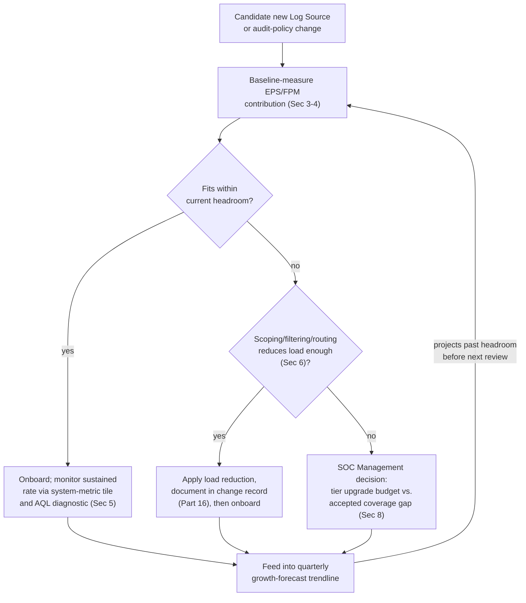

# Part 17 — Licensing, EPS/FPM Management, and Capacity Planning

## Why this part exists

**[CONCEPT]** DEH Part 27 §1.3 flags QRadar's licensing model in exactly one paragraph — a QRadar deployment is licensed by sustained Events Per Second (EPS) and Flows Per Minute (FPM), not by indexed data volume or analyst seat count, and a Sysmon rollout that widens its collection scope or a new Log Source that pushes sustained throughput past its licensed tier "does not silently get ingested for free." That paragraph exists in DEH Part 27 to make one narrow point: a detection engineer designing an analytic against QRadar cannot borrow the mental model a storage-priced, volume-billed cloud-native SIEM might teach — where ingesting more data mostly just costs more money at the end of the month — because QRadar's own correlation and search capacity is bounded by a rate limit that behaves differently under sustained overage. This part is the deep dive that single paragraph promises but has no room to deliver: what the EPS/FPM licensing model actually measures, what a burst allowance is and how overage actually plays out operationally, how to size a candidate Log Source before it goes live rather than after the license-overage notification fires, what growth forecasting looks like as a recurring discipline instead of a one-time appliance-sizing exercise at initial deployment, and — the concrete question every SOC eventually asks — what onboarding one new, genuinely noisy Log Source really costs.

This part also picks up a thread DEH Part 23 §5 states in general terms for cross-platform analytic design: whether a Sigma-first authoring investment pays off depends on backend-specific constraints that a single canonical example doesn't need to enumerate. Licensed EPS/FPM capacity is exactly that kind of constraint for QRadar specifically — a detection design ported from a volume-priced backend, or authored with no backend in mind at all, can be logically correct and still be unaffordable to run the way it was designed, once its actual event rate is measured against a real license tier. This book's own Part 2 (deployment architecture) already named the Event Processor as the component actually running the Custom Rules Engine (CRE) and writing to Ariel storage — this part is about the rate limit that component's licensed capacity imposes on everything upstream of it, and how a platform engineer plans for that limit rather than discovering it during an incident.

---

## 1. What EPS and FPM actually meter

**[CONCEPT]** A QRadar license entitles a deployment to a specific sustained Events Per Second rate and a specific sustained Flows Per Minute rate — two independent metered dimensions, because event data (parsed log records) and flow data (network-traffic records, Part 7) arrive through different collection paths and are licensed separately. "Sustained" is the operative word: EPS/FPM licensing is not a hard per-second ceiling that instantly rejects the 501st event in a second licensed for 500, any more than a highway's posted speed limit rejects a single moment of acceleration — it is a rate the deployment is licensed to sustain over time, with tolerance for short-term variance above that rate (§2) and consequences that accumulate specifically under *sustained* overage rather than a single burst.

This is a genuinely different resource from the one Part 12 covers for Ariel search performance. EPS/FPM capacity governs how much data the deployment is licensed and provisioned to *ingest and correlate* in real time; Ariel search capacity governs how much of that already-ingested data can be *queried* concurrently without analysts competing for the same search resources. A deployment can be well within its EPS tier and still have slow, contended Ariel searches during a heavy report-generation window (Part 13 §3), and a deployment can have fast, uncontended search performance and still be in sustained license overage — the two constraints are adjacent but not the same conversation, and conflating them is a common capacity-planning mistake: buying more search-side hardware does not raise a licensed EPS ceiling, and raising an EPS tier does not by itself fix a slow, contended search.

> **PRODUCT VERSION NOTE**
> Whether a given QRadar deployment's EPS/FPM entitlement is delivered as a fixed on-premises appliance tier, a flexible cloud/SaaS consumption model, or some hybrid of the two — and which IBM business unit or partner currently owns sale, packaging, and support for that entitlement — has shifted across release cycles and business decisions this book does not have current visibility into at time of writing, exactly the packaging/ownership risk `STYLE-GUIDE.md` §11 flags as aging fastest. State a specific tier number, contract structure, or delivery model to your own organization's procurement or IBM account team as something to verify directly rather than something this part can hand you as settled fact.

### 1.1 Tiers, not a single number

**[PLATFORM ENGINEER]** A license entitlement is packaged as a tier — a bundled EPS ceiling and FPM ceiling sized together, because most deployments' event and flow load scale together with the same underlying infrastructure growth (more hosts, more network segments, more traffic). A distributed deployment (Part 2) may also license individual Event Processors or Flow Processors against a portion of the total entitlement, so that "are we within license" is not always a single deployment-wide number to check — it can be a per-processor question, particularly once a deployment has grown past its original All-in-One or single-processor footprint. Confirm which shape your own entitlement takes before treating any single EPS figure quoted in a vendor conversation as the complete answer for a multi-processor deployment.

---

## 2. Burst allowance and what sustained overage actually does

**[PLATFORM ENGINEER]** QRadar's licensing model tolerates short-term bursts above the sustained licensed rate — a brief spike during a batch job, a log-rotation event, or a burst of authentication failures during a real incident should not immediately degrade correlation the moment it crosses the licensed ceiling for a few seconds. What counts as "short-term" and how far above the sustained rate a burst is tolerated before it registers as an overage condition is itself part of the licensing model, not an emergent side effect — but the exact burst window and percentage are the kind of specific, version- and packaging-sensitive figures this book will not assert as a fixed number (see the PRODUCT VERSION NOTE below). What is stable across the platform's history, and consistent with DEH Part 27 §1.3's own framing, is the shape of the consequence: a *sustained* rate above the licensed tier — not a momentary spike — is what triggers a logged license-overage condition, and sustained overage is what risks degraded event or flow processing rather than a brief burst being absorbed and forgotten.

> **Platform Reality**
> The documented behavior most teams can find without much digging is that sustained overage gets logged as a notification-level event and is visible somewhere in the deployment's own system-notification feed or Offense/system dashboard (Part 13 §1.1's system-metric tile category). What is less consistently understood, and matters more operationally, is what happens to the data itself once a deployment sits in sustained overage rather than a brief burst: throughput above the licensed ceiling is not guaranteed to be processed with the same priority or timeliness as licensed-rate traffic, and a deployment that has been quietly over its tier for weeks — not because anyone made a deliberate decision, but because a Log Source's own logging verbosity crept upward after a vendor agent upgrade — can have events delayed into Ariel later than their actual timestamp, or dropped outright, well before anyone reads the notification that first flagged the condition. Treat a license-overage notification as an incident-severity finding, not a background housekeeping item: the gap between "overage was first logged" and "someone looked at it" is exactly the window in which correlation against real telemetry can be silently degraded.

> **PRODUCT VERSION NOTE**
> The specific burst-tolerance window and percentage above the sustained licensed rate, the exact overage grace period before enforcement behavior changes, and whether enforcement means throttling, delayed processing, selective dropping, or a purely advisory notification with no data-plane effect at all, have been described differently across QRadar releases and licensing packaging changes. Verify the current overage-handling behavior for your specific license tier and deployment version directly against IBM's current documentation and your own support contract before designing a capacity margin around an assumed grace period.

---

## 3. Sizing a candidate Log Source before it goes live

**[PLATFORM ENGINEER]** The failure mode this section exists to prevent is the one DEH Part 27 §1.3 names in miniature: a team widens a Sysmon deployment to log Event ID 1 (Process Create) fleet-wide, or onboards a new EDR agent's full telemetry stream, without first estimating what that change actually costs in sustained EPS — and finds out from a license-overage notification instead of a sizing exercise. The estimation itself does not require exotic tooling: it requires a baseline sample of the source's actual logging behavior, measured the way it will actually be configured in production, not a vendor's marketing figure for "typical" volume.

A workable sizing sequence: stand the source up against a small, representative subset of its eventual footprint (a handful of hosts, one collection channel, the actual verbosity level planned for production — not a minimal default that understates the real rollout); let it run long enough to capture a realistic mix of quiet and busy periods, not just a quiet baseline; measure the sustained rate that subset produced (§5 covers how); and extrapolate linearly to the full planned footprint, treating the extrapolation as a floor rather than a ceiling, since per-host log verbosity rarely decreases as an environment scales and a rollout that starts at ten hosts routinely ends up logging more per host once real production activity — not a quiet test environment — is what's generating the events.

Table 17.1 supports the first, coarser pass of that estimate: which category of Log Source tends to drive load for structural reasons, before any specific vendor's per-event size or per-host rate is measured.

**Table 17.1 — Log Source categories and what drives their EPS/FPM footprint.** Supports deciding which candidate sources need a measured baseline before onboarding versus which are safe to size by rough headcount alone.

| Source category | Primary load driver | Typical scaling factor | Verification note |
|---|---|---|---|
| Windows Security auditing (baseline: logon/logoff, object access) | Host count, audit-policy scope | Roughly linear with host count at a fixed audit-policy setting | A single Group Policy change widening audit scope (e.g., enabling object-access auditing broadly) can multiply this source's rate without any host-count change — re-baseline after any audit-policy change, not just after fleet growth |
| Sysmon (process creation, network connection, image load) | Host count, which Sysmon event IDs are enabled, config verbosity | Materially higher per-host rate than baseline Windows auditing; scales with both host count and config breadth | DEH Part 27 §1.3's own named example — verify per-host rate against the *specific* Sysmon config being deployed, not a generic figure, since two Sysmon configs of differing verbosity can differ by an order of magnitude on the same fleet |
| Firewall/perimeter (allow+deny logging) | Traffic volume, whether allowed traffic is logged in addition to denied | Highly deployment-specific; a policy that logs all allowed connections, not just denies, can dominate total EPS | Confirm whether "log all" or "log denies only" is the actual configured policy before sizing — this single setting is often the largest lever on this source category's contribution |
| EDR/endpoint telemetry (full behavioral stream) | Host count, telemetry tier selected (alert-only vs. full behavioral) | Full behavioral telemetry (process, network, file, registry events) is typically the single highest per-host rate among common source categories | The exact rate difference between an "alerts only" and a "full telemetry" integration tier is vendor- and version-specific on both the EDR product and QRadar's own DSM (Device Support Module)/app integration — measure both tiers against the same host subset if choosing between them |
| Cloud platform audit logs (IaaS/SaaS control-plane activity) | Tenant activity level, API call volume, breadth of services in scope | Can spike sharply and unpredictably with automated tooling (CI/CD pipelines, infrastructure-as-code runs) rather than scaling smoothly with headcount | Size against a period that includes at least one automated deployment cycle, not only interactive human activity, since the spike shape differs from every other row in this table |
| Flow data (NetFlow/sFlow/QFlow-derived) | Network segment breadth, sampling rate configured on the flow source | FPM, not EPS — scales with distinct flow count, which is sensitive to flow-timeout and sampling configuration independent of raw traffic bytes | A flow source's sampling rate is often configured outside QRadar's own console (on the router/switch/exporter) — confirm that setting directly at the source, not by assumption, before sizing FPM contribution |

---

## 4. The real cost of one new noisy Log Source — a worked walkthrough

**[PLATFORM ENGINEER]** Put §3's sizing discipline into a concrete sequence, because "measure before onboarding" is easy to state and easy to skip under deadline pressure. A SOC decides to extend EDR coverage from alert-only integration to full behavioral telemetry across 4,000 endpoints, because a recent incident review found the alert-only feed didn't retain enough raw process/network detail to answer a question the team needed answered during triage. The naive path is to flip the integration tier in the EDR console and the corresponding Log Source setting in QRadar the same afternoon. The sized path looks like this:

1. **Baseline a subset.** Enable full behavioral telemetry on 100 representative endpoints (a mix of workstation and server roles, not just one) for a week that includes normal business activity, not a holiday week.
2. **Measure the subset's sustained contribution** (§5) and compare it against the alert-only tier's already-known contribution from the same 100 hosts, to isolate the *delta* the tier change actually introduces — not the full new rate, which conflates the change with load the source was already contributing.
3. **Extrapolate to 4,000 hosts**, treating the 100-host measurement as a floor per §3's guidance, and add that delta to the deployment's current total sustained EPS.
4. **Compare the projected total against the current license tier's headroom** — not against the tier's raw ceiling, since some headroom needs to remain for organic growth and burst tolerance (§7).
5. **If the projected total exceeds available headroom**, the decision is no longer a configuration change — it is a licensing and budget decision (§8), with the tradeoffs a filtering approach can and cannot buy back (§6) as the alternative to a straight tier upgrade.

> **SOC Management View**
> The number that actually needs to reach whoever approves budget is not "we want better EDR telemetry" — it's the projected sustained EPS delta from step 3, translated into whatever unit your license tier is actually priced in, compared against current headroom from step 4. A request framed as a security-value argument alone ("this closes a real visibility gap the incident review found") is true and still incomplete without the capacity number attached, because the approver's actual decision is between a licensing cost and one of the mitigations in §6 — a decision that cannot be made well from the security argument alone. Bring both numbers to the same conversation: what the gap costs to close in security terms, and what it costs in licensed capacity terms, since a program that always argues the first without the second trains its own budget holders to discount the ask the next time, whether or not this specific request was justified.

---

## 5. Measuring actual load: AQL approximation and system-metric utilization

**[PLATFORM ENGINEER]** Two different views of "how much are we actually using" exist side by side in a QRadar deployment, and they answer slightly different questions. The system-metric dashboard tile category Part 13 §1.1 already names — a tile reading QRadar's own operational telemetry rather than an Ariel search — is the canonical source for total sustained EPS/FPM utilization against the licensed tier, because it reflects QRadar's own internal accounting of what it considers metered load, not an approximation. What it typically does not hand you in one glance is a per-Log-Source breakdown fine-grained enough to answer "which specific source is driving this number up" — for that, an ad hoc AQL search against the `events` table (DEH Part 27 §1.1–§1.2 owns the full syntax; not re-taught here) is the practical tool:

```sql
-- QRadar AQL — DEH Part 27 §1 owns full AQL syntax; shown here only to illustrate a
-- load-diagnostic search pattern, not to re-teach SELECT/FROM/WHERE/GROUP BY. LOGSOURCENAME()
-- resolves the internal log source ID to its configured display name (DEH Part 27 §1.2).
-- This query approximates per-source event volume for capacity diagnosis — it is not a
-- substitute for QRadar's own licensed-EPS accounting; see the Platform Reality note below.
SELECT LOGSOURCENAME(logsourceid) AS "Log Source", COUNT(*) AS "Event Count"
FROM events
LAST 1 HOURS
GROUP BY LOGSOURCENAME(logsourceid)
ORDER BY "Event Count" DESC
```

Divide the top result's `Event Count` by 3,600 to get an approximate average EPS contribution for that source over the hour searched — useful for identifying *which* source to investigate further, and a reasonable first estimate, but it carries two real limitations worth stating plainly rather than treating the number as authoritative. First, an hour-wide average smooths over exactly the short-term bursts §2 discusses — a source that spikes hard for five minutes and sits quiet the rest of the hour shows the same hourly average as one that sustains a flat, lower rate the whole time, and only the first of those two patterns is likely to matter for burst-tolerance planning. Second, this query counts events as stored in Ariel, which may not be identical to QRadar's own point of license metering in the ingestion pipeline (§6 covers why that distinction matters for filtering decisions specifically) — treat this as a strong diagnostic signal for *which* source to investigate, not as a replacement for the system-metric tile's own accounting when the two numbers need to be reconciled for a licensing conversation.

> **Platform Reality**
> A discrepancy between this section's AQL approximation and the system-metric tile's own reported utilization is not automatically a bug in either number — it is a reminder that "events counted in Ariel over an hour" and "QRadar's own licensed-EPS accounting" are not guaranteed to be defined identically, and a capacity-planning conversation that hinges on a precise number should use the system-metric tile (or QRadar's own licensing-status reporting, where your deployment exposes one) as the number of record, with the AQL breakdown used only to identify which source to act on.

---

## 6. Reducing load without losing detection value

**[PLATFORM ENGINEER]** When §4's projected total doesn't fit inside available headroom, a straight license-tier upgrade is one option, but it is not the only one, and it is not always the right one. Three categories of load-reduction are worth evaluating before defaulting to a bigger tier:

- **Scope the source's own verbosity.** Table 17.1's Windows-auditing and Sysmon rows both name this directly: an audit policy or Sysmon config that logs more event categories than any deployed Rule or Building Block actually consumes is pure licensed-capacity cost with no detection value behind it. Cross-reference which QIDs (QRadar's internal event-taxonomy identifiers) a given source's telemetry actually feeds into a deployed `BB:`-prefixed condition (Part 9's Building Block governance) before assuming every enabled event category is earning its EPS cost.
- **Filter at or near the source, not after ingestion.** Dropping a known-noisy, low-value event category at the collection point — a source-side logging policy change, or a filter configured on the Event Collector itself (Part 2 §1.2) before the event is parsed and counted — reduces load earlier in the pipeline than trying to exclude it via a Rule condition after the fact, which does not reduce licensed load at all since the event was already ingested and metered by the time a Rule evaluates it.
- **Route low-value verbose logs elsewhere.** A source whose full detail is valuable for compliance retention or forensic depth but not for real-time correlation is a candidate for dual-routing to a lower-cost, non-QRadar retention target, with only a filtered, high-signal subset actually forwarded into QRadar's licensed ingestion path.

> **PRODUCT VERSION NOTE**
> Where exactly in the pipeline QRadar's own EPS metering is calculated — at raw ingestion on the Event Collector (Part 2 §1.2), or after DSM parsing on the Event Processor (Part 2 §1.3) — determines whether a given filtering approach actually reduces licensed load or only reduces what gets parsed, indexed, and made searchable while the event still counts against the license at the point it was received. This book has no verified, version-current answer to state as settled fact for every release and packaging combination; confirm the actual metering point for your specific deployment against current IBM documentation before assuming a specific filtering technique buys back license headroom rather than only reducing storage and search-index load.

> **Blind Spot**
> Every filtering technique in this section reduces licensed load by making an event never arrive, or never get parsed, at all — which is indistinguishable, from a Rule's or a Building Block's perspective, from the source going quiet for an unrelated reason (Part 18's log-source-stops-parsing failure mode). A `BB:`-prefixed condition that used to fire reliably against a now-filtered event category stops firing with no error anywhere, exactly the silent-failure shape DEH Part 27 §3.1 already documents for a broken DSM/QID mapping — except here the cause is a deliberate capacity decision instead of an accident, which makes it easier to lose track of which Rules were quietly depending on a category someone else filtered out for capacity reasons six months later. Any filtering decision made for capacity reasons belongs in the same change-management record Part 16 asks a team to keep for a rule change, cross-referenced against which deployed Rules and Building Blocks consumed the filtered category, so a later detection-coverage review doesn't mistake "we chose to stop collecting this" for "this stopped working."

---

## 7. Growth forecasting as a recurring discipline

**[PLATFORM ENGINEER]** Capacity planning done once, at initial deployment sizing, answers the question the deployment had on day one. It does not answer the question a deployment has eighteen months later, after three new business units, one acquisition's worth of newly onboarded infrastructure, and a security program that has (correctly) pushed for wider telemetry coverage the whole time. Treating capacity planning as a recurring review — not a one-time sizing exercise — is the difference between a tier upgrade decided calmly ahead of need and a tier upgrade decided during a license-overage incident.

A workable recurring cadence tracks three inputs against current headroom on a fixed schedule (quarterly is a reasonable default for most SOCs): the deployment's actual trailing sustained EPS/FPM trend (measured per §5, trended over months, not read as a single point-in-time snapshot); the known onboarding pipeline — sources already committed to but not yet live, sized per §3–§4; and organic growth assumptions — headcount growth, infrastructure growth, or planned audit-policy changes that will increase load from *existing* sources without any new source being added at all. The output of that review is a single go/no-go decision made ahead of need: does the trend, plus the pipeline, plus organic growth, project past current headroom before the next scheduled review — and if so, is the answer a §6 load-reduction, a tier-upgrade budget request (§8), or an explicit, documented decision to accept a coverage gap rather than pay for the headroom.





**Figure 17.1 — Capacity planning as a closed loop, not a one-time sizing pass.** *CONCEPTUAL.* Illustrates the decision sequence this part builds section by section — baseline measurement, a headroom check, a load-reduction branch, and a SOC Management budget or accepted-gap decision — all feeding back into a recurring trendline review rather than terminating at "onboarded." Not a reproduction of any IBM capacity-planning workflow diagram; this book's own synthesis of the recurring discipline §7 argues for, illustrative only.

---

## 8. Budgeting the tier: the conversation this part has been building toward

**[SOC MANAGEMENT]** Every section above produces inputs to one recurring budget conversation: does the current license tier's headroom cover the deployment's actual and projected sustained load, and if not, which of the available responses — tier upgrade, load reduction, or an explicitly accepted gap — is the right call for this specific shortfall. Table 17.2 frames that decision as a comparison rather than a default, because "just upgrade the tier" is not always the answer a budget conversation should reach for first, and "just filter more aggressively" is not always safe to reach for either.

**Table 17.2 — Responses to a projected capacity shortfall, compared.** Supports deciding which lever to pull first when a growth-forecast review (§7) projects sustained load past current headroom.

| Response | What it actually buys | What it costs | Best fit |
|---|---|---|---|
| Tier upgrade | Headroom for the full projected load, including future organic growth beyond this specific shortfall | Recurring licensing cost, scaled to the new tier | A shortfall driven by broad, ongoing organic growth (more hosts, more business units) rather than one identifiable noisy source |
| Source-side filtering/scoping (§6) | Load reduction with no new recurring cost, if the filtered category has genuinely low detection value | Coverage risk if the filtered category turns out to matter later (Blind Spot, §6); ongoing maintenance to keep the filter's rationale documented | A shortfall traceable to one specific over-verbose source or policy setting where the value of the removed category is genuinely low or already covered elsewhere |
| Dual-routing to non-QRadar retention (§6) | Preserves full-fidelity retention for compliance/forensics while reducing QRadar's licensed ingestion specifically | Additional storage/retention infrastructure and a second system to maintain | A source whose value is mostly retention/forensic depth rather than real-time correlation |
| Explicitly accepted coverage gap | No cost, immediate | A named, documented Visibility Debt (DEH `TERMINOLOGY.md`; Part 13 §4's Blind Spot on the same concept) that has to be tracked, not quietly forgotten | A shortfall the budget genuinely cannot absorb this cycle, where the alternative to naming the gap honestly is discovering it during an incident review instead |

> **SOC Management View**
> The fourth row in Table 17.2 is the option every team is tempted to reach for silently rather than name explicitly, because it has no immediate cost — and it is exactly the option Part 13 §4's Blind Spot warns looks identical, from inside QRadar's own dashboards, to a deliberately well-tuned deployment with nothing missing. A capacity shortfall absorbed by quietly under-provisioning one source's onboarding, with no record of the decision, is Visibility Debt with a specific, nameable cause (a licensing budget constraint) that this part's own Table 17.1–17.2 sequence gives a team the vocabulary to document instead of losing. Bring the accepted-gap option to the same budget conversation as the tier-upgrade option, explicitly, rather than letting a shortfall resolve itself by default into whichever source's onboarding got quietly deprioritized — the review-cost and staffing consequences of a QRadar practice (this book's Part 22 capstone) assume a team that can point to *why* a gap exists, not one that discovers a gap it forgot it had chosen.

---

**Cross-references:** DEH Part 27 §1.1–§1.2 (AQL fundamentals and translation functions, applied to §5's diagnostic query rather than re-taught), §1.3 (the single-paragraph EPS/FPM licensing flag this part expands in full), §3.1 (the silent DSM/QID mapping failure whose shape §6's Blind Spot reapplies to capacity-driven filtering); DEH Part 23 §5 (backend-specific constraints on cross-platform analytic design, of which licensed EPS/FPM capacity is this platform's own instance); DEH `TERMINOLOGY.md` (Visibility Debt, invoked in §8); this book's Part 2 (Event Collector/Event Processor roles and where in the pipeline load is metered, §6), Part 4 (Log Source onboarding, §3–§4), Part 7 (flow architecture and FPM, §1/§3), Part 9 (Building Block governance, §6), Part 12 (Ariel search performance — the adjacent but distinct resource constraint named in §1), Part 13 §1.1/§4 (system-metric dashboard tiles and the Visibility Debt framing reused in §5/§8), Part 16 (change management for filtering decisions, §6), Part 18 (troubleshooting a source that stops parsing, §6), Part 22 (staffing and budget capstone referenced in §8).
