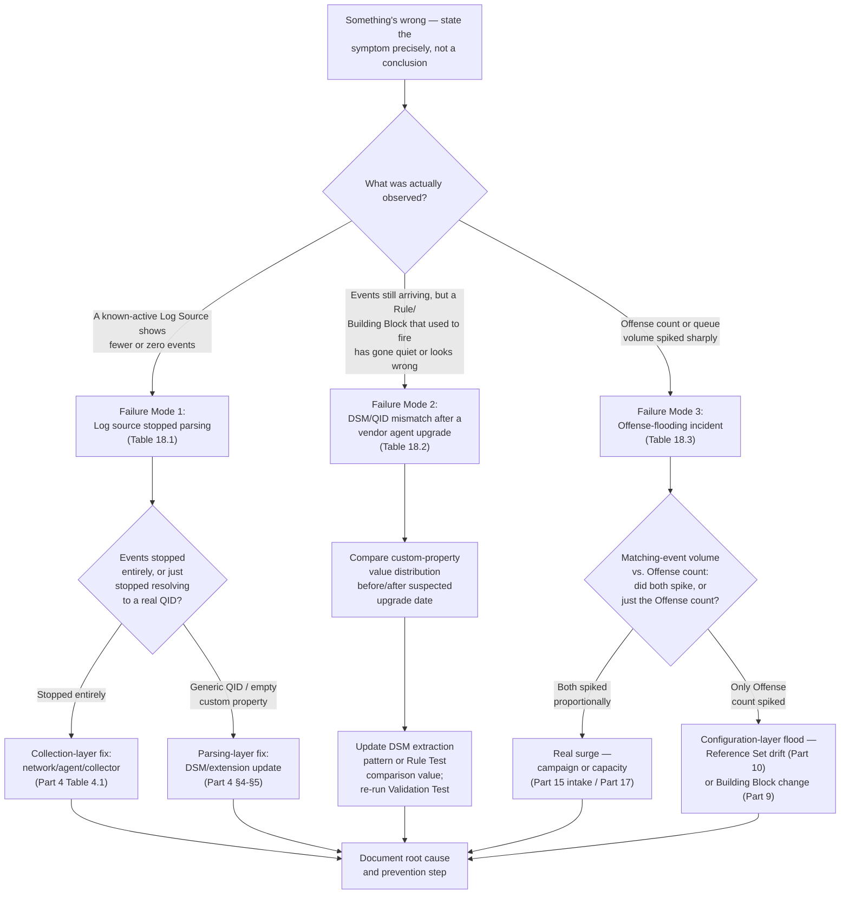

# Part 18 — QRadar-Specific Troubleshooting: Log Sources, DSMs, and Offense Flooding

## Why this part exists

Every other part in this book describes how something in QRadar is supposed to work — how a Log Source gets onboarded (Part 4), how a Building Block library stays governable at scale (Part 9), how a Reference Set's type and TTL should be chosen (Part 10), how a noisy Offense gets tuned rather than suppressed (Part 15). This part is what happens after one of those things has already gone wrong in production, and the person who has to figure out why is not the person who built it. DEH Part 27 §3.1 names this book's central operational hazard in one sentence, about one worked example: "an unmapped or partially-mapped event lands under a generic QID with no custom properties, and the query fails silently." DEH Part 27 §2.3's Blind Spot names a second, structurally related hazard: a chained Rule whose first stage silently stops firing takes its second stage down with it, with no error surfacing anywhere. Neither of those sentences was written as a troubleshooting guide — they were written to prove a design point about QRadar's correlation model. This part turns both into a repeatable diagnostic practice, and adds a third failure mode neither DEH part had reason to cover: what to do when the queue that was supposed to be quiet suddenly isn't.

This part is a playbook for three named failure modes — a Log Source that stops parsing, a DSM/QID mismatch surfacing after a vendor agent upgrade, and an offense-flooding incident — each walked the same way: **symptom, likely cause set, verification step, fix.** None of the three is exotic. All three share the same trap: QRadar's platform-health indicators (a Log Source showing green, an event count that looks nonzero, an Offense that exists) answer a narrower question than the one a troubleshooter actually needs answered, and mistaking the narrow question for the broad one is how a real platform fault gets misdiagnosed as a detection-logic problem, or vice versa. This part does not re-teach AQL syntax — every diagnostic query below leans on DEH Part 27 §1's function set (`QIDNAME()`, `CATEGORYNAME()`, `LOGSOURCETYPENAME()`) without re-explaining it — and it does not re-litigate Sigma-first-vs-native authoring, which DEH Part 23 §5 settles generically. It also does not re-derive the DSM onboarding lifecycle (Part 4), the Reference Set type taxonomy and TTL discipline (Part 10), or the tuning-intake workflow (Part 15); this part points at each as the thing that prevents its own failure modes from recurring, not restates it.

---

## 1. A troubleshooting mindset: symptom, likely cause set, verification, fix

**[CONCEPT]** The single mistake this part exists to prevent is treating a platform status indicator as an answer instead of as one data point. "The Log Source shows events arriving," "the Rule exists and is enabled," and "an Offense was created" are all true statements that can coexist with a completely broken detection — Part 4 §4 already demonstrates this for the narrower DSM/QID case, and the same shape recurs at every layer this part covers. A troubleshooter who stops at the first green indicator has confirmed the pipe is connected, not that anything useful is flowing through it.

The four-step method below is deliberately mechanical, because the alternative — jumping straight from symptom to a guessed fix — is how a real platform fault gets mistaken for a detection-logic problem, or the reverse: a Rule Engineer who assumes their Rule Test logic is fine because "it worked last month" spends a day rewriting Building Block conditions that were never the actual problem, while a DSM extension silently dropping a field after an agent upgrade sits untouched.

1. **Symptom.** State precisely what was observed, not what it's assumed to mean. "The Offense count for this Rule dropped to zero" is a symptom. "The Rule stopped working" is already a half-formed conclusion.
2. **Likely cause set.** Enumerate every plausible cause for that exact symptom before investigating any single one — this book's own Tables 18.1–18.3 exist to make that enumeration something a troubleshooter can look up under time pressure rather than reconstruct from memory during an incident.
3. **Verification step.** For each candidate cause, a specific check — an AQL search, a Reference Set membership review, a Log Source status field — that confirms or rules it out. This step is where most troubleshooting time should actually go; skipping straight to a fix based on the most familiar cause, rather than the verified one, is how a real fix gets applied to the wrong problem.
4. **Fix.** The remediation for the verified cause, plus — critically — the part of this book that keeps it from recurring. A fix with no linked prevention step is a fix this part considers incomplete.

> **PRODUCT VERSION NOTE**
> This part refers generically to "System Notifications," "Log Activity," and "the Offenses tab" as the console surfaces a troubleshooter checks first. The exact navigation path, the specific wording QRadar uses for a Log Source status or coverage-gap indicator, and whether a given notification appears as a dashboard item, an email alert, or only on manual review, have all varied across QRadar releases and delivery models (on-prem vs. cloud/SaaS). Verify the current notification surface and wording in your own deployment before building an incident runbook that assumes a specific screen name or alert path — the diagnostic logic in this part does not depend on any of those specifics holding still.

---

## 2. Failure mode 1 — A log source that stops parsing

**[PLATFORM ENGINEER]** "Stopped parsing" covers two symptoms that look similar from a distance but have almost entirely disjoint cause sets, and separating them is the first branch a troubleshooter has to take correctly:

- **The Log Source stops receiving events at all** — a collection-layer failure. Nothing reaches Ariel from this source, full stop.
- **The Log Source keeps receiving events, but they stop resolving to a meaningful QID (QRadar's internal event-taxonomy identifier) or custom-property set** — a parsing-layer failure. Bytes are arriving; the DSM stops making sense of them (or never did, for a subset of event types).

Table 18.1 separates the two, because confusing them wastes the first, most valuable diagnostic minutes of an incident — a platform engineer who spends an hour re-checking network connectivity for a source that is receiving data fine but parsing none of it is investigating the wrong layer entirely.

**Table 18.1 — Failure mode 1: a log source that stops parsing.** Supports deciding which layer (collection vs. parsing) actually failed before investigating either.

| Symptom | Likely cause set | Verification step | Fix |
|---|---|---|---|
| Event count for this Log Source drops to zero | Network path broken (firewall rule change, routing change); source device stopped forwarding (config rollback, agent service stopped); collector/Event Collector itself down or over capacity | Check the Log Source's own last-event-received indicator; confirm from the source device's own logs or agent status that it is still attempting to forward; check collector health independently of this one source | Restore the network path or agent service; if the collector itself is saturated, this is a capacity question — Part 17 |
| Event count stays nonzero, but the QID distribution shifts toward a generic/unmatched category | DSM signature stopped matching this source's payload shape — see Failure Mode 2 (§3) for the vendor-upgrade variant specifically | AQL search grouping by `QIDNAME(qid)` over a window spanning the suspected change point (query below); compare the generic-QID share before and after | Re-validate and, if needed, update the DSM or DSM extension per Part 4 §4–§5's checklist |
| Event count nonzero, QIDs look normal, but a specific custom property a downstream Building Block depends on is empty | Extraction pattern broke for that one field only, while the rest of the DSM's mapping kept working — the exact shape of Part 4 §5's Rule Autopsy | AQL search selecting the specific custom property, scoped to the affected QID, over a representative sample; confirm null rate | Fix the extraction pattern in the DSM extension; re-run Part 4's Validation Test for every Building Block depending on that property, not just the one that surfaced the gap |
| Log Source shows "active" but a scheduled report or dashboard depending on it looks stale | Report/dashboard scheduling or caching issue, unrelated to the Log Source itself — a false lead if investigated as a parsing failure | Confirm via a fresh ad hoc AQL search against `events` for this source that current data is actually present, independent of the report | Part 13 owns dashboard/report-specific troubleshooting; don't spend Log Source triage time here once this check clears the source itself |

```sql
-- QRadar AQL — SELECT/FROM/WHERE syntax reads close to standard SQL but AQL is not SQL:
-- no general-purpose JOIN, and LAST n HOURS is AQL-specific time-window shorthand, not
-- a function call. QIDNAME()/LOGSOURCENAME() resolve internal integer IDs to text per
-- DEH Part 27 §1.2 — this part relies on both without re-explaining them.
SELECT QIDNAME(qid) AS "Event Name", COUNT(*) AS "Occurrences"
FROM events
WHERE LOGSOURCENAME(logsourceid) = 'suspect-source-01'
GROUP BY QIDNAME(qid)
LAST 24 HOURS
```

This query's limitation: it shows the QID distribution for one window, not a before/after comparison. Run it twice — once bounded to a window before the suspected change point (an explicit `START`/`STOP` range in place of `LAST 24 HOURS`) and once after — and compare the generic-QID row's share of total events between the two. A generic-QID share that jumps from a small background rate to the majority of this source's traffic is the parsing-layer failure confirmed; a generic-QID share that stays flat while total event count drops to zero is the collection-layer failure instead, and this query alone won't distinguish that case from "the source went quiet" — check the Log Source's own last-event-received indicator for that branch.

> **Rule Autopsy**
>
> **The rule:** A syslog-TCP Log Source forwarding a perimeter firewall's traffic, feeding several threshold-based Rules keyed on `CATEGORYNAME(category)` matching a broad "denied/blocked" category — none of the LSASS-specific worked example this book carries from DEH Part 27; a plainer, higher-volume case that's more representative of what actually floods a real troubleshooting queue.
>
> **Why it shipped:** The syslog-TCP connection used a certificate for transport encryption with a two-year validity window set at onboarding. Nobody added the expiry to a maintenance calendar, because the onboarding checklist (Part 4 Table 4.2) was followed in full at the time — the certificate was valid then, and nothing in that checklist re-checks a credential's future expiry as a distinct step.
>
> **How it failed:** The certificate expired at 2 a.m. on a weekend. The firewall's syslog-TCP client failed the TLS handshake on every subsequent attempt and, per its own configuration, silently dropped forwarding rather than alerting on its own side. QRadar's Log Source showed no events starting at the expiry timestamp — a clean, detectable collection-layer failure by Table 18.1's own definition — but nobody was watching that Log Source's status over the weekend, and the threshold Rules downstream had nothing to evaluate. Every Rule fed by this source went quiet exactly the way a genuinely quiet firewall would: no errors, no Offenses, nothing to investigate.
>
> **The fix:** Certificate/credential expiry dates for every certificate-based Log Source got added to the onboarding log Part 4 Table 4.2 already requires, with a renewal reminder scheduled well ahead of expiry — and a standing monitoring check for "zero events from a normally-active Log Source longer than its expected quiet period" was added, so a silent collection-layer failure surfaces as its own alert rather than only as an absence of Offenses nobody was specifically watching for.

> **PRODUCT VERSION NOTE**
> Whether QRadar surfaces a "Log Source stopped sending events" condition as a proactive System Notification, a dashboard item, or only as something a platform engineer discovers by manually reviewing the Log Source list, and how configurable that detection window is, has varied across releases and is not something this book can state as a fixed console behavior without lab access to verify (STYLE-GUIDE.md §0/§9). Confirm what your own deployment surfaces automatically, and what it doesn't, before assuming a silent collection failure like the one above would have been caught without the standing check the fix above describes.

---

## 3. Failure mode 2 — A DSM/QID mismatch after a vendor agent upgrade

**[PLATFORM ENGINEER]** This is the narrower, sharper case Table 18.1's third row gestures at. It's typically discovered not by a platform engineer reviewing Log Source health, but by a Rule Engineer or analyst noticing a specific Rule has gone quiet, weeks after the actual cause — a vendor's routine agent, firmware, or software upgrade — already happened. Part 4 §5's Rule Autopsy walks one concrete instance in full narrative detail (a Sysmon agent upgrade changing `GrantedAccess`'s string format, silently emptying the custom property `BB:LSASS-Access-Candidate` depends on); this section doesn't re-tell that story, it generalizes the diagnostic technique to any vendor.

The defining shape of this failure mode: the Log Source keeps showing healthy, active status throughout — Table 18.1's collection layer never breaks. The QID itself often keeps resolving correctly too, because a vendor upgrade frequently changes a field's *format* without changing the log line's structure enough to break the DSM's signature match. What breaks is narrower and harder to notice: a custom property silently changes format, silently stops populating, or — worse — starts populating with a *plausible-looking but wrong* value a Rule Test's literal comparison no longer matches.

**Table 18.2 — Failure mode 2: a DSM/QID mismatch after a vendor agent upgrade.** Supports isolating which specific field broke, not just confirming that "something" did.

| Symptom | Likely cause set | Verification step | Fix |
|---|---|---|---|
| A previously reliable Rule's Offense count drops to zero or near-zero, with no change to the Rule, Building Block, or Reference Set itself | Vendor agent/firmware/software upgrade changed a custom property's extraction format (case, padding, encoding) without changing the QID | AQL search selecting the specific custom property the Rule Test compares, over a window spanning the suspected upgrade date, checking for a null-rate or format shift (query below) | Update the DSM extension's extraction pattern to match the new format; re-run Part 4's Validation Test for every Building Block depending on that property |
| Same symptom, but the property is still populated — just with a value that no longer matches the Rule Test's literal comparison | Upgrade changed the *value* a field reports (e.g., a different access-mask encoding, a renamed category string) without changing its presence or format detectably | Compare the distinct values observed for that property before and after the suspected date, not just whether it's populated | Update the Rule Test's or Building Block's comparison value set to include the new value, after confirming it's semantically equivalent — do not just widen the match blindly |
| A Rule's Offense count doesn't drop but changes character — different `sourceip`/asset distribution, different time-of-day pattern | Vendor upgrade changed which events reach this QID at all (broadened or narrowed the DSM's own matching for that event type) | Compare QID-level event volume and its top contributing hosts before/after the suspected date | Confirm with the vendor's own release notes whether logging behavior intentionally changed; adjust the Building Block scope if the new behavior is legitimate and expected |
| Multiple, seemingly unrelated Rules go quiet around the same date | The broken property is a foundational one referenced by several Building Blocks — Part 9's dependency-graph problem surfacing as a troubleshooting symptom rather than a governance one | Check the Building Block dependency graph (Part 9 §1) for every affected Rule; confirm they share the same upstream custom property | Fix the shared extraction pattern once; re-validate every dependent Building Block, not just the one that was noticed first |

```sql
-- QRadar AQL — SELECT/FROM/WHERE syntax, not standard SQL: no general-purpose JOIN, and
-- LAST n HOURS/an explicit START-STOP range are AQL's own time-window mechanisms. Custom
-- property names in double quotes follow DEH Part 27 §1.2's convention exactly. The QID
-- display string and property names below are DET-27-01's illustrative example (DEH Part
-- 27 §3.1-§3.2) carried forward for continuity, not a claim that any deployment's DSM
-- resolves them identically — verify both against your own Log Activity field list first.
SELECT "Granted Access", COUNT(*) AS "Occurrences"
FROM events
WHERE QIDNAME(qid) = 'Process accessed'
  AND "Target Process Name" ILIKE '%lsass.exe%'
  AND devicetime BETWEEN '2026-08-01 00:00' AND '2026-08-31 23:59'
GROUP BY "Granted Access"
```

Run this once for a window safely before the suspected vendor-upgrade date and once for a window safely after, and compare the distinct-value list, not just row counts. A property that reports one consistent value before the change and a *different* consistent value after — rather than simply going null — is the harder variant of this failure mode: the Rule Test's comparison silently stops matching, with the field still populated and the analytic still logically well-formed, which is exactly why comparing distinct values (not just presence) matters more here than in Failure Mode 1.

> **Validation Test**
> **Setup:** A Rule or Building Block suspected of having gone quiet due to a vendor agent/firmware upgrade, the specific custom property it depends on identified, and the DSM extension's extraction pattern updated to match the new format.
> **Action:** Generate a fresh known-positive event on the upgraded source system — the same discipline Part 4 §6 requires at initial onboarding, applied here as *re*-validation rather than first validation — and confirm the resulting event in Log Activity.
> **Expected result:** The event resolves to the same QID as before the upgrade; the target custom property is populated in the corrected format; an ad hoc AQL search scoped to this Log Source and QID over a window including only post-fix events returns the property populated and matching the Rule Test's comparison value across more than one sample event; and the affected Rule produces a new Offense (or updates an existing one) from a subsequent live, real event — not only from the deliberately generated test event, which confirms the fix reaches production traffic and not only the test case that prompted it.

---

## 4. Failure mode 3 — An offense-flooding incident

**[RULE ENGINEER]** Where the first two failure modes present as *silence* — a Rule, Building Block, or Log Source that should be producing something and isn't — this one is the opposite: a queue that was manageable an hour ago and now isn't. Part 15 owns the full noisy-offense tuning workflow as an ongoing discipline; this section is narrower and more urgent — what to check in the first hour of an active flood, before there's time for Part 15's full intake process, and specifically how to tell whether the flood is a real security event, a platform misconfiguration, or both at once.

**[ANALYST]** The distinction matters most to whoever is working the queue directly during the flood: escalating every flooding Offense as a live incident when the actual cause is a stale Reference Set burns response capacity that a real campaign would need, and the reverse — writing off a genuine campaign as "probably just noisy config" — delays escalation on something that needed it immediately. The verification steps below exist to settle that question with evidence before either instinct wins by default.

The single most useful diagnostic move here is one most teams under flood pressure skip, because it feels like it wastes time that should go to the Offenses themselves: **compare the raw matching-event volume behind the flooding Rule against the Offense count it's producing, over the same window.** These two numbers answering differently is the fastest signal for which cause-set branch to investigate:

- **Matching-event volume spiked, and Offense count spiked proportionally.** The underlying activity itself increased — a real campaign, a misconfigured client hammering a service and triggering a legitimate threshold, or a new noisy Log Source (Part 17) whose volume the deployment wasn't sized for. The Rule is doing exactly what it was built to do; the input changed.
- **Matching-event volume stayed flat, but Offense count spiked.** Something in the *correlation logic itself* changed what counts as a match, independent of the world it's watching — a Reference Set that stopped excluding what it used to exclude, a Building Block edit that widened scope, or a threshold Rule Test's window or count value changed. This is a configuration-layer flood, not a real-world one, and the fix is a rollback or a targeted tuning change, not an incident response to whatever the Offenses claim happened.

Table 18.3 breaks the cause set down further, with this volume-comparison check as the first verification step for nearly every row.

**Table 18.3 — Failure mode 3: an offense-flooding incident.** Supports separating a real activity surge from a configuration-layer flood before committing incident-response time to either.

| Symptom | Likely cause set | Verification step | Fix |
|---|---|---|---|
| One Rule's Offense count spikes sharply | Reference Set drift — an exclusion list (e.g., `RS-Allowlisted-Scanner-IPs`) went stale after a legitimate source's address changed, and traffic that used to be excluded now matches | Check the Reference Set's last-updated timestamp and current membership against the source it's meant to allowlist; compare matching-event volume vs. Offense count as above | Update the Reference Set's membership; per Part 10, add or shorten a TTL and an owner if this Reference Set had neither |
| Same symptom | A Building Block feeding this Rule was edited (narrowed an exclusion, widened a match condition) for an unrelated reason and the change had a broader blast radius than intended — Part 9's dependency-graph problem again | Check the Building Block's recent change per whatever revision mechanism your deployment provides (see PRODUCT VERSION NOTE below); identify every other Rule that also depends on it | Roll back the specific change if it wasn't intentional; if intentional, confirm every dependent Rule was meant to be affected, not just the one that triggered the investigation |
| Same symptom | A threshold Rule Test's count or window was changed (deliberately or by an incorrect edit) to a value that fires far more easily | Compare the Rule's current threshold/window configuration against its documented intended value (Part 16's change record, if one exists) | Restore the intended threshold; if no change record exists, this incident is itself the argument for Part 16's change-management discipline |
| Multiple, unrelated Rules spike at once | A newly onboarded Log Source is pushing far more volume, or a different event mix, than estimated at onboarding — a real surge, not a configuration fault | Matching-event volume check (above) confirms a real spike; cross-check against Part 17's EPS/FPM budget for whether the deployment itself is now under licensing or processing pressure | Part 17 owns the capacity response; short-term, prioritize triage on the Rules with the clearest signal-to-noise, not an equal pass across every flooding Rule |
| Multiple, unrelated Rules spike at once, and the pattern looks credible as one campaign | A genuine, active security event | Pull contributing events across the flooding Offenses and look for a shared indicator (source IP range, account, process) consistent across Rules rather than an artifact of one broken Building Block | This is not a troubleshooting fix — escalate through the organization's incident-response process; do not spend further time on Tables 18.1–18.2 once a real campaign is confirmed |

> **Noisy Offense Trap**
> The instinct under flood pressure is to silence the loudest Rule first — disable it, or bolt on a broad, hastily written exclusion — because that's the fastest way to make the queue stop growing. If the actual cause is a stale Reference Set or an over-widened Building Block (Table 18.3's first two rows), disabling the Rule fixes nothing; it converts a false-positive flood into a silent detection gap with the same root cause unaddressed, waiting to flood again once re-enabled or to stay disabled long enough that nobody remembers why. Per DEH `TERMINOLOGY.md`'s Tuning-vs-Suppression distinction (carried forward by Part 15), the volume-comparison check exists precisely so the fix targets the verified cause — restore the Reference Set, revert the Building Block change, restore the threshold — rather than reaching for whatever blunt instrument is fastest.

> **Blind Spot**
> An Offense queue that has just spiked, viewed from the Offenses tab alone, looks identical whether the cause is a real active campaign or a Reference Set that silently went stale three weeks ago and finally got exercised by ordinary traffic today. Both produce "many new Offenses, seemingly correlated in time." Magnitude scoring — computed from severity, relevance, and credibility per Part 3 — doesn't resolve this either — a configuration-layer flood produces high-magnitude Offenses just as easily as a real campaign, because that scoring evaluates the fired Rule's own severity, the asset's relevance, and the event's credibility, not whether the Rule's match condition is currently doing what its author intended. The matching-event-volume-vs-Offense-count comparison above is the specific check that closes this gap; defaulting to "assume it's real" or "assume it's a misconfiguration" under time pressure is a coin flip with real cost either way wrong — lost response time on a real campaign, or burned incident-response hours chasing an attacker who isn't there.

> **PRODUCT VERSION NOTE**
> Whether your deployment exposes a built-in revision history for a Rule or Building Block (who changed what, and when) directly in the console, versus requiring an external change log maintained by the team itself, has varied across QRadar releases and is not a capability this book can assert as universally present (Part 9's front matter flags the same uncertainty for governance purposes; this is the troubleshooting-time consequence of that same gap). If your deployment has no reliable built-in revision history, Part 16's change-ticket discipline is not optional process overhead — during an offense-flooding incident, it may be the only way to answer "what changed, and when" at all.

---

## 5. A triage flowchart across all three failure modes

**[PLATFORM ENGINEER]** Figure 18.1 states this part's branching logic as a single diagram — which of the three tables to open first, based on the symptom actually observed, before any cause is investigated. Appendix A3 extends each of the three branches below into its own detailed decision tree; this figure is the top-level router between them, not a replacement for either the appendix or Tables 18.1–18.3's own detail.






**Figure 18.1 (FIG-18-01) — Top-level troubleshooting router across this part's three failure modes.** *CONCEPTUAL.* Illustrates the first branch decision for each failure mode — collection vs. parsing layer for Failure Mode 1, and the matching-event-volume-vs-Offense-count comparison for Failure Mode 3 — as a single entry point a platform engineer or on-call analyst can follow under time pressure; not a reproduction of any QRadar console screen, and not a substitute for Tables 18.1–18.3's full cause sets or Appendix A3's per-mode decision trees. This book has no lab access to produce a captured console diagnostic view (STYLE-GUIDE.md §9), so this diagram is drawn as this book's own workflow, not sourced from IBM.

---

## 6. Telling a real incident from a platform fault, under time pressure

**[SOC MANAGEMENT]** The volume-comparison check in §4 is a technical diagnostic, but the decision it feeds is often a management one as much as a technical one: whether to escalate a flooding queue as a security incident, treat it as a platform-maintenance ticket, or — the genuinely hard case — both, because a real campaign and a stale Reference Set can coincide. A SOC manager fielding a "why do we have four hundred new Offenses" question from leadership mid-flood needs an answer grounded in Table 18.3's verification step, not a guess extrapolated from how alarming the Offense count looks, because the count alone — as the Blind Spot above states plainly — cannot distinguish the two causes on its own.

The practical discipline: whoever owns the on-call rotation should have Table 18.3's volume-comparison query ready before the first flood happens, not improvised during one, and status updates during a flood should frame around what's been verified ("matching-event volume is flat; this looks like a stale Reference Set, not a live campaign — confirming now") rather than the raw Offense count, which by itself supports either story equally well. Reporting a bare offense count as a proxy for severity during a flood repeats, at incident speed, the same coverage-count ambiguity Part 13 already warns against for routine dashboard reporting.

---

## 7. Closing the loop: what prevents recurrence

**[PLATFORM ENGINEER]** None of the three failure modes in this part are closed by the fix column in Tables 18.1–18.3 alone — each fix is paired with a part of this book whose entire job is making the same failure less likely to recur, and skipping that pairing is how a team ends up re-diagnosing the same incident under a different name a year later:

- **Failure Mode 1 (log source stops parsing)** is prevented by Part 4's onboarding checklist and its requirement to *re-run* known-positive validation after any change touching the source, not just at initial onboarding. The Rule Autopsy in §2 is a variant of the exact gap Part 4 §5 names: a validated mapping nobody re-validated after something changed source-side.
- **Failure Mode 2 (DSM/QID mismatch after a vendor upgrade)** is the same prevention target, sharpened to the trigger of a vendor-side agent, firmware, or software update. Part 4's onboarding log — Log Source Type, DSM/extension version, validation date, owner — is the record that should flag this source as due for re-validation the moment its vendor ships an update, if that log is actually maintained and checked against vendor release notes.
- **Failure Mode 3 (offense flooding)** is prevented by different parts depending on which branch of §4's volume comparison it lands in: Part 10's Reference Set TTL/ownership discipline for the configuration-layer branch, Part 15's tuning-intake workflow for the fuller diagnosis-to-re-validation cycle once the immediate flood is under control, and Part 17's capacity-planning discipline for the real-surge branch, when the surge is a Log Source the deployment was never sized for.

A troubleshooting playbook that stops at "fixed" without naming which of these disciplines was the actual gap has fixed the incident and left the recurrence risk exactly where it was.

---

**Cross-references:** DEH Part 27 §1.2 (`QIDNAME()`/`LOGSOURCETYPENAME()` and the custom-property display-name convention this part's diagnostic queries rely on without re-teaching); DEH Part 27 §3.1 (the DSM/QID silent-failure mode this part's Failure Modes 1 and 2 operationalize into a diagnostic playbook); DEH Part 27 §2.3 (the chained-Rule Blind Spot underlying why a single broken field can silently take down more than one Rule); DEH Part 23 §5 (Sigma-first-vs-native authoring tradeoff, not re-argued here). Within this book: Part 4 (DSM/QID onboarding checklist and the Rule Autopsy this part's §2–§3 extend); Part 9 (Building Block dependency graphs, relevant to both Failure Mode 2's multi-Rule variant and Failure Mode 3's configuration-layer branch); Part 10 (Reference Set TTL/ownership discipline that prevents Failure Mode 3's drift cause); Part 13 (dashboard/report-specific troubleshooting and the bare-count reporting risk §6 extends into an incident-communication context); Part 15 (the full noisy-offense tuning-intake workflow this part's §4 hands off to after first-hour triage); Part 16 (change-ticket discipline as the substitute for a missing built-in revision history, flagged in §4's PRODUCT VERSION NOTE); Part 17 (EPS/FPM capacity planning for Failure Mode 3's real-surge branch); Appendix A3 (per-failure-mode decision trees extending Figure 18.1's top-level router).
