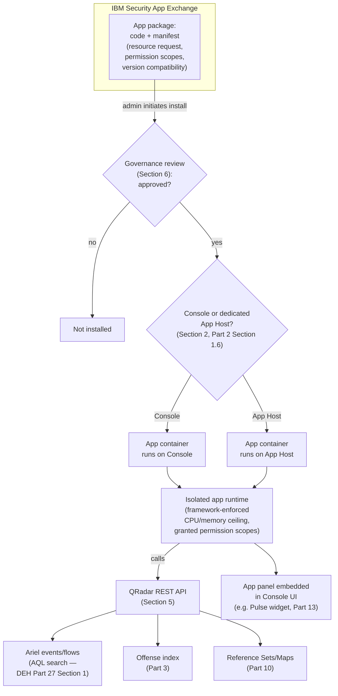

# Part 19 — Apps, Extensions, and the App Framework

## Why this part exists

**[CONCEPT]** Part 2 §1.6 named the App Host as one of six deployment component types and deferred the detail: apps run there (or on the Console, in a smaller deployment) so "a resource-hungry or poorly-behaved app doesn't compete with the Console's own management and UI workload." Part 13 built on the same framework from the other direction, treating Pulse as one of the surfaces a dashboard-and-reporting reader actually looks at. Neither part had room to answer the questions that matter once a SOC is actually deciding whether to install something: what is an "app" structurally, what can it see and touch once it's running, who vetted it before it went into production, and what happens to the rest of the deployment if it misbehaves. This part answers those questions.

DEH Part 27 does not cover the App Framework at all — its job was proving a point about AQL and the Custom Rules Engine (CRE), not surveying QRadar's extension ecosystem. Where this part shows an app querying Ariel or calling QRadar's REST API, it uses the exact AQL syntax and function set DEH Part 27 §1 and §1.2 already teach, and it does not re-explain `SELECT`/`FROM`/`WHERE`/`QIDNAME()` from scratch. Where this part touches whether an app's own bundled content should be authored Sigma-first or natively, it defers to DEH Part 23 §5's tradeoff rather than re-arguing it — an app vendor's packaging choice is a fact of that specific app, not a decision this book's reader makes for their own rule set.

This part covers, in order: what the App Framework actually is structurally (§1), where an app physically runs and why that placement decision matters (§2), how an app gets from IBM's marketplace to a running container in your deployment (§3), a survey of the app families a working QRadar SOC actually encounters (§4), what an installed app can reach once it's running (§5), and the governance risk a third-party app introduces against a production deployment (§6) — the scope item Part 22's staffing capstone assumes this part has already covered when it budgets review time against it.

---

## 1. What the App Framework actually is: isolation, not just packaging

**[PLATFORM ENGINEER]** An "app," in QRadar's own vocabulary, is a packaged, independently deployable unit of functionality — a UI panel, a background data-processing job, or both — that runs inside its own isolated runtime rather than as code merged into the Console's own process space. That isolation is the architectural point, not a footnote: it is what makes it possible to install a third party's code inside a production security platform at all without that code having unrestricted access to the Console's own filesystem, configuration, or the credentials the platform itself runs on. Each app declares, in a manifest packaged with it, what it needs — a defined slice of CPU and memory, and a set of permission scopes for which QRadar objects it's allowed to read or write (§5) — and the framework is responsible for enforcing that ceiling and that scope, not trusting the app's own code to self-limit.

This is the same resource-governance principle Part 2 Table 2.2 named without unpacking it: "App Framework app competing with Console UI responsiveness" is a real, observed failure mode precisely *because* an app's resource ceiling is enforceable, not because it never gets set. A misbehaving app that ignores its own declared footprint doesn't take down the CRE or Ariel search on a properly isolated App Host — it degrades its own runtime, and the framework (or an administrator watching resource utilization) has a boundary to act against. An app running directly on the Console in an All-in-One or small deployment has a narrower version of the same protection: isolated from the Console's core processes, but sharing the same physical or virtual appliance's total CPU, memory, and disk I/O budget, which is exactly the tradeoff §2 covers.

> **PRODUCT VERSION NOTE**
> The specific containerization or process-isolation technology underlying the App Framework, the exact mechanism by which a resource ceiling is configured and enforced (a fixed allocation set at install time versus an adjustable quota an administrator can tune afterward), and the console menu path for viewing or changing an installed app's resource allocation have all been the kind of implementation detail that shifts across QRadar release cycles without changing the architectural principle above. Verify the current mechanism and menu path against your own deployment's Admin console and IBM's current documentation before treating any specific UI description as current.

---

## 2. Where apps run: Console vs. dedicated App Host

**[PLATFORM ENGINEER]** Part 2 §1.6 already stated the decision in outline: smaller or All-in-One deployments run apps directly on the Console; a deployment large enough to justify the added component runs them on a dedicated App Host instead. What that section didn't have room for is the actual factors that should drive the choice for a specific deployment, rather than treating "add an App Host" as a blanket best practice regardless of scale.

**Table 19.1 — Factors in the Console-vs-App-Host placement decision.** Supports deciding whether a given deployment's app workload justifies the added component and its own maintenance/licensing overhead, rather than defaulting either way.

| Factor | Favors Console-hosted apps | Favors dedicated App Host |
|---|---|---|
| Number and footprint of installed apps | One or two lightweight apps (a single dashboard-widget app) | Several apps, or any app with a known heavy background-processing job (a behavioral-analytics app scoring every asset nightly) |
| Console UI responsiveness complaints | None reported | Analysts report slow Offense-list or search-page rendering coinciding with app activity |
| Deployment size/topology | All-in-One or small distributed deployment already resource-constrained | Distributed deployment with headroom to add a component, or Console already near capacity from its own management workload |
| App vetting maturity (§6) | Only vetted, low-permission-scope apps installed | Any third-party or high-permission-scope app, where blast-radius containment matters most |
| Licensing/appliance budget | No budget for an additional component | Budget available, and the isolation is worth the added cost |

A deployment does not have to choose once and never revisit it — the signal in Part 2 Table 2.2 ("App Framework app competing with Console UI responsiveness → App Host") is exactly the trigger for moving from the left column to the right one as an app footprint grows, not a decision made permanently at initial deployment sizing.

---

## 3. The App Exchange: from IBM's marketplace to a running container

**[PLATFORM ENGINEER]** IBM operates a marketplace — commonly referred to as the App Exchange — through which both IBM-authored apps and third-party or partner-authored apps are published, discovered, and installed into a QRadar deployment. An app listed there ships as a package: the app's own code, a manifest declaring its required resource allocation and the specific permission scopes it needs (read access to Ariel search results, write access to create or update Offenses, read or write access to a named Reference Set — the same object categories this book's Parts 3 and 10, and DEH Part 27 §2.2, already cover), and version metadata stating which QRadar release(s) it's compatible with. An administrator installs a package either directly from the App Exchange listing inside the Console, or by uploading a package file obtained separately — the second path exists specifically for air-gapped or otherwise internet-restricted deployments that cannot reach the Exchange directly.

Installation itself does not imply review. The framework enforces the resource ceiling and permission scopes an app's manifest declares (§1), but it does not evaluate whether those declared permissions are *appropriate* for what the app actually claims to do, whether the app's code does anything beyond its stated purpose with the access it's granted, or whether the vendor will keep maintaining it against QRadar's own future releases. That evaluation is a governance function this book's reader has to build, not a gate the framework provides for free — the exact gap §6 covers in depth.

Figure 19.1 puts the install-time governance decision and the runtime data-access surface on one diagram, so the rest of this part can refer back to a single picture instead of re-describing the pipeline in every section.





**Figure 19.1 (FIG-19-01) — An app's path from the App Exchange to a running container, and what it can reach once running.** *CONCEPTUAL.* Illustrates the governance-review and placement decisions this part argues are load-bearing (Sections 2 and 6), and the REST-API-mediated data-access surface Section 5 covers in depth — not a reproduction of any single IBM architecture diagram, and not a claim about a specific release's exact install-wizard steps or menu wording.

> **PRODUCT VERSION NOTE**
> The App Exchange's own name, URL, catalog browsing experience, and whether it is branded as part of "QRadar," a broader IBM Security Suite umbrella, or a successor product name, have shifted across IBM's own release and business-packaging history in ways this book's author cannot verify as current from outside a live deployment. Treat "App Exchange" in this part as the generic concept — a marketplace for QRadar apps — and verify the current name, URL, and any air-gapped-install procedure against IBM's own current documentation before relying on this part's description as a literal, current walkthrough.

---

## 4. A survey of common apps

**[CONCEPT]** This section stays at survey depth on purpose — a full working guide to any one app's own configuration is out of this book's scope, which is about the platform these apps run on top of, not any single app's feature set. The point of this survey is knowing what each app family is for well enough to decide whether your SOC needs it, and which of this book's other parts its output actually feeds.

### 4.1 Use Case Manager

**[RULE ENGINEER]** A use-case-and-coverage-mapping app maps a deployment's actual Rules and Building Blocks against a framework of attack techniques — most commonly MITRE ATT&CK — to surface which techniques have deployed detection content and which don't. This is directly downstream of the `BB:`/`R:`-prefixed object library Part 9 covers: the app reads the same Rule and Building Block metadata that library governance already has to track, and presents it as a coverage map instead of a flat list. It does not create detection content on its own — a technique showing "no coverage" in the map is a prioritization signal for a rule engineer to act on, not a gap the app closes by itself. Treat its coverage claim with the same discipline Part 13 §4 applies to a bare offense-count dashboard metric: "we have a Rule tagged against this technique" is a narrower claim than "we would actually detect this technique's real-world variations," and the app's map only speaks to the first one.

> **PRODUCT VERSION NOTE**
> Whether a use-case-and-coverage-mapping app of this kind currently ships under the name "Use Case Manager," as a distinct installable App Exchange app at all, or has been renamed or folded into a different first-party offering, is the same kind of commercial-packaging fact §4.3's note flags for the behavioral-analytics app family rather than asserts here. Verify current availability, name, and the specific technique-framework version (e.g., which MITRE ATT&CK release) it maps against, against IBM's own current documentation before assuming this app exists, under this name, in the tier a reader is licensed for.

### 4.2 Pulse

**[PLATFORM ENGINEER]** Pulse is a dashboarding and visualization app that Part 13 already covers from the consumption side — what a Pulse widget looks like to a SOC manager or executive reader, and how it's backed by the same AQL-driven or Offense-index-driven data sources any Dashboard tab item uses (Part 13 §1.1). This part's addition is the App Framework side of that same fact: Pulse is not special-cased infrastructure baked into the Console — it is an app, subject to the same install, resource-allocation, and placement decisions (§§1–2) as any other, which matters directly if a deployment's executive-reporting workload is heavy enough to justify moving it to a dedicated App Host rather than leaving it competing with Console UI responsiveness.

### 4.3 User Behavior Analytics

**[RULE ENGINEER]** A behavioral-analytics app of this kind builds risk or anomaly scores for users and assets from baseline behavior, typically using the same underlying mechanisms Part 11 covers at full depth — Reference Sets/Maps holding accumulated state, and Rules (including Behavioral rule types) evaluating that state against a baseline rather than a fixed threshold. Its practical output is usually its own risk-score dashboard and/or its own Offense-generating Rules layered on top of the correlation content a team already has. That second property is exactly why §6's governance discussion applies to this app family with extra force: an app that deploys its own Rules and Building Blocks as part of its own installation is adding to the `BB:`/`R:` library Part 9 governs, whether or not the team that installed it thought of it that way.

> **PRODUCT VERSION NOTE**
> Whether a behavioral-analytics app of this kind currently ships as a distinct installable App Exchange app, is bundled into a broader QRadar packaging tier, or has been renamed, retired, or folded into a different product family entirely, is exactly the kind of commercial-packaging fact this book's §11 convention flags rather than asserts. Verify current availability, name, and packaging against IBM's own current documentation before assuming this app family exists, under this name, in the specific tier a reader is licensed for.

### 4.4 Third-party and partner apps

**[SOC MANAGEMENT]** Beyond IBM's own apps, the App Exchange hosts partner- and community-authored apps covering threat-intelligence enrichment, ticketing-system integration, case-management handoff, and dozens of narrower integrations — a long tail no survey section can enumerate usefully. The governance posture in §6 applies to every one of them, and applies *more* strongly the further a given app is from IBM's own first-party maintenance commitment: a community-maintained integration with a small install base is more likely to lag a QRadar upgrade, go unmaintained after its original author moves on, or have had less security review than a flagship first-party app.

**Table 19.2 — App families surveyed, and what each one's output feeds.** Supports deciding which of this book's other parts a given app's evaluation should route through, rather than treating "install the app" as the end of the decision.

| App family | Primary function | Feeds into | Version sensitivity |
|---|---|---|---|
| Use-case/coverage-mapping (e.g. Use Case Manager) | Maps deployed Rules/BBs to an attack-technique framework | Part 9 (BB library governance), Part 22 (staffing/coverage review) | Catalog naming and technique-framework version — flag per §11 |
| Dashboarding/visualization (e.g. Pulse) | Renders AQL- and Offense-index-backed widgets | Part 13 (dashboards/reporting) | Widget catalog and default layout — flag per §11 |
| Behavioral analytics (e.g. UBA-type app) | Baseline-based risk/anomaly scoring, often deploys its own Rules/BBs | Part 10 (reference data), Part 11 (behavioral rules), Part 9 (BB governance) | Product name, packaging tier, continued availability — flag per §11 |
| Third-party/partner integrations | Threat-intel enrichment, ticketing, case handoff, niche integrations | Varies by integration; governance in §6 applies to all | Maintenance currency and update cadence — verify per app, not assumed |

---

## 5. What an installed app can reach: AQL, the REST API, and the objects this book already governs

**[PLATFORM ENGINEER]** An app does not query Ariel storage directly, and it does not read or write a Rule, Building Block, or Reference Set through some app-specific back door — it goes through the same QRadar REST API surface a script, an external SOAR platform, or an analyst's own tooling would use, constrained to whatever permission scopes its manifest declared and the administrator approved at install time (§3). This matters for exactly one reason worth stating plainly: **an app's data access inherits every version-dependent property-name and QID (QRadar's internal event-taxonomy identifier) mapping risk this book and DEH Part 27 §3.1 already name for a human-written AQL search.** If an app's bundled dashboard widget queries a custom property your DSM (Device Support Module — the log-source parser that assigns a QID and extracts fields, DEH Part 27 §1.1) configuration never populated, or references a QID display string your environment's DSM assigns differently, that widget fails exactly the way an ad hoc analyst search fails under the same conditions — silently, with an empty or misleading result and no error surfaced to explain why.

A widget backed by an app's own saved search uses the identical AQL syntax and function set DEH Part 27 §1 and §1.2 teach in full — there is no separate "app query language":

```sql
-- QRadar AQL — the same SELECT/FROM/WHERE syntax and function set DEH Part 27 Section 1 and
-- Section 1.2 teach in full (QIDNAME(), LOGSOURCETYPENAME(), custom properties in double quotes).
-- Shown here only to make concrete that an installed app's dashboard tile queries Ariel through
-- this same surface, not a distinct app-specific query interface — see the framing paragraph above.
SELECT QIDNAME(qid) AS "Event Name", COUNT(*) AS "Occurrences"
FROM events
WHERE LOGSOURCETYPENAME(devicetype) = 'Microsoft Windows Security Event Log'
GROUP BY QIDNAME(qid)
LAST 24 HOURS
```

This query's main limitation is the same one Part 13 §1.1 already names for any saved-search-backed dashboard tile: it is only as current and as complete as the DSM mapping behind the Log Source type it filters on, and an app vendor has no more visibility into your specific DSM configuration than any other consumer of the same AQL surface does.

The REST API itself is the mechanism an app's backend actually calls to submit that search or to read/write an Offense or Reference Set:

```bash
# Illustrative: an installed app's backend submitting an Ariel search via QRadar's REST API,
# the same endpoint pattern available to any authenticated caller with search permission --
# not a special app-only interface. Header name, endpoint path, and versioning scheme are
# flagged below as version-sensitive; do not treat this as a literal, current API call.
curl -k -H "SEC: <app-service-token>" \
  -X POST "https://<console-host>/api/ariel/searches" \
  --data-urlencode 'query_expression=SELECT QIDNAME(qid) AS "Event Name", COUNT(*) AS "Occurrences" FROM events LAST 24 HOURS'
```

```json
{
  "search_id": "b6e6b1b0-1c2d-4e3f-illustrative",
  "status": "WAIT"
}
```

> **PRODUCT VERSION NOTE**
> The REST API's exact authentication header name and mechanism, endpoint path and versioning scheme, and the specific permission-scope granularity an app manifest can request (a whole-category grant like "Offense read/write" versus a narrower per-object grant) have evolved across QRadar releases and are exactly the kind of literal API detail this part flags rather than asserts as current. Verify the current authentication mechanism, endpoint versioning, and permission-scope model against your own deployment's REST API documentation before an app's declared permission request is evaluated against it.

The `SEC`-header authentication model and the create-search/poll-status/retrieve-results shape shown above are not this book's own guess at the REST API's surface: IBM's own public `qradar-mcp` reference implementation documents the same `SEC`/`QRadarCSRF` header pair (or an authorized service token passed as `SEC`) and the same Ariel-search lifecycle — submit a query, poll its status, then retrieve results — as the mechanism it wraps for programmatic callers (IBM, "qradar-mcp," GitHub, 2026: https://github.com/IBM/qradar-mcp). That confirms the shape of the pattern; it does not override the version note above about trusting any single header name or endpoint path as permanently current.

---

## 6. Governance risk: installing a third-party app against a production deployment

**[SOC MANAGEMENT]** Everything in §§1–5 establishes that the App Framework's isolation is real and enforceable. It does not follow that installation is safe by default — isolation contains an app's resource footprint and constrains it to its declared permission scopes; it does not evaluate whether those scopes are appropriate, or audit what the app's code actually does with the access it's granted once running.

### 6.1 Permission scope is a grant, not a review

**[RULE ENGINEER]** An app that requests write access to Rules, Building Blocks, or Reference Sets is requesting the ability to change this book's Section D objects — the exact `BB:`/`R:`/`RS-`-prefixed library Part 9 and Part 10 govern — and the framework will grant that request as declared if an administrator approves the install, with no independent check that the app's actual behavior matches its stated purpose.

> **Rule Autopsy**
> **The rule:** A behavioral-analytics app (§4.3) was installed specifically for its risk-scoring dashboard. As part of its own bundled content, it silently deployed several of its own Building Blocks and a handful of Rules with Offense-creating Responses, because that's how its baseline-comparison feature is implemented under the hood — not because anyone reviewing the install request understood that outcome.
> **Why it shipped:** The install approval focused on the dashboard feature the team wanted and the resource footprint in the manifest; nobody read far enough into the permission-scope list to notice "create/update Rule" and "create/update Building Block" sitting alongside "read Ariel search results."
> **How it failed:** Three weeks post-install, the Offense queue showed a new cluster of Offenses from Rules nobody on the rule-engineering team had authored, named after the app's own internal convention rather than this book's `R:`/`BB:` naming standard (§4, `STYLE-GUIDE.md`) — invisible to Part 9's governance review because that review assumes every Rule in the library came through the team's own authoring process.
> **The fix:** Treat "does this app's install request include write access to Rule, Building Block, or Reference Set objects" as a standing question in the pre-install checklist (§7), not an assumption to skip past because the app's advertised feature is something else entirely — and if the answer is yes, fold whatever it deploys into the same Part 9 governance inventory as any human-authored object, on the same review cadence.

### 6.2 The framework's isolation stops at resource and permission scope — it does not audit data handling

**[PLATFORM ENGINEER]** The framework enforces the CPU/memory ceiling and the permission scopes an app declares (§1). It does not, by itself, tell you what the app's own code does with the data it's granted access to read — whether it retains a copy outside the deployment, calls an external vendor endpoint for cloud-based analysis, or logs sensitive field values somewhere outside QRadar's own audit trail.

> **Blind Spot**
> The App Framework's resource and permission-scope enforcement answers "can this app touch more than it declared" and "is this app consuming more resources than its ceiling allows" — both real, enforced boundaries. It does not answer "what does this app do with the data it was correctly granted access to read." A third-party app with a legitimately granted "read Ariel search results" permission that also happens to forward a copy of matched events to an external vendor endpoint for cloud-side processing is operating entirely inside its declared scope from the framework's point of view — the framework has no mechanism to flag that as different from an app that keeps everything local. That evaluation is a data-handling and vendor-trust question a security/procurement review has to ask before install, not a gap the framework will surface after the fact.

### 6.3 Review cost is a staffing line, not a one-time gate

**[SOC MANAGEMENT]** Part 9's closing SOC MANAGEMENT framing named the review-cost consequence of QRadar's own multi-object model for human-authored content; the App Framework adds a parallel review-cost line for anything installed rather than authored. Vetting an app's manifest, tracing what it actually deploys once installed (§6.1), and re-validating that after every app *and* every QRadar platform update, is ongoing work, not a single approval decision made once at install time.

> **SOC Management View**
> Budgeting a QRadar practice's headcount for rule review (Part 9, Part 22) without a corresponding line for app-vetting review understates the real review burden the moment a team installs anything beyond IBM's own first-party apps. A third-party app that quietly deploys its own Rules (§6.1) is exactly as much a review-cost item as a human-authored Rule, and an app that stops receiving vendor updates after a QRadar version bump is a maintenance liability nobody budgeted for if the original install decision was framed as "add a dashboard," not "take on an ongoing integration to maintain." Size the app-governance line explicitly, the same way Part 22 sizes rule-review headcount against the `BB:`/`RS-`/`R:` library.

---

## 7. A pre-install review checklist

**[SOC MANAGEMENT]** The checklist below collects §6's specific findings into the form a governance process actually uses — a gate to run every app installation request through, not a one-time exercise.

**Table 19.3 — Pre-install review checklist for a QRadar App Framework app.** Supports a consistent go/no-go decision regardless of which team member handles a given install request.

| Review question | Why it matters | Owning role |
|---|---|---|
| What permission scopes does the manifest declare, and does every one map to a feature the team actually needs? | An unused write scope is pure risk with no offsetting benefit (§6.1) | Platform Engineer |
| Does the app deploy its own Rules, Building Blocks, or Reference Sets as part of installation? | If yes, it joins Part 9's governance inventory on the same review cadence as any human-authored object (§6.1) | Rule Engineer |
| Where does the app send data it's granted access to, and does any of it leave the deployment? | The framework does not audit data handling — this is a manual review question (§6.2) | SOC Management / Security Review |
| Is the app first-party (IBM), partner-maintained, or community-maintained, and what is its update cadence? | Maintenance currency risk scales with distance from first-party support (§4.4) | SOC Management |
| Does the deployment's current placement (Console vs. App Host, §2) have headroom for this app's declared resource request? | Avoids reproducing Part 2 Table 2.2's "app competing with Console UI responsiveness" signal after the fact | Platform Engineer |
| Is there a rollback plan (disable/uninstall) tested before this app is approved for production? | An app that deploys its own Rules doesn't necessarily clean them up on uninstall — verify before relying on uninstall as a safety net | Platform Engineer |

> **Platform Reality**
> An app's install-time resource request is a declaration, not a guarantee of steady-state behavior — a behavioral-analytics app's nightly baseline-recomputation job, or a dashboarding app's widget refresh under a sudden spike in concurrent analyst viewers, can spike well above its typical footprint at a predictable or unpredictable interval. Watch an app's actual resource utilization for at least one full cycle of its heaviest workload (a nightly batch job, a peak-shift dashboard-viewing window) before treating its manifest's declared footprint as the number that matters for capacity planning, the same discipline Part 17 already applies to EPS/FPM licensing headroom.

---

**Cross-references:** DEH Part 27 §1 and §1.2 (AQL syntax and the `QIDNAME()`/`LOGSOURCETYPENAME()`/custom-property function set this part's §5 queries reuse without re-teaching) and §2 (the Custom Rules Engine objects — Rule, Building Block, Reference Set — an app can deploy or reference, per §6.1); DEH Part 23 §5 (Sigma-first-vs-native authoring, referenced rather than re-argued for an app vendor's own bundled content). Within this book: Part 2 §1.6 (the App Host component role this part's §2 builds out in full); Part 3 (Offenses, Magnitude, Credibility, and Relevance — the object an app-deployed Rule creates); Part 9 (Building Block governance — the inventory an app's own bundled Rules/Building Blocks join per §6.1); Part 10 (Reference Data Collections — the object type a behavioral-analytics app typically reads or writes); Part 11 (Thresholds, Anomaly and Behavioral Rules — the native mechanism a UBA-type app's scoring often builds on); Part 13 (Dashboards, Pulse, and Executive Reporting — the consumption-side view of §4.2's Pulse survey); Part 17 (Licensing, EPS/FPM Management, and Capacity Planning — the capacity discipline §7's Platform Reality callout extends to app resource footprints); Part 22 (Staffing and Running a QRadar Practice — the headcount line §6.3 argues an app-vetting practice needs).
