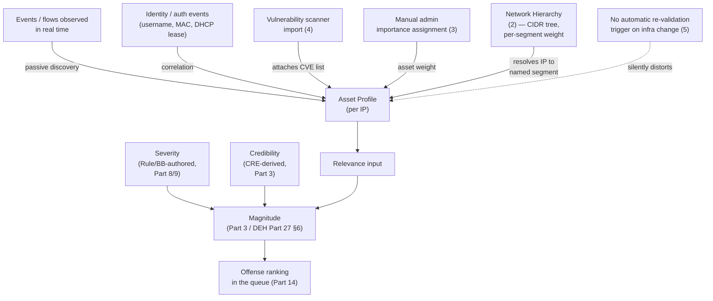

# Part 20 — Asset Model, Network Hierarchy, and Vulnerability Data

## Why this part exists

**[CONCEPT]** This book's Part 3 states magnitude as a function of three inputs — severity, relevance, credibility — the same architecture DEH Part 27 §6 already establishes when it describes a QRadar Offense's `magnitude` score as computed "from severity, relevance, and credibility rather than a single fixed severity value." Severity is a value a Rule or Building Block author sets at authoring time (Part 8, Part 9). Credibility is a score the Custom Rules Engine (CRE) derives from how many distinct sources agree an event happened and how reliable the reporting Log Source has historically been. Relevance is different in kind from both: it asks whether the asset actually involved in an event — the specific host at that IP, on that network segment, with those known vulnerabilities — is a host this environment actually cares about. Answering that question is not a property of the Rule that fired or the Log Source that reported it. It is a property of three things QRadar maintains about the network itself, continuously and mostly automatically: the asset database, the Network Hierarchy, and whatever vulnerability data has been imported against a given asset.

This part is about that data, not about magnitude's arithmetic — Part 3 owns the scoring architecture and states plainly that any specific numeric weighting between severity, relevance, and credibility is unpublished and version-variable rather than something this book guesses at. What follows here is the plumbing that feeds Relevance specifically: how QRadar decides what "known" even means for a given IP (§1–§2), how the Network Hierarchy gives that IP a place in your address space that a Rule Test or a dashboard can reason about (§3), how vulnerability data gets attached to an asset and what that attachment can and can't tell you (§4), and the failure mode that gives this part its second half: an asset model nobody re-validates after the infrastructure it describes has already changed (§5–§7). It does not re-teach AQL syntax — DEH Part 27 §1 owns that, and §6 below reuses it rather than re-explaining it — and it does not re-argue the query-language-portability tradeoff DEH Part 23 covers generically; where this part's asset- and vulnerability-aware search patterns touch that tradeoff, it says so and points back rather than re-deriving it.

---

## 1. What "the asset model" actually is

**[CONCEPT]** QRadar maintains a persistent record — an Asset Profile — for every IP address it has observed with enough corroborating detail to be worth tracking, built up over time from multiple, independent sources rather than from any single authoritative feed:

- **Passive discovery from events and flows.** Every event and flow the CRE evaluates in real time (DEH Part 27 §1.1's `events`/`flows` tables) carries a source and/or destination IP, and QRadar updates the corresponding Asset Profile's observed attributes — open ports and services inferred from flow data, an operating-system guess where a DSM's parsed fields support one, a hostname where DNS or an identity event supplied one — as a background process, not as a Rule Response an engineer configures.
- **Identity correlation.** Authentication and identity-provider events (a domain logon, a VPN session, a DHCP lease) let QRadar associate a username, and sometimes a MAC address, with an IP for the window that association was actually true — important because in a DHCP environment the same IP can legitimately belong to a different host by the next lease cycle (§5 returns to exactly this).
- **Vulnerability-scanner import.** A vulnerability assessment feed attaches a list of discovered vulnerabilities to the Asset Profile matching the scanned IP or hostname, covered in full in §4.
- **Manual assignment.** An admin can set fields by hand on a specific Asset Profile — most importantly for this part, an importance/weight value (§3) — for a host the automated sources alone would not otherwise mark as significant.

The practical consequence for everything downstream: an Asset Profile is a *merged, continuously updated inference*, not a static inventory record someone typed in once. That is a strength when the underlying network is stable — the model tracks reality without anyone maintaining it by hand — and it is the exact mechanism that turns into a liability once the network changes faster than the merge logic's assumptions hold, which §5 names directly.

> **PRODUCT VERSION NOTE**
> Which specific event/flow fields feed automated OS and service fingerprinting, how aggressively QRadar merges a new observation into an existing Asset Profile versus creating a new one, and the exact Admin-console screen name for reviewing and editing a single Asset Profile by hand, have all seen incremental changes across QRadar release cycles. Treat this section's description as the stable shape of the mechanism — multiple independent sources merged into one profile per IP — and verify the exact field list and merge behavior against your own deployed release before writing a runbook that depends on a specific field being populated.

### 1.1 Asset Profile fields relevant to Relevance, at a glance

**[PLATFORM ENGINEER]** Table 20.1 supports a narrower question than "what does an Asset Profile contain" — it names only the fields that actually feed a Rule Test's asset-aware conditions or Relevance itself, since the full profile carries more descriptive detail (hostname history, observed ports) that matters for investigation (Part 14) but does not itself move a magnitude score.

**Table 20.1 — Asset Profile fields that feed Relevance and asset-aware Rule Tests.** Supports deciding which field a stale-data audit (§7) needs to check first for a given Offense.

| Field | Populated by | Feeds | Staleness risk |
|---|---|---|---|
| IP / MAC association | Passive discovery, DHCP/identity events | Which Asset Profile an event's source/destination IP resolves to at all | High in DHCP environments — see §5 |
| Importance / weight | Manual admin assignment (§3) | Relevance directly | High — set once at onboarding, rarely revisited |
| Vulnerability list | Scanner import (§4) | Relevance, and any Rule Test checking asset vulnerability | Moderate to high, tied to scan cadence |
| Network location | Resolved via Network Hierarchy (§2) against the asset's IP | Relevance (via network weight), local-vs-remote Rule Tests, dashboards grouped by segment | Moderate — tied to Network Hierarchy re-sync after IPAM changes |
| Observed OS / services | Passive fingerprinting from flow/event data | Investigative context (Part 14); not a direct Relevance input on its own | Low to moderate, self-correcting as new traffic arrives |

---

## 2. Network Hierarchy: giving an address space a name a Rule can reason about

**[PLATFORM ENGINEER]** DEH Part 27 §1.1 introduces this concept in one clause, in service of a different point: AQL's `NETWORKNAME()` function "resolve[s] a raw IP into the network-hierarchy segment your admins have named it (Admin > Network Hierarchy), rather than a separately queryable network-hierarchy table." This part takes that clause as its starting fact and builds outward from it, because the Network Hierarchy it references is not just a naming convenience for a search result column — it is the second major input to Relevance, alongside asset weight, and the object that lets a Rule Test express "traffic between two of our own network segments" versus "traffic from the internet."

The Network Hierarchy is an admin-configured tree of named objects, each defined by one or more CIDR ranges — a segment for a data center subnet, a segment for a branch-office VLAN, a segment for guest wifi, nested under broader groupings as the environment's address space calls for. Every IP QRadar observes resolves to exactly one Network Hierarchy leaf (or to "unknown"/remote networks outside anything defined), and that resolution feeds three distinct things:

1. **Display naming** — the same `NETWORKNAME()` resolution DEH Part 27 §1.1 already names for AQL search output and dashboard grouping.
2. **Local-vs-remote classification** — Rule Tests and Building Blocks (Part 8, Part 9) that distinguish "an internal host talking to another internal host" from "an internal host talking to something outside every defined segment" depend entirely on the Network Hierarchy being complete; an address range nobody has defined resolves as remote/unknown by default, with real correlation consequences (§5).
3. **Network weight, contributing to Relevance** — a Network Hierarchy object can itself carry an importance value, separate from any individual Asset Profile's weight, so that traffic touching a segment defined as high-value (a data center subnet holding domain controllers, for instance) can contribute to Relevance even for an IP whose own Asset Profile has never been individually reviewed.

> **PRODUCT VERSION NOTE**
> The exact console path (`Admin > Network Hierarchy`, per DEH Part 27 §1.1's own citation), the specific weight/importance scale a Network Hierarchy object supports, and whether that weight is expressed as a numeric slider, a low/medium/high category, or something else entirely, are UI specifics this book cannot verify against a live console — no lab access, per this book's stated evidence constraint (STYLE-GUIDE.md §0/§9). Verify the current editor and scale against your own deployment before treating a specific number or control as a literal on-screen fact.

### 2.1 The hierarchy is a manually maintained object, not a discovery result

**[PLATFORM ENGINEER]** This is the detail easiest to lose sight of once the hierarchy has existed for a few years: unlike an Asset Profile's passive enrichment (§1), the Network Hierarchy itself does not automatically discover new subnets from observed traffic. A new VLAN, a new cloud VPC's CIDR block, or a re-numbered branch office is invisible to the Network Hierarchy — and therefore to local-vs-remote Rule Tests and to network-weight-driven Relevance — until an admin adds it by hand. An environment that provisions infrastructure faster than someone remembers to update Admin > Network Hierarchy accumulates a growing blind spot in exactly the two things §2's list above says the hierarchy is for.

> **Blind Spot**
> Traffic to or from an address range that has never been added to the Network Hierarchy resolves as an unnamed remote/unknown segment for every purpose the hierarchy serves — `NETWORKNAME()` returns nothing useful for it, a Rule Test built on "traffic between two internal segments" does not recognize it as internal, and any network-weight contribution to Relevance for that range is simply absent, not merely low. A newly provisioned data-center subnet holding a fresh batch of production database hosts looks, to every Network-Hierarchy-dependent Rule and to Relevance itself, exactly like traffic from an unrecognized external network — until someone notices and adds the range. The Offense volume this produces is not obviously wrong in either direction: it can under-fire (a local-only Rule Test never matches traffic QRadar doesn't recognize as local) or it can over-fire (a "communication with an unknown/external network" Rule Test fires routinely against a segment that is, in fact, entirely internal), and neither failure mode announces itself as a Network Hierarchy gap in the Offense record — it just looks like a Rule behaving oddly against a specific IP range.

---

## 3. Asset importance and network weight: the two hand-set inputs to Relevance

**[PLATFORM ENGINEER]** Both mechanisms named above — an Asset Profile's manually assigned importance (§1) and a Network Hierarchy object's manually assigned weight (§2) — are, as far as this book can verify without a live deployment, admin-set values rather than anything QRadar derives on its own. That is the operationally important fact, independent of the exact numeric scale either control uses: **Relevance's two most direct levers are decisions a human made once, at some point, about which hosts and which segments matter**, not a live measurement of anything. A domain controller's Asset Profile carries whatever importance value someone assigned it during onboarding; a guest-wifi segment carries whatever network weight someone assigned the Network Hierarchy object representing it. Neither value updates itself when the domain controller is decommissioned or the guest-wifi segment is repurposed as a contractor VLAN with access to production systems.

This is also where this part's Part 3 dependency is tightest: Part 3 states the three magnitude inputs as architecture and explicitly declines to assert the numeric weighting between them, consistent with DEH Part 27 §6's treatment of magnitude as a computed score without a published formula. This part inherits that same discipline rather than reverse-engineering a weighting scheme from observed Offense behavior — the honest claim available here is that asset importance and network weight are real, configurable inputs to Relevance, not what fraction of a magnitude point either one is worth.

> **PRODUCT VERSION NOTE**
> Whether asset importance and Network Hierarchy weight combine additively, whether one can override the other, and whether a given release exposes both as numeric sliders on the same 0–10-style scale or as differently-shaped controls, is exactly the kind of internal weighting detail Part 3 flags as unpublished and version-variable. This part does not guess at that mechanism; if your own investigation of a live deployment's behavior suggests a specific combination rule, treat it as an observation about your version, not a platform-wide fact to build automation against.

### 3.1 A worked failure: the weight that outlived the server

**[PLATFORM ENGINEER]**

> **Rule Autopsy**
> **The configuration:** An Asset Profile for `10.4.12.31`, assigned the highest importance value the console offers, set three years ago when that address hosted the organization's primary domain controller.
> **Why it shipped:** At onboarding, the SOC team correctly identified the domain controller as a high-value target and weighted its Asset Profile accordingly — a reasonable, deliberate decision, not an oversight, and exactly the kind of manual input §3 says Relevance depends on.
> **How it failed:** The domain controller was migrated to a new address during a data-center consolidation eighteen months later. The old address, `10.4.12.31`, was reassigned by DHCP to a rotating pool of contractor laptops. Nobody's decommissioning checklist included revisiting that address's Asset Profile importance, because the address itself was never the thing anyone thought of as "the domain controller" — the hostname and the service were. Every Offense touching `10.4.12.31` from that point forward inherited a Relevance boost intended for a domain controller and applied instead to whichever laptop happened to hold that lease that week, ranking ordinary contractor-laptop noise artificially high in the queue for eighteen months before a queue-fatigue review (Part 15) traced the pattern back to the stale weight.
> **The fix:** Asset importance review became a required line item on the infrastructure-decommissioning and IP-reassignment checklist, not just the vulnerability-scan and Reference Set cleanup items Part 10 and Part 18 already name for a retired host — and the Asset Profile for a reassigned high-importance address is explicitly reset (not left at its prior value "just in case") the moment the reassignment is known, with a new importance value assigned deliberately once the address's new role is understood, rather than inherited from whatever address it happens to be.

---

## 4. Vulnerability data: what "this asset is vulnerable" actually means to QRadar

**[PLATFORM ENGINEER]** The third input this part covers is vulnerability data attached to an Asset Profile — commonly discussed under the umbrella term VIS (Vulnerability Information Service) in QRadar's own documentation and community material, though this book cannot verify the current branding, licensing scope, or exact ingestion mechanism against a live console (see the PRODUCT VERSION NOTE immediately below). Conceptually, the mechanism is stable regardless of its current name: a vulnerability-assessment source — historically a native scanner add-on, and more commonly today a third-party scanner (Qualys, Tenable/Nessus, Rapid7, or others) feeding results in through a supported integration — reports a list of discovered vulnerabilities per scanned IP or hostname, and QRadar attaches that list to the matching Asset Profile.

That attachment feeds two genuinely different things, and conflating them is a real risk this section exists to head off:

1. **Relevance.** An asset with known, unpatched vulnerabilities is a more relevant target for an Offense involving it than an asset with a clean scan history, all else equal — the same intuition behind asset importance in §3, but derived from scan data instead of a manual assignment.
2. **A dedicated Rule Test category.** Independent of Relevance, a Rule Test checking whether the source or destination asset in a matched event carries a specific known vulnerability (or any vulnerability at all) lets a Rule fire — or a Building Block narrow its candidate match — specifically on exploit-relevant context, e.g., "flag this exposure attempt only against a host we know is vulnerable to it," the same intent as an EDR-reported CVE match feeding a correlation decision.

> **PRODUCT VERSION NOTE**
> The current name, packaging, and licensing model for vulnerability-scanner integration in QRadar — whether it ships as a built-in capability, a separately licensed add-on, or purely through third-party scanner integrations configured against the platform — has changed more than once across QRadar's release history and business-unit ownership changes, exactly the category of packaging claim STYLE-GUIDE.md §11 flags as aging fastest. This part describes the *mechanism* (scan results attach to an Asset Profile and feed Relevance and a dedicated Rule Test category) as the stable claim; do not treat any specific product name, licensing tier, or supported-scanner list in this section as current without verifying it against your own deployment's admin console and current IBM documentation.

> **PRODUCT VERSION NOTE**
> The exact Rule Wizard wording for a vulnerability-aware Rule Test (this part's own paraphrase above — "when the source or destination asset... carries a specific known vulnerability" — is illustrative phrasing, not a transcript) has shifted in wording and grouping across releases, the same drift risk DEH Part 27 §2.1 already flags for the Rule Test catalog generally. Verify the current category name and exact condition options in your own deployment's Rule Wizard before quoting a literal string from this section.

### 4.1 The coverage gap a clean vulnerability record actually means

**[THREAT HUNTER]**

> **Blind Spot**
> A vulnerability-aware Rule Test or a Relevance boost derived from scan data can only see what a scanner has actually scanned. An Asset Profile with no vulnerability entries reads, on the surface, identically for two very different hosts: one genuinely patched and clean, and one simply never reached by a scan — an ephemeral container that existed for six minutes between two scan windows, a segment excluded from the scanner's scope by a firewall rule nobody revisited, a newly provisioned cloud instance that spun up after the last scheduled scan completed. Neither QRadar's console nor a Rule Test built against vulnerability data distinguishes "verified clean" from "never checked," and an analyst or a Rule Response treating an empty vulnerability list as reassurance is trusting a scan-coverage gap as if it were a security finding. Before treating a host's clean vulnerability record as evidence of anything, confirm the scanner's scope and last-scan timestamp actually covered that specific host recently enough to mean something — the same discipline this book's Part 13 §4 Blind Spot already applies to a clean-looking dashboard tile, applied here to a clean-looking Asset Profile field instead.

**[THREAT HUNTER]** A hunt built around this gap starts from the same AQL fundamentals DEH Part 27 §1 teaches, extended with whatever asset/vulnerability-lookup fields your deployment exposes in a search's context — a search surface DEH Part 23 §3's general point about backend-specific enrichment applies to directly: an AQL query that joins event data against asset and vulnerability context this way is doing something a KQL or SPL query against the same event stream would express with a different join or lookup construct entirely, not a portable pattern across backends.

```sql
-- QRadar AQL, not standard SQL — this query relies on QRadar's own asset-context
-- resolution for a matched IP, which has no direct KQL/SPL equivalent syntax (DEH
-- Part 23 §3's backend-specific-enrichment point applies here). NETWORKNAME() is
-- confirmed AQL syntax per DEH Part 27 §1.1; any additional asset/vulnerability
-- lookup field name is illustrative only — this book has not verified an exact
-- function/field name against a live console (see the PRODUCT VERSION NOTE above)
-- and you should confirm the current equivalent in your own Log Activity > Advanced
-- Search field list before reusing this shape.
SELECT sourceip, NETWORKNAME(sourceip) AS "Source Network",
       destinationip, QIDNAME(qid) AS "Event Name"
FROM events
WHERE NETWORKNAME(sourceip) = 'DMZ-Web-Tier'
LAST 7 DAYS
```

> **Hunter's Note**
> This query's actual hunting value is not the rows it returns from `events` — it's the cross-check you run manually afterward against the asset-management console for the same `sourceip` list: does each address's Asset Profile show a recent vulnerability scan at all? A source-network filter like `'DMZ-Web-Tier'` narrows you to a segment; it says nothing about whether that segment's hosts were actually in scope for the last completed scan. Pair every asset- or vulnerability-aware hunt with a direct look at scan coverage and timestamps, not just the Rule Test or search result that assumes the data behind it is current.

---

## 5. The staleness problem, named directly

**[PLATFORM ENGINEER]** Every mechanism in §1–§4 shares one structural weakness: each is accurate at the moment it was last updated and silently stops being accurate the moment the infrastructure it describes changes without a corresponding update. Nothing about QRadar's own architecture forces that update to happen. Four concrete change events drive this in practice:

- **DHCP churn.** The domain-controller example in §3.1 is the general case, not an edge case: any environment where IP addresses are reassigned faster than Asset Profile importance is reviewed will eventually apply a stale weight to the wrong host, in either direction — over-weighting a now-unimportant address, or under-weighting a newly critical one that inherited a low-importance address's leftover profile.
- **IPAM and Network Hierarchy drift.** §2.1's Blind Spot is the direct consequence of new address space outrunning a manually maintained hierarchy — a growth pattern, not a one-time gap, in any environment provisioning infrastructure on a faster cycle than someone remembers to touch Admin > Network Hierarchy.
- **Decommissioning without cleanup.** A retired host's Asset Profile, Network Hierarchy membership, and any Reference Set entry referencing it by IP or hostname (Part 10's drift-risk framing applies identically here) all persist by default. QRadar does not know a host is gone until something tells it — a scanner no longer finding it, or an admin removing the profile by hand — and until then, that stale profile's weight and vulnerability history keep influencing Relevance for whatever now holds that address.
- **Ephemeral and cloud-native infrastructure.** A container or autoscaled instance that lives for minutes to hours defeats the asset model's core assumption — that an IP-to-host mapping is stable enough to be worth persisting and weighting — before any manual review cycle could plausibly catch up to it. §4.1's scan-coverage gap and this staleness problem compound directly in this environment: an ephemeral host is both unlikely to be individually weighted and unlikely to be scanned before it disappears.

> **Platform Reality**
> None of these four drivers is a QRadar defect — they are the ordinary cost of a model that trades manual maintenance for automated correlation. A live vulnerability scan feed, a maintained Network Hierarchy, and a periodically reviewed set of asset-importance values are inputs a team has to keep current the same way a firewall rule base or a Reference Set (Part 10) needs periodic review, not a one-time setup task. The failure mode in practice is not that any single mechanism breaks — it is that all four keep running exactly as designed, producing a magnitude score that reads as confident and specific right up until someone asks how recently the asset model behind it was actually checked against the infrastructure it claims to describe.

---

## 6. Analyst impact: trusting Relevance without trusting it blindly

**[ANALYST]** Part 14's triage workflow already treats magnitude as a queue-ranking signal, not a verdict — this part gives that caution a specific, checkable form for any Offense where Relevance looks like it's doing unusual work. Before treating a surprisingly high or surprisingly low magnitude as a signal about the underlying event, an analyst working a queue that draws on the asset model above has a fast, three-question check available:

1. **Does the involved asset's importance value match what this host actually is right now** — not what its Asset Profile description says it was set up as, per §3.1's worked failure?
2. **Is the involved IP's Network Hierarchy resolution current** — does it land in a named, correctly weighted segment, or does it silently fall out to "unknown/remote" the way §2.1's Blind Spot describes?
3. **If vulnerability data is contributing to this Offense's Relevance or matched a vulnerability-aware Rule Test, when was this asset actually last scanned** — a recent, real result, or a stale entry from a scan that predates a rebuild or a redeploy, per §4's coverage-gap warning?

None of these three checks require re-opening this part's whole architecture during a live triage — each is a single lookup against the Asset Profile or Network Hierarchy entry already linked from the Offense record. The discipline worth building into a team's triage habit is treating "this Offense's magnitude looks wrong for reasons that don't track back to the Rule logic itself" as a prompt to check the asset model before assuming the Rule (Part 8, Part 9) is the thing that needs tuning — a Noisy Offense Trap that traces back to a stale asset weight has a different fix than one that traces back to an actual Rule Test problem, and tuning the Rule instead of correcting the asset data leaves the underlying staleness in place to distort the next Offense too.

---

## 7. Keeping the model honest: a re-validation cadence

**[SOC MANAGEMENT]** The technical fix for every failure mode in §5 is straightforward in isolation — update the Asset Profile, add the missing Network Hierarchy range, re-scan the segment. The organizational problem is that none of those fixes has an obvious owner by default. Network Hierarchy and IPAM changes are usually a network-engineering decision; vulnerability scan scope and cadence usually belong to a vulnerability-management or infrastructure-security function; asset decommissioning checklists belong to whoever runs that lifecycle process — and a SOC team consuming Relevance as a triage input often has write access to none of the three, while depending on all three being current.

> **SOC Management View**
> Treat asset-model currency as a named cross-team dependency, not a QRadar administration task the SOC can fully own or fully delegate. A minimum viable cadence: a Network Hierarchy review triggered by IPAM change tickets rather than a fixed calendar (since address-space changes, not the calendar, are what actually invalidates the hierarchy); a quarterly sample audit of high-importance Asset Profiles against current infrastructure inventory, checking specifically for the §3.1 failure pattern of a weight that outlived its host; and a documented answer to "what is our vulnerability scan's actual coverage and cadence for the segments feeding Relevance" that the SOC can point to rather than assume. None of this requires QRadar functionality beyond what §1–§4 already describe — the gap is process ownership, not platform capability, and naming an owner for each of the three inputs is cheaper than discovering the gap the way §3.1's worked failure did, eighteen months and a queue-fatigue review later.

> **Validation Test**
> **Setup:** A test host provisioned on a network range recently added (or about to be added) to the Network Hierarchy, with a known, deliberately assigned Asset Profile importance value distinct from that segment's default.
> **Action:** Generate a single event or flow involving the test host that would match an existing Rule contributing to an Offense (any low-noise Rule already in production is sufficient — the specific Rule doesn't matter for this test), then open the resulting Offense.
> **Expected result:** The Offense's linked Asset Profile reflects the test host's actual current importance value and correct Network Hierarchy segment, not a stale or default value — confirming the asset-model pipeline in §1–§3 is resolving new or recently-changed infrastructure correctly, rather than merely confirming that magnitude renders a number at all. Run this test after any Network Hierarchy change or bulk asset-importance review, the same way DEH Part 27 §3.3's own Detection Test validates a Rule after a DSM change, applied here to the asset model instead of the Rule logic.

---





**Figure 20.1 (FIG-20-01) — How Relevance's inputs reach magnitude, and where staleness enters unseen.** *CONCEPTUAL.* Illustrates the four independent paths (passive discovery, identity correlation, vulnerability import, manual assignment) and the Network Hierarchy's parallel contribution that together populate an Asset Profile feeding Relevance, converging with Severity and Credibility into the magnitude score DEH Part 27 §6 and this book's Part 3 already establish as architecture — and the dashed path showing that nothing in this diagram forces a re-check when the underlying infrastructure changes, the mechanism §5 names directly. Not a reproduction of any IBM architecture diagram, and not a claim about magnitude's internal weighting formula, which Part 3 states as unpublished/version-variable rather than guessed at here.

---

**Cross-references:** DEH Part 27 §1.1 (`NETWORKNAME()` and the Ariel `events`/`flows` model this part's AQL example builds on), §2.1 (Rule Test catalog wording drift, the same risk this part flags for a vulnerability-aware Rule Test), §6 (Offense magnitude as severity/relevance/credibility, the architecture this part's Relevance inputs feed); DEH Part 23 §3 (backend-specific query enrichment, the general point this part's asset/vulnerability-lookup AQL example instantiates); this book's Part 3 (magnitude, credibility, relevance — the scoring architecture this part supplies data for), Part 8 and Part 9 (Rule/Building Block authoring — where Severity is set, and where a vulnerability-aware Rule Test is built), Part 10 (Reference Data drift risk, the same pattern this part names for a decommissioned host's stale profile), Part 13 §4 (the coverage-trap discipline this part's §4.1 Blind Spot applies to a clean vulnerability record), Part 14 (Offense triage workflow this part's §6 extends), Part 15 (tuning workflow — distinguishing a Rule problem from an asset-model problem), Part 18 (troubleshooting — decommissioning cleanup checklist referenced in §5).
