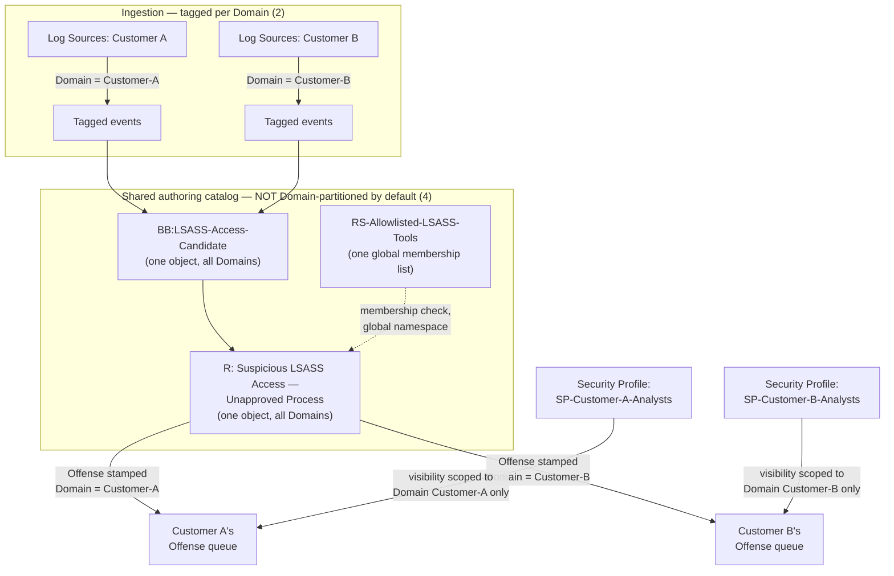

# Part 21 — Multi-Tenancy, RBAC, and MSSP Operations

## Why this part exists

**[CONCEPT]** DEH Part 27's closing paragraph names a review-cost consequence of QRadar's own object model: reviewing "one detection" here means reviewing a Building Block, a Reference Set's maintained membership, and a Rule's chained logic as three separately-changeable artifacts, not one query file. That paragraph frames the problem for a single-tenant shop — one deployment, one customer, one review burden. This part covers what happens to that same three-object review burden the moment one QRadar Console serves more than one customer, business unit, or otherwise legally-or-operationally-separated audience from a shared pool of infrastructure: an MSSP running twelve client environments off one deployment, or a large enterprise segregating a regulated subsidiary's data from its parent's SOC.

QRadar gives you three constructs to make that separation real rather than aspirational — Domains, Security Profiles and User Roles, and Tenants — and this part's job is to explain how each one actually works, how they interact with the Rules, Building Blocks, Reference Sets, and Offenses every earlier Section D and Section B part already built, and, most importantly, where that interaction is incomplete: which objects genuinely isolate per customer and which ones remain shared platform-wide whether you intended that or not. This part does not re-teach AQL (DEH Part 27 §1 owns that, referenced below only where a domain-scoped search needs it) and does not re-argue Sigma-first-vs-native authoring (DEH Part 23 §5). It assumes this book's own Part 3 (Offense scoring), Part 9 (Building Block governance), and Part 10 (Reference Data types) and builds the MSSP-specific version of each.

---

## 1. Two constructs, two different jobs, one shared name problem

**[CONCEPT]** "Multi-tenancy" in QRadar conversation covers two genuinely different mechanisms that are easy to conflate because they're often deployed together and because QRadar's own vocabulary for the second one has shifted:

- **Domain** — a data-tagging construct. QRadar stamps every incoming event and flow with a Domain identifier, derived from which Log Source, Log Source Group, vulnerability scanner, or network-CIDR association produced it, and that Domain identifier travels with the record through Ariel and into any Offense the record contributes to. A Domain is what makes "this event belongs to Customer A, not Customer B" a fact QRadar can enforce downstream, rather than a convention analysts have to remember on their own.
- **Tenant** — a packaging and licensing construct built on top of Domain isolation, used specifically for MSSP-style operation: a Tenant groups one or more Domains under a customer-facing identity with its own licensed EPS/Flows Per Minute (FPM) allocation (Part 17) and its own administrative boundary, so an MSSP can report per-customer consumption and, in principle, let a customer's own delegated administrator manage a slice of configuration without touching another customer's.

**Security Profiles and User Roles** are the RBAC layer that actually enforces who sees what and who can do what — covered in full in §3 — and they are the mechanism that turns a Domain tag into an actual visibility boundary for a specific analyst. A Domain with no Security Profile built against it is metadata sitting on an event, not an access control.

> **PRODUCT VERSION NOTE**
> Whether "Tenant" appears in your own console as a first-class object distinct from Domain, or whether your deployment's licensing tier exposes Tenant Management at all, has varied across QRadar release cycles and packaging changes — this book's style guide (§11) flags commercial-packaging claims as exactly the category that ages fastest and least gracefully, and this is one of them. Some deployments run genuine multi-customer MSSP segregation using Domains and Security Profiles alone, with no separately licensed Tenant construct in play at all. Verify which of the two constructs your specific deployment actually has enabled before designing an MSSP operating model around a Tenant Management capability you haven't confirmed is present.

---

## 2. Domains: how data gets tagged at the source

**[PLATFORM ENGINEER]** A Domain is defined by a set of inclusion rules an administrator configures — typically some combination of specific Log Sources, Log Source Groups, vulnerability scanners, and network-CIDR ranges assigned to it. When an event or flow arrives, QRadar evaluates it against every configured Domain's inclusion rules and stamps the matching Domain's identifier onto the normalized record, alongside the QID (QRadar's internal event-taxonomy identifier — Part 4) and custom properties the DSM already extracted. An event that matches no configured Domain lands in the deployment's default Domain — effectively "unscoped," which matters the moment §3's Security Profiles start restricting visibility by Domain, because an analyst restricted to Customer A's Domain will not see an event QRadar filed under the default Domain even if that event actually originated from Customer A's infrastructure through a Log Source nobody remembered to assign.

This tagging happens once, at ingestion, on the Event/Flow Processor pipeline Part 2 already describes — it is not something a Rule, a saved search, or an analyst chooses per-query. Everything downstream (Ariel storage, Custom Rules Engine — universally abbreviated CRE — evaluation, Offense indexing) inherits whatever Domain the record was stamped with at that point, which is exactly why getting the inclusion-rule assignment right during onboarding matters as much as getting the DSM/QID mapping right (Part 4 §1's onboarding checklist gains a Domain-assignment line item the moment more than one Domain exists in a deployment).

> **PRODUCT VERSION NOTE**
> The exact console location for configuring Domains (an Admin-tab section, historically named along the lines of "Domain Management"), the precise set of inclusion-rule types available (Log Source, Log Source Group, scanner, CIDR, and whether additional types have been added in later releases), and whether a given release allows overlapping Domain definitions or enforces a strict partition, are all specifics this book cannot confirm against a live console (STYLE-GUIDE.md §0/§9 — no lab access). Verify the current inclusion-rule catalog and overlap behavior in your own deployment before assuming this section's description is a literal, current transcript.

### 2.1 Domain assignment and Offense indexing

**[PLATFORM ENGINEER]** Because an Offense is built from contributing events (Part 3), and every contributing event carries a Domain tag, an Offense itself is stamped with the Domain of the events that created it. This is the mechanical basis for §3's per-customer Offense queue segregation: an analyst whose Security Profile restricts them to Domain `Customer-A` sees only Offenses whose contributing events were tagged `Customer-A`, in the same Offenses tab every other analyst uses, filtered transparently rather than through a separate console. A single Rule firing against events from two different Domains produces two separate Offenses, one per Domain, rather than one Offense straddling both — Domain segregation applies at the Offense-indexing layer, not just at the display layer, which is the detail that makes it a real isolation boundary rather than a filtered view over commingled data.

---

## 3. Security Profiles and User Roles: the two independent axes of RBAC

**[PLATFORM ENGINEER]** QRadar splits access control into two independent decisions, and conflating them is the single most common RBAC design mistake in a multi-tenant deployment:

- **User Role** answers "what can this person do" — which tabs they can open (Offenses, Log Activity, Admin), which administrative capabilities they hold (can they edit a Rule, deploy a Building Block change, manage other users), and which apps they can access. A User Role has no awareness of Domains or customer boundaries at all; it is a pure capability grant.
- **Security Profile** answers "what data can this person see" — which Networks (from the Network Hierarchy, Part 20), which Log Source Groups, and which Domains are visible to a user holding this profile. A Security Profile has no awareness of what a user is allowed to *do*; it is a pure visibility grant.

A user's actual, effective access is the combination of both, assigned together when the account is created: a Tier-1 analyst User Role (view Offenses, add notes, cannot edit Rules) paired with a Security Profile scoped to `Customer-A`'s Domain only produces an account that can triage Customer A's Offenses and nothing else's — the same User Role paired with an unrestricted Security Profile produces an account with identical capabilities but visibility across every customer in the deployment. Table 21.1 makes that intersection concrete.

**Table 21.1 — RBAC and tenancy objects at a glance.** Supports deciding which construct actually needs to change when an access request comes in — "give this analyst access to Customer B" is a Security Profile change; "let this analyst edit Rules" is a User Role change; conflating the two produces either an over-broad grant or a support ticket that goes to the wrong admin.

| Object | Answers | Set by | Typical grain | Version note |
|---|---|---|---|---|
| Domain | Which customer/business unit does this data belong to | Log Source, Log Source Group, scanner, or CIDR inclusion rules, at ingestion | Deployment-wide, configured once per data source | Inclusion-rule catalog and console location have shifted across releases — verify current set |
| Security Profile | What data can this user see (Networks, Log Source Groups, Domains) | Admin, assigned per user or user group | Per user/group | Whether a Security Profile can restrict to multiple named Domains individually, or only to broader groupings, is version-dependent — verify before designing a fine-grained profile |
| User Role | What actions can this user perform | Admin, assigned per user or user group | Per user/group | Exact capability list and default role templates have expanded across releases |
| Tenant | Commercial/licensing grouping of one or more Domains, with its own EPS/FPM allocation | Admin (where the Tenant Management capability is licensed and enabled — §1) | Per customer, MSSP context | Availability and packaging tier have varied; do not assume presence — see §1's PRODUCT VERSION NOTE |

> **PRODUCT VERSION NOTE**
> Whether Security Profile visibility restrictions and User Role capability grants are exposed as fully independent assignment steps in your specific release's user-management UI, or bundled into a combined "role template" workflow that still resolves to the same two-axis model underneath, is a console-workflow detail this book will not assert as a literal transcript. The two-axis *architecture* (visibility separate from capability) is the stable claim here; the exact screen layout for assigning both is not.

**[SOC MANAGEMENT]** The practical governance discipline this two-axis model demands: every access request should name both axes explicitly — "this person needs Tier-1 Analyst capability, scoped to Customer A and Customer C's Domains" — rather than "give them access like Priya has," which silently copies whatever combination of Role and Security Profile Priya happens to hold today, including any Domain scope that was never re-reviewed since Priya's own onboarding. A copied-access request is how one analyst's originally-correct, narrowly-scoped account becomes the template for a dozen accounts with visibility nobody individually approved.

---

## 4. What actually isolates per Domain — and what doesn't

**[RULE ENGINEER]** This is the section that matters most for anyone who has already built Rules, Building Blocks, and Reference Sets under this book's Section D and now needs to reason about what happens to those same objects once a second customer's Domain enters the deployment. The honest answer is that QRadar's three correlation objects do not all inherit Domain awareness the same way, and assuming they do is the most consequential mistake an MSSP-facing rule engineer can make.

- **Offenses are Domain-scoped by construction** (§2.1) — this isolation is real and automatic, inherited from the events that built the Offense.
- **Rules and Building Blocks are shared, deployment-wide objects by default.** A Rule you build lives in one catalog, evaluated against every incoming event regardless of which Domain tagged it, unless you deliberately add a Rule Test that restricts evaluation to specific Domain(s) — a scoping condition, not a default behavior. `R: Suspicious LSASS Access — Unapproved Process` (DEH Part 27 §3.3), built once, evaluates against Customer A's and Customer B's Sysmon telemetry identically unless someone explicitly narrows it. For most detections this is exactly what you want — one well-tuned Rule, maintained once, protecting every customer identically. It is also exactly the design decision that makes an allowlist change made *for* one customer a change that silently affects every other customer sharing that Rule, which brings us to the object that makes this concrete.
- **Reference Sets, Maps, Tables, and Sequences are global membership stores, not Domain-partitioned data.** `RS-Allowlisted-LSASS-Tools` (Part 10) has exactly one membership list across the entire deployment. Adding Customer A's legitimate backup-agent path to that Reference Set, because Customer A's environment happens to run a backup tool that trips `BB:LSASS-Access-Candidate`, makes that same path invisible to `R: Suspicious LSASS Access — Unapproved Process` for Customer B too — even though Customer B may never have deployed that backup agent, and even though Customer B's own analysts and administrators have no visibility into `RS-Allowlisted-LSASS-Tools`'s membership at all if their Security Profile scopes them away from the Admin tab. This is not a bug in any one Reference Set; it is the architecture's default behavior, and §5 below is what happens when nobody accounts for it.

> **PRODUCT VERSION NOTE**
> Whether a given QRadar release offers any native mechanism to scope Reference Set membership per Domain — a Domain-qualified reference-data key, or an equivalent partitioning feature — rather than treating reference data as a single global namespace, is not a claim this book makes either way; it has not been reliably verifiable against current IBM documentation at the time of writing (see this book's front-matter constraint). If your deployment has such a mechanism, it changes §5's risk materially — confirm its presence and actually use it before assuming the global-namespace behavior described here is your only option.

Figure 21.1 lays out the resulting asymmetry: one clean isolation boundary (Offenses, via Domain tagging) sitting on top of one shared authoring layer (Rules, Building Blocks, Reference Sets) that has no equivalent boundary unless someone builds one deliberately.

**Figure 21.1 (FIG-21-01) — Domain-scoped Offense visibility sitting on top of a shared, un-partitioned correlation catalog.** *CONCEPTUAL.* Illustrates the structural asymmetry this section argues from prose: Offense visibility genuinely separates Customer A from Customer B through Domain tagging and Security Profile scoping, while the Building Block, Reference Set, and Rule that produced those Offenses remain single, shared, deployment-wide objects with no equivalent partition unless an administrator deliberately adds Domain-scoping Rule Tests or an equivalent control. Not a reproduction of any IBM architecture diagram, and not a claim about a specific release's reference-data partitioning capability (see the PRODUCT VERSION NOTE above).

---

## 5. A worked failure: the allowlist that crossed a customer boundary

**[RULE ENGINEER]** §4's global-namespace behavior stops being an abstract risk the first time a real tuning change, made correctly for one customer, reaches a Rule shared with another. The following walks that failure end to end.

> **Rule Autopsy**
> **The rule:** `R: Suspicious LSASS Access — Unapproved Process`, chained to `BB:LSASS-Access-Candidate` and `RS-Allowlisted-LSASS-Tools`, deployed once and evaluated across both Domain `Customer-A` and Domain `Customer-B` in a shared MSSP console — exactly DEH Part 27 §3.3's worked example, now carrying two customers' worth of traffic instead of one.
> **Why it shipped:** Customer A onboarded a legitimate backup agent that legitimately opens a handle to `lsass.exe` with memory-read rights as part of its own credential-vaulting feature. Customer A's assigned analyst, working a real Noisy Offense Trap (Part 15's tuning-intake process, correctly followed for a single-tenant deployment) added the backup agent's binary path to `RS-Allowlisted-LSASS-Tools` and closed the ticket. Every step taken was the *right* tuning action for a single-tenant shop.
> **How it failed:** `RS-Allowlisted-LSASS-Tools` has no Domain qualifier (§4) — the entry Customer A's analyst added suppressed `BB:LSASS-Access-Candidate` matches for that exact binary path across every Domain in the deployment, including Customer B, who does not run that backup product at all but happens to share a directory-naming convention with a subset of Customer A's legitimate paths through nothing more than coincidence. Months later, an actual credential-dumping tool renamed to match one of the allowlisted paths on a Customer B host produced zero Offense — not because the Rule failed to evaluate, but because the allowlist entry a different customer's analyst added, for a reason entirely unrelated to Customer B, silently suppressed it. No error, no warning, no cross-tenant audit trail pointed at the cause; the first sign of the problem was a post-incident review asking why a known-bad tool never fired anything.
> **The fix:** Treat any shared Reference Set consulted by a Rule that evaluates across more than one Domain as a cross-tenant-risk object requiring its own governance tier beyond Part 9's ordinary Building Block/Reference Set change process: either partition the allowlist logic explicitly — a separate, Domain-suffixed Reference Set per customer (`RS-Allowlisted-LSASS-Tools-CustomerA`, `RS-Allowlisted-LSASS-Tools-CustomerB`) checked by Domain-scoped Rule Tests, at the cost of one more object per customer to maintain — or, where the underlying tool and path genuinely are common across every customer's environment, keep one shared Reference Set but require any addition to be reviewed against every customer's threat model, not just the requesting customer's, before it ships. Either fix is real work; the failure mode this Rule Autopsy documents is what happens when neither is done and a single-tenant tuning habit is applied unchanged to a multi-tenant Rule.

> **Blind Spot**
> Nothing in QRadar's own architecture stops a shared Reference Set, Building Block, or Rule from spanning every Domain in a deployment, and nothing surfaces a warning when an edit intended for one customer's tuning need is about to affect another's detection surface — the same "no error, no exception, quietly matches nothing" failure shape DEH Part 27 §3.1 documents for a broken DSM/QID mapping, recurring here one layer up, across a tenant boundary instead of within one deployment. An MSSP that assumes Domain tagging alone provides tenant isolation for its correlation logic — not just its Offense queues — has a detection gap it cannot see from inside QRadar's own console, discoverable only by the kind of cross-customer audit §6 below has to make a named, recurring task rather than an incident-driven afterthought.

---

## 6. The MSSP-specific multiplication of the three-object review burden

**[SOC MANAGEMENT]** DEH Part 27's closing paragraph frames the base cost: reviewing one QRadar detection means reviewing a Building Block, a Reference Set's maintained membership, and a Rule's chained logic as three separately-changeable artifacts. Part 9 §5 of this book already extends that cost across a `BB:` library's own dependency graph for a single tenant. An MSSP running N customer Domains off one shared correlation catalog inherits both costs multiplied by a factor that has nothing to do with the number of customers and everything to do with how many of them share a given object:

- A Rule, Building Block, or Reference Set used by only one customer's Domain-scoped Rule carries that customer's review cost alone — no different from a single-tenant shop.
- A Rule, Building Block, or Reference Set shared across multiple customers' Domains — the common case for anything not deliberately partitioned, per §4 — carries a review cost proportional to every customer whose detection surface that object touches, exactly as §5's Rule Autopsy demonstrates for one allowlist entry affecting two customers who never coordinated with each other.

> **SOC Management View**
> Budget a named review step, run before any change to a shared Reference Set, Building Block, or un-scoped Rule ships, that explicitly enumerates every customer Domain the object is known to affect — not just the customer whose ticket requested the change — and requires a second reviewer's sign-off against that full list, the same two-person discipline Part 9 §4 already requires for a high-fan-in Building Block, extended here across a customer boundary rather than just a rule-dependency boundary. A team that skips this step is not avoiding the cost; it is deferring it to the day one customer's legitimate tuning request quietly reopens or closes a detection gap for a customer who never asked for the change and was never told it happened. Where the customer contract or a regulatory boundary (a segregated subsidiary, a government client with its own audit requirements) requires provable non-interference between tenants, the Domain-suffixed partitioning approach in §5's fix is not an optional hardening step — it is the only version of this architecture that can actually support the compliance claim, and should be priced into the MSSP's onboarding cost for that customer rather than discovered as rework later.

**[SOC MANAGEMENT]** This same multiplication applies to dashboards and scheduled reports (Part 13). A shared dashboard tile or report template built against un-scoped Ariel data, rather than a Domain-filtered saved search, risks the same cross-tenant exposure this section names for correlation objects — a management-facing report meant for Customer A's stakeholders that inadvertently aggregates Customer B's event volume into a "total" figure is a contractual and, depending on the customer relationship, a legal problem, not just an inaccurate chart. Part 13 §7 flags this and defers the Domain-scoping detail to this part: any dashboard, Pulse widget, or report distributed outside the MSSP's own internal team must have its backing search explicitly filtered to the intended Domain(s), verified per customer before first distribution, not assumed correct because the dashboard "looks like" it's scoped to one tenant's tab.

---

## 7. Verifying isolation actually holds

**[PLATFORM ENGINEER]** Because Domain/Security-Profile isolation is enforced by configuration rather than by physically separate infrastructure, "we configured it correctly" and "it actually isolates" are different claims, and only the second one is worth anything to a customer relying on it. The isolation boundary that matters most — can Customer A's analyst account see anything belonging to Customer B — is testable directly, the same discipline this book applies to every other silent-failure surface (a Rule that stopped matching, a dashboard tile that renders zero for the wrong reason) rather than trusted on the strength of the configuration screen looking correct.

> **Validation Test**
> **Setup:** Two Domains configured (`Customer-A`, `Customer-B`) with Log Sources correctly assigned to each per §2; two test analyst accounts, each holding an identical Tier-1 Analyst User Role but Security Profiles scoped respectively to `Customer-A` only and `Customer-B` only; at least one Offense already open in each Domain.
> **Action:** Log in as the `Customer-A`-scoped analyst account and attempt to locate, by any means available in the console (Offenses tab, Log Activity search, an Advanced Search against `events` naming `Customer-B`'s known Log Source or asset), any data tagged Domain `Customer-B`. Repeat symmetrically for the `Customer-B`-scoped account against `Customer-A`'s data.
> **Expected result:** Neither account can locate, list, or search into the other Domain's Offenses or events through any console surface — not merely that the default Offenses-tab view happens not to show them, since a default view filtered by convenience is not the same guarantee as a Security Profile that structurally excludes the data from every search surface. Any surface where the restricted account can see even a count or a summary figure derived from the other Domain's data (a global "total events today" system tile, for instance) is a finding to document and fix, not a false alarm — §6's cross-tenant exposure risk applies to summary numbers exactly as it does to raw events.

---

## 8. A governance checklist for a multi-tenant deployment

**[SOC MANAGEMENT]** Table 21.2 collects this part's recommendations into a form a platform owner can run against a new customer onboarding or a periodic MSSP-wide audit, rather than holding the whole part in mind at once.

**Table 21.2 — Multi-tenancy and RBAC governance checklist.** Supports an onboarding or audit decision: is this customer's data, and this customer's detection surface, actually isolated the way the contract or compliance boundary requires.

| Check | Confirms | Owning section |
|---|---|---|
| Every Log Source, Log Source Group, scanner, and CIDR range assigned to the correct Domain, with none left in the default/unscoped Domain | No customer's data lands unintentionally outside its intended isolation boundary | §2 |
| Security Profile and User Role assigned as two explicit, independently-justified grants per account, not copied from a peer's existing access | Visibility and capability both match the actual access decision made, not an inherited default | §3 |
| Isolation validated by direct test (Validation Test above), not assumed from configuration screens alone | The boundary that matters — cross-Domain visibility — actually holds under test | §7 |
| Every shared Rule, Building Block, and Reference Set consulted by a multi-Domain Rule inventoried, with affected customer list current | A change proposed for one customer can be checked against every customer actually affected before it ships | §4, §5, §6 |
| High-risk shared Reference Sets (allowlists, exclusion lists) evaluated for Domain-suffixed partitioning, especially where a contract or compliance boundary requires provable non-interference | Cross-tenant leakage risk (§5) is closed structurally where it matters, not left to review discipline alone | §5, §6 |
| Dashboard tiles, Pulse widgets, and report templates distributed to any customer-facing audience confirmed to filter by that customer's Domain before first distribution | No aggregate figure or chart inadvertently exposes another customer's volume or Offense data | §6, Part 13 §7 |
| Second-reviewer sign-off required for any change to a Rule, Building Block, or Reference Set known to span more than one customer Domain | The MSSP-specific review-cost multiplication (§6) is budgeted and enforced, not assumed absorbed by ordinary Part 9/Part 16 change control | §6 |

---

**Cross-references:** DEH Part 27 §2 (Custom Rules Engine, Building Blocks, Rule Tests), §3.3 (`BB:LSASS-Access-Candidate`, `RS-Allowlisted-LSASS-Tools`, and `R: Suspicious LSASS Access — Unapproved Process` worked example, reused in this part's §4–§5), §6 (Offense as Alert/Case hybrid; the closing SOC MANAGEMENT paragraph naming the three-object review burden this part multiplies across customers); DEH Part 23 §5 (Sigma-first vs. native authoring, not re-argued here); this book's Part 3 (Offense magnitude/credibility/relevance and Offense indexing, extended by §2.1's Domain-tagging mechanism), Part 9 (Building Block governance and change control, extended by §5–§6's cross-tenant review burden), Part 10 (Reference Data types, extended by §4's global-namespace limitation), Part 13 §7 (dashboard/report sharing across roles, resolved here for Domain-based tenant separation), Part 15 (Noisy-Offense tuning workflow, the single-tenant process §5's Rule Autopsy shows applied unsafely across a tenant boundary), Part 17 (EPS/FPM capacity, the metric a Tenant's licensing allocation is built on), Part 20 (Network Hierarchy, the Networks a Security Profile scopes), and Part 22 (staffing and TCO capstone, where this part's review-cost multiplication becomes a headcount line item).
