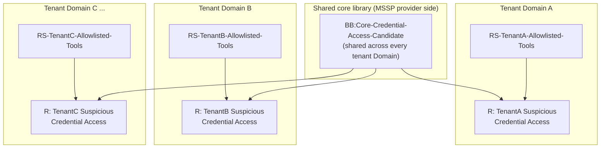

# Part 22 — Staffing and Running a QRadar Practice

## Why this part exists

**[CONCEPT]** Every part before this one built or operated one piece of a QRadar practice: the deployment architecture (Part 2), the offense-scoring model (Part 3), log source and DSM onboarding (Parts 4–7), the Custom Rules Engine's authoring surface — Rule Wizard, Building Blocks, reference data (Parts 8–11) — Ariel and dashboards (Parts 12–13), the day-to-day queue (Parts 14–16), platform health (Parts 17–19), and the asset model and multi-tenancy layer (Parts 20–21). None of those parts answered the question a SOC manager or a budget owner actually opens this book to ask: how many people, in which roles, does running this platform actually take, and what does it cost beyond the license line item everyone already expects to see?

This part is the capstone that answers that question, and it does so by building directly on a claim DEH Part 27 makes only once, in its own closing paragraph, and does not have room to develop: that reviewing "one detection" in QRadar means reviewing a `BB:`-prefixed Building Block, an `RS-`-prefixed Reference Set's maintained membership, and an `R:`-prefixed Rule's chained logic as three separately-changeable artifacts, not one file — a review-cost shape that does not exist for a team running a single Sigma rule or a single KQL scheduled query. DEH Part 23 (Query Language Strategy) owns the cross-platform version of the hiring-pool and query-language-choice question generally; this part is the QRadar-specific instance of it for a practice that has already chosen this platform, narrowed to the staffing consequence of *that* choice rather than a re-argument of the choice itself.

What follows treats staffing as an architectural consequence, not a generic industry benchmark borrowed from a different platform's headcount model. §1 names the roles this book's own tag taxonomy already implies and what each actually touches. §2 turns Part 9's Building Block fan-in problem and Part 27's three-object review burden into a concrete review-cost driver. §3 does the same for analyst-side queue staffing, building on Part 14's disposition discipline and Part 15's tuning-intake volume. §4 covers platform engineering staffing — onboarding backlog, capacity planning, App Framework maintenance. §5 is the MSSP-vs-in-house question, built on Part 21's Domain/tenant model. §6 assembles license, App Framework, and staffing cost into one total-cost-of-ownership frame. §7 gives a worksheet. §8 closes on the review cadence that keeps a staffing model from decaying the moment the person who built it moves on.

---

## 1. What a QRadar practice actually staffs against

**[CONCEPT]** This book's six content tags are not just a reading aid — four of them name real staffing roles, and the fifth and sixth (`[CONCEPT]` and `[THREAT HUNTER]`) name work that a practice's existing roles absorb rather than hire a dedicated headcount line for at most shop sizes. `[SOC MANAGEMENT]` is the role asking the question this part answers. The other three — `[ANALYST]`, `[RULE ENGINEER]`, `[PLATFORM ENGINEER]` — are the roles whose combined headcount, review cadence, and coverage model this part actually budgets.

Table 22.1 states what each role owns, which parts of this book cover that ownership in depth, and which named QRadar objects that role's work centers on — the anchor a budget conversation needs before it can turn "we need more people" into "we need one more of *which* role, doing *what*."

**Table 22.1 — QRadar practice roles, ownership, and primary objects.** Supports deciding which role a new hire, contractor, or reassignment actually fills before writing a job requisition around a generic "SOC engineer" title that hides which of these three very different jobs is actually understaffed.

| Role | Owns | Primary objects touched | Owning parts |
|---|---|---|---|
| Analyst | Offense triage, disposition, reason-coded closure, escalation | Offense queue (magnitude/credibility/relevance) | Part 3, Part 14 |
| Rule Engineer | Rule Wizard authoring, `BB:` design and governance, `RS-`/reference-data type selection and maintenance, change management | `R:` Rules, `BB:` Building Blocks, `RS-` Reference Sets/Maps/Tables/Sequences | Part 8, Part 9, Part 10, Part 16 |
| Platform Engineer | Deployment topology, DSM/log source onboarding, custom-property governance, Ariel performance, licensing/capacity, App Framework, troubleshooting | Log Sources, DSMs, Ariel indexes, App Host, license/EPS budget | Part 2, Parts 4–7, Part 12, Part 17, Part 18, Part 19 |
| SOC Management | Headcount, cadence, MSSP-vs-in-house structure, TCO, cross-role escalation boundaries | None directly — budgets and governs the other three roles' work | Part 22 (this part) |

**[SOC MANAGEMENT]** A practice below a certain size does not staff four separate people for these four roles — a small team's single senior hire routinely covers Rule Engineer and Platform Engineer work together, with SOC Management folded into a lead-analyst or team-lead title rather than a dedicated line. What matters for this part's purpose is not that every role gets its own headcount, but that every role's *work* is accounted for by someone, explicitly, rather than assumed to happen as a side effect of the Analyst role's queue time — the single most common staffing failure this part exists to name is a shop that budgeted Analyst FTEs to cover queue volume and never separately budgeted the Rule Engineer hours that keep that same queue from flooding in the first place (Part 15's tuning-intake backlog is exactly what accumulates when this gap goes unbudgeted).

---

## 2. The three-object review burden as a headcount driver

**[RULE ENGINEER]** DEH Part 27's closing paragraph names the structural fact this section turns into a staffing number: a QRadar detection is not one file. It is a Rule that chains one or more Building Block matches against one or more Reference Set membership checks, and each of those three object types is separately versioned, separately permissioned, and separately capable of drifting out of sync with the other two (a Rule referencing a Building Block by name after the Building Block was renamed, per Part 9's own Rule Autopsy pattern). A team that budgets Rule Engineer review time the way a KQL or SPL shop budgets query review time — one reviewer-hour per detection, roughly — is budgeting for a review unit that does not exist in this platform.

Part 9 §1 already showed why the multiplier is not even constant per detection: a Building Block's Rule Test can itself reference another Building Block, so a `BB:` library of any real size is a dependency graph, not a flat list, and a foundational Building Block referenced by forty Rules turns one proposed edit into a forty-Rule regression check, not a one-Rule review. Table 22.2 makes the review-cost driver concrete as something a headcount model can actually multiply against, rather than leaving "it's more work" as an unquantified intuition.

**Table 22.2 — Review-cost multipliers by change type.** Supports estimating Rule Engineer review hours for a proposed change before it is scheduled, using the fan-in concept from Part 9 §1 and the three-object decomposition from DEH Part 27 §2–§4.

| Change type | What has to be re-verified | Review-cost driver | Owning section |
|---|---|---|---|
| New Rule, new dedicated Building Block, new dedicated Reference Set | One Rule's logic, one Building Block's match condition, one Reference Set's initial population | Fixed, one-time — closest to a single-detection review cost in a KQL/SPL shop | DEH Part 27 §3.3 |
| Edit to a low-fan-in Building Block (feeds one or two Rules) | Those one or two Rules only | Small multiplier over a single-detection review | Part 9 §1 |
| Edit to a high-fan-in Building Block (feeds many Rules directly or through nesting) | Every dependent Rule and every second-order Building Block referencing it | Multiplier scales with fan-in count — a forty-Rule dependency means a forty-Rule regression check | Part 9 §1, §3 |
| Reference Set population change (allowlist addition/removal) | Every Rule that checks membership against that specific set, for both false-negative and false-positive direction | Usually small, but silent if skipped — Part 9's Reference Set drift risk | Part 9 §1, Part 10 |
| Building Block or Reference Set rename | Every dependent object by name, since QRadar's console-native workflow gives no automatic rename-propagation guaranteed across versions | Full dependency-export re-check, same cost class as a high-fan-in edit | Part 9 §3.1 |

**[SOC MANAGEMENT]** The practical staffing consequence: a shop that has grown its `BB:` library past a few dozen custom entries (Part 9's own threshold for when informal team memory stops working) needs to budget Rule Engineer review hours against the *dependency graph's* size, not against the *count of Rules* alone — two shops with the same 150 active Rules can have wildly different review costs depending on whether those Rules sit on a flat, low-reuse Building Block layer or a deeply nested, high-fan-in one. Part 9 §5's quarterly audit cadence (orphan detection, near-duplicate detection, fan-in-outlier detection) is not optional governance hygiene from a staffing perspective — it is the mechanism that keeps this multiplier from growing silently until a review that used to take an afternoon takes a week, with nobody having budgeted the week.

> **PRODUCT VERSION NOTE**
> Whether a given QRadar release exposes a built-in Building Block dependency-visualization or impact-analysis view — showing which Rules and Building Blocks reference a given object before you edit it — versus requiring a manual configuration export and offline diff (Part 9 §3's stated workaround), is a version-dependent capability this book cannot confirm current for any specific release without lab access (STYLE-GUIDE.md §0/§9). Verify what your own console's Admin tab actually offers before assuming either the manual workaround or a native dependency view is what your reviewers will be using; the review-cost multiplier in Table 22.2 holds either way, but the reviewer-hours-per-change estimate changes materially depending on which tooling is actually available.

---

## 3. Analyst-side staffing: queue volume, coverage, and disposition cost

**[ANALYST]** The Analyst role's headcount is driven by three inputs this book has already covered separately and this section combines: offense volume (a function of Rule/Building Block/Reference Set tuning maturity — Part 15), average time-to-disposition per offense (a function of Part 14's triage workflow and the reason-code discipline Part 14 §3 requires), and shift-coverage requirements if the practice runs anything close to 24/7 monitoring.

The coverage math is the part most staffing models understate. A single continuously-staffed seat — one analyst on shift at all times, every day of the year — is not three people working three eight-hour shifts. Vacation, sick leave, training time, and turnover mean the commonly cited industry rule of thumb for one truly continuous 24/7/365 seat is closer to four to five full-time analysts, not three; this is a general SOC-staffing fact independent of QRadar specifically, and this part states it plainly because it is the single most common staffing-model error a first-time SOC budget makes, QRadar or otherwise. A practice running business-hours-only coverage avoids this multiplier entirely, at the cost of an unmonitored window Part 3's offense-lifecycle discussion already flags as a real detection gap, not a budget-neutral tradeoff.

**[SOC MANAGEMENT]** Part 14 §3's reason-code discipline — no disposition closes without a reason code — costs seconds per offense, and Part 14's own closing paragraph already names this as a real, budgetable cost rather than a free process improvement. At queue volumes common in a maturing QRadar deployment (high before tuning matures, per Part 15's own framing), those seconds multiply into real analyst-hours per shift. Budgeting Analyst headcount without also budgeting the Part 15 tuning-intake pipeline that reduces offense volume over time is how a practice ends up permanently overstaffed on Analyst headcount to compensate for a Rule Engineer function that was never separately funded — the same gap §1 names generically, made concrete here as a specific, recurring line item.

> **SOC Management View**
> An illustrative — not sourced, not universal — starting worksheet for a single-tenant, moderate-volume QRadar deployment: roughly 150–300 offenses per day pre-tuning, falling toward 40–80 per day once Part 15's tuning workflow has had two to three quarters to mature against a stable Building Block library; an average disposition time (including reason-code entry) in the low single-digit minutes for a routine, non-escalated offense. Against that volume, a 24/7 single-analyst-seat coverage model needs roughly four to five Analyst FTEs before counting any shift lead or escalation-tier separation; a business-hours-only model needs one to two. These numbers describe one illustrative shop, not a formula — the actual multiplier for any real deployment depends on offense volume, disposition complexity, and tuning maturity specific to that environment, and should be re-derived from that environment's own queue data (Part 14's disposition records are exactly the input) rather than copied from this box.

---

## 4. Platform engineering staffing: onboarding, capacity, and the maintenance tail

**[PLATFORM ENGINEER]** The Platform Engineer role's staffing driver is less cyclical than the Analyst role's queue and less dependency-graph-shaped than the Rule Engineer role's review burden — it is dominated by backlog and maintenance debt. Three sources of that debt, each already covered in depth elsewhere in this book and combined here into a staffing input:

- **Log source onboarding backlog** (Parts 4–5). Every new log source is a one-time onboarding cost (protocol configuration, DSM mapping validation per Part 4's checklist) plus, for anything without native DSM coverage, an ongoing maintenance cost for a hand-built DSM Editor extension that has to survive the source's own format changes (Part 5). A practice growing its log source count faster than its Platform Engineer headcount accumulates exactly the kind of onboarding backlog Part 4 warns produces a silently-unmapped or partially-mapped source — a staffing shortfall that shows up as a detection gap, not a visible queue, which makes it easy to underbudget until Part 18's troubleshooting playbook gets invoked.
- **Custom property and Ariel performance debt** (Parts 6, 12). A custom property extracted by regex without performance review, or a saved search pattern that scans rather than uses an indexed quick-filter property, is a maintenance cost that compounds with data volume — Part 12's tuning discipline is not a one-time setup task, it is ongoing work that needs budgeted hours as retention and EPS both grow.
- **Licensing, capacity, and App Framework footprint** (Parts 17, 19). Forecasting EPS/FPM growth against the licensed tier, planning for a new noisy log source's actual sustained rate before it goes live, and monitoring App Host resource contention as more apps get installed are all Platform Engineer work with a real time cost that scales with deployment size, not with offense volume.

> **Platform Reality**
> A common under-staffing pattern this section names directly: a practice hires exactly enough Platform Engineer capacity to complete the *initial* onboarding wave — the log sources present at go-live — and does not separately budget for the steady-state rate of *new* log source requests that follows in any organization whose infrastructure keeps changing. The onboarding backlog that results does not announce itself as a staffing shortfall; it shows up as "we've been meaning to onboard that source for two quarters," a sentence that, if said about a source relevant to an active investigation, is a coverage gap wearing a scheduling-delay disguise.

---

## 5. MSSP vs. in-house: the review-cost problem changes shape, not size

**[SOC MANAGEMENT]** Part 21 covers the Domain/tenant model's mechanics — how a shared QRadar deployment segments Rules, Offenses, and Reference Sets across multiple client organizations or business units under a shared security profile structure. This section covers the staffing consequence: an MSSP operating a shared deployment across many tenant Domains does not avoid the three-object review burden §2 describes — it changes its shape.

A single in-house shop's Building Block fan-in problem (Part 9 §1) stays within one organization: a bad edit to a high-fan-in `BB:` affects that one shop's own Rules. An MSSP that maintains a shared "core" Building Block library — common threat patterns reused across every tenant Domain, with tenant-specific Reference Sets holding each client's own allowlist and tenant-specific Rules chaining the shared Building Block against that tenant's own Reference Set — has effectively multiplied the fan-in problem across paying customers instead of across one org's own Rule set. Figure 22.2 extends Part 9's own dependency-graph diagram to show exactly this shape.

**Figure 22.2 (FIG-22-02) — A shared core Building Block's fan-in across tenant Domains.** *CONCEPTUAL.* Extends Part 9's Figure 9.1 dependency-graph concept from a single organization's Rule set to an MSSP's multi-tenant deployment: one shared `BB:` edit's blast radius now spans every tenant Domain referencing it, not just one team's own Rules, which is exactly why an MSSP's core-library review has to be treated as higher-stakes than the same edit in a single-tenant shop, per Part 21's Domain-separation model. Not a capture of any real multi-tenant deployment's configuration.

**[SOC MANAGEMENT]** Table 22.3 lays out the tradeoff a practice actually faces, rather than treating "MSSP vs. in-house" as a binary business-model choice made once and forgotten — it is a staffing-shape decision with recurring consequences this book's own review-burden framing already justifies naming explicitly.

**Table 22.3 — MSSP-shared vs. in-house staffing tradeoffs.** Supports deciding, or re-evaluating, which model fits a given practice's growth pattern before defaulting to whichever model the practice happened to start with.

| Dimension | MSSP shared-core model | In-house single-tenant model |
|---|---|---|
| Marginal Rule Engineer cost per new client/business unit | Low — new tenant mostly consumes existing shared `BB:` library, needs only its own `RS-` allowlist and thin tenant-specific Rules | Not applicable — one org, cost doesn't marginalize this way |
| Blast radius of a shared Building Block edit | Every tenant Domain referencing it — Figure 22.2 | Contained to one org's own Rules — Part 9 §1's original framing |
| Review stakes per high-fan-in change | Higher — a regression affects multiple paying customers simultaneously | Lower — affects one org's own queue |
| Analyst staffing elasticity | Better — shared queue-management tooling and cross-tenant shift coverage amortize the 24/7 coverage multiplier (§3) across more offense volume per analyst-hour | Worse — the full §3 coverage multiplier applies to one org's own volume alone |
| Customization ceiling | Lower per-tenant — deep tenant-specific Rule Wizard logic competes with shared-library consistency | Higher — no cross-tenant consistency constraint |
| Licensing/capacity planning (Part 17) | Aggregated across tenants, requiring careful per-tenant EPS accounting to avoid one noisy tenant consuming shared capacity | Scoped to one org's own growth forecast |

> **PRODUCT VERSION NOTE**
> The specific Domain/tenant security-profile features that determine how strictly a shared Building Block, Reference Set, or Rule can be scoped or hidden from a given tenant's own view — and whether a given release lets an MSSP delegate limited, tenant-scoped Rule authoring to a client without exposing the shared core library — are RBAC/Domain capabilities that have evolved across QRadar releases and are covered in depth by Part 21. Verify the current Domain/tenant feature set against your specific deployment before committing to a shared-core staffing model that assumes a level of tenant isolation your release may not actually provide.

---

## 6. Total cost of ownership: license, App Framework, and staffing together

**[SOC MANAGEMENT]** A budget conversation that stops at the license line item is the most common TCO mistake this part sees reason to name directly: the license tier (committed EPS/FPM capacity, per Part 17) is real cost, but it is not the majority of what running a QRadar practice actually costs over a multi-year horizon once staffing (§§2–4) and App Framework add-ons (Part 19 — Pulse, UBA, Use Case Manager, or any third-party App Exchange app a practice has installed) are counted alongside it.

Table 22.4 names the categories a complete TCO conversation needs to include, without attaching invented dollar figures to any of them — this book has no authoritative, current pricing to cite, and inventing a number here would be exactly the kind of unverifiable specific claim §0's honesty constraint exists to prevent.

**Table 22.4 — TCO cost categories for a QRadar practice.** Supports building a complete budget conversation rather than one anchored on the license line alone; no dollar figures are given because none are sourced or current enough to state as fact.

| Cost category | Primary driver | Owning part(s) | Version sensitivity |
|---|---|---|---|
| License tier (EPS/FPM) | Sustained ingest rate, committed capacity, growth headroom | Part 17 | High — tier structure and overage handling change across release cycles |
| On-prem infrastructure or cloud/SaaS delivery | Deployment topology choice, hardware/cloud spend | Part 2, Part 17 | High — packaging/delivery model and vendor-side ownership have shifted historically |
| App Framework add-ons | Which apps are installed (Pulse, UBA, Use Case Manager, third-party App Exchange apps) and their App Host resource footprint | Part 19 | High — bundling, separate-install requirements, and licensing for individual apps vary by release and packaging tier |
| Rule Engineer staffing | Active Rule/Building Block/Reference Set count and dependency-graph fan-in (§2) | Part 8, Part 9, Part 10 | Low — the review-cost architecture itself is stable |
| Platform Engineer staffing | Log source count and growth rate, DSM extension maintenance debt, Ariel performance tuning cadence | Parts 4–7, 12, 18 | Low — the maintenance-tail shape is stable; specific tooling availability is version-sensitive (§2's PRODUCT VERSION NOTE) |
| Analyst staffing | Offense volume, disposition complexity, coverage-hours requirement | Part 3, Part 14, Part 15 | Low — coverage math is general SOC staffing, not QRadar-specific |
| Onboarding/training cost for new Rule Engineer or Platform Engineer hires | Rule Wizard catalog depth (Part 8), `BB:` library taxonomy (Part 9), reference-data type taxonomy (Part 10) — genuinely deep, platform-specific knowledge that does not transfer from a KQL/SPL background without ramp time | Part 8, Part 9, Part 10 | Low — the ramp-time cost is a consequence of platform depth, not a specific version's UI |

> **PRODUCT VERSION NOTE**
> QRadar's own commercial packaging — on-prem vs. cloud/SaaS delivery, which business unit sells and supports which piece, and the license-tier structure itself — has changed more than once across release cycles and business decisions this book does not have current visibility into at time of writing (STYLE-GUIDE.md §11's packaging/ownership trigger). Treat every cell in Table 22.4's "License tier" and "On-prem infrastructure or cloud/SaaS delivery" rows as a category to re-price against IBM's current commercial terms at budget time, not as a stable line item that can be estimated once and reused across budget cycles.

---

## 7. A minimal staffing worksheet

**[SOC MANAGEMENT]** Table 22.5 collects this part's role and coverage math into a single starting worksheet — explicitly a starting point for a small-to-moderate single-tenant deployment to adapt, not a formula that produces a correct headcount number for every practice regardless of scale, tuning maturity, or MSSP structure.

**Table 22.5 — Illustrative minimum staffing worksheet, single-tenant, moderate volume.** Supports a first-pass headcount conversation; every "Minimum FTE" figure is this book's own illustrative estimate against the volume assumptions in §3's SOC Management View box, not a benchmark sourced from any specific real deployment or vendor guidance.

| Role | Minimum FTE (business-hours-only) | Minimum FTE (24/7 coverage) | Primary scaling factor |
|---|---|---|---|
| Analyst | 1–2 | 4–5 | Offense volume and disposition complexity (§3) — falls as Part 15 tuning matures |
| Rule Engineer | 0.5 (often combined with Platform Engineer at this scale) | 1 | `BB:`/`RS-` library size and dependency-graph fan-in (§2) — rises with library age and Rule count |
| Platform Engineer | 0.5–1 | 1 | Log source onboarding rate, App Framework footprint, licensed EPS growth (§4) |
| SOC Management | 0.25–0.5 (often a lead-analyst or lead-engineer title, not a dedicated line) | 0.25–0.5 | Cadence-governance overhead (§8) — rises with MSSP tenant count (§5) |

**[SOC MANAGEMENT]** The single most important use of Table 22.5 is not the numbers themselves — it is the exercise of assigning every one of §1's four roles a nonzero number before deciding any of them can be absorbed into another. A practice that zeroes out the Rule Engineer row because "the analysts can handle small tuning changes themselves" has not eliminated that cost; it has moved it, unbudgeted, into Analyst hours that were sized for triage, not for the dependency-graph review §2 describes — and moved it specifically into the role with the least visibility into Building Block fan-in, since that visibility is exactly what the Rule Engineer role's own tooling and practice (Part 9 §3) is built to provide.

---

## 8. Keeping the model current: cadence, not a one-time hire

**[SOC MANAGEMENT]** A staffing model built once at go-live and never revisited decays for the same reason Part 9 §5's governance cadence and Part 16's change-management discipline both exist: the inputs driving §2's review-cost multiplier, §3's offense volume, and §4's onboarding backlog all move continuously, not once. Part 9 §5's own recommendation — a named Building Block library owner running a quarterly audit, a rolling deprecation policy, an ownership review — is the Rule Engineer-side instance of a broader discipline this part asks a practice to run for its whole staffing model, not just its `BB:` library:

- Re-derive §3's offense-volume and disposition-time inputs from Part 14's own disposition records each quarter, not from the assumption that made sense at go-live.
- Re-run Part 9 §3's dependency-graph audit before every headcount conversation that touches Rule Engineer staffing, so the review-cost multiplier in Table 22.2 is measured against the library's *current* fan-in shape, not its shape a year ago.
- Re-price Table 22.4's license and App Framework rows against IBM's current commercial terms at each renewal, given §6's PRODUCT VERSION NOTE — a TCO model that was accurate at signing is not guaranteed to still be accurate at the next renewal cycle.
- Treat any MSSP tenant-count growth as a trigger to re-check Figure 22.2's fan-in shape specifically, since onboarding tenant number twenty against a shared core library that was only ever reviewed at tenant number five is exactly the kind of unmeasured blast-radius growth §5 warns about.

> **What Would Change My Mind**
> This part treats the three-object review burden (§2) as the dominant Rule Engineer staffing driver, ahead of raw Rule count. If a practice running a large, deeply nested `BB:` library found — through actual measured review-hour data across multiple change cycles — that review time tracked flat Rule count just as well as it tracked dependency-graph fan-in, that would be a real argument for simplifying Table 22.2's model back to a per-Rule estimate rather than requiring a fan-in audit before every headcount conversation. This part has not seen that data; it states the fan-in-driven model as the more defensible default because Part 9's own dependency-graph argument is structural, not because any real measured comparison between the two models has been run against a production `BB:` library this book has access to.

---

**Cross-references:** DEH Part 27 §2 (Building Blocks and Rule Tests), §2.2 (Reference Sets), §3.3 (three-object decomposition worked example), and its closing SOC MANAGEMENT paragraph (the three-object review-cost consequence this whole part is built on); DEH Part 23 (Query Language Strategy — the cross-platform hiring-pool question this part narrows to a QRadar-specific staffing model, not re-argued here); DEH `TERMINOLOGY.md` (Disposition, Triage, Tuning/Suppression — inherited unchanged); this book's Part 3 (magnitude/credibility/relevance and offense-lifecycle volume drivers), Part 8 (Rule Wizard catalog), Part 9 (Building Block governance, dependency-graph fan-in, and the quarterly audit cadence this part's §8 extends), Part 10 (reference-data type taxonomy), Part 14 (triage workflow and disposition-record data this part's §3 draws from), Part 15 (tuning-intake workflow and its effect on offense volume), Part 16 (rule change management without a detection-as-code pipeline), Part 17 (licensing, EPS/FPM, and capacity planning), Part 18 (troubleshooting playbook triggered by onboarding-backlog gaps), Part 19 (App Framework footprint and add-on cost), Part 20 (asset model staleness as a relevance-weighting risk), and Part 21 (Domain/tenant/RBAC model this part's §5 builds its MSSP staffing analysis on).
